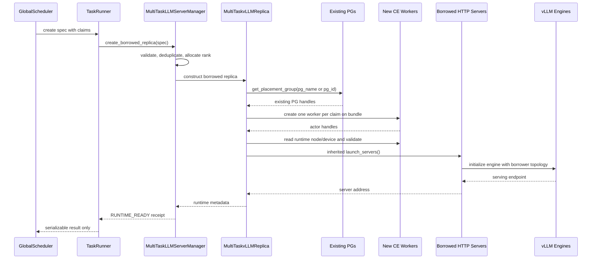

# D2 开发记录：按 claims 创建 borrowed runtime

## 1. 阶段结论

D2 的目标是把 D1 的“创建请求记录”推进为真实 runtime 创建：

```text
GS 下发 placement claims
  -> MultiTaskLLMServerManager 分配本任务 replica_rank
  -> MultiTaskvLLMReplica 解析已存在的 PlacementGroup/bundle
  -> 每个 claim 创建一个独立的 CE Worker actor
  -> 复用 verl 原生 vLLMReplica.launch_servers()
  -> HTTP server 启动 vLLM engine
  -> 校验 endpoint、node/device 映射
  -> 返回 RUNTIME_READY
```

本阶段没有实现 CE 注册、参数 bootstrap、LB 接流、sleep、wake、reclaim 或 destroy 的完整编排。创建成功只表示 borrower 的 Worker、HTTP server 和 engine 已经启动并且实际落点通过校验；它不会自动加入全局 LB，也不会被加入 donor 的 Worker 或通信域。

D2 选择“复用 donor PG 的指定 bundle、创建新的 actor”的方案。borrower 不创建 PG，也不复用 donor CE Worker。这样支持非连续 bundle、多个 PG 拼接以及与 donor 不同的 world size，同时保持 donor actor 的所有权不变。

## 2. 本阶段修改的文件

### 2.1 `src/multi_task_scheduler/rollout/replica.py`

`MultiTaskvLLMReplica` 仍然继承原生 `vLLMReplica`。新增逻辑全部位于扩展类中，原生 `init_standalone()` 和 `launch_servers()` 均保持可用；D2 的 borrowed 路径只新增 `init_from_lease()`，不改变 native PG 创建。

新增或扩展的成员：

| 成员 | 用途 |
| --- | --- |
| `operation_id` | 当前 GS 创建操作的幂等标识，用于生成 actor 名称和故障定位 |
| `worker_group` | 对新建 CE Worker handles 的 `RayWorkerGroup.from_detached()` 包装；不代表 donor 的 WorkerGroup |
| `created_actor_names` | 本次新建的 Worker actor 名称；启动失败时用于诊断，清理只针对本 replica 创建的 handles |
| `expected_device_map` | rank 到 GS 声明的 node/GPU 映射 |
| `actual_device_map` | rank 到 Worker 运行时通过 Ray context 读取的 node/GPU 映射 |
| `node_layout` | node 到 node rank、全局 ranks、GPU 标识和 local GPU index 的布局 |

新增方法：

| 方法 | 参数/返回值 | 作用 |
| --- | --- | --- |
| `validate_placement(spec)` | `dict -> dict[str, PlacementGroup]` | 用 `ray.util.get_placement_group()` 按 `pg_name` 或 `pg_id` 查找已有 PG，并检查 bundle 下标；找不到立即失败，不创建新 PG |
| `_validate_claim_layout(claims, world_size)` | `list[dict], int -> tuple[dict, dict]` | 检查 rank 顺序必须按 `node_rank/local_rank` 分组，生成 server 分组所需的 `node_layout` 和期望设备表 |
| `_configure_borrowed_parallelism(spec)` | `dict -> None` | 按 spec 的并行配置复制 rollout config，计算 borrower 的 world size 和均匀节点拓扑；不会修改 native replica 的 config |
| `_create_workers_from_claims(groups, spec)` | `dict, dict -> None` | 每个 claim 使用明确的 PG、bundle、CPU fraction、GPU fraction、rank/world/master 环境创建一个新的 `MultiTaskCheckpointEngineWorker` actor，并包装为 detached WorkerGroup |
| `_cleanup_runtime()` | `() -> dict` | 只 `ray.kill()` 当前 replica 已创建的 server/worker handles，并返回 kill 请求和错误；绝不删除 donor PG 或 donor actor |
| `init_from_lease(spec)` | `dict -> dict` | 完成 placement 解析、Worker 创建、server/engine 启动和设备校验，成功返回可序列化 runtime metadata；失败清理并抛出异常 |
| `runtime_metadata()` | `() -> dict` | 返回 rank、lease、world size、endpoint、拓扑和实际设备映射，不返回 Ray handles |

每个 CE Worker actor 的调度策略是：

```python
PlacementGroupSchedulingStrategy(pg, claim["bundle_index"])
```

CPU 使用 claim 的 `cpu_request`，加速器使用 `num_gpus=gpu_fraction`（目标 verl 0.9 的 Ray worker API）；同一个 bundle 是否能容纳多个 Worker 由 PG 创建时的 CPU/GPU 容量和 GS 的 claims 共同决定；修改 `max_colocate_count` 不会扩大一个已经存在的 PG。Ray 资源调度失败时，创建流程进入 FAILED，不能把“提交了 actor 请求”当成成功。

Worker 环境显式设置 `WORLD_SIZE`、`RANK`、`LOCAL_RANK`、`RAY_LOCAL_WORLD_SIZE`、`MASTER_ADDR` 和 `MASTER_PORT`。master 地址和端口通过原生 `get_master_addr_port()` 在第一个 claim 的 PG bundle 上获取，其他 PG 只复用这个通信入口。

server 创建没有另写一套 vLLM 启动器，而是先按 borrower 的 node/local rank 排序 Worker，再调用继承自原生 `vLLMReplica` 的 `launch_servers()`。该原生方法会：

1. 从 Worker actor 的 Ray runtime context 读取 node id 和 accelerator id；
2. 按每节点固定的 Worker 数切分 Worker 列表；
3. 使用 `NodeAffinitySchedulingStrategy` 在对应节点创建 `MultiTaskvLLMHttpServer`；
4. 将 `cuda_visible_devices`、rollout config、model config、Worker handles 和并行拓扑传给 HTTP server；
5. 调用每个 server 的 `launch_server()`，最后读取第一个 server 的 endpoint。

这里的 HTTP server 是 borrower 自己创建的 server actor，内部 engine 也由该 actor 自己初始化。donor 的 HTTP server、engine、CE Worker 和通信域均不复用。

### 2.2 `src/multi_task_scheduler/integration/verl/experimental_fully_async/llm_server_manager.py`

`create_borrowed_replica()` 从 D1 的“记录 FAILED”改为真实异步创建：

1. 在锁内做 D1 spec 校验、lease/operation 幂等检查和 `replica_rank` 分配；
2. 将记录写为 `CREATING`，冻结规范化后的 claims；
3. 释放锁，在锁外构造 `MultiTaskvLLMReplica` 并调用 `await init_from_lease()`，避免慢速 engine 启动阻塞其他 lease；
4. 失败时把记录更新为 `FAILED`，只返回错误 receipt，不发布任何 server；
5. 成功时保存本地 replica、worker/server handles、actor 名称和 runtime metadata，状态更新为 `RUNTIME_READY`；
6. receipt 只包含字符串、数字和映射，不向 GS 或其他任务泄露 ActorHandle/PG handle。

manager 仍只拥有本任务的 `borrowed_operations`。全局 lease、bundle 是否可借、跨任务冲突和归还授权由 GS 决定，manager 不维护第二份全局表。

为在 GS 尚未提供真实命令前执行 D2 的 Ray/GPU 验收，manager 增加了三个测试辅助方法：

| 方法 | 作用 |
| --- | --- |
| `_snapshot_native_claims(replica, donor_task_id)` | 从已初始化 native replica 的 resource pool、Worker runtime context 和 PlacementGroup 读取真实 PG 名称、bundle、node、accelerator ID，生成可用于本次测试的 claims；不向生产 GS 协议写入状态 |
| `_build_d2_test_spec(scenario)` | 以真实 claims 为基础生成 `basic`、`split`、`fragmented`、`cross_pg` 和预期失败场景；只虚构 lease/operation 等逻辑字段，不虚构物理资源字段 |
| `run_d2_runtime_smoke(scenario, cleanup_after_test=True)` | 调用正式 `create_borrowed_replica()`，校验 `RUNTIME_READY` 或预期失败，并在成功场景结束后只清理本次 borrowed Actor；不调用 CE、bootstrap 或 LB |

这些方法只由 Rollouter 的显式 D2 测试开关调用，正常 profile 不会执行。测试成功后的 `RUNTIME_READY` 是 runtime-ready，不是 serving-ready；因为参数版本尚未 bootstrap，测试不会把新 server 加入 LB。

### 2.3 测试文件

| 文件 | 内容 |
| --- | --- |
| `tests/unit/test_borrowed_contract.py` | 将 D1 的创建断言更新为 fake runtime receipt；仍验证 idempotency、rank 分配和预留 reclaim 行为 |
| `tests/unit/test_borrowed_runtime.py` | 不启动 Ray/vLLM，使用真实扩展类方法验证 claims 的 node/rank 分组、交错布局拒绝、异构 world size 的 config 隔离，以及不可见 named PG 的明确失败 |
| `D2_runtime_test.sh` | 从 `multi_task_run.sh` 进入 `fully_async_main`/`main_ppo`，按场景启用测试 hook；每个场景独立运行并检查 `D2_RUNTIME_RESULT` |

单元测试不宣称 GPU runtime 成功。真实 actor、engine、非连续 bundle 和跨 PG 场景由 `D2_runtime_test.sh` 在服务器上的 Ray/GPU 环境执行。

### 2.4 主入口测试 hook 的边界

`MultiTaskFullyAsyncRollouter._maybe_run_d2_runtime_smoke()` 位于 native
replica 初始化和 AgentLoop manager 创建之间，只有配置中显式出现
`+multitask.d2_runtime_test.enabled=true` 时才执行。它先读取当前 manager
已经创建的 native replicas，再调用正式 borrowed 创建接口；没有另写一套
Worker 或 HTTP server 创建器。成功场景测试完成后默认调用 replica 的失败清理
路径释放本次 borrowed Actor，避免 D2 尚未实现 reclaim 时影响后续训练。

该 hook 不改变以下正常路径：native replica 初始化、native LB、Trainer 参数
同步、AgentLoop 请求处理。它也不持有 GS 句柄，不代表 D4 的 TaskRunner 命令
编排；GS 创建 spec 后续接入时复用同一个 `create_borrowed_replica(spec)`。

## 3. 完整创建流程与组件调用关系



此阶段没有 `CE register`、`bootstrap` 或 `LB commit READY` 箭头。D2 创建出的 endpoint 只保存在本任务 manager 的 operation record 中，直到后续阶段完成参数同步后才能接收业务请求。

## 4. 关键前提与失败语义

### 4.1 PG 必须可被 borrower 查找

GS 只下发 claims 时不会传递 Python PG handle。Ray 的公开 API 只能通过可见的 placement group 名称查找已有 PG，因此本实现将 claim 的 `pg_id` 作为默认 `pg_name` 使用，也接受显式 `pg_name`。

实际部署必须满足：

1. donor 创建 PG 时使用全局唯一、可查找的名称；
2. donor 和 borrower 在同一可见 Ray 集群及 namespace，或部署方提供等价的跨 job 查找机制；
3. GS 在 claim 中携带实际名称，不能只携带 donor 本地 Python 对象的 repr。

如果 `get_placement_group()` 查不到 PG，D2 返回明确的 runtime creation failure。实现不会猜测 PG、重新创建 PG 或退回使用 donor Worker。

### 4.2 world size 与模型并行约束

borrower rank 是本任务新分配的连续 rank，不能沿用 donor rank。manager 会把 `parallelism` 归一化到 claims 的 world size；未显式提供时使用 `TP=borrower_world_size, DP=PP=1`，显式提供时要求 `TP*DP*PP==world_size`。实现复制 rollout config 后启动 engine。vLLM 或模型如果不支持这个并行度，会在正常 engine 启动阶段失败，并按失败路径杀掉新建 actors。

因此“支持异构 world size”表示 placement、Worker rank 和 server 拓扑不再强制等于 donor；它仍受模型、vLLM backend 和设备显存的真实并行约束。D2 不通过修改 donor config 绕过这些限制。

### 4.3 设备身份校验

Worker 创建后从每个 actor 的 `ray.get_runtime_context()` 读取 node id 和 accelerator id，并与 claim 的 `node_id/gpu_uuid` 比较；若 claim 同时带 `local_gpu_index`，Ray 返回本地索引也作为同一设备的兼容表示。任何一个 rank 不匹配都进入 FAILED 并清理本次新建 handles。NPU/CUDA 环境仍应在 GS claim 生成侧统一 GPU 标识格式，索引兼容只用于适配 Ray 常见的 accelerator-id 表示，不能跨 node 使用索引推断设备归属。

### 4.4 失败清理边界

以下资源属于 borrower 本次创建，可以清理：

- 已创建的 CE Worker actors；
- 已创建的 HTTP server actors；
- 这些 actor 触发的 engine 子进程（由 actor 退出路径负责）。

以下资源不属于本次创建，不能清理：

- donor 的 PlacementGroup；
- donor 的 bundle 预留；
- donor CE Worker、HTTP server 或通信域。

完整 `reclaim()`/`destroy()`、PG claim 归还以及 engine shutdown 在 D2 仍是预留接口，不能把 D2 的失败清理误认为生产回收实现。

## 5. 验证步骤

### 5.1 本地可执行的静态/单元检查

服务器上可以直接从原生 `verl` 目录执行：

```bash
bash ../D2_test.sh
```

脚本会沿用 `multi_task_run.sh` 的 `VERL_REPO_DIR`、`VERL_SOURCE_ROOT`、
`VERL_MULTI_TASK_ROOT`、Ascend 环境和 vLLM 预检配置，默认执行 D1 契约、
D2 runtime 规划、wiring 以及 native parent 适配测试。每次运行的完整输出
保存在 `${VERL_REPO_DIR}/logs/d2_test_<timestamp>.log`。如果只验证不依赖
Ray/vLLM 的 D2 隔离测试，可使用：

```bash
D2_INCLUDE_NATIVE=0 bash ../D2_test.sh
```

### 5.2 真实 main_ppo borrowed 创建测试

从服务器原生 `verl` 目录执行：

```bash
bash ../D2_runtime_test.sh
```

默认按顺序启动三个独立的 main_ppo 进程：

| 场景 | 目的 | 预期 |
| --- | --- | --- |
| `split` | 一个 native replica 的 claims 拆出 `world_size=2` | borrowed Worker、HTTP server、engine 启动并返回 `RUNTIME_READY` |
| `fragmented` | 使用同一 PG 的非连续 bundle | 物理落点逐 claim 匹配并返回 `RUNTIME_READY` |
| `missing_pg` | 替换一个不存在的 PG 名称 | 返回预期失败，donor PG 不被删除 |

可指定单个或多个场景：

```bash
D2_RUNTIME_SCENARIOS=basic bash ../D2_runtime_test.sh
D2_RUNTIME_SCENARIOS=cross_pg bash ../D2_runtime_test.sh
D2_RUNTIME_SCENARIOS=split,fragmented,duplicate_device bash ../D2_runtime_test.sh
```

`cross_pg` 场景会将 rollout TP 临时设置为 2，使一台 4 卡 rollout 节点
生成两个 native PG，再用两个 PG 的真实 claims 组成一个 borrowed replica。
每个场景独立启动，成功后默认清理 borrowed Worker/server；日志保存在
`${VERL_REPO_DIR}/logs/d2_runtime/`。脚本只把带有明确
`D2_RUNTIME_RESULT` 的结果视为场景完成，不能用 main_ppo 进程或 `tee` 的
退出码单独推断 borrowed 创建成功。

真实测试需要使用小模型和足够低的 `gpu_memory_utilization`，因为 donor 和
borrowed engine 会共享物理设备；Ray 的 fractional GPU 记账不提供显存隔离。

在可用的 Linux Python 环境中，从插件仓根执行：

```bash
export VERL_SOURCE_ROOT=/absolute/path/to/compatible-verl
export PYTHONPATH="$PWD/src:$VERL_SOURCE_ROOT${PYTHONPATH:+:$PYTHONPATH}"
export PYTEST_DISABLE_PLUGIN_AUTOLOAD=1
export RAY_USAGE_STATS_ENABLED=0

python -m pytest -q -p no:cacheprovider \
  tests/unit/test_borrowed_contract.py \
  tests/unit/test_borrowed_runtime.py \
  tests/native_unit/test_native_adapters.py
```

通过标准：D1 契约、D2 纯布局和 native 父类适配测试全部通过；不得因为没有 Ray 而把 GPU 测试标为成功。

### 5.3 真实 Ray/GPU 验收记录

当前 GS 尚未提供创建命令，因此 D2 的临时验收由 `D2_runtime_test.sh` 在同一
main_ppo 进程中先创建 native replica，再从其 resource pool 和 Worker
runtime context 读取一份**真实可查找**的 donor PG，最后由 Rollouter 测试
hook 调用正式的 `create_borrowed_replica(spec)`。GS 未来提供 spec 后复用同一
manager 接口。每个场景至少保存：

- PG name、Ray namespace、bundle index 和 claim JSON；
- 每个 rank 的 actor ID、node ID、accelerator ID、CPU/GPU fraction；
- HTTP server actor、engine PID、endpoint 和启动耗时；
- `runtime_metadata()` 与 manager receipt；
- 失败场景中的 actor 清理结果及 donor PG 存活状态。

必须依次验证：

1. 一个 PG 的连续 claims；
2. 一个 donor 4 卡拆成两个 world size=2 的 borrower；
3. 两个 donor PG 各取 2 卡组成 world size=4 的 borrower；
4. 同一个 PG 的非连续 bundle；
5. 同 bundle 的多个 fractional Worker（PG 资源和 GS claims 均足够）；
6. 跨节点均匀布局和不均匀布局拒绝；
7. 缺失 PG、设备不匹配、engine 启动异常时不返回 READY，且 donor PG 未被删除。

本阶段暂不以业务请求成功作为通过条件，因为 CE 注册、参数 bootstrap 和 LB
接流归 D3/D4；只确认 runtime 能启动、实际设备正确、endpoint 已建立且失败
边界可定位。

### 5.4 D2 服务器联调问题：PlacementGroup 名称读取

首次在服务器运行 `D2_runtime_test.sh` 的 `split` 场景时，native replica
和 native HTTP server 都已启动，但测试在构造 spec 前失败：

```text
RuntimeError: native placement group has no globally discoverable name
  ... llm_server_manager.py, _snapshot_native_claims
```

根因不是 PG 丢失。Ray 的 `PlacementGroup` 公共句柄只保证 `id`、bundle
查询等接口，不保证 `.name` 或 `._name` 属性；原实现把这两个属性当成名称来源，
因此把正常的 native PG 误判为不可查找。native PG 是用名字创建的，但名称存储在
Ray 的 placement-group table 中。

修复只修改插件 manager：对每个 native PG 调用
`ray.util.placement_group_table(placement_group)`，读取表中的 `name`，再把
`pg.id.hex()`、名称和 bundle index 写入测试 claims。borrowed 创建仍通过
`ray.util.get_placement_group(pg_name)` 查找原 PG，不创建或删除 PG。若表中确实
没有名称，仍立即失败并保留明确错误；这表示 donor PG 没有满足跨任务借用所需的
全局命名约束。

新增单元覆盖无 `.name` 的真实句柄形状、单 PG/多 PG 名称映射以及 Ray table
缺少名称的失败路径。修复后的本地结果为 `27 passed`；真实 NPU/vLLM 场景仍需
重新运行 `D2_runtime_test.sh`。

### 5.5 D2 服务器联调问题：smoke run 的训练 batch 太小

PG 名称问题修复后，`split` 场景已经进入主训练流程，但随后在 native Trainer
组 batch 时失败：

```text
AssertionError: number of items:[1] < k_partitions:[4]
```

这不是 borrowed 创建失败。`D2_runtime_test.sh` 为了缩短训练曾把
`ppo_mini_batch_size` 和 `rollout.n` 都设成 1，因而只生成 1 条序列；当前
4 张训练卡的 data-parallel batch 平衡至少需要 4 条可均分的序列。

脚本现设置 `ppo_mini_batch_size=2`、`rollout.n=2`，并根据训练 DP、
`require_batches`、参数同步周期和训练步数计算所需的最少 prompt 数；显式检查
batch 能被 DP 整除且 `TOTAL_ROLLOUT_STEPS` 足够。这样 smoke run 仍只执行一个
训练步，但不会因为测试配置不合法掩盖 `D2_RUNTIME_RESULT`。这些设置只属于
测试脚本，没有修改原生 batch 平衡逻辑。

## 6. 当前验证记录与限制

- 代码修改范围仅在 `verl-multi-task` 仓库；外层原生 `verl` 未修改。
- `uv run ... py_compile` 已通过。
- D2 相关隔离测试、D1 契约测试和 wiring 测试已通过：`27 passed`。服务器上的 native 适配组合测试已达到 `33 passed`；这些测试仍不等于 borrowed engine 已启动。
- 全量 `tests/unit` 在当前环境收集失败，因为本地虚拟环境没有 `omegaconf`；原生适配测试收集还需要 `ray`。这两项不能记录为通过，应在服务器的完整 verl 环境中执行。
- D2 代码依赖与实际运行环境匹配的 verl/Ray/vLLM/vLLM-Ascend 版本。导入路径、vLLM engine 启动失败和设备标识格式不一致，都应先记录为环境/兼容性问题，不应通过修改 donor 资源归属来规避。
- `D2_runtime_test.sh` 是进入 D3 前的真实创建验收入口；只有保留 `RUNTIME_READY`、实际 Actor/device/PG 映射和失败清理证据后，D2 才能进入 D3 的 CE 通信域和 bootstrap 开发。
