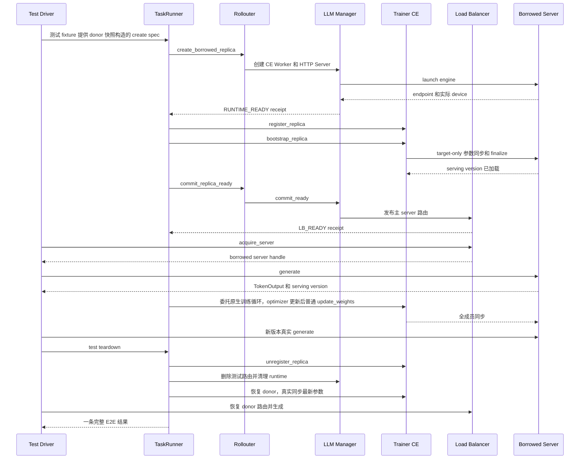

# D0–D4 综合验收测试设计

## 1. 目标与边界

本文定义 borrowed replica 在 D0–D4 已实现能力上的一次综合验收。它把各阶段的单元测试、真实 Ray/NPU 测试和端到端请求验证串成一条可追溯流程，避免“各阶段分别通过”被误认为“完整链路已经通过”。

D0–D4 的目标链路为：

```text
原生训练基线
  → native replica 和真实 PG/bundle/device 清单
  → GS/TaskRunner 下发创建 spec
  → borrowed CE Worker、HTTP Server、vLLM Engine
  → RUNTIME_READY
  → CE 注册与 target-only bootstrap
  → serving version 确认
  → LB READY
  → 经 LB 生成请求
  → 后续普通参数同步
  → 再次生成
  → 测试清理与资源核验
```

本轮不把生产级 sleep、wake、drain、reclaim、destroy 算入 D0–D4 的完成条件。这些接口目前只保留预留或测试清理行为，不能用测试 teardown 证明生产生命周期已经实现。

`D4_test.sh` 默认保留训练结束后的 command-chain smoke；只有显式设置 `D4_E2E_TEST=1`
才启用训练前创建、训练期保留 borrowed runtime、真实生成和普通 CE 同步的 E2E fixture。
综合脚本对 S1–S5、S7–S9、S16 自动启用该模式，并以一条完整结构化回执判定结果。
本机尚未执行真实 NPU 验收；“已有可执行入口”不表示场景已经通过。实现和本地验证记录见
[D0_D4_e2e_develop.md](D0_D4_e2e_develop.md)。

## 2. 验收分层

后一层不能用前一层的替身结果代替。

| 层 | 目标 | 允许的替身 | 不能证明的内容 |
| --- | --- | --- | --- |
| U：静态/单元 | spec、幂等、rank、LB 状态、CE 状态机和错误传播 | AST 隔离、mock Actor、假 Worker | Ray 放置、显存、HTTP、HCCL、真实参数 |
| N：原生适配 | 扩展类继承、原生参数转发、profile 选择 | 兼容 verl 源码和轻量 import | GPU engine 和跨进程通信 |
| R：CPU Ray | TaskRunner/GS 句柄注册、管理 RPC 并发、receipt 序列化 | 无 GPU 的 Ray Actor | NPU 显存、PG bundle、vLLM、HCCL |
| G：真实 GPU/NPU | PG/bundle、Worker、server、engine、CE 和请求 | 不允许 mock 关键组件 | 未执行的跨任务或跨节点场景 |
| E：端到端 | 一次操作从 create 到 generate、sync、cleanup 的一致性 | 仅允许测试驱动器 | 未覆盖的故障路径 |

## 3. 环境与资源前提

### 3.1 环境记录

每次验收开始前生成 environment.json：

```json
{
  "verl_source_root": "/absolute/path/to/verl",
  "multi_task_root": "/absolute/path/to/verl-multi-task",
  "verl_commit": "...",
  "plugin_commit": "...",
  "python": "...",
  "ray": "...",
  "vllm": "...",
  "vllm_ascend": "...",
  "device_type": "npu",
  "visible_devices": ["0", "1", "2", "3", "4", "5", "6", "7"],
  "model_path": "...",
  "train_files": ["..."],
  "val_files": ["..."]
}
```

driver、Ray worker、vLLM server 和 plugin 必须从同一套源码及 Python 环境导入。每个场景使用独立 Ray namespace、日志目录和 checkpoint 目录；场景结束后确认 Ray Actor、vLLM Engine 子进程和端口均已释放。

### 3.2 资源前提

1. native server 借卡前必须执行测试专用显存释放；不能让 native engine 和 borrowed engine 同时按完整显存预算运行在同一物理卡上。
2. donor CE Worker 必须从 borrower 的 HCCL 通信域中排除，否则同一物理设备对应多个 rank，可能出现 HCCL parameter error。
3. max_colocate_count 只表示 Ray bundle 的 CPU/GPU fractional placement 上限，不表示显存隔离。共卡 server 必须单独验证显存和端口。
4. 跨 PG 或跨任务 spec 必须来自授权快照；测试驱动器不能传递 donor ActorHandle、PGHandle 或 CE Worker 给 borrower。

## 4. 完整主流程

### 4.1 时序图

下面展示当前同任务测试夹具的正例顺序。placement 输入来自真实 donor 快照，由测试
fixture 构造；它不代表独立 Task 间的 GS 授权、调度策略或公平性已经经过验收。



### 4.2 硬检查

以下 A–G 是整体设计门槛，包含正向路径、契约单元检查和待实现的故障注入。本轮同机
E2E 的实际真机范围以第 7 节最终回执为准：创建/placement、bootstrap、真实生成、
原生训练后的普通同步、版本推进及测试清理/恢复。每个 S 正例不会主动注入验证所有
A–G 断言；例如 pending/READY 前不可见、替换 handle 拒绝主要由契约测试覆盖，
底层 communicator 无残留也不能由一条上层状态回执独立证明。

#### A. Native 基线

使用与插件完全相同的模型、数据、训练卡和 rollout 卡启动 profile 关闭的原生任务，完成至少一次生成和一次参数同步。记录 native replica rank、world size、PG ID、bundle、node、device、server endpoint 和参数版本。基线失败时不进入 borrowed 验收。

#### B. Placement 快照与 spec

从真实 native Worker 读取 task_id、replica_rank、worker_actor_id、pg_id、pg_name、bundle_index、node_id、gpu_uuid、local_gpu_index、node_rank 和 local_rank。测试驱动器只构造不含 ActorHandle/PGHandle 的 spec。

检查 claims 数量等于 borrower world_size、rank 从 0 连续、lease 和 epoch 正确、borrower rank 不复用 donor rank、跨 PG claim 完整，并且过期 lease、缺失 PG、重复设备在创建 Actor 前失败。

#### C. Runtime 创建

经 TaskRunner 调用 create_borrowed_replica，验证：

- 创建 borrower 自己的 CE Worker、HTTP Server 和 vLLM Engine；
- donor PG 不被删除或重新初始化；
- Worker 实际 node/GPU 与 claim 一一对应；
- world_size、nnodes、local_rank、node_rank 与 borrower spec 一致；
- 每个 server 有独立 endpoint、Actor ID 和 engine PID；
- 失败状态不是 READY，receipt 中 released 不得虚报为 true。

#### D. CE target-only bootstrap

在 RUNTIME_READY 和 LB_READY 之间检查：

- borrowed replica 是 pending 成员；
- pending 不进入普通全成员同步；
- current_param_version 在 snapshot gate 内只读取一次；
- target-only 通信域只包含训练 Worker 和目标 borrowed Worker；
- donor/sibling 不被误 abort；
- finalize 成功后才写 last_synced_versions 和 serving_version 并清除 pending；
- bootstrap 失败不进入 READY。

#### E. LB READY 与真实生成

READY 前调用 acquire_server，必须失败或看不到新 borrowed server。READY 后：

1. commit_ready 只发布主 HTTP server，不发布 headless server；
2. 同一 server_id/同一 ActorHandle 重复提交不改变 inflight 计数；
3. 同一 ID 换不同 handle 必须拒绝；
4. acquire_server 返回本次 borrowed server；
5. 通过原生 FullyAsyncLLMServerClient.generate 或等价真实客户端发送 prompt；
6. 响应包含可核对的 request ID、server ID、replica rank、serving version 或等价 trace；
7. 请求完成后 LB inflight 回到创建前基线。

仅调用 get_server_address 或 get_all_servers 不算生成验证。

#### F. 后续普通参数同步

创建并完成一次生成后执行至少一轮 update_weights：

- borrowed 被纳入 effective set；
- donor 被正确排除或恢复，不能形成重复物理 device rank；
- borrowed serving_version 更新到新 actor version；
- donor 在测试借用窗口从路由和 CE effective set 暂停，清理 borrowed 后恢复并同步最新参数；
- 同步后再次生成成功；
- 通信域 finalize 完成，无残留 communicator。

#### G. 清理

清理顺序必须为：

```text
停止/排空请求
→ unregister borrowed CE member
→ 从 LB 移除测试路由
→ 关闭 borrowed server/engine/Worker
→ 独立核验 Actor/engine 执行已退出、HTTP 端口关闭
→ 核对 donor PG、Worker、server 仍存在且可恢复
→ donor 同步最新参数并真实生成，验证资源可重新使用
```

最终 `cleanup` 必须确认测试资源释放、LB 移除、CE 注销、donor PG 保留及 donor 最新版本恢复；
`cleanup.borrowers` 保存各 runtime 的实际清理诊断，包括 Actor RPC 状态、Actor/engine
进程身份、端口状态和错误。`release_confirmed` 表示测试 runtime 的执行资源已核验释放，
生产 claim 的 `released` 仍为 false。只出现 `D4_RUNTIME_CLEANUP` 或 `DESTROYED`
不能证明清理成功。进程退出与被父进程回收分别记录，未回收的 zombie 不冒充 PID 消失。
本轮没有实现 `npu-smi` 逐卡显存回到基线的量化审计；进程/端口观察与 donor 恢复后的
真实同步、生成证明可重新使用，不应写成已经取得显存数值审计。

## 5. 场景矩阵

成功场景执行当前已实现的正向路径并采集第 7 节证据；负例执行到对应预期失败点并核验
清理。A–G 中尚缺真实注入的检查依然保留在相应 `BLOCKED` 场景，不由正例替代。

| 编号 | 场景 | spec/资源布局 | 关键检查 | 当前状态 |
| --- | --- | --- | --- | --- |
| S0 | 原生基线 | 无 borrowed | 生成、参数同步、server/PG 正常 | D0 有基础脚本，需纳入综合运行 |
| S1 | 单 PG 基础 | 一个 native PG，borrower 使用授权 claims | 创建、bootstrap、逐 rank 真实生成、训练期普通同步和清理 | E2E 入口已实现；真实设备待验收 |
| S2 | 一拆二 | donor 4 卡；两个 world_size=2 borrowed 同时存在 | 独立 lease/rank/server、不重叠 claims；两者均生成、参与训练和同步 | E2E 入口已实现；严格核对 `[2,2]`，真实设备待验收 |
| S3 | 二合一 | 两个 world_size=2 donor PG；一个 world_size=4 borrower | 全部四个 claim 合并，跨 PG 实际设备、生成和普通同步 | E2E 入口已实现；严格核对 donor `[2,2]`、borrower `[4]` |
| S4 | 碎片化 bundle | 真实 donor 的非连续 `source_claims[::2]` | 实际 bundle/device 对应；真实生成、普通同步和清理 | E2E 入口已实现；真实设备待验收 |
| S5 | 多 Worker 共 bundle | 同一 PG/bundle 的两个 world_size=1 fractional runtime | A 生成/同步 → A 暂停 → B 生成/训练/同步 → B 暂停 → A 最新参数恢复并生成；两者清理 | E2E 入口已实现；串行激活，不要求同设备两个 active CE rank |
| S6 | 跨节点均匀 | 每节点相同 Worker 数 | node/local rank、server 分组、通信域 | `BLOCKED`：缺少多机环境及跨节点 fixture |
| S7 | 异构 world_size | 两个 TP=2 donor 合并为一个 TP=4 borrower | donor/borrower rank 独立，四 Worker 实际 placement、生成和普通同步 | E2E 入口已实现；真实设备待验收 |
| S8 | 同 lease 重试 | 相同 spec/lease，串行 create 两次 | 同 rank/server、仅一套 runtime，再完成真实生成/训练/同步/清理 | E2E 入口已实现；真实设备待验收 |
| S9 | 并发重复 | 两个并发调用同时提交同 lease | 同 rank/server、仅一套 runtime，再完成真实生成/训练/同步/清理 | E2E 入口已实现；不替代跨 Task 并发 |
| S10 | lease 冲突/过期 | 相同 lease 不同 spec；expired lease | 创建前拒绝，无 Actor/PG 副作用 | 有契约单测，需真实入口 |
| S11 | PG/设备错误 | missing PG、duplicate device、错误 node/GPU | 不 READY；donor 不受损；清理可确认 | D2 负例部分覆盖 |
| S12 | Worker/engine 局部失败 | Worker 失败、OOM、端口冲突或超时 | 不发布 LB；清除部分资源；donor 恢复 | 当前缺少完整故障注入 |
| S13 | CE bootstrap 失败 | finalize、通信域或目标 Worker 更新失败 | pending/失败态；不接流；可诊断 | 有 CE 单元，需真实 backend 证据 |
| S14 | LB RPC 不确定 | LB 写入后模拟响应丢失 | 查询实际路由再重试/失败；不重复或漏删 | 当前未覆盖 |
| S15 | 多任务借用/公平性 | 独立 Task A donor、Task B borrower、GS 授权 claims | 任务隔离、两任务继续运行、跨任务分配公平性 | `BLOCKED`：缺少独立 Task fixture 和调度公平性验证 |
| S16 | 请求压力边界 | bootstrap 后及训练同步后各发至少四个并发真实请求 | request/server/token/version、路由恢复和 inflight 归零 | E2E `pressure` 已实现；有界并发验收，真实设备待验收 |

### 5.1 各场景实际执行步骤与当前可测试性

下面描述综合脚本当前调用的 E2E 模式。`可直接执行，待实测`表示面向 1 节点 8 卡、
4 张训练 NPU 加 4 张 rollout NPU 的目标服务器已有完整入口，本机没有运行设备验收。
单独运行不带 `D4_E2E_TEST=1` 的 `D4_test.sh` 仍是旧 smoke。

E2E 共用顺序为：native 初始化 → 暂停 donor CE → 摘除原 native LB 路由 → 测试休眠
donor engine → 真实 create、
target-only bootstrap、LB READY → 每个 borrowed rank 的真实生成 → 委托原生训练循环，
记录 borrowed 请求审计和 optimizer 后普通 CE 同步 → 新版本再次生成 → 测试清理 →
donor 最新参数同步、恢复路由并生成 → 输出唯一 `D0_D4_E2E_RESULT`。fixture 不新增训练入口。
E2E 默认执行两个真实 training step；旧 smoke 仍默认一步，可通过
`D4_TOTAL_TRAINING_STEPS` 调整。

| 场景 | 当前脚本实际经历的步骤 | 当前条件下的结论 |
| --- | --- | --- |
| S0 | `D0_D4_comprehensive_test.sh` → `multi_task_run.sh` → native `main_ppo`；创建原生训练/rollout 资源，执行 native rollout、训练和原生参数同步，进程退出后检查日志。 | **可直接执行**。可以证明 native baseline 可运行，但当前脚本没有导出结构化 native inventory，也不能证明 borrowed 生命周期。 |
| S1 | E2E `basic` 使用一个 donor 的授权 claims，执行共用顺序。 | **可直接执行，待实测**。必须同时具备真实 token、训练请求、最终参数普通同步和清理证据。 |
| S2 | E2E `split` 将一个四卡 donor 的完整 claims 分为两份，为两个独立 lease 创建 `[2,2]` borrowed；两个 runtime 保留到训练和同步完成。 | **可直接执行，待实测**。逐 rank 检查前后生成、训练审计和普通同步；缺少任一 borrower 证据即 `FAIL`。 |
| S3 | E2E `cross_pg` 使用两个 TP=2 donor 的全部四个 claims，创建一个 TP=4 borrower，执行共用顺序。 | **可直接执行，待实测**。严格要求两个 PG、donor `[2,2]`、borrower `[4]`，不再沿用旧 smoke 的每 PG 一个 claim。 |
| S4 | E2E `fragmented` 保留非连续 bundle 构造，核对实际 node/device，再执行共用生成、训练、同步和清理顺序。 | **可直接执行，待实测**。不是仅检查 placement 或 endpoint。 |
| S5 | E2E `shared_bundle`：A bootstrap/生成/当前版本普通同步 → A CE 注销并测试暂停 → B bootstrap/生成 → 原生训练及 B 的新版本普通同步/生成 → B 暂停 → A 重新注册、真实 bootstrap 到最终版本并生成 → A/B 清理 → donor 恢复。 | **可直接执行，待实测**。`activation_order=[A,B,A]`；前后生成覆盖 A/B，训练审计及 optimizer 普通同步只要求训练期 active B；两者不能同时进入同设备 HCCL effective set。 |
| S6 | 当前没有跨节点启动器或多节点资源配置；不能进入真实多节点 PG、node rank 和 HCCL 通信域验证。 | **不可执行**。当前只有 1 个节点。 |
| S7 | E2E `merge_world_size` 将 rollout TP 设为 2，合并两个 donor 全部 claims 为 TP=4，并执行共用顺序。 | **可直接执行，待实测**。与 S3 使用同样严格的四 Worker/双 PG、生成和同步证据。 |
| S8 | E2E `idempotent` 串行两次 create，检查同 rank/server 和一套 runtime，随后该 borrowed 完整参与生成、训练、同步及清理。 | **可直接执行，待实测**。三项幂等字段和完整 E2E 证据均须成立。 |
| S9 | E2E `concurrent_idempotent` 用两个线程并发提交相同 spec/lease，检查一套 runtime，再执行共用顺序。 | **可直接执行，待实测**。测试任务内并发 duplicate create；跨 Task 并发及公平性留在 S15。 |
| S10 | `D2_runtime_test.sh expired`；native 初始化 → 构造已过期 spec → 在创建 Worker 前被 placement/lease 校验拒绝 → 输出 `EXPECTED_FAILURE` → 主训练流程继续并清理 native 资源。 | **可直接执行**。可以验证 expired lease 不进入 `RUNTIME_READY`；不能替代完整 lease 冲突重试测试。 |
| S11 | `D2_runtime_test.sh missing_pg,duplicate_device`；native 初始化 → 构造缺失 PG 或重复设备的 spec → 创建前校验失败 → 输出预期失败 receipt → 检查没有发布 borrowed runtime。 | **可直接执行**。可以验证两类 placement 负例；Worker 中途失败、OOM、端口冲突仍没有真实注入。 |
| S12 | 当前没有第 N 个 Worker 失败、Engine OOM、端口冲突或启动超时的可控注入参数。 | **不可执行**。不能用一次自然 OOM 代替可重复的故障验收。 |
| S13 | 当前没有让 CE register、target-only bootstrap、通信域 finalize 或目标 Worker 更新可控失败的 main_ppo 入口。 | **不可执行**。已有 CE 单元测试不能证明真实 HCCL 失败后的资源状态。 |
| S14 | 当前没有让 LB `commit_ready`/remove RPC 在写入后丢失响应的测试代理，也没有查询后幂等重试入口。 | **不可执行**。不能证明 LB 不确定提交的最终路由一致性。 |
| S15 | 当前 fixture 的 donor/borrower 位于同一 Task；缺少两个独立 Task、真实 GS 授权和公平性负载。 | **BLOCKED**。不得由本地 donor fixture 推导跨 Task 隔离或公平性通过。 |
| S16 | E2E `pressure` 在 bootstrap 后和原生训练最终同步后，分别通过原生客户端并发发起四个请求，核对每个请求的目标 server、非空 token 和实际版本，再恢复路由并清理。 | **可直接执行，待实测**。两阶段 `concurrency>=4` 且每 rank 至少四个独立请求；这是有界压力边界，不是吞吐基准。 |

目标单机服务器可逐个执行 `S0、S1、S2、S3、S4、S5、S7、S8、S9、S10、S11、S16`。
S1–S5、S7–S9、S16 的结果由真实运行回执决定，不硬编码 `PASS` 或 `INCOMPLETE`。
S6、S12–S15 仍为 `BLOCKED`。本机单元测试通过不能替这些场景生成设备验收记录。

## 6. 故障注入与不变量

| 故障点 | 注入方法 | 必须成立的结果 |
| --- | --- | --- |
| spec 校验 | 删除 claim、修改 world_size、过期 expires_at | 不创建 Actor，不 READY |
| PG 解析 | 删除 PG 或修改 bundle index | 明确错误；donor PG 不删除 |
| device 校验 | 重复 gpu_uuid 或 node/GPU 不匹配 | 不启动 engine，不加入 CE/LB |
| Worker 创建 | 第 N 个 Worker 创建失败 | 清除已成功 Worker；released 未确认前不能为 true |
| Engine 启动 | 显存不足、端口冲突或 engine core 失败 | 不发布 endpoint；有部分资源清理证据 |
| CE 注册 | rank 冲突或不同 Worker handle | 不进入 pending/READY，原成员不变 |
| bootstrap | update 或 finalize 抛错 | 不写确认版本，不进 effective set，LB 无路由 |
| LB commit | RPC 超时、写后断回包 | 查询实际状态后幂等重试或返回不确定 |
| 生成请求 | server 错误或请求超时 | finally 释放 inflight；下一请求仍可路由 |
| cleanup | kill 或通信域释放失败 | receipt 保留 errors，不能只返回 DESTROYED |

每个故障场景检查：

1. donor PG、Worker、server 不被 borrower 清理；
2. 失败 borrowed runtime 不在 LB；
3. 未确认释放时 released 不为 true；
4. 同一 lease 重试不产生第二组 Worker、engine 或 rank。

## 7. 证据格式

当前脚本实际保存 `environment.json`、逐场景运行日志、`results.tsv` 和 `summary.json`。
E2E 日志中的唯一最终回执保存 topology、bootstrap、普通同步、生成、训练审计和清理信息。
排查复杂部署时可额外拆分保存下列证据；这些独立文件名不是当前脚本全部自动生成的承诺：

```text
environment.json
spec.json
native_inventory.json
task_runner_receipts.jsonl
ce_events.jsonl
lb_events.jsonl
generation_results.jsonl
ray_actors_after_cleanup.json
device_memory_before_after.json
stdout.log
stderr.log
```

创建阶段日志保留 operation_id、lease_id、replica_rank、world_size、state 等字段。
E2E 最终回执以 `D0_D4_E2E_RESULT ` 后的一行 JSON 为准，`schema_version=1`：

| 字段 | 必须可核对的事实 |
| --- | --- |
| `scenario/state` | 与选定场景一致；必须为 `PASSED`，但状态字段单独不构成通过 |
| `training` | `completed=true`、`state=COMPLETED`、正整数 `completed_steps==target_steps`，以及最终 `current_param_version` |
| `topology/bootstrap_versions` | 真实 borrowed rank/world size/donor/PG，场景约束及每 rank 首次版本；S5 还需 active B 与 `[A,B,A]` |
| `normal_syncs` | `origin=optimizer_loop` 的最终新版本覆盖全部训练期 borrowed rank；逐 rank 确认版本/Worker 数与 effective set 一致 |
| `normal_syncs[].parameter_validation` | source/receiver 校验状态、同版本、正参数数量/numel、相同 manifest digest；Worker 总数匹配同步映射 |
| `generation_before/after` | 每 rank 的原生客户端请求，实际 acquired server、独立 request ID、非空 token、bootstrap/最终版本；S16 两阶段均至少四请求并发 |
| `training_audits` | 每个训练期 active rank 有真实非空完成请求，无失败和残留 inflight；S5 仅要求 B |
| `cleanup` | 每个 borrower 的资源释放证据、CE/LB 移除、donor PG 保留、最终版本真实同步和 donor 真实生成 |

`e2e_verdict.py` 只使用 Python 标准库，按绝对源码文件路径执行。它要求训练进程实际退出码
为 0、日志中恰好一条 marker、JSON 完整且内部证据一致。缺失、重复、矛盾、解析失败或
进程失败都返回 `FAIL`，不会从不同日志行或多个运行拼接成功证据。

插件 Trainer 的训练完成回执如下；E2E 最终回执包含同一训练对象，严格核对步数：

```text
MULTITASK_TRAINING_COMPLETE {"state": "COMPLETED", "completed": true,
                             "completed_steps": N, "target_steps": N, ...}
```

`[ASYNC MAIN] One component completed successfully`、`total time`、进程退出码为 0
以及没有 Traceback 都不能单独证明训练完成了全部 step。异常、OOM、HCCL 错误等日志只作为
诊断信息；如果没有 `completed_steps == target_steps` 的回执，场景必须判为失败。脚本仍会
检查子进程和 `tee` 的退出码，用于发现测试驱动器自身没有正常退出；这属于执行完整性检查，
不替代训练完成回执。

参数同步成功还必须有 `CE_PARAMETER_VALIDATION` 回执。启用测试开关后，CE Worker 在接收
每个 named tensor 时记录 name、shape、dtype、numel 和 SHA-256，Manager 比较所有接收
Worker 的完整 manifest，并核对本次冻结的参数版本。只看到 `WEIGHTS_READY` 或
`FULL_SYNC_READY` 而没有逐参数 manifest，不能证明参数内容一致。该校验默认关闭，D0、D3、
D4 验收脚本显式打开，因为逐参数 hash 会增加同步开销。

D3/D4 还显式打开 `MULTITASK_SOURCE_VALIDATION=1` 和
`multitask.source_validation.enabled`。在 `multitask_hccl` 后端中，
Actor rank 0 同时生成 source manifest，Manager 对 source 与每个 CE Worker 的 manifest
逐参数比较。回执必须包含 `"source_state": "SOURCE_TO_RECEIVER_VALIDATED"`；只有
`WEIGHTS_READY`、`FULL_SYNC_READY` 或接收侧 digest 一致而缺少该字段，不能证明参数
确实等于 Actor 源模型。

## 8. 一键综合脚本实现

`D0_D4_comprehensive_test.sh` 每次只接受一个场景名。它使用 `tee` 实时打印并保存 native
verl、Ray、vLLM 和训练日志，生成 `environment.json`、`results.tsv` 和 `summary.json`。
S1–S5、S7–S9、S16 自动传入 `D4_E2E_TEST=1`；`D4_test.sh` 禁用旧
`multitask.d4_runtime_test`、启用 `multitask.e2e_test`，沿用原训练入口。
子脚本检查实际训练进程与 `tee` 退出码并验证唯一 E2E 回执，综合脚本再核对其捕获日志。
`INCOMPLETE` 仍属于汇总格式，但这些正例已不再固定返回该状态。

当前映射如下：

| 场景 | 执行入口 | 当前判定 |
| --- | --- | --- |
| S0 | `multi_task_run.sh`，只启用 CE 接收侧逐参数校验，不启用 borrowed smoke hook | 必须有全 step 完成回执和 CE manifest 校验才为 `PASS`；默认 `nccl` 不做 source manifest 比对 |
| S1 | E2E `basic` | 单 rank 完整结构化回执通过才 `PASS` |
| S2 | E2E `split` | `[2,2]` 两 rank 完整生成/训练/普通同步/清理证据通过才 `PASS` |
| S3 | E2E `cross_pg` | 双 donor `[2,2]`、双 PG → borrower `[4]` 及完整回执通过才 `PASS` |
| S4 | E2E `fragmented` | 碎片 placement 实测和完整回执通过才 `PASS` |
| S5 | E2E `shared_bundle` | `[1,1]`、A→B→A、两 rank 前后生成、B 训练后普通同步和两者清理通过才 `PASS` |
| S6 | 跨节点环境/fixture | `BLOCKED` |
| S7 | E2E `merge_world_size` | 2+2→4 实测和完整回执通过才 `PASS` |
| S8 | E2E `idempotent` | 串行重试同 rank/server/一套 runtime 及完整回执通过才 `PASS` |
| S9 | E2E `concurrent_idempotent` | 并发 create 同 rank/server/一套 runtime 及完整回执通过才 `PASS` |
| S10 | `D2_runtime_test.sh expired` | 预期拒绝且无 READY 才为 `PASS` |
| S11 | `D2_runtime_test.sh missing_pg,duplicate_device` | placement 负例均按预期失败才为 `PASS` |
| S12、S13、S14 | 缺少可控真实故障注入 | `BLOCKED` |
| S15 | 缺少独立 Task/公平性 fixture | `BLOCKED` |
| S16 | E2E `pressure` | 前后各至少四并发真实请求及完整回执通过才 `PASS` |

成功路径必须经由真实 `main_ppo`。fixture 只负责测试窗口和证据采集；真实模型生成、
optimizer、参数传输、CE 和 LB 使用已有实现。多节点、独立 Task、公平性和故障注入
场景仍需相应环境及 fixture。

返回值：

```text
0  所有选定场景的完整证据通过
1  任一场景失败、证据缺失或清理未确认
2  环境/版本/硬件不满足，或存在 INCOMPLETE/BLOCKED 场景
```

默认 D2/D3/D4 smoke 与新的综合 E2E 可分别运行：

```bash
D2_RUNTIME_SCENARIOS=basic,split,fragmented,cross_pg bash ../D2_runtime_test.sh
D3_RUNTIME_SCENARIOS=basic,split,fragmented,cross_pg bash ../D3_test.sh
D4_RUNTIME_SCENARIOS=basic,split,fragmented,cross_pg bash ../D4_test.sh

# D4 资源边界和 lease 幂等场景
D4_RUNTIME_SCENARIOS=shared_bundle bash ../D4_test.sh
D4_RUNTIME_SCENARIOS=merge_world_size bash ../D4_test.sh
D4_RUNTIME_SCENARIOS=idempotent bash ../D4_test.sh
D4_RUNTIME_SCENARIOS=concurrent_idempotent bash ../D4_test.sh

# 综合脚本：每次只运行一个场景
D0_D4_SCENARIOS=S0 bash ../D0_D4_comprehensive_test.sh
D0_D4_SCENARIOS=S1 bash ../D0_D4_comprehensive_test.sh
D0_D4_SCENARIOS=S5 bash ../D0_D4_comprehensive_test.sh
D0_D4_SCENARIOS=S16 bash ../D0_D4_comprehensive_test.sh
D0_D4_SCENARIOS=S10 bash ../D0_D4_comprehensive_test.sh

# 直接启用同一 D4 E2E 入口；不带开关时仍执行旧 smoke
D4_E2E_TEST=1 D4_RUNTIME_SCENARIOS=split bash ../D4_test.sh

# 批量运行：每次只启动一个场景；无论当前场景成功、失败或阻塞，
# 脚本都会等待其进程结束并记录结果，然后再启动下一个场景
bash ../D0_D4_batch_test.sh

# 只运行指定子集；仍然严格串行
D0_D4_BATCH_SCENARIOS=S0,S1,S2,S3,S4,S5,S7,S8,S9,S10,S11,S16 \
  bash ../D0_D4_batch_test.sh

# 批量结果目录包含每个场景的控制台日志、单场景 summary.json，
# 以及总的 results.tsv 和 summary.json。批量入口不会因为某个场景
# 返回 FAIL 而提前退出，因此可以一次收集全部场景的结果。

# 允许已声明的 BLOCKED 项汇总退出为 0；状态仍为 BLOCKED，不是验收通过
D0_D4_REQUIRE_COMPLETE=0 \
D0_D4_SCENARIOS=S6 \
  bash ../D0_D4_comprehensive_test.sh
```

批量脚本默认依次执行 S0 到 S16；设置 `D0_D4_BATCH_SCENARIOS` 可以传入逗号或空格
分隔的子集。最终返回 0 表示全部通过，返回 1 表示至少一个场景失败，返回 2 表示存在
环境阻塞或证据不足。

S6、S15 分别需要多节点以及独立 Task/公平性 fixture；脚本明确记录 `BLOCKED`，不能自动
跳过后报告全部通过。运行子集返回 0 只证明该子集，本文件整体门槛仍包含未完成故障场景。

## 9. 通过标准

D0–D4 综合验收只有在以下条件全部满足时通过：

1. S0 原生基线通过；
2. 至少一个成功场景完成 create → bootstrap → READY → generate → sync → generate → cleanup；
3. S2、S3、S4、S7 覆盖拆分、合并、跨 PG、碎片化和异构 world size；
4. S8、S9、S10 覆盖幂等、并发重复和租约边界；
5. S11–S14 覆盖 placement、engine、CE、LB 四类失败，且没有 READY 或资源残留；
6. 真实日志证明 CE 通信域、参数版本、LB inflight 和生成请求；
7. 清理结果 errors 为空、release_confirmed=true，并确认 donor PG/Worker/server 保留；
8. 目标部署涉及多任务或跨节点时，必须在对应硬件通过；暂不具备时只能标记阻塞；
9. 生产 sleep/wake/reclaim/destroy 另行验收，不得使用本文件的测试 teardown 冒充生命周期完成。

当前同机正例的真实生成、训练期普通同步和结构化清理已具备可执行入口，尚待设备运行
结果。S12–S14 故障注入及需要的跨节点/多 Task 验收仍未完成，因此不能把正例子集通过
解释为整个 S0–S16 综合验收完成。

## 10. 历史 smoke 修复说明（2026-09-25）

本节记录 E2E fixture 引入前的服务器反馈修复；其中旧 D4 marker 仍适用于默认 smoke，
当前综合脚本的步骤、证据和状态以第 5、7、8 节及
[E2E 开发记录](D0_D4_e2e_develop.md) 为准。

| 场景 | 本次修复与需要查看的证据 |
| --- | --- |
| S5 | donor CE 占 1 CPU，borrower A/B 各占 0.5 CPU；两个 borrowed 的 accelerator fraction 各为 0.25。端口探测任务改为 0 CPU，避免只剩 0.5 CPU 时等待调度。依然在原 PG/bundle 上创建两套独立 runtime；检查 `D4_SHARED_BUNDLE_RESULT` 和清理结果。 |
| S7 | 两个 donor 的 local_rank 会重复；先按节点内 Ray 设备 ID 数值排序，再分配 borrower rank/local_rank。检查 `BORROWED_WORKER_PLACEMENT` 中四个不同设备的升序映射、原 PG/bundle 归属，以及 CE 校验和 LB_READY。只排序 HTTP mask 而不调整 CE rank 不可作为修复。 |
| S8 | fixture 使用 basic placement，同一份 spec/lease 仍串行提交两次。`D4_IDEMPOTENCY_RESULT` 中 rank/server 相同，Worker 数等于 spec.world_size，server 数等于节点数；默认是 4 Worker、1 server。 |
| S9 | fixture 使用 basic placement，同一份 spec/lease 仍由两个线程并发提交；创建操作受原任务锁保护。`D4_CONCURRENCY_RESULT` 采用与 S8 相同的拓扑数量及端点一致性校验。 |

失败回执现在包含 `error.type/stage/message/traceback`，有原因链时包含 `error.cause`。
例如 `MASTER_ADDRESS` 阶段尚未创建 CE Actor；`HTTP_ENGINE_START` 阶段需继续查看
EngineCore 日志。`kill_requested=[]` 本身不再被当作底层根因。

S7 的原 ACL 错误不能证明 OOM 或残留进程；当前消除了代码中已确认的设备排序问题，
仍需真实服务器验证。各场景独立使用测试 spec，不修改全局可见设备环境，不执行全局杀进程。

```bash
# 单独复测
D0_D4_SCENARIOS=S7 bash ../D0_D4_comprehensive_test.sh
# 四项严格串行复测，每项完成（无论成败）后才启动下一项
D0_D4_BATCH_SCENARIOS=S5,S7,S8,S9 bash ../D0_D4_batch_test.sh
```

在当时的 smoke 验收中，创建/幂等异常会导致 `FAIL`，阶段路径通过而完整生成/同步证据
缺失则为 `INCOMPLETE`。该历史结论不再是当前 E2E 正例的固定结果；现在必须检查唯一
`D0_D4_E2E_RESULT` 的完整内容及实际进程退出码。
