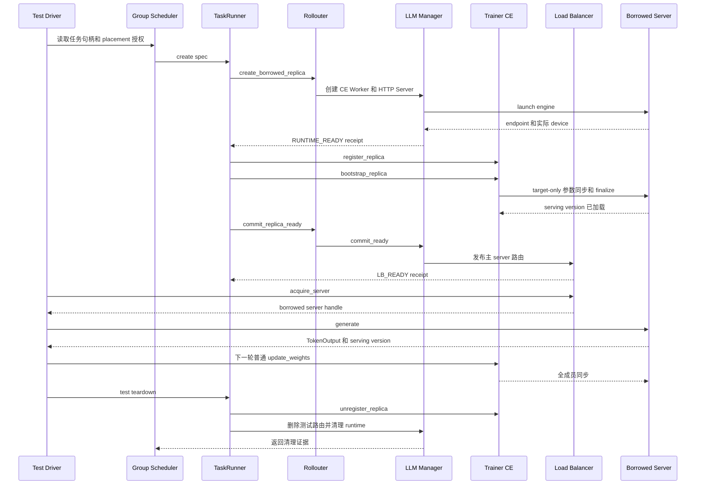

# D0–D4 综合验收测试设计

## 1. 目标与边界

本文定义 borrowed replica 在 D0–D4 已实现能力上的一次综合验收。它把各阶段的单元测试、真实 Ray/NPU 测试和端到端请求验证串成一条可追溯流程，避免“各阶段分别通过”被误认为“完整链路已经通过”。

D0–D4 的目标链路为：

```text
原生训练基线
  → native replica 和真实 PG/bundle/device 清单
  → GS/TaskRunner 下发创建 spec
  → borrowed CE Worker、HTTP Server、vLLM Engine
  → RUNTIME_READY
  → CE 注册与 target-only bootstrap
  → serving version 确认
  → LB READY
  → 经 LB 生成请求
  → 后续普通参数同步
  → 再次生成
  → 测试清理与资源核验
```

本轮不把生产级 sleep、wake、drain、reclaim、destroy 算入 D0–D4 的完成条件。这些接口目前只保留预留或测试清理行为，不能用测试 teardown 证明生产生命周期已经实现。

当前 D4_test.sh 在训练结束后执行 smoke，只检查 endpoint 和 LB 名录，不能单独作为综合验收。综合验收必须补充真实生成请求、CE 状态、参数版本和清理结果的核验。

## 2. 验收分层

后一层不能用前一层的替身结果代替。

| 层 | 目标 | 允许的替身 | 不能证明的内容 |
| --- | --- | --- | --- |
| U：静态/单元 | spec、幂等、rank、LB 状态、CE 状态机和错误传播 | AST 隔离、mock Actor、假 Worker | Ray 放置、显存、HTTP、HCCL、真实参数 |
| N：原生适配 | 扩展类继承、原生参数转发、profile 选择 | 兼容 verl 源码和轻量 import | GPU engine 和跨进程通信 |
| R：CPU Ray | TaskRunner/GS 句柄注册、管理 RPC 并发、receipt 序列化 | 无 GPU 的 Ray Actor | NPU 显存、PG bundle、vLLM、HCCL |
| G：真实 GPU/NPU | PG/bundle、Worker、server、engine、CE 和请求 | 不允许 mock 关键组件 | 未执行的跨任务或跨节点场景 |
| E：端到端 | 一次操作从 create 到 generate、sync、cleanup 的一致性 | 仅允许测试驱动器 | 未覆盖的故障路径 |

## 3. 环境与资源前提

### 3.1 环境记录

每次验收开始前生成 environment.json：

```json
{
  "verl_source_root": "/absolute/path/to/verl",
  "multi_task_root": "/absolute/path/to/verl-multi-task",
  "verl_commit": "...",
  "plugin_commit": "...",
  "python": "...",
  "ray": "...",
  "vllm": "...",
  "vllm_ascend": "...",
  "device_type": "npu",
  "visible_devices": ["0", "1", "2", "3", "4", "5", "6", "7"],
  "model_path": "...",
  "train_files": ["..."],
  "val_files": ["..."]
}
```

driver、Ray worker、vLLM server 和 plugin 必须从同一套源码及 Python 环境导入。每个场景使用独立 Ray namespace、日志目录和 checkpoint 目录；场景结束后确认 Ray Actor、vLLM Engine 子进程和端口均已释放。

### 3.2 资源前提

1. native server 借卡前必须执行测试专用显存释放；不能让 native engine 和 borrowed engine 同时按完整显存预算运行在同一物理卡上。
2. donor CE Worker 必须从 borrower 的 HCCL 通信域中排除，否则同一物理设备对应多个 rank，可能出现 HCCL parameter error。
3. max_colocate_count 只表示 Ray bundle 的 CPU/GPU fractional placement 上限，不表示显存隔离。共卡 server 必须单独验证显存和端口。
4. 跨 PG 或跨任务 spec 必须来自授权快照；测试驱动器不能传递 donor ActorHandle、PGHandle 或 CE Worker 给 borrower。

## 4. 完整主流程

### 4.1 时序图



### 4.2 硬检查

#### A. Native 基线

使用与插件完全相同的模型、数据、训练卡和 rollout 卡启动 profile 关闭的原生任务，完成至少一次生成和一次参数同步。记录 native replica rank、world size、PG ID、bundle、node、device、server endpoint 和参数版本。基线失败时不进入 borrowed 验收。

#### B. Placement 快照与 spec

从真实 native Worker 读取 task_id、replica_rank、worker_actor_id、pg_id、pg_name、bundle_index、node_id、gpu_uuid、local_gpu_index、node_rank 和 local_rank。测试驱动器只构造不含 ActorHandle/PGHandle 的 spec。

检查 claims 数量等于 borrower world_size、rank 从 0 连续、lease 和 epoch 正确、borrower rank 不复用 donor rank、跨 PG claim 完整，并且过期 lease、缺失 PG、重复设备在创建 Actor 前失败。

#### C. Runtime 创建

经 TaskRunner 调用 create_borrowed_replica，验证：

- 创建 borrower 自己的 CE Worker、HTTP Server 和 vLLM Engine；
- donor PG 不被删除或重新初始化；
- Worker 实际 node/GPU 与 claim 一一对应；
- world_size、nnodes、local_rank、node_rank 与 borrower spec 一致；
- 每个 server 有独立 endpoint、Actor ID 和 engine PID；
- 失败状态不是 READY，receipt 中 released 不得虚报为 true。

#### D. CE target-only bootstrap

在 RUNTIME_READY 和 LB_READY 之间检查：

- borrowed replica 是 pending 成员；
- pending 不进入普通全成员同步；
- current_param_version 在 snapshot gate 内只读取一次；
- target-only 通信域只包含训练 Worker 和目标 borrowed Worker；
- donor/sibling 不被误 abort；
- finalize 成功后才写 last_synced_versions 和 serving_version 并清除 pending；
- bootstrap 失败不进入 READY。

#### E. LB READY 与真实生成

READY 前调用 acquire_server，必须失败或看不到新 borrowed server。READY 后：

1. commit_ready 只发布主 HTTP server，不发布 headless server；
2. 同一 server_id/同一 ActorHandle 重复提交不改变 inflight 计数；
3. 同一 ID 换不同 handle 必须拒绝；
4. acquire_server 返回本次 borrowed server；
5. 通过原生 FullyAsyncLLMServerClient.generate 或等价真实客户端发送 prompt；
6. 响应包含可核对的 request ID、server ID、replica rank、serving version 或等价 trace；
7. 请求完成后 LB inflight 回到创建前基线。

仅调用 get_server_address 或 get_all_servers 不算生成验证。

#### F. 后续普通参数同步

创建并完成一次生成后执行至少一轮 update_weights：

- borrowed 被纳入 effective set；
- donor 被正确排除或恢复，不能形成重复物理 device rank；
- borrowed serving_version 更新到新 actor version；
- native 服务和生成不受影响；
- 同步后再次生成成功；
- 通信域 finalize 完成，无残留 communicator。

#### G. 清理

清理顺序必须为：

```text
停止/排空请求
→ unregister borrowed CE member
→ 从 LB 移除测试路由
→ 关闭 borrowed server/engine/Worker
→ 检查 Actor、子进程、端口和设备显存
→ 核对 donor PG、Worker、server 仍存在且可恢复
```

清理 receipt 必须显式记录 errors、kill_requested、release_confirmed、lb_removed、ce_unregistered 和 donor_pg_preserved。只出现 D4_RUNTIME_CLEANUP，或只返回 DESTROYED，不能证明清理成功。

## 5. 场景矩阵

每个成功场景执行 A–G；失败场景执行到预期失败点，然后执行清理核验。

| 编号 | 场景 | spec/资源布局 | 关键检查 | 当前状态 |
| --- | --- | --- | --- | --- |
| S0 | 原生基线 | 无 borrowed | 生成、参数同步、server/PG 正常 | D0 有基础脚本，需纳入综合运行 |
| S1 | 单 PG 基础 | 一个 native PG，borrower 使用授权 claims | RUNTIME_READY、bootstrap、LB、真实生成 | D2/D3/D4 分别覆盖，未串成完整请求流程 |
| S2 | 一拆二 | donor 4 卡；创建两个 world_size=2 borrowed | 两个 lease/rank/server 独立；claim 不重叠；分别 bootstrap 和生成 | 当前 D2 smoke 未覆盖两个 borrower 同时创建 |
| S3 | 二合一 | 两个 world_size=2 donor PG；一个 world_size=4 borrower | 跨 PG rank 重新编号；四 Worker、一个 engine 拓扑一致 | 当前 cross_pg 只选少量 claim，不能代替 |
| S4 | 碎片化 bundle | 同一/多个 PG 选择非连续 bundle，如 1、3、0、2 | 实际 bundle 与 claim 逐条匹配 | 有 D2 证据，需接入 CE/LB/生成 |
| S5 | 多 Worker 共 bundle | max_colocate_count 大于 2，多个 fractional claim | 先验证 Ray/CE placement，再核验显存 | 需 CE-only 或足够显存配置 |
| S6 | 跨节点均匀 | 每节点相同 Worker 数 | node/local rank、server 分组、通信域 | 单机 8 卡不能证明 |
| S7 | 异构 world_size | donor 4→borrower 2，donor 2+2→borrower 4 | donor rank 不复用，borrower rank 连续 | 当前只验证部分拆分 |
| S8 | 同 lease 重试 | 相同 spec、相同 lease、重复 RPC | 一个 runtime、同一 receipt | 有 D1 单元，需真实 Ray 重复 RPC |
| S9 | 并发重复 | 多线程或多 Ray caller 同时提交同 lease | 一个 rank、一个 Worker/engine 集合 | 当前没有真实 Ray 并发验收 |
| S10 | lease 冲突/过期 | 相同 lease 不同 spec；expired lease | 创建前拒绝，无 Actor/PG 副作用 | 有契约单测，需真实入口 |
| S11 | PG/设备错误 | missing PG、duplicate device、错误 node/GPU | 不 READY；donor 不受损；清理可确认 | D2 负例部分覆盖 |
| S12 | Worker/engine 局部失败 | Worker 失败、OOM、端口冲突或超时 | 不发布 LB；清除部分资源；donor 恢复 | 当前缺少完整故障注入 |
| S13 | CE bootstrap 失败 | finalize、通信域或目标 Worker 更新失败 | pending/失败态；不接流；可诊断 | 有 CE 单元，需真实 backend 证据 |
| S14 | LB RPC 不确定 | LB 写入后模拟响应丢失 | 查询实际路由再重试/失败；不重复或漏删 | 当前未覆盖 |
| S15 | 多任务借用 | Task A donor、Task B borrower、GS 授权 claims | borrower 不持 donor handle；两任务可继续 | 当前 smoke 是同 manager 本地 donor |
| S16 | 请求压力边界 | READY 后并发多个 request | inflight、sticky 路由、释放计数和输出 | 当前未覆盖真实生成压力 |

## 6. 故障注入与不变量

| 故障点 | 注入方法 | 必须成立的结果 |
| --- | --- | --- |
| spec 校验 | 删除 claim、修改 world_size、过期 expires_at | 不创建 Actor，不 READY |
| PG 解析 | 删除 PG 或修改 bundle index | 明确错误；donor PG 不删除 |
| device 校验 | 重复 gpu_uuid 或 node/GPU 不匹配 | 不启动 engine，不加入 CE/LB |
| Worker 创建 | 第 N 个 Worker 创建失败 | 清除已成功 Worker；released 未确认前不能为 true |
| Engine 启动 | 显存不足、端口冲突或 engine core 失败 | 不发布 endpoint；有部分资源清理证据 |
| CE 注册 | rank 冲突或不同 Worker handle | 不进入 pending/READY，原成员不变 |
| bootstrap | update 或 finalize 抛错 | 不写确认版本，不进 effective set，LB 无路由 |
| LB commit | RPC 超时、写后断回包 | 查询实际状态后幂等重试或返回不确定 |
| 生成请求 | server 错误或请求超时 | finally 释放 inflight；下一请求仍可路由 |
| cleanup | kill 或通信域释放失败 | receipt 保留 errors，不能只返回 DESTROYED |

每个故障场景检查：

1. donor PG、Worker、server 不被 borrower 清理；
2. 失败 borrowed runtime 不在 LB；
3. 未确认释放时 released 不为 true；
4. 同一 lease 重试不产生第二组 Worker、engine 或 rank。

## 7. 证据格式

每个场景保存：

```text
environment.json
spec.json
native_inventory.json
task_runner_receipts.jsonl
ce_events.jsonl
lb_events.jsonl
generation_results.jsonl
ray_actors_after_cleanup.json
device_memory_before_after.json
stdout.log
stderr.log
```

每条 receipt 至少包含 scenario、operation_id、lease_id、replica_rank、state、world_size、serving_version、server_id、ce_registered、bootstrap_finalized、lb_registered、generated_request_ids、released 和 error。

脚本不能只用 grep 判断 marker 是否出现。应解析 JSON，同时验证状态、错误列表、计数、server ID、版本和清理结果。出现 Traceback、HCCL 错误、OOM、release_confirmed=false 或未知状态时，场景失败。

## 8. 一键综合脚本实现

已新增 `D0_D4_comprehensive_test.sh`。脚本不是简单地把阶段脚本的退出码相加，而是为每个场景生成独立日志、`environment.json`、`results.tsv` 和 `summary.json`，并区分真实通过、阶段路径通过但证据不足（`INCOMPLETE`）和当前没有实现入口（`BLOCKED`）。

当前映射如下：

| 场景 | 执行入口 | 当前判定 |
| --- | --- | --- |
| S0 | `multi_task_run.sh`，不启用 smoke hook | native baseline 成功才为 `PASS` |
| S1 | `D4_test.sh basic` | 当前 D4 只验证到 LB/endpoint，因此为 `INCOMPLETE` |
| S2 | `D4_test.sh split` | 只创建一个拆分后的 borrower，尚未验证两个 borrower 同时存在，为 `INCOMPLETE` |
| S3 | `D4_test.sh cross_pg` | 当前只验证跨 PG claim，尚未验证 2+2 合成 world_size=4，为 `INCOMPLETE` |
| S4 | `D4_test.sh fragmented` | placement 和 runtime 路径可执行，但缺少真实 generate/后续 sync，为 `INCOMPLETE` |
| S8、S9 | `D2_test.sh` 契约单元测试 | 只有单元证据，真实重试/并发 RPC 未实现，为 `INCOMPLETE` |
| S10 | `D2_runtime_test.sh expired` | 预期拒绝且无 READY 才为 `PASS` |
| S11 | `D2_runtime_test.sh missing_pg,duplicate_device` | placement 负例均按预期失败才为 `PASS` |
| S12、S13、S14、S16 | 暂无真实故障注入或请求压力入口 | `BLOCKED` |

成功路径必须经由真实 `main_ppo`，并执行现有的 create → CE bootstrap → LB READY → 测试清理链路；脚本不会把未实现的 generate、普通同步、并发或故障注入伪装成通过。多节点/多任务场景仍需额外 harness。

返回值：

```text
0  所有选定场景的完整证据通过
1  任一场景失败、证据缺失或清理未确认
2  环境/版本/硬件不满足，或存在 INCOMPLETE/BLOCKED 场景
```

现有脚本仍是阶段回归：

```bash
D2_RUNTIME_SCENARIOS=basic,split,fragmented,cross_pg bash ../D2_runtime_test.sh
D3_RUNTIME_SCENARIOS=basic,split,fragmented,cross_pg bash ../D3_test.sh
D4_RUNTIME_SCENARIOS=basic,split,fragmented,cross_pg bash ../D4_test.sh

# 综合脚本（严格模式，默认要求所有选定场景完整）
D0_D4_SCENARIOS=S0,S1,S2,S3,S4,S8,S9,S10,S11,S12,S13,S14,S16 \
  bash ../D0_D4_comprehensive_test.sh

# 只做当前阶段路径回归；仍须查看 summary.json，不能据此宣布综合验收完成
D0_D4_REQUIRE_COMPLETE=0 \
D0_D4_SCENARIOS=S0,S1,S2,S3,S4,S10,S11 \
  bash ../D0_D4_comprehensive_test.sh
```

S6、S15 需要多节点或两个独立任务；硬件或 GS 不支持时，脚本必须返回“环境/能力阻塞”，不能自动跳过后报告全部通过。

## 9. 通过标准

D0–D4 综合验收只有在以下条件全部满足时通过：

1. S0 原生基线通过；
2. 至少一个成功场景完成 create → bootstrap → READY → generate → sync → generate → cleanup；
3. S2、S3、S4、S7 覆盖拆分、合并、跨 PG、碎片化和异构 world size；
4. S8、S9、S10 覆盖幂等、并发重复和租约边界；
5. S11–S14 覆盖 placement、engine、CE、LB 四类失败，且没有 READY 或资源残留；
6. 真实日志证明 CE 通信域、参数版本、LB inflight 和生成请求；
7. 清理结果 errors 为空、release_confirmed=true，并确认 donor PG/Worker/server 保留；
8. 目标部署涉及多任务或跨节点时，必须在对应硬件通过；暂不具备时只能标记阻塞；
9. 生产 sleep/wake/reclaim/destroy 另行验收，不得使用本文件的测试 teardown 冒充生命周期完成。

在实现真实生成、结构化清理结果、LB 不确定提交核对和多任务 harness 之前，当前 D0–D4 只能标记为“阶段测试通过、综合验收未完成”。
