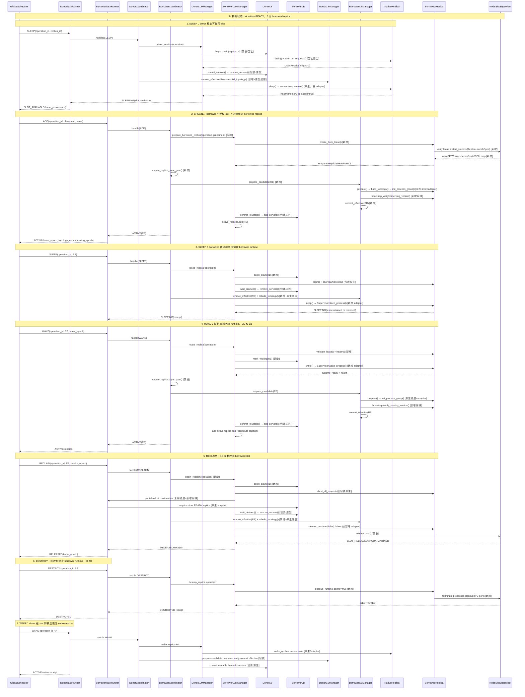

# Replica 资源生命周期设计

## 1. 目标、范围和基本原则

本文设计 `verl-multi-task` 在不修改 verl 原文件的前提下，实现 replica 的五类能力：

1. 创建 borrowed replica；
2. 销毁 borrowed replica；
3. 休眠 native 或 borrowed replica；
4. 唤醒已休眠 replica；
5. 在调度器要求下回收 borrowed replica。

本文只定义任务侧执行能力和组件边界，不定义 GlobalScheduler 的调度算法。GS 决定“谁借、谁捐、借多少、何时回收”，任务侧负责安全执行并返回可验证的结果。

设计原则：

- native 和 borrowed 对外遵循同一套 Replica 生命周期协议；
- borrowed 只复用 GS 授权的物理 GPU slot，不复用 donor 的 ResourcePool、Placement Group、CE Worker、ServerAdapter 或 process group；
- Manager、CE、LB 只在事务提交后看到 ACTIVE replica；
- 原生 verl 接口只作为底层动作复用，不能把原生列表操作当作完整的动态扩缩协议；
- 任一步骤失败都必须可回滚或进入 `QUARANTINED`，不能虚报 GPU 已释放或 replica 已可接流。

### 1.1 replica 类型

| 类型 | 创建方式 | 运行时所有权 | 资源归还 | 是否允许 destroy |
|---|---|---|---|---|
| native replica | 任务启动时通过原生 worker group/PG 创建 | donor 任务 | sleep 后由 donor wake | 作为捐赠归还动作时禁止 |
| borrowed replica | 根据 GS 的 slot lease 由 borrower 创建 | borrower 任务 | reclaim 后 sleep 或 destroy | 允许，必须先排空并清理 |

两类 replica 可以使用同一个 `MultiTaskReplica` 具体类，也可以分别实现同一个 `Replica` 协议。无论采用哪种形式，二者的 server、CE Worker、IPC 端点和 process group 都必须独立。

### 1.2 生命周期状态

```text
STOPPED
   └─ prepare/create ─→ PREPARED
PREPARED
   └─ bootstrap + commit ─→ READY
READY
   └─ drain ─→ DRAINING
DRAINING
   ├─ sleep ─→ SLEEPING
   ├─ remove + destroy ─→ DESTROYED
   └─ failure ─→ QUARANTINED
SLEEPING
   ├─ wake ─→ READY
   └─ lease 过期/故障 ─→ DESTROYED 或 QUARANTINED
```

`READY` 是唯一允许 LB 路由请求的状态。`DRAINING` 仍保留 in-flight 计数，`SLEEPING` 不属于 CE effective set，`DESTROYED` 是终态。

## 2. 组件设计：原生能力复用与插件扩展

### 2.1 总体组件关系

```text
GlobalScheduler (外部/新增)
        │ operation + slot lease
        ▼
MultiTaskTaskRunner (插件 command adapter)
        ├── ReplicaOperationCoordinator (新增：事务、幂等、跨 Actor gate)
        ├── MultiTaskLLMServerManager (扩展：replica 生命周期)
        │      ├── NativeReplica
        │      ├── BorrowedReplica
        │      └── MultiTaskGlobalRequestLoadBalancer
        └── MultiTaskCheckpointEngineManager (扩展：CE effective projection)
               └── CheckpointTopologyAdapter (新增：动态拓扑)

BorrowedReplica
        ├── LeaseResourceBinder (新增)
        ├── NodeSlotSupervisor (新增，CPU-only launcher)
        ├── BorrowedRuntimeFactory (新增)
        ├── Borrowed CE Worker 集合 (新增、独立)
        └── Borrowed server/engine/endpoint (新增、独立)
```

### 2.2 原生 verl 组件的复用和修改边界

| 原生组件 | 可直接复用 | 必须包装/重构 | 不应复用的语义 |
|---|---|---|---|
| `RolloutReplica` | 配置、拓扑计算、`world_size`、server 控制方法签名 | 增加统一状态、health、destroy policy | `init_standalone()` 的新 PG/GPU 申请不能用于 borrowed |
| `vLLMReplica` | `server_address`、server handle、部分 abort/resume 逻辑 | 外接 runtime adapter；覆盖启动和 sleep/wake | 不假设 borrowed worker 是 Ray GPU Actor |
| `CheckpointEngineWorker` | `prepare`、`update_weights`、`finalize` 底层传输动作 | 为 borrowed 创建独立 Worker 工厂和 endpoint | donor Worker handle、ServerAdapter、group 不能跨任务转移 |
| `CheckpointEngineManager` | `prepare`、`build_topology`、`init_process_group`、`finalize` | 增加 candidate/effective 两阶段、epoch、回滚 | `add_replicas/remove_replicas` 本身不等于动态扩缩 |
| `GlobalRequestLoadBalancer` | `add_servers`、`remove_servers`、计数接口 | 增加 DRAINING/WAKING、原子 commit、sticky 清理 | 不能直接 remove 尚有 in-flight 的 server |
| `RayWorkerGroup` | 对独立 CE Worker handles 的临时封装 | borrowed 需要自己的 handles 和 world size | 不能重复加入 donor handle |
| Ray PG/ResourcePool | native 初始资源管理 | borrowed 只保存 donor slot provenance | borrowed 不能新建 PG 抢占同一物理卡 |

### 2.3 `ReplicaOperationCoordinator`

这是 TaskRunner 内的新增协调器，负责把一次 GS 命令串成跨 Manager、CE、LB 的事务。

重点字段：

```python
class ReplicaOperationCoordinator:
    operation_lock: asyncio.Lock
    completed_operations: dict[str, OperationReceipt]
    active_operation: ReplicaOperation | None
    replica_sync_gate: ReplicaSyncGate
    topology_epoch: int
    routing_epoch: int
```

重点方法：

```python
async def handle(operation: ReplicaOperation) -> OperationReceipt
async def acquire_replica_sync_gate(operation_id: str) -> None
async def release_replica_sync_gate(operation_id: str) -> None
async def rollback(operation_id: str, failure: Exception) -> None
```

`operation_id` 重试必须返回原回执；旧 `lease_epoch` 或旧 `topology_epoch` 的操作返回 `STALE_OPERATION`。原生参数同步必须进入同一 `replica_sync_gate`，否则 bootstrap、拓扑变化和 `_fit_update_weights()` 可能并发修改同一组 Worker。

### 2.4 `MultiTaskLLMServerManager`

该组件管理 replica 对象和 server 路由，不负责 GS 的调度决策。

重点字段：

```python
class MultiTaskLLMServerManager:
    native_replicas: dict[str, Replica]
    borrowed_replicas: dict[str, BorrowedReplica]
    active_replicas: dict[str, Replica]
    global_load_balancer: MultiTaskGlobalRequestLoadBalancer
    replica_factory: ReplicaFactory
```

重点方法：

```python
async def prepare_replica(operation, spec) -> PreparedReplica
async def activate_replica(operation) -> OperationReceipt
async def sleep_replica(operation) -> OperationReceipt
async def wake_replica(operation) -> OperationReceipt
async def destroy_replica(operation) -> OperationReceipt
async def reclaim_replica(operation) -> OperationReceipt
```

Manager 只能在 `commit_routable()` 成功后更新 `active_replicas`；失败的候选 replica 只能保留在 prepared/quarantined 集合。

### 2.5 `Replica` 公共协议

native 和 borrowed 必须对上层提供相同的生命周期和服务接口：

```python
class Replica(Protocol):
    replica_id: str
    kind: Literal["native", "borrowed"]
    world_size: int
    workers: Sequence[CEWorkerHandle]

    def describe(self) -> ReplicaDescriptor: ...
    async def prepare(self) -> PreparedReplica: ...
    async def activate(self) -> OperationReceipt: ...
    async def drain(self) -> DrainReceipt: ...
    async def abort_all_requests(self) -> AbortReceipt: ...
    async def resume_generation(self) -> None: ...
    async def sleep(self) -> OperationReceipt: ...
    async def wake(self) -> OperationReceipt: ...
    async def remove_from_ce(self) -> OperationReceipt: ...
    async def remove_from_lb(self) -> OperationReceipt: ...
    async def health(self) -> HealthSnapshot: ...
    async def destroy(self) -> OperationReceipt: ...
```

`destroy()` 对 native 可以返回 `POLICY_DENIED`，但方法存在且错误语义统一；这样 Manager 不需要通过类型强转访问 native/borrowed 专有对象。

### 2.6 `BorrowedReplica` 类设计

borrowed replica 是本文的核心。它是 borrower 自己拥有的完整运行时实例，不能只保存 donor 的 Worker handle。

#### 2.6.1 字段

```python
class BorrowedReplica:
    # identity/ownership
    replica_id: str
    owner_task_id: str
    donor_task_id: str | None
    kind: Literal["borrowed"]
    replica_rank: int
    lifecycle_epoch: int

    # rollout/model topology
    config: RolloutConfig
    model_config: HFModelConfig
    backend: str
    rollout_mode: RolloutMode
    tp_size: int
    dp_size: int
    pp_size: int
    world_size: int
    nnodes: int
    gpus_per_replica_node: int

    # resource lease
    slot_lease: ReplicaPlacement
    lease_expire_at: float | None
    lease_state: LeaseState
    resource_binder: LeaseResourceBinder
    supervisor: NodeSlotSupervisor
    cuda_visible_devices: tuple[str, ...]
    local_rank_map: dict[int, int]

    # borrower-owned runtime
    workers: list[CEWorkerHandle]
    servers: list[ServerEndpoint]
    process_handles: list[ProcessHandle]
    runtime_factory: BorrowedRuntimeFactory
    server_adapter: BorrowedServerAdapter
    checkpoint_endpoint: CheckpointEndpoint
    _server_address: str | None
    _server_handle: ServerEndpoint | None

    # lifecycle/sync/routing
    runtime_state: ReplicaState
    ce_membership: CEMembershipState
    topology_epoch: int | None
    routing_epoch: int | None
    serving_version: int | None
    capabilities: frozenset[str]
    operation_lock: asyncio.Lock
    completed_operations: dict[str, OperationReceipt]
    inflight_snapshot: int
    last_error: ReplicaError | None
```

关键约束：

- `slot_lease` 是唯一 GPU 授权，不能从 donor 的 PG 推断 borrower 资源；
- `workers` 必须是 borrower 新建的 CE Worker；数量匹配该 replica 的 TP/DP/PP `world_size`；
- `server_adapter` 只能指向 borrowed server；不能缓存 donor server 名称或 donor job 的 IPC 路径；
- `topology_epoch`、`routing_epoch`、`serving_version` 分别表示 CE 拓扑、LB 路由和模型权重版本；
- `operation_lock` 只保护单个 replica，跨 Actor 的互斥由 coordinator gate 保护；
- `capabilities` 显式声明 `full_sleep`、`partial_rollout`、`dynamic_topology`、`destroy` 等能力。

#### 2.6.2 方法

```python
# 公共生命周期方法
async def prepare(self) -> PreparedReplica
async def activate(self) -> OperationReceipt
async def drain(self) -> DrainReceipt
async def sleep(self) -> OperationReceipt
async def wake(self) -> OperationReceipt
async def remove_from_ce(self) -> OperationReceipt
async def remove_from_lb(self) -> OperationReceipt
async def health(self) -> HealthSnapshot
async def destroy(self) -> OperationReceipt

# borrowed 专有方法
async def create_from_lease(self, placement, operation) -> PreparedReplica
async def validate_lease(self, expected_epoch: int) -> None
async def build_launch_spec(self) -> ReplicaLaunchSpec
async def start_or_wake_runtime(self) -> RuntimeReceipt
async def bootstrap_weights(self, target_version: int) -> BootstrapReceipt
async def prepare_ce_membership(self, topology_epoch: int) -> CEMembershipReceipt
async def begin_reclaim(self, operation) -> ReclaimReceipt
async def cleanup_runtime(self, destroy_process: bool) -> CleanupReceipt
async def release_slot(self) -> SlotReleaseReceipt
```

`BorrowedReplica` 可以继承 `RolloutReplica` 复用配置和属性，但必须覆盖 `init_standalone()`、`launch_servers()` 以及所有假定 `self.servers` 是 Ray ActorHandle 的控制方法。更稳妥的实现是继承公共 Replica 基类，并通过 `LeaseResourceBinder` 和 `BorrowedRuntimeFactory` 注入资源差异。

### 2.7 `LeaseResourceBinder` 与 `NodeSlotSupervisor`

borrowed 不能调用原生 `RolloutReplica.init_standalone()`，因为该方法会新建 ResourcePool、Placement Group 和 GPU WorkerGroup。插件使用以下结构：

```text
GS lease
→ LeaseResourceBinder.verify()
→ NodeSlotSupervisor.assert_slot_free_or_owned()
→ Supervisor.start_process(ReplicaLaunchSpec)
→ 返回 process handles、CUDA 映射、端口和健康状态
```

`NodeSlotSupervisor` 是不申请 GPU 资源的 CPU 控制进程/Actor，负责：

- 按物理 node/GPU 校验 lease；
- 使用 `spawn/subprocess` 启动 borrower server、engine 和 CE receiver；
- 显式设置 `CUDA_VISIBLE_DEVICES`、rank、world size、master 地址和端口；
- 监控进程、端口、孤儿进程和退出状态；
- 在 destroy 时清理进程、临时文件、IPC socket 和端口。

donor Actor 只能作为资源 provenance 和 lease 协调对象，不能直接 fork 出 borrower 进程，也不能把已初始化的 CUDA/NCCL 状态传给 borrower。

### 2.8 `MultiTaskCheckpointEngineManager` 与 CE 拓扑

该组件在原生 CE Manager 之上增加两个投影：

```text
candidate_replicas   正在 bootstrap、尚不可接流
effective_replicas   已完成 CE/LB 提交、可参与同步
```

重点方法：

```python
async def prepare_candidate(replica) -> None
async def bootstrap_replica(replica, target_version: int) -> BootstrapReceipt
async def commit_effective(replica, topology_epoch: int) -> None
async def remove_effective(replica) -> None
async def rebuild_topology(snapshot, topology_epoch: int) -> None
```

底层可调用原生：

```text
CheckpointEngineWorker.prepare()
CheckpointEngine.build_topology()
CheckpointEngineWorker.init_process_group()
CheckpointEngineWorker.update_weights()
CheckpointEngineWorker.finalize()
```

但原生 `add_replicas()`/`remove_replicas()` 只有列表变更，不负责建组、清理连接、bootstrap、epoch 或回滚。`CheckpointTopologyAdapter` 必须在 topology 变化时关闭旧 group/连接，创建带 `task_id + topology_epoch + backend` 命名空间的新拓扑；不支持运行期重建的 backend 暂不支持 borrowed replica。

### 2.9 `MultiTaskGlobalRequestLoadBalancer`

原生 LB 的 `add_servers()`/`remove_servers()` 可作为最终动作，但插件增加路由状态：

```text
WAKING → READY → DRAINING → ABORTING → DRAINED → REMOVED
```

重点方法：

```python
async def mark_waking(replica_id: str) -> None
async def commit_routable(replica_id: str, routing_epoch: int) -> None
async def begin_drain(replica_id: str) -> DrainReceipt
async def wait_drained(replica_id: str) -> None
async def commit_remove(replica_id: str) -> None
```

`remove_servers()` 只能在 `inflight == 0` 且 partial rollout 回执已经生成后调用，否则原生 LB 会丢失 in-flight 计数和 sticky 映射。

## 3. 五类生命周期流程

以下流程中，`[原生]` 表示可直接调用的 verl 动作，`[包装]` 表示保留原生动作但由插件增加状态/顺序控制，`[新增]` 表示必须实现的新组件或新接口。

### 3.0 五类操作端到端总时序

下图以 donor Task A 将一组 native replica 的 GPU slot 借给 borrower Task B 为例，串起五类操作。图中 `SLEEP`/`WAKE` 可以作用于 native 或 borrowed；`RECLAIM` 只作用于 borrowed；`DESTROY` 只结束 borrower-owned runtime。为便于展示，回收后先进入 SLEEPING，再执行 DESTROY；实际也可以由 GS 在回收事务中直接选择 destroy。



总时序中的关键提交点：

1. SLEEP/RECLAIM 都先由 LB 摘流，再移除 CE，最后释放 runtime；
2. CREATE/WAKE 都先创建或恢复 runtime，再完成 CE bootstrap 和 topology commit，最后加入 LB；
3. DESTROY 只清理 borrower-owned runtime，不触碰 donor 的 PG 或 Worker；
4. `ACTIVE` 和 `RELEASED` 都必须由跨组件回执证明，不能由单个 RPC 的返回值推断。

### 3.1 创建 Replica

#### 3.1.1 borrowed 创建流程

```text
1. GS → TaskRunner
   handle_replica_operation(ADD, operation_id, lease)
   [新增]

2. TaskRunner → ReplicaOperationCoordinator
   acquire operation lock；校验 operation/lease 幂等性
   [新增]

3. Coordinator → MultiTaskLLMServerManager
   prepare_borrowed_replica(operation, placement)
   [包装]

4. Manager → BorrowedReplica
   BorrowedReplica.create_from_lease()
   LeaseResourceBinder.verify()
   [新增]

5. BorrowedReplica → NodeSlotSupervisor
   start_process(ReplicaLaunchSpec)
   设置 CUDA_VISIBLE_DEVICES、rank/world、master/DP 端口
   [新增]

6. Supervisor → BorrowedRuntimeFactory
   创建独立 server/engine、CE Worker、ServerAdapter、IPC endpoint
   [新增]

7. Manager → Replica
   health()；确认进程、端口、GPU 映射和 server endpoint
   [新增]

8. Coordinator → CE Manager
   acquire_replica_sync_gate()
   prepare_candidate(borrowed)
   使用 borrower 自有 workers 构造临时 RayWorkerGroup
   [包装 + 新增]

9. CE Manager → 原生 backend
   prepare() → build_topology() → init_process_group()
   [原生底层 + topology adapter]

10. CE Manager → borrowed CE endpoint
    bootstrap_replica(target serving_version)
    [新增编排，复用 Worker.update_weights/ServerAdapter 传输]

11. CE Manager
    commit_effective(borrowed, topology_epoch)
    [新增]

12. Manager → LB
    commit_routable(replica_id, routing_epoch)
    内部最后调用原生 add_servers()
    [包装]

13. Manager
    active_replicas.add(); recompute_capacity()
    返回 ACTIVE receipt
    [新增]
```

创建完成条件：borrowed server 健康、CE bootstrap 完成、topology epoch 生效、LB 已提交 READY、lease 仍有效。任何条件不满足都不能返回 ACTIVE。

#### 3.1.2 native 创建流程

native 继续使用任务启动时的原生路径：

```text
TaskRunner → 原生 ResourcePool/PG → RayWorkerGroup → RolloutReplica
→ vLLMReplica.launch_servers()
→ 原生 CE/ServerAdapter 初始化
→ 插件 Manager 注册 native descriptor
→ LB commit_routable()
```

插件只增加 descriptor、状态和 gate，不重复创建 native Worker 或 PG。

### 3.2 销毁 Replica

销毁用于结束 borrower-owned runtime；不能把它当作 donor 归还资源的普通步骤。

```text
1. GS/TaskRunner → Coordinator
   handle(Destroy, operation_id)
   校验 kind=borrowed、lease/operation 未过期

2. Coordinator → Manager/LB
   begin_drain(replica_id)
   [新增状态 + 原生计数接口]

3. Manager → BorrowedReplica
   abort_all_requests()
   生成 partial-rollout 或明确失败回执
   [包装原生 abort]

4. Manager → LB
   wait_drained(); commit_remove()
   内部调用原生 remove_servers()
   [包装]

5. Coordinator → CE Manager
   remove_effective(replica)
   rebuild_topology(new_epoch)
   [新增编排 + 原生 prepare/topology/init/finalize]

6. Manager → BorrowedReplica
   cleanup_runtime(destroy_process=True)
   关闭 server、CE Worker、engine、IPC、端口
   [新增]

7. BorrowedReplica → Supervisor
   assert_process_exited(); release_slot()
   [新增]

8. Manager
   从 borrowed_replicas/active_replicas 删除
   返回 DESTROYED 或 QUARANTINED
```

native 调用 `destroy()` 必须返回 `POLICY_DENIED`。任务整体退出时可由原生 Ray/PG 生命周期清理 native，不属于跨任务资源归还流程。

### 3.3 休眠 Replica

休眠保留 replica 的生命周期对象，目标是释放后端显存或让进程进入可唤醒状态。它与 destroy 的区别是：休眠后仍可由同一任务 wake，borrowed 的 lease 是否释放由 GS 指令决定。

#### 3.3.1 公共流程

```text
1. TaskRunner → Manager.sleep_replica(operation)
   校验 READY，获取 operation lock

2. Manager → LB
   begin_drain(); 禁止新 acquire，保留 in-flight 计数

3. Manager → Replica
   abort_all_requests() 或等待自然排空
   partial rollout 生成续推数据

4. Manager → LB
   wait_drained(); commit_remove()
   [原生 remove_servers 只能在此时调用]

5. Coordinator → CE Manager
   remove_effective(replica); rebuild_topology()
   native 保留 replica/PG 引用，borrowed 保留 descriptor/endpoint 引用

6. Replica → RuntimeAdapter
   native: RolloutReplica.sleep() → server.sleep.remote()
   borrowed: BorrowedRuntimeAdapter.sleep() → Supervisor.sleep_process()

7. Replica → health()
   确认权重/KV/cache 释放结果、进程状态和显存

8. Manager
   runtime_state = SLEEPING
   native 向 GS 报告 slot 可借用；borrowed 按 GS 指令保持 lease 或释放 lease
```

#### 3.3.2 原生复用边界

`RolloutReplica.sleep()` 和 server `sleep()` 只有在 backend 真正支持目标 sleep level 时才可复用。当前 vLLM STANDALONE 的 sleep 可能是空操作，`release_kv_cache()` 也不代表权重完整卸载，因此必须由 `VLLMSleepAdapter` 检查真实显存和权重状态。

### 3.4 唤醒 Replica

唤醒必须在所有 CE/LB 提交完成后才恢复接流。详细步骤如下。

#### 3.4.1 公共入口

```text
1. GS → TaskRunner
   handle_replica_operation(WAKE, operation_id, replica_id, lease_epoch)

2. TaskRunner → Coordinator
   acquire operation lock；检查幂等、状态和 lease epoch

3. Coordinator → LB
   mark_waking(replica_id)
   确保 wake 期间不会接收新请求

4. Coordinator → Replica
   validate_ownership_and_lease()
   health() 检查当前进程、GPU 映射、端口和 server endpoint

5. Replica → RuntimeAdapter
   native: wake_up() → server.wake_up.remote()
   borrowed: wake_runtime() → Supervisor.wake_process()

6. Replica
   health()；确认 server/engine 已恢复

7. TaskRunner → Trainer
   acquire_replica_sync_gate(operation_id)

8. CE Manager
   prepare_candidate(replica)
   使用该 replica 自有 workers，不把 donor workers 加入列表

9. CE Manager → backend
   prepare() → build_topology() → init_process_group()
   产生新 topology_epoch，清理旧 group/连接

10. CE Manager → Replica CE endpoint
    若 serving_version 不一致：bootstrap_weights(serving_version)
    若版本一致：verify_serving_version()

11. CE Manager
    commit_effective(replica, topology_epoch)

12. Manager → LB
    commit_routable(replica_id, routing_epoch)
    内部调用原生 add_servers()

13. Manager
    active_replicas.add(replica)
    recompute_capacity()
    返回 ACTIVE receipt

14. TaskRunner
    release_replica_sync_gate(operation_id)
```

#### 3.4.2 native 分支

native 不创建新 replica ID、PG 或 CE Worker。`wake_up()` 可以复用原生 `RolloutReplica.wake_up()`，但必须用健康检查确认 STANDALONE 后端确实恢复；若权重丢失，则先通过 CE candidate bootstrap，再提交 effective/LB。

#### 3.4.3 borrowed 分支

borrowed 必须先执行：

```text
LeaseResourceBinder.verify()
→ Supervisor.assert_slot_owned_by(replica_id)
→ BorrowedRuntimeFactory.start_or_wake()
```

不得调用 `init_standalone()`，不得重新申请 Ray PG/GPU。若进程已经销毁，`wake` 实际上转为 create-from-lease；若权重或版本不一致，必须使用 borrowed 自有 CE Worker 完成 bootstrap。

唤醒失败时，replica 保持 `SLEEPING` 或进入 `QUARANTINED`；不能只恢复 server 而不恢复 CE/LB 视图，也不能部分加入 active 集合。

### 3.5 回收 Replica

回收是 GS 因公平性、donor 需求或 lease 撤销而强制要求 borrower 归还资源。它只针对 borrowed replica，允许中断仍有请求的实例，但不能静默丢弃请求。

```text
1. GS → TaskRunner
   handle_replica_operation(RECLAIM, operation_id, replica_id, revoke_epoch)

2. Coordinator → Manager/LB
   begin_drain(replica_id)
   标记 ABORTING，禁止新的 acquire

3. Manager → BorrowedReplica
   abort_all_requests()
   收集 request_ids、已生成 token、sampling 参数和 Agent Data 引用

4. AgentLoop/LLM client
   对 aborted 请求生成 partial-rollout continuation
   在其他 READY replica 上以 prompt_ids + 已生成 token_ids 续推
   [复用 Fully Async partial-rollout 底层能力，新增回收编排]

5. Manager → LB
   等待 in-flight == 0 且续推回执齐全
   commit_remove() → 原生 remove_servers()

6. Coordinator → CE Manager
   remove_effective(borrowed)
   销毁旧 group/连接并 rebuild_topology()

7. Manager → BorrowedReplica
   根据 GS 指令执行：
   - cleanup_runtime(False) + sleep：保留进程和可唤醒状态；或
   - cleanup_runtime(True) + destroy：终止进程并清理资源

8. BorrowedReplica → Supervisor
   校验进程退出/休眠、端口释放、CUDA 映射和 slot 状态

9. Manager → GS
   只有实际释放完成才返回 RELEASED；失败返回 QUARANTINED
```

回收与销毁的区别：销毁是生命周期终止动作，回收还包含摘流、abort、partial rollout、CE/LB 移除和资源释放证明。回收不能直接调用 `remove_servers()` 或 kill server，否则会丢失 in-flight 请求和资源状态。

## 4. 跨组件一致性和失败处理

### 4.1 ACTIVE 提交条件

一个 replica 只有同时满足以下条件才能进入 `effective_replicas` 和 LB READY：

1. operation ID、lease epoch 未过期；
2. server/engine 进程和 GPU 映射健康；
3. borrowed 自有 CE Worker 数量与 world size 一致；
4. topology epoch 已建立，旧 group/连接已清理；
5. serving version 已完成 bootstrap 或通过版本校验；
6. LB routing epoch 已提交；
7. Manager、CE、LB 三个视图一致。

### 4.2 回滚矩阵

| 失败位置 | 回滚动作 | 对 GS 的结果 |
|---|---|---|
| lease/GPU 映射校验 | 不启动进程 | `REJECTED` |
| server/CE runtime 创建 | 停止已创建进程，保留或隔离 slot | `FAILED`/`QUARANTINED` |
| CE prepare/topology | 清理 candidate group，不加入 effective | `RETRYABLE` |
| bootstrap | server 保持不可路由，清理临时连接 | `RETRYABLE`/`QUARANTINED` |
| LB commit | 回滚 CE effective 或保持不可路由 | `RETRYABLE` |
| destroy/slot release | 不报告资源已释放，保留隔离状态 | `QUARANTINED` |

### 4.3 关键不变量

- 一个物理 GPU slot 同时只能有一个有效 lease；
- donor 和 borrower 的 CUDA context、NCCL group、CE Worker、ServerAdapter 独立；
- `workers.extend(replica.workers)` 只能接收该 replica 自己的 Worker handles，不能重复加入 donor handle；
- `SLEEPING`、`DRAINING`、`PREPARED`、`QUARANTINED` replica 不得被 LB 路由；
- GS 不可达或命令超时时，任务不能自行把 slot 转租给第三方；
- 任何 operation 重试使用同一 operation ID，不得创建第二个 runtime；
- 只有收到实际进程、端口、显存和通信清理证明，才能上报 RELEASED。

## 5. 实施顺序和验收标准

### 5.1 实施顺序

1. 实现 `ReplicaDescriptor`、`ReplicaOperation`、状态机、幂等回执和公共协议；
2. 为 native 增加 Manager/LB 状态包装，验证 sleep/wake 不影响原生训练；
3. 实现 `LeaseResourceBinder`、`NodeSlotSupervisor` 和单节点 borrowed runtime；
4. 实现 borrower 自有 CE Worker/ServerAdapter 和单一 backend topology adapter；
5. 实现 candidate bootstrap、LB draining 和 partial rollout 回收；
6. 扩展多节点 TP/DP/PP、不同 backend、故障隔离和 lease 过期处理。

### 5.2 验收标准

- 创建：borrowed 能在指定 node/GPU 上启动，并完成当前 serving version bootstrap 后才接流；
- 休眠/唤醒：native 和 borrowed 都能从 READY 安全进入 SLEEPING 再恢复 READY；
- 销毁：borrowed 的 server、CE Worker、进程、IPC、端口和 slot 状态全部可验证清理；
- 回收：强制 abort 后每个请求都有完成、续推或明确失败回执；
- CE：拓扑 epoch 单调、旧 group 清理、donor/borrower Worker 不混用；
- LB：DRAINING 期间不接新请求，remove 不丢失 in-flight 事实；
- 兼容：关闭插件 profile 时，原生 verl 训练路径行为不变；
- 故障：任何中间步骤失败都不会返回 ACTIVE 或 RELEASED 的假成功。

### 5.3 仍需在实现前补充的内容

当前设计已经覆盖组件职责和五类生命周期主流程，但真正编码前还需要冻结以下实现参数：

1. 首个支持的 rollout backend 和 vLLM 版本，以及 standalone sleep level 的实际语义；
2. borrowed runtime 使用 Ray zero-GPU facade 还是 Supervisor 外部进程 endpoint；
3. CE backend 是否支持运行期销毁/重建 process group；
4. GS lease 的续租、撤销、超时和 donor/borrower 双方确认协议；
5. partial rollout 需要保存的 Agent Data、prompt/token、sampling 和多模态输入格式；
6. 多节点端口分配、进程权限、CUDA_VISIBLE_DEVICES 映射和孤儿进程回收机制；
7. 启动、bootstrap、sleep、wake、destroy 的性能阈值，供 GS 判断是否值得借用。

这些参数不影响本文的生命周期边界，但会决定具体 Factory、Supervisor 和 CE backend adapter 的实现方式。未冻结前不能声称所有 backend 和多节点拓扑都支持完整 replica 共享。

## 6. 面向评审和实现交接的讲解辅助

### 6.1 一句话说明整体方案

GS 只分配物理 GPU slot lease；donor 通过 sleep 释放可借用的 GPU，borrower 在该 slot 上启动自己拥有的 server、CE Worker 和通信组；TaskRunner 以事务方式协调 CE、LB 和 replica 状态，只有 bootstrap、拓扑和路由全部成功后才把 borrowed replica 标记为 READY。

讲解时应先强调：**共享的是物理 slot，不是 Ray Actor、PG、CUDA context、CE Worker 或 process group。** native 和 borrowed 共享生命周期协议，但运行时对象独立。

### 6.2 一个完整交接示例

下面的例子可以作为说明五类操作如何串起来的标准故事：

```text
1. donor Task A 发现 rollout 空泡
   A.drain() → A.abort/排空 → A.remove_from_lb()
   → A.remove_from_ce() → A.sleep()
   → GS 确认物理 slot 可借用

2. GS 将 slot lease 分配给 borrower Task B
   B.create_from_lease()
   → Supervisor.start_process()
   → B 创建自己的 server、CE Worker 和 endpoint
   → CE bootstrap 当前 serving_version
   → LB commit_routable()

3. B 使用 borrowed replica 服务请求
   B 的请求、权重版本、in-flight 计数和 CE Worker 与 A 独立

4. GS 要求回收 B 的 slot
   B.begin_reclaim()
   → LB DRAINING → abort/partial-rollout
   → CE remove/rebuild → sleep 或 destroy
   → Supervisor.release_slot()
   → GS 确认 slot 已释放

5. A 恢复自己的 native replica
   A.wake_up() → serving_version 校验/同步
   → CE effective commit → LB READY
```

这个示例要同时说明两件事：donor 的 native replica 在借出期间只是休眠，borrower 不接管 donor 的运行时对象；回收发生在 step 边界之外时，必须先处理 in-flight 请求和 partial rollout。

### 6.3 建议冻结的数据契约

为了让实现人员无需从叙述中猜字段，建议将以下结构作为插件公共协议，并在编码前冻结版本：

```python
@dataclass(frozen=True)
class ReplicaPlacement:
    node_id: str
    physical_gpu_ids: tuple[int, ...]
    lease_id: str
    lease_epoch: int
    expire_at: float | None

@dataclass(frozen=True)
class ReplicaLaunchSpec:
    replica_id: str
    task_id: str
    node_ids: tuple[str, ...]
    physical_gpu_ids: tuple[int, ...]
    cuda_visible_devices: tuple[str, ...]
    local_rank_map: dict[int, int]
    world_size: int
    master_address: str
    master_port: int
    dp_rpc_port: int | None
    topology_epoch: int

@dataclass(frozen=True)
class OperationReceipt:
    operation_id: str
    replica_id: str
    operation: str
    state: str
    serving_version: int | None
    topology_epoch: int | None
    routing_epoch: int | None
    lease_epoch: int | None
    gpu_mapping: tuple[str, ...]
    stage_timings_ms: dict[str, float]
    error_code: str | None
```

必须明确的错误码至少包括 `STALE_OPERATION`、`LEASE_EXPIRED`、`GPU_MAPPING_MISMATCH`、`UNSUPPORTED`、`TOPOLOGY_REBUILD_FAILED`、`BOOTSTRAP_FAILED`、`DRAIN_TIMEOUT` 和 `QUARANTINED`。回执状态不能只返回布尔值，否则无法区分“已接收命令”“进程已启动”“CE 已同步”和“已可接流”。

### 6.4 对外讲解时必须回答的五个问题

| 问题 | 文档中的明确答案 |
|---|---|
| GPU 是怎么共享的？ | 共享 GS 授权的物理 slot；Ray 不再次申请 GPU，Supervisor 负责进程映射和租约隔离 |
| borrowed 为什么不是 donor 的副本？ | 它拥有独立 server、engine、CE Worker、Adapter、IPC 和 process group |
| 为什么不能只把 replica 加入列表？ | 原生 `add_replicas()` 只改 Python 列表，不做 bootstrap、拓扑重建或 LB 门控 |
| 什么时候可以接收请求？ | runtime 健康、权重版本、CE topology、LB routing 和 lease 全部有效后 |
| 强制回收如何保证数据不丢？ | 先 DRAINING，abort 后生成 partial-rollout，再移除 CE/LB，最后 sleep/destroy |

### 6.5 当前文档已经覆盖和仍需补齐的内容

当前文档已经足够支持架构评审和组件分工说明，已覆盖：

- native/borrowed 的所有权模型；
- `BorrowedReplica` 字段和方法；
- 原生 verl 接口复用边界；
- 五类生命周期的组件调用链；
- CE/LB 事务顺序、回滚和不变量。

实现交接前仍应补齐以下与具体环境相关的附件，而不应继续停留在抽象流程：

1. 首个 backend 的真实类图和模块路径，例如 `ReplicaFactory`、`BorrowedRuntimeFactory`、`NodeSlotSupervisor` 的文件布局；
2. `ReplicaLaunchSpec` 到实际进程命令、环境变量和端口的映射；
3. CE backend 的 topology adapter 细节，包括 group 销毁、重建和 bootstrap 数据路径；
4. LB DRAINING 与 partial-rollout 的请求数据结构和超时策略；
5. 一次成功和一次失败操作的完整日志/回执样例；
6. 单节点、多节点、lease 过期、进程崩溃和 donor/borrower 同时退出的验收脚本。

这些附件属于实现规格，不改变本文的核心设计。讲解时按“资源所有权 → 组件结构 → 公共协议 → 五类流程 → 失败和验收”的顺序展开，听众即可从架构目标追踪到具体函数调用。
