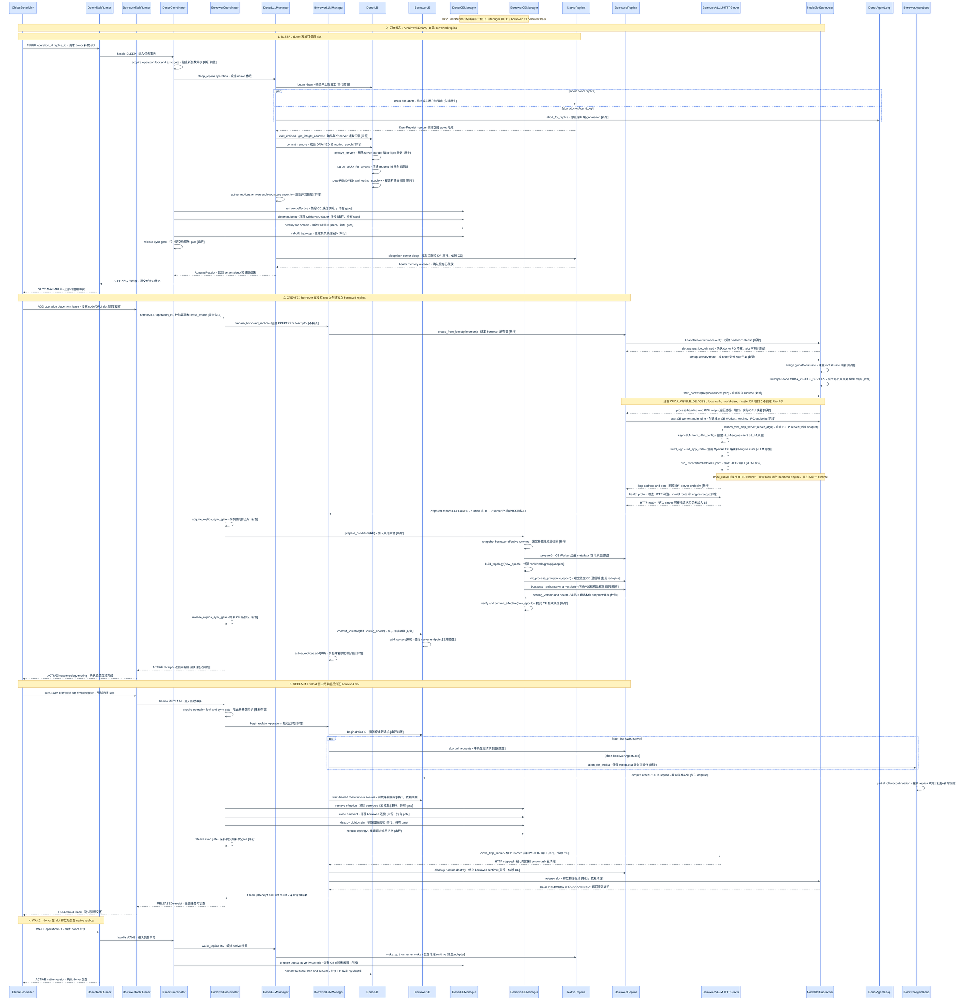
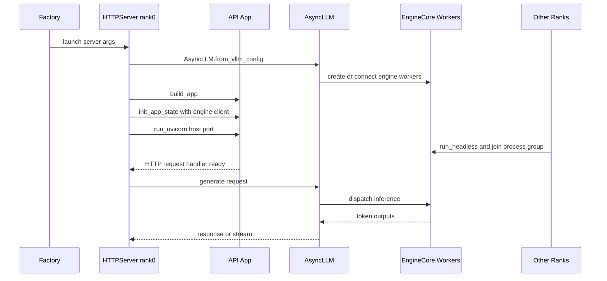

# Replica 资源生命周期设计

## 1. 目标、范围和基本原则

本文设计 `verl-multi-task` 在不修改 verl 原文件的前提下，实现 replica 的五类能力，并区分 native 与 borrowed 的操作边界。

1. 创建 replica（包括 borrowed replica）；
2. 销毁 borrower-owned replica；
3. 休眠 replica；
4. 唤醒已休眠 replica；
5. 在调度器要求下回收 borrowed replica。

本文只定义任务侧执行能力和组件边界，不定义 GlobalScheduler 的调度算法。GS 决定“谁借、谁捐、借多少、何时回收”，任务侧负责安全执行并返回可验证的结果。

设计原则：

- native 和 borrowed 对外遵循同一套 Replica 生命周期协议；
- borrowed 只复用 GS 授权的物理 GPU slot，不复用 donor 的 ResourcePool、Placement Group、CE Worker、ServerAdapter 或 process group；
- Manager、CE、LB 只在事务提交后看到 ACTIVE replica；
- 原生 verl 接口只作为底层动作复用，不能把原生列表操作当作完整的动态扩缩协议；
- 任一步骤失败都必须可回滚或进入 `QUARANTINED`，不能虚报 GPU 已释放或 replica 已可接流。

### 1.1 replica 类型

| 类型 | 创建方式 | 运行时所有权 | 资源归还 | 是否允许 destroy |
|---|---|---|---|---|
| native replica | 任务启动时通过原生 worker group/PG 创建 | donor 任务 | sleep 后由 donor wake | 作为捐赠归还动作时禁止 |
| borrowed replica | 根据 GS 的 slot lease 由 borrower 创建 | borrower 任务 | reclaim 后由回收策略选择清理方式 | 允许，必须先排空并清理 |

两类 replica 可以使用同一个 `MultiTaskReplica` 具体类，也可以分别实现同一个 `Replica` 协议。无论采用哪种形式，二者的 server、CE Worker、IPC 端点和 process group 都必须独立。

### 1.2 生命周期状态

```text
STOPPED
   └─ prepare/create ─→ PREPARED
PREPARED
   └─ bootstrap + commit ─→ READY
READY
   └─ drain ─→ DRAINING
DRAINING
   ├─ sleep ─→ SLEEPING
   ├─ remove + destroy ─→ DESTROYED
   ├─ cancel/temporary pause ─→ READY
   └─ failure ─→ QUARANTINED
SLEEPING
   ├─ wake ─→ READY
   └─ lease 过期/故障 ─→ DESTROYED 或 QUARANTINED
```

`READY` 是唯一允许 LB 路由请求的状态。`DRAINING` 仍保留 in-flight 计数，`SLEEPING` 不属于 CE effective set，`DESTROYED` 是终态。

状态机保留统一的 `SLEEPING → READY` 协议；具体 replica 类型是否开放可恢复的 sleep/wake，由操作策略和 lease 约束决定。

`DRAINING` 可以口头称为“待回收”，但在状态机中它不是最终回收状态，而是**摘流和排空阶段**：收到 TaskRunner 的 `drain` 后，replica 立即禁止新请求，保留已有请求的计数和续推信息，等待自然完成或执行 abort。排空完成后，调用方才根据操作原因选择后续动作：

| drain 原因 | 排空后的可能路径 | 说明 |
|---|---|---|
| 临时暂停、参数同步或拓扑调整 | `READY` | 完成临时操作后重新加入 CE/LB，不释放 replica runtime |
| 普通休眠 | `SLEEPING` | 移除 CE/LB 后释放权重/KV/cache，保留可唤醒对象 |
| borrowed 资源回收 | `DESTROYED` | 按回收策略终止 borrower-owned runtime 并释放 lease |
| 强制回收 | `ABORTING`（逻辑原因）→ `SLEEPING/DESTROYED` | 先生成 partial-rollout，再清理 CE/LB 和 slot |
| 排空、进程或拓扑失败 | `QUARANTINED` | 不得报告资源已释放，也不得重新接流 |

因此建议把“状态”和“操作原因”分开：状态使用 `DRAINING`，操作记录使用 `drain_reason = TEMPORARY_PAUSE | SLEEP | RECLAIM | DESTROY`。只有 `RECLAIM` 才表示 GS 正在要求归还借用资源；不能因为 replica 进入 `DRAINING` 就立即释放 GPU 或销毁进程。

## 2. 组件设计：原生能力复用与插件扩展

### 2.1 总体组件关系

```text
GlobalScheduler (外部/新增)
        │ operation + slot lease
        ▼
MultiTaskTaskRunner (插件 command adapter)
        ├── ReplicaOperationCoordinator (新增：事务、幂等、跨 Actor gate)
        ├── MultiTaskLLMServerManager (扩展：replica 生命周期)
        │      ├── NativeReplica
        │      ├── BorrowedReplica
        │      └── MultiTaskGlobalRequestLoadBalancer
        └── MultiTaskCheckpointEngineManager (扩展：CE effective projection)
               └── CheckpointTopologyAdapter (新增：动态拓扑)

BorrowedReplica
        ├── LeaseResourceBinder (新增)
        ├── NodeSlotSupervisor (新增，CPU-only launcher)
        ├── BorrowedRuntimeFactory (新增)
        ├── Borrowed CE Worker 集合 (新增、独立)
        └── Borrowed server/engine/endpoint (新增、独立)
```

#### 2.1.1 插件协议数据类

`ReplicaDescriptor`、`ReplicaPlacement`、`ReplicaOperation` 和 `OperationReceipt` 都不是 verl 原生类，而是 `verl-multi-task` 新增的、跨 TaskRunner/Manager/CE/LB/GS 传递的可序列化协议对象。原生 verl 使用的是 `RolloutReplica`、`RayWorkerGroup`、`ActorHandle` 以及各方法的直接返回值，不能直接作为跨任务调度协议。

```python
@dataclass(frozen=True)
class PhysicalGPUSlot:
    node_id: str                         # 物理节点标识或 node UUID
    gpu_uuid: str                        # GPU 稳定标识，优先于可变化的 ordinal
    physical_index: int                  # 节点上的物理 GPU ordinal，仅用于校验和诊断
    global_rank: int                     # 该 slot 在本 replica 中对应的全局 rank
    local_rank: int                      # 该 slot 在所属节点中的 local rank

@dataclass(frozen=True)
class ReplicaPlacement:
    slots: tuple[PhysicalGPUSlot, ...]   # 一个 replica 的全部 GPU slot，可跨多个节点
    master_node_id: str                  # rank 0 所在节点，用于 master_addr/port
    lease_id: str                        # 本次 GPU 租约标识
    lease_epoch: int                     # 租约版本，用于拒绝旧命令
    expire_at: float | None              # 租约过期时间，None 表示由 GS 显式释放

    # 约束：len(slots) == world_size；每个 node 的 slot 按 local_rank 连续；
    # global_rank 必须唯一且覆盖 [0, world_size)，同一 GPU UUID 不能被重复授权。

@dataclass(frozen=True)
class ReplicaLaunchSpec:
    replica_id: str                      # 要启动的逻辑 replica
    placement: ReplicaPlacement          # GS 授权的全部 node/GPU slot
    visible_devices_by_node: dict[str, tuple[str, ...]]  # 每节点传给 CUDA_VISIBLE_DEVICES 的 UUID/ordinal 列表
    rank_by_slot: dict[tuple[str, str], tuple[int, int]]  # (node, gpu_uuid) → (global_rank, local_rank)
    world_size: int                      # 本 replica 的总并行进程数
    nnodes: int                          # 参与本 replica 的节点数
    master_address: str                  # rank 0 可达地址
    master_port: int                     # process group 建组端口
    dp_rpc_port: int | None               # DP 控制面端口
    http_port: int | None                 # rank 0 HTTP 端口

@dataclass(frozen=True)
class ReplicaDescriptor:
    replica_id: str                      # replica 的逻辑唯一标识
    owner_task_id: str                   # 当前拥有运行时对象的任务
    kind: Literal["native", "borrowed"] # 资源来源类型
    placement: ReplicaPlacement | None  # native 可为空，borrowed 必须有 lease
    world_size: int                      # TP×DP×PP 对应的 CE/推理进程数
    serving_version: int | None           # 当前 server 已加载的权重版本
    runtime_state: str                    # PREPARED/READY/DRAINING/SLEEPING 等状态
    topology_epoch: int | None            # 当前 CE 通信拓扑版本
    routing_epoch: int | None             # 当前 LB 路由视图版本

@dataclass(frozen=True)
class ReplicaOperation:
    operation_id: str                    # 操作幂等标识，重试必须复用
    operation: Literal["ADD", "SLEEP", "WAKE", "RECLAIM", "DESTROY"]  # 操作类型
    replica_id: str                       # 目标 replica
    lease_id: str | None                  # borrowed 操作对应的租约
    lease_epoch: int | None               # 操作发送方认为有效的租约版本
    topology_epoch: int | None            # 可选的 CE 拓扑前置版本
    routing_epoch: int | None             # 可选的 LB 路由前置版本

@dataclass(frozen=True)
class OperationReceipt:
    operation_id: str                    # 对应的操作幂等标识
    replica_id: str                      # 被操作的 replica
    operation: str                       # 实际执行的操作类型
    state: str                            # 完成后的 replica 状态
    serving_version: int | None           # 操作完成时的权重版本
    topology_epoch: int | None            # 操作完成时的 CE 拓扑版本
    routing_epoch: int | None             # 操作完成时的 LB 路由版本
    lease_epoch: int | None               # 操作完成时的 lease 版本
    gpu_mapping: tuple[str, ...]          # 实际使用/释放的 GPU 映射
    stage_timings_ms: dict[str, float]    # 各阶段耗时，便于调度和故障分析
    error_code: str | None                # 成功为 None，失败为标准错误码
```

这里的 slot 绑定不是简单地给 replica 填一个 GPU 编号，而是三层映射：

```text
GS lease 的 PhysicalGPUSlot
 → ReplicaLaunchSpec 的 global_rank/local_rank
 → 节点进程的 CUDA_VISIBLE_DEVICES
 → vLLM engine 的并行 worker/rank
```

CE Worker 也必须使用同一份 rank/slot 映射，但它与 vLLM engine worker 是不同的逻辑组件。CE Worker 可以是独立的 GPU 进程，也可以是 CPU receiver 加上到 engine 的 IPC 通道，取决于 CE backend；不能假设“一个 slot 永远只对应一个 Ray Actor”。slot 的真正约束是：所有会在该 slot 上创建 CUDA context 或占用显存的进程，都只能使用 lease 授权的 GPU，并且 global rank、local rank、通信端点一致。

单机多卡时，Supervisor 收到该节点的 slot 子集，例如：

```text
node A: (GPU UUID-0, global_rank=0, local_rank=0)
         (GPU UUID-1, global_rank=1, local_rank=1)
         (GPU UUID-2, global_rank=2, local_rank=2)
```

它为该节点的 runtime 设置 `CUDA_VISIBLE_DEVICES=UUID-0,UUID-1,UUID-2`。vLLM 的本地 engine worker 使用 local rank 0/1/2 分别映射到可见设备列表中的第 0/1/2 项；CE endpoint 则使用同一份 global/local rank 元数据。这里绑定的是“slot → rank/device”，不是把三个 slot 逐个注册成三个 HTTP server；通常一个 rank 0 HTTP server 代表整个 replica。

跨机时，GS 的 placement 必须携带所有节点的 slot，而不是单个 `node_id`：

```text
ReplicaPlacement.slots
  ├─ node A: GPU-0, GPU-1 → global rank 0, 1
  └─ node B: GPU-4, GPU-5 → global rank 2, 3
world_size = 4, nnodes = 2, master_node_id = node A
```

Supervisor 按 node 分组启动进程：每个节点启动一个本地 HTTP/engine runtime，其中 master node 的 rank 0 暴露 HTTP listener，其他节点启动 headless engine；所有节点通过 `master_address/master_port` 加入同一个 TP/DP 通信组。LB 只登记 master node 的 endpoint，CE Manager 则登记该 replica 的全部 CE Worker/endpoint。

原生 verl 的 `vLLMReplica.launch_servers()` 会从每个 Ray rollout worker 查询 node ID 和可见 GPU，再按 node 切片创建 `vLLMHttpServer`；borrowed 插件不能复用这些 Ray Worker handle，但必须用 `ReplicaPlacement.slots` 生成等价的按节点分组和 rank 映射。这样即使 replica 跨机，物理 slot、vLLM engine worker、CE Worker 和通信拓扑仍使用同一份确定映射。

四类对象的职责不同：

| 数据类 | 方向 | 用途 | 是否携带运行时句柄 |
|---|---|---|---|
| `ReplicaPlacement` | GS → TaskRunner/Replica | 描述可使用的物理 node/GPU 和 lease | 否 |
| `ReplicaDescriptor` | Replica/Manager → GS/CE/LB | 描述某一时刻的 replica 状态快照 | 否 |
| `ReplicaOperation` | GS/TaskRunner → Coordinator | 描述要执行的生命周期操作及前置版本 | 否 |
| `OperationReceipt` | Coordinator/Manager → GS | 证明操作阶段、最终状态和失败原因 | 否 |

这些对象只传递身份、版本、资源和结果；Ray ActorHandle、PG handle、CUDA IPC 对象、进程句柄和 CE Worker 实例仍留在对应任务内部。`OperationReceipt` 不是对原生方法返回值的简单包装，而是跨组件提交和 GS 判断资源是否真正交接的事实凭证。

`OperationReceipt` 负责记录结果，不单独负责幂等性。幂等性由以下组合实现：`ReplicaOperation.operation_id` 作为请求身份、Coordinator 的 `completed_operations` 作为结果缓存、replica 状态机作为重复操作校验。相同 `operation_id` 重试时返回原 receipt；不同 operation 试图操作旧 epoch 时返回 `STALE_OPERATION`。

生命周期操作不能简单把返回值设为 `None`。调用方至少需要区分：命令已接收、runtime 已创建、CE bootstrap 已完成、LB 已接流、资源已实际释放，以及失败后是否需要隔离。如果没有 receipt，网络超时或 Actor 重启后无法判断上一次操作是否完成，重试可能重复创建 replica、重复注册 server，或在尚未清理时向 GS 错报 slot 可用。

只有不需要跨组件确认、允许丢失结果且不会触发资源交接的内部 best-effort 操作，才可以返回 `None`，例如非关键的日志上报或可重复的指标刷新。ADD、SLEEP、WAKE、RECLAIM 和 DESTROY 必须返回 `OperationReceipt`，即使最终状态是 `FAILED` 或 `QUARANTINED`。

### 2.2 原生 verl 组件的复用和修改边界

| 原生组件 | 可直接复用 | 必须包装/重构 | 不应复用的语义 |
|---|---|---|---|
| `RolloutReplica` | 配置、拓扑计算、`world_size`、server 控制方法签名 | 增加统一状态、health、destroy policy | `init_standalone()` 的新 PG/GPU 申请不能用于 borrowed |
| `vLLMReplica` | `server_address`、server handle、部分 abort/resume 逻辑 | native 复用 sleep/wake；borrowed 通过 runtime adapter 接入创建和回收 | 不假设 borrowed worker 是 Ray GPU Actor |
| `CheckpointEngineWorker` | `prepare`、`update_weights`、`finalize` 底层传输动作 | 为 borrowed 创建独立 Worker 工厂和 endpoint | donor Worker handle、ServerAdapter、group 不能跨任务转移 |
| `CheckpointEngineManager` | `prepare`、`build_topology`、`init_process_group`、`finalize` | 增加 candidate/effective 两阶段、epoch、回滚 | `add_replicas/remove_replicas` 本身不等于动态扩缩 |
| `GlobalRequestLoadBalancer` | `add_servers`、`remove_servers`、计数接口 | 增加 DRAINING/WAKING、原子 commit、sticky 清理 | 不能直接 remove 尚有 in-flight 的 server |
| `RayWorkerGroup` | 对独立 CE Worker handles 的临时封装 | borrowed 需要自己的 handles 和 world size | 不能重复加入 donor handle |
| Ray PG/ResourcePool | native 初始资源管理 | borrowed 只保存 donor slot provenance | borrowed 不能新建 PG 抢占同一物理卡 |

### 2.2.1 native 的 Ray 创建链与 CE Worker 绑定关系

native replica 的实际创建链如下：

```text
RolloutReplica.init_standalone()
 → ResourcePoolManager.create_resource_pool()
 → RayResourcePool.get_placement_groups()
 → RayWorkerGroup(resource_pool, ray_cls_with_init)
 → _create_worker() 创建 Ray CheckpointEngineWorker
 → vLLMReplica.launch_servers()
 → 每节点创建 vLLMHttpServer
 → vLLMHttpServer.launch_server()
```

具体关系如下：

1. `init_standalone()` 为一个 replica 创建 ResourcePool/Placement Group。ResourcePool 的每个 bundle 表示一个 GPU 位置；`RayWorkerGroup._create_worker()` 使用 `PlacementGroupSchedulingStrategy` 将一个 `CheckpointEngineWorker` 放到对应 bundle，并通过 `runtime_env` 设置 `WORLD_SIZE`、`RANK`、`RAY_LOCAL_WORLD_SIZE`、`MASTER_ADDR` 等环境变量。原生代码默认 `max_colocate_count=2`，本扩展允许在 PG 创建时配置为 `M=4` 或其他明确值，使同一 bundle 可以容纳多个 fractional CE Worker；该值不支持对已有 PG 动态扩容，也不提供显存隔离。
   `RayWorkerGroup` 会按 node 排序 Placement Group，先按 node 再按 `local_rank` 连续分配 global rank；因此跨机 replica 的 rank 顺序依赖 ResourcePool 的 node 分组和 bundle 顺序，不是由 server 地址决定。
2. `CheckpointEngineWorker` 在自己的 Ray 进程中创建 checkpoint backend、bucket/transport 状态和 `ServerAdapter`。它会初始化 CPU Gloo 控制组，并在参数同步时执行 `prepare → init_process_group → update_weights → finalize`。它不是无状态的“GPU 标签”，而是带有 CUDA/通信/ServerAdapter 状态的长期 Actor。
3. `vLLMReplica.launch_servers()` 从每个 CE Worker 查询 `node_id` 和 Ray 分配的可见 GPU，然后按 node 分组创建 `vLLMHttpServer`。每个 node 一个 server Actor；server Actor 接收该节点的 CE Worker handles 和 `CUDA_VISIBLE_DEVICES` 列表。它本身不等于 CE Worker，也不代表每张 GPU 单独注册一个 HTTP server。
4. `vLLMHttpServer.launch_server()` 在 rank 0 创建 `AsyncLLM` 和 HTTP app，其他 node/rank 运行 headless engine。vLLM 的 multiprocessing/distributed executor 根据 `CUDA_VISIBLE_DEVICES`、rank 和 master 地址创建真正的 engine worker。因而 native 的资源关系是：

```text
Ray PG bundle / GPU slot
 → CheckpointEngineWorker 的 Ray Actor 和环境
 → vLLMHttpServer 的按节点可见设备列表
 → vLLM engine worker/rank
```

这里的 `workers` 在 `vLLMReplica` 中首先指 CE Worker handles；vLLM engine worker 是之后由 vLLM 在 server runtime 内创建的进程，不能把两者混为同一个 Actor。

上述结论对应的原生代码位置如下：

| 原生位置 | 关键事实 |
|---|---|
| [`replica.py:189`](D:/verl/verl/workers/rollout/replica.py:189) | `init_standalone()` 创建 ResourcePool、PG 和 `RayWorkerGroup` |
| [`replica.py:228`](D:/verl/verl/workers/rollout/replica.py:228) | native rollout worker class 是 `ray.remote(CheckpointEngineWorker)` |
| [`ray/base.py:623`](D:/verl/verl/single_controller/ray/base.py:623) | 每个 PG bundle 创建一个 Worker，设置 rank/world/master 环境 |
| [`vllm_async_server.py:1295`](D:/verl/verl/workers/rollout/vllm_rollout/vllm_async_server.py:1295) | 按 CE Worker 的 node/GPU 信息按节点创建 vLLM HTTP server |
| [`base.py:304`](D:/verl/verl/checkpoint_engine/base.py:304) | `CheckpointEngineWorker` 持有 backend 和 `ServerAdapter` |
| [`base.py:505`](D:/verl/verl/checkpoint_engine/base.py:505) | 每次同步用已有 handles 创建临时 `RayWorkerGroup`，并重新建 CE 拓扑 |

### 2.2.2 CE Worker 是否可以在 borrowed 中复用

需要区分三种“复用”：

| 复用方式 | 是否创建新的 CE Actor | 结论 |
|---|---:|---|
| 复用 `RayWorkerGroup` 包装器 | 否 | 可以。原生 `CheckpointEngineManager.update_weights()` 每次同步都会用 `worker_handles` 创建临时 `RayWorkerGroup`；这只是本地视图，不迁移、不复制、不改变 Actor 所有权 |
| 直接复用 donor 的 `CheckpointEngineWorker` ActorHandle | 否 | 不适合作为默认方案。它仍属于 donor 的 PG、任务和 server adapter，不能仅靠把 handle 放进 borrower 的 `replicas` 列表完成交接 |
| 在相同 slot 上创建 borrower 自有 CE Actor | 是 | 技术上可行，但必须显式传入 slot、rank、环境、borrower endpoint 和 lease，并由 Supervisor 防止错误共占 GPU；这属于“复用物理 slot”，不是复用 donor CE Worker |

直接复用 donor CE Worker 的主要阻碍是：

- **设备绑定已经固定**：Actor 创建时由 Ray PG bundle 和 `CUDA_VISIBLE_DEVICES` 决定 node/GPU；借给 borrower 后不能通过 `RayWorkerGroup` 改变 Actor 的物理位置。
- **ServerAdapter 已绑定 donor**：`CheckpointEngineWorker.__init__()` 创建的 `ServerAdapter` 依赖 donor 的 `RANK`、`RAY_LOCAL_WORLD_SIZE`、replica/server actor name、job ID 和 IPC/ZMQ 路径。它默认会把权重发往 donor HTTP server；不重建 adapter 就会把 borrower 权重写到 donor。
- **CE backend 有持久状态**：`checkpoint_engine` 持有 bucket、NCCL/HCCL/NIXL agent、通信句柄和旧 epoch 的 process group。即使临时 `RayWorkerGroup(worker_handles=...)` 重新调用 `prepare/init_process_group`，也不会自动清理 donor endpoint、远端 agent 和旧通信域。
- **所有权和故障边界不一致**：Actor 仍由 donor PG 和 Ray job 维持。donor 任务或 PG 被销毁时，borrower 的 CE Worker 也会消失；borrower 不能独立执行 destroy，也无法向 GS 证明 slot 已由自己拥有。
- **跨机必须成组交接**：TP/DP/PP replica 的所有 CE Worker 必须一次性转移，并使用一致的 rank/world size/group。只复用部分 worker 会让 collective 和参数拓扑失配。
- **backend 的重建能力不同**：例如 NCCL backend 默认 `rebuild_group=False`，同一个 CE Actor 在已有 group 上只能复用相同的 rank/world size；NIXL 的 `finalize()` 会清理 remote agent 和注册内存，但仍要求重新执行完整的 `prepare/init_process_group`。不能假设所有 backend 都支持运行期 handoff。

因此，`workers.extend(replica.workers)` 的原生写法只能表示“把已有 Worker handles 纳入本次同步视图”，不能表示 donor→borrower 的资源或所有权迁移。要让 donor CE Actor 真正服务 borrower，至少需要新增 `handoff` 协议：停止 donor 使用、关闭旧 ServerAdapter/IPC、重置 CE backend、绑定 borrower endpoint、重新建立拓扑、转移 lease 和生命周期所有权。这已经不是少量配置修改。

Ray 中确实存在一个可参考的 `RayClassWithInitArgs(sharing_with=...)` 分支：它通过 `NodeAffinitySchedulingStrategy` 把新 Actor 放到 donor 所在 node，并复制 donor 的可见设备字符串，但不申请 GPU 资源。该分支只解决 node/device 环境复制，不设置 `WORLD_SIZE/RANK/MASTER_*`，也不迁移 CE backend 或 ServerAdapter；当前代码没有用它创建 CheckpointEngineWorker。因此它不能直接作为 borrowed CE Worker 的完整实现。

若希望保留 Ray 控制面，可以新增 `BorrowedCheckpointEngineWorker` 工厂：每个 slot 创建一个 borrower-owned Ray Actor，使用 node affinity、显式 `runtime_env` 和 `CUDA_VISIBLE_DEVICES`，并由 `NodeSlotSupervisor` 在 lease 下校验。Actor 使用 borrower 自己的 `ServerAdapter` 和 CE endpoint，Ray 不申请新的 GPU PG。这能复用物理 slot 映射，但仍需创建新 Actor、建立新的 CE 通信域和处理 Ray 不计 GPU 配额带来的安全问题。

**结论：** borrowed 不应直接复用 donor 的 CE Worker ActorHandle；推荐复用的是 slot 的授权和 rank 映射，并创建 borrower 自有 CE Worker。若采用 Ray 实现，可使用 Ray 的 node affinity/CPU-only Actor 作为控制方式，但必须绕开 Ray 的 GPU 配额申请并由 lease Supervisor 负责物理绑定。只有在未来实现完整 CE handoff、endpoint 重绑定、通信域重置、跨机原子转移和故障托管后，才考虑真正复用 donor CE Worker。

### 2.3 `ReplicaOperationCoordinator`

这是 TaskRunner 内的新增协调器，负责把一次 GS 命令串成跨 Manager、CE、LB 的事务。

重点字段：

```python
class ReplicaOperationCoordinator:
    operation_lock: asyncio.Lock                    # 协调器内串行执行生命周期操作
    completed_operations: dict[str, OperationReceipt]  # operation_id 到最终回执的幂等缓存
    active_operation: ReplicaOperation | None        # 当前正在执行的操作
    replica_sync_gate: SyncGateClient                # 任务级 gate 客户端；真正的 gate 由 Trainer/CE 侧持有
    ce_control: CEControlPort                        # 注入的 CE 控制端口，不直接持有 CE Manager 对象
    runtime_control: RuntimeControlPort              # 注入的 server/process 生命周期端口
    lb_control: LoadBalancerControlPort              # 注入的 LB 摘流、加流和路由提交端口
    topology_epoch: int                              # 当前 CE 通信拓扑版本
    routing_epoch: int                                # 当前 LB 路由版本
```

重点方法：

```python
async def handle(operation: ReplicaOperation) -> OperationReceipt  # 执行一次完整生命周期事务
async def acquire_replica_sync_gate(operation_id: str) -> None      # 获取任务级 CE/Replica 同步锁
async def release_replica_sync_gate(operation_id: str) -> None      # 释放任务级同步锁
async def rollback(operation_id: str, failure: Exception) -> None   # 按已完成阶段逆序清理并生成失败回执
```

`operation_id` 重试必须返回原回执；旧 `lease_epoch` 或旧 `topology_epoch` 的操作返回 `STALE_OPERATION`。原生参数同步必须进入同一 `replica_sync_gate`，否则 bootstrap、拓扑变化和 `_fit_update_weights()` 可能并发修改同一组 Worker。

`ReplicaOperationCoordinator` 的“原子”是任务侧逻辑原子性，不是跨 Ray Actor、进程和 GPU 的数据库事务。它保证一次操作只有在必要阶段全部成功后才提交为 ACTIVE/RELEASED，并在中间失败时执行补偿清理；同时串行化 ADD、REMOVE、SLEEP、WAKE、RECLAIM、DESTROY 与原生参数同步。因此它不只是给 add/remove 加锁。

`replica_sync_gate` 是任务级同步屏障，保护的是“CE 有效成员快照、通信拓扑和参数同步”这一临界区。它不是数据库锁，也不是某个 replica 的状态锁：`operation_lock` 串行化整个生命周期操作，单个 replica 的 `operation_lock` 保护本地状态，而 gate 防止生命周期操作与 `_fit_update_weights()` 使用不同的 Worker 集合。Fully Async 中 TaskRunner/Coordinator 与 Trainer 是不同 Ray Actor，不能跨 Actor 共享同一个 `asyncio.Lock`；因此 Coordinator 持有的是 `SyncGateClient`，通过 Trainer RPC 请求真实 gate，真实 gate 和 `_fit_update_weights()` 位于同一个 Trainer/CE 进程。SLEEP、RECLAIM、DESTROY、WAKE 等会改变 CE 成员的操作，必须在事务开始、完成 operation/lease 校验后立即通过 client 获取 gate；gate 先阻止新的参数同步并等待当前同步结束，随后由同一 Coordinator 持有到 CE 拓扑提交完成。`remove_effective()` 在这把已持有的 gate 内冻结 effective 快照，完成候选集删除、endpoint 清理、旧通信域销毁、新拓扑建立和 epoch 提交；若实现拆成底层方法，则底层方法要求调用方已经持有 gate，不能在同一调用链中重复加锁。拓扑提交后可以释放 gate，再在 `operation_lock` 保护下执行较长的 server 显存释放或进程销毁。失败时 replica 保持不可路由的 `DRAINING`/`QUARANTINED` 状态，不能在拓扑未确认时释放 slot。

**Coordinator 不直接持有 CE Manager 句柄。** 在现有 Fully Async 结构中，CE Manager 位于 Trainer Actor，replica/server/LB 位于 Rollouter Actor，而 Coordinator 通常驻留 TaskRunner。因此 TaskRunner 初始化 Coordinator 时注入 `CEControlPort`（其实现通过 `trainer_handle` 调用 Trainer 内的 `CheckpointTopologyAdapter`/`MultiTaskCheckpointEngineManager`）、`RuntimeControlPort` 和 `LoadBalancerControlPort`。Coordinator 执行 `remove_effective(replica_id)` 时，实际调用链是：

```text
Coordinator.ce_control.remove_effective(replica_id)
  → Trainer Actor RPC
  → Trainer.checkpoint_manager.topology_adapter.remove_effective(...)
  → CE Worker/通信域清理与拓扑重建
```

Coordinator 只保存端口或 Actor handle 以及操作上下文，不访问 CE Manager 的私有字段；端口返回阶段结果和新 `topology_epoch`，Coordinator 据此决定是否继续提交 LB、server 清理和最终回执。同步模式下若 CE Manager 与协调器同进程，`CEControlPort` 可直接绑定本地对象；这只是调用路径的优化，不改变职责边界。

一个最小的端口实现如下（伪代码）：

```python
class TrainerCEControl(CEControlPort):
    def __init__(self, trainer_handle):
        self.trainer_handle = trainer_handle       # Ray ActorHandle，仅作为 RPC 传输通道

    async def remove_effective(self, replica_id: str) -> CEMembershipReceipt:
        return await self.trainer_handle.remove_replica_from_ce.remote(replica_id)

    async def acquire_gate(self, operation_id: str) -> None:
        await self.trainer_handle.acquire_replica_sync_gate.remote(operation_id)

    async def release_gate(self, operation_id: str) -> None:
        await self.trainer_handle.release_replica_sync_gate.remote(operation_id)

# Trainer Actor 内部
async def remove_replica_from_ce(self, replica_id):
    # 该 RPC 只在 Coordinator 已通过 acquire_gate() 后调用。
    return await self.checkpoint_manager.topology_adapter.remove_effective(replica_id)
```

因此，`Coordinator` 发起的是 CE 控制端口调用；真正访问 `CheckpointEngineManager` 的代码仍运行在 Trainer Actor 内。若没有这个端口或等价的 Trainer RPC，Coordinator 确实无法完成 CE remove，这属于实现缺口而不是可以忽略的细节。

#### 生命周期操作事务化的收益

将 SLEEP、WAKE、RECLAIM、DESTROY 等操作设计成事务，解决的是跨组件状态一致性问题。一次操作通常同时涉及 AgentLoop/LB 摘流、CE effective 成员、通信域、HTTP server、GPU 进程和 GS lease；任何一步失败都可能留下“路由已删除但 CE 仍发送参数”或“CE 已移除但进程仍占用 GPU”等半完成状态。事务协议带来以下能力：

1. **明确提交点**：只有 CE 拓扑、runtime 健康、LB 路由和 lease 状态全部满足条件，才提交 `READY`、`SLEEPING` 或 `RELEASED`；GS 不会把半完成资源再次分配。
2. **失败补偿**：按已完成阶段登记逆序清理动作。例如 WAKE 的 LB 提交失败时，撤销 CE candidate、关闭 server 或回到 `QUARANTINED`，而不是留下不可路由实例。
3. **并发隔离**：`operation_lock`、Trainer 侧同步 gate 和 epoch 校验共同阻止 SLEEP/WAKE 与参数同步、另一个 reclaim 同时修改同一拓扑。
4. **幂等重试**：`operation_id` 与 `OperationReceipt` 让 GS 重试超时请求时返回已有结果，避免重复创建进程、重复释放 slot 或重复唤醒。
5. **可观测和恢复**：每个阶段都有状态和回执，故障恢复或人工处理可以从 `DRAINING`、`QUARANTINED` 等中间状态继续，而不是只能依赖进程重启。

这里的“事务”是任务内的阶段提交、补偿和幂等协议，不承诺跨 Ray Actor、操作系统进程和 GPU 的数据库式原子回滚；对于已经完成且不可逆的物理动作，协议通过隔离、清理和 quarantine 保证最终可恢复。

#### Coordinator 与 Rollouter 的职责边界

`ReplicaOperationCoordinator` 不是全局单例，也不是新增的控制 Actor。GlobalScheduler 才是跨任务的全局 Actor；Coordinator 应按任务创建为普通 Python 对象，通常驻留在 TaskRunner，或在同步模式下直接驻留在与 Trainer/CE 同一进程的任务对象中。它的作用是控制一次生命周期操作的顺序和提交条件，而不是承载推理请求。

Coordinator 的实例粒度是“任务级”，不是“单次操作级”：TaskRunner 初始化任务时创建一个长期存在的 Coordinator，后续 `SLEEP`、`CREATE`、`RECLAIM`、`DESTROY`、`WAKE` 都提交给同一个实例。每次命令只创建独立的 `OperationContext`（记录 operation_id、阶段、快照、补偿动作和临时回执），最终结果写入 Coordinator 的 `completed_operations`。如果每次操作都新建 Coordinator，新的实例无法看到旧实例的 operation receipt、active operation、topology/routing epoch 和 gate ownership，重试可能重复创建 runtime，并且不同操作仍会并发修改同一 CE/LB 状态。

Rollouter **可以**提供对外的生命周期入口，但不能在现有组件边界下独立完成全部编排：

| 责任 | Rollouter 能直接完成的部分 | 仅靠 Rollouter 无法安全完成的部分 |
|---|---|---|
| runtime/server | 创建或关闭 borrowed runtime、HTTP server、端口和进程 | 无法证明 CE 拓扑已同步更新 |
| LB | `begin_drain`、排空、`add_servers`、`remove_servers`、并发额度 | 无法单独锁住 Trainer 正在执行的 `_fit_update_weights()` |
| AgentLoop | abort、保存 Agent Data、partial-rollout 续推 | 无法提交 CE effective topology |
| CE/参数同步 | 可通过 Trainer handle 发起请求 | CE Manager 位于 Trainer 时，Rollouter 自己的 `asyncio.Lock` 不会自动保护 Trainer 内部同步 |
| 操作协议 | 可解析 GS 命令 | 幂等 receipt、lease/topology epoch、跨 Manager 回滚需要统一协调状态 |

如果把所有生命周期操作都强制路由到 Rollouter，必须同时满足四个前提：Rollouter 独占所有生命周期入口；Trainer 的参数同步只能通过 Rollouter 发起；Rollouter 与 Trainer 使用同一套跨 Actor gate/epoch 协议；Rollouter 负责失败补偿和幂等回执。现有 verl 并不满足这些前提：Fully Async 中 Rollouter 持有 LLMServerManager/LB，Trainer 持有 CheckpointEngineManager，Trainer 和 Rollouter 还会相互调用。直接在 Rollouter 中串联远程调用，容易形成 `Trainer → Rollouter → Trainer` 的持锁循环，也无法阻止 Trainer 自己启动的同步与拓扑变更并发。

因此推荐保留 Coordinator 这个**逻辑角色**，但不把它实现成独立 Ray Actor：GS 命令由 TaskRunner 接收，Coordinator 通过 Rollouter/Trainer handles 执行阶段，Rollouter 负责 server/LB/AgentLoop，Trainer/CE 负责 gate 内的拓扑和参数同步。对于 Trainer、Rollouter、CE 已经同进程的 HYBRID 模式，Coordinator 可以退化为 Rollouter/Trainer 内的一组私有方法；职责和 gate 仍需保留。这样既避免新增 Actor 和通信跳数，又不把数据面 Rollouter 变成跨组件事务管理器。

MVP 的最小调用链可以是：

```text
GS → TaskRunner.handle_replica_operation()
   → Rollouter.begin_drain()/create_runtime()/commit_lb()
   → Trainer.acquire_replica_sync_gate()/CE topology + bootstrap
   → Rollouter.commit_lb()
   → TaskRunner 返回 OperationReceipt
```

其中 `Trainer` 必须让正常 `_fit_update_weights()` 也使用同一把 gate；不能只在 Rollouter 的生命周期方法里加一把本地锁。若选择把 Coordinator 的代码直接写进 Rollouter，应保留这条调用链和 epoch/receipt 语义，并禁止 Trainer 在持有 CE 锁时反向等待 Rollouter。

### 2.4 `MultiTaskLLMServerManager`

该组件管理 replica 对象和 server 路由，不负责 GS 的调度决策。

重点字段：

```python
class MultiTaskLLMServerManager:
    native_replicas: dict[str, Replica]              # 本任务初始创建的 native replica
    borrowed_replicas: dict[str, BorrowedReplica]    # 当前由本任务持有的 borrowed replica
    active_replicas: dict[str, Replica]              # 已完成 CE/LB 提交、允许接流的 replica
    global_load_balancer: MultiTaskGlobalRequestLoadBalancer  # 任务侧路由管理器
    replica_factory: ReplicaFactory                  # 按 backend 创建 native/borrowed runtime 的工厂
```

重点方法：

```python
async def prepare_replica(operation, spec) -> PreparedReplica       # 创建运行时但暂不接流
async def activate_replica(operation) -> OperationReceipt          # 完成 bootstrap、CE/LB 提交并进入 READY
async def sleep_replica(operation) -> OperationReceipt             # 摘流、移除 CE/LB 并休眠 runtime
async def wake_replica(operation) -> OperationReceipt              # 恢复 runtime、同步版本并重新接流
async def destroy_replica(operation) -> OperationReceipt           # 销毁 borrower-owned runtime
async def reclaim_replica(operation) -> OperationReceipt            # 强制回收 borrowed slot 并处理在途请求
```

Manager 只能在 `commit_routable()` 成功后更新 `active_replicas`；失败的候选 replica 只能保留在 prepared/quarantined 集合。

### 2.5 `Replica` 公共协议

native 和 borrowed 必须对上层提供相同的生命周期和服务接口：

```python
class Replica(Protocol):
    replica_id: str                              # 全局唯一的 replica 标识
    kind: Literal["native", "borrowed"]         # 资源来源类型
    world_size: int                              # TP×DP×PP 的 CE/推理参与者数量
    workers: Sequence[CEWorkerHandle]             # 该 replica 自己拥有的 CE Worker handles

    def describe(self) -> ReplicaDescriptor: ...             # 返回可序列化的身份、拓扑、版本摘要
    async def prepare(self) -> PreparedReplica: ...          # 创建/恢复 runtime，进入 PREPARED
    async def activate(self) -> OperationReceipt: ...        # 完成 CE/LB 提交，进入 READY
    async def drain(self) -> DrainReceipt: ...               # 禁止新请求并排空已有请求
    async def abort_all_requests(self) -> AbortReceipt: ...  # 中断请求并返回续推所需信息
    async def resume_generation(self) -> None: ...           # 恢复 partial-rollout 请求
    async def sleep(self) -> OperationReceipt: ...           # 释放权重/KV/cache，进入 SLEEPING
    async def wake(self) -> OperationReceipt: ...            # 恢复 runtime 和 serving version
    async def remove_from_ce(self) -> OperationReceipt: ...  # 从 CE effective topology 移除
    async def remove_from_lb(self) -> OperationReceipt: ...  # 从 LB 路由集合移除
    async def health(self) -> HealthSnapshot: ...            # 检查进程、server、CE、版本和显存
    async def destroy(self) -> OperationReceipt: ...         # 终止本 replica 拥有的 runtime
```

`destroy()` 对 native 可以返回 `POLICY_DENIED`，但方法存在且错误语义统一；这样 Manager 不需要通过类型强转访问 native/borrowed 专有对象。

### 2.6 `BorrowedReplica` 类设计

borrowed replica 是本文的核心。它是 borrower 自己拥有的完整运行时实例，不能只保存 donor 的 Worker handle。

#### 2.6.1 字段

```python
class BorrowedReplica:
    # identity/ownership
    replica_id: str                         # borrowed replica 的唯一标识
    owner_task_id: str                      # 当前 borrower 任务标识
    donor_task_id: str | None                # 提供物理 slot 的 donor，可为空
    kind: Literal["borrowed"]                # 固定为 borrowed
    replica_rank: int                       # borrower 内部的 replica 编号
    lifecycle_epoch: int                    # 本地生命周期版本，防止旧状态覆盖新状态

    # rollout/model topology
    config: RolloutConfig                    # rollout 全局配置
    model_config: HFModelConfig              # 模型和权重配置
    backend: str                             # vllm/sglang/trtllm 等推理后端
    rollout_mode: RolloutMode                # HYBRID/COLOCATED/STANDALONE
    tp_size: int                             # tensor parallel 度
    dp_size: int                             # data parallel 度
    pp_size: int                             # pipeline parallel 度
    world_size: int                          # 本 replica 的并行进程总数
    nnodes: int                              # 本 replica 使用的节点数
    gpus_per_replica_node: int               # 每节点使用的 GPU 数

    # resource lease
    slot_lease: ReplicaPlacement              # GS 授权的 node/GPU/lease 信息
    lease_expire_at: float | None             # lease 过期时间
    lease_state: LeaseState                   # lease 当前状态
    resource_binder: LeaseResourceBinder     # 校验和绑定物理 GPU slot
    supervisor: NodeSlotSupervisor            # 启停和监控 borrower 进程
    cuda_visible_devices: tuple[str, ...]    # 启动进程实际可见的 GPU 列表
    local_rank_map: dict[int, int]            # CE/global rank 到节点 local rank 的映射

    # borrower-owned runtime
    workers: list[CEWorkerHandle]              # borrower 自有 CE Worker handles
    servers: list[ServerEndpoint]              # borrower 自有 server endpoint
    process_handles: list[ProcessHandle]       # Supervisor 管理的进程句柄
    runtime_factory: BorrowedRuntimeFactory    # 创建/恢复独立 runtime 的工厂
    server_adapter: BorrowedServerAdapter      # 连接 borrowed server 的权重/控制适配器
    checkpoint_endpoint: CheckpointEndpoint    # 对 CE Manager 暴露的同步端点
    _server_address: str | None                # 对外 HTTP 地址的内部存储
    _server_handle: ServerEndpoint | None      # 对外 token-in-token-out 的主 server

    # lifecycle/sync/routing
    runtime_state: ReplicaState                  # runtime 生命周期状态
    ce_membership: CEMembershipState             # 是否在 CE effective topology 中
    topology_epoch: int | None                   # 当前 CE 通信拓扑版本
    routing_epoch: int | None                    # 当前 LB 路由版本
    serving_version: int | None                  # 当前 server 已加载的权重版本
    capabilities: frozenset[str]                 # 后端声明支持的 create/reclaim/destroy/topology 等能力
    operation_lock: asyncio.Lock                 # 本 replica 内部操作串行锁
    completed_operations: dict[str, OperationReceipt]  # 幂等操作回执缓存
    inflight_snapshot: int                       # 最近一次观测到的在途请求数
    last_error: ReplicaError | None              # 最近一次失败信息
```

关键约束：

- `slot_lease` 是唯一 GPU 授权，不能从 donor 的 PG 推断 borrower 资源；
- `workers` 必须是 borrower 新建的 CE Worker；数量匹配该 replica 的 TP/DP/PP `world_size`；
- `server_adapter` 只能指向 borrowed server；不能缓存 donor server 名称或 donor job 的 IPC 路径；
- `topology_epoch`、`routing_epoch`、`serving_version` 分别表示 CE 拓扑、LB 路由和模型权重版本；
- `operation_lock` 只保护单个 replica，跨 Actor 的互斥由 coordinator gate 保护；
- `capabilities` 显式声明 `full_sleep`、`partial_rollout`、`dynamic_topology`、`destroy` 等能力。

#### 2.6.2 方法

```python
# 公共生命周期方法
async def prepare(self) -> PreparedReplica             # 校验 lease 并准备 runtime，不接收请求
async def activate(self) -> OperationReceipt           # 完成 CE bootstrap 和 LB 注册后进入 READY
async def drain(self) -> DrainReceipt                  # 禁止新请求并排空或中断 in-flight
async def sleep(self) -> OperationReceipt              # 公共兼容接口，具体能力由 replica policy 决定
async def wake(self) -> OperationReceipt               # 公共兼容接口，具体能力由 replica policy 决定
async def remove_from_ce(self) -> OperationReceipt     # 从 CE effective topology 移除
async def remove_from_lb(self) -> OperationReceipt     # 从 LB 路由集合摘除
async def health(self) -> HealthSnapshot               # 返回进程、端口、显存、版本和通信健康状态
async def destroy(self) -> OperationReceipt            # 清理 borrower-owned runtime 和资源

# borrowed 专有方法
async def create_from_lease(self, placement, operation) -> PreparedReplica  # 根据 lease 创建独立 runtime
async def validate_lease(self, expected_epoch: int) -> None                  # 校验 lease 所有权和版本
async def build_launch_spec(self) -> ReplicaLaunchSpec                      # 生成 GPU/rank/端口启动规格
async def start_runtime(self) -> RuntimeReceipt                         # 启动 Supervisor 进程
async def bootstrap_weights(self, target_version: int) -> BootstrapReceipt # 同步目标权重版本
async def prepare_ce_membership(self, topology_epoch: int) -> CEMembershipReceipt  # 准备 CE 加入拓扑
async def begin_reclaim(self, operation) -> ReclaimReceipt                  # 启动强制回收和续推流程
async def cleanup_runtime(self) -> CleanupReceipt                         # 终止 runtime 并清理进程、端口和 IPC
async def release_slot(self) -> SlotReleaseReceipt                          # 向 Supervisor 证明并释放 GPU slot
```

`BorrowedReplica` 可以继承 `RolloutReplica` 复用配置和属性，但必须覆盖 `init_standalone()`、`launch_servers()` 以及所有假定 `self.servers` 是 Ray ActorHandle 的控制方法。更稳妥的实现是继承公共 Replica 基类，并通过 `LeaseResourceBinder` 和 `BorrowedRuntimeFactory` 注入资源差异。

### 2.7 `LeaseResourceBinder` 与 `NodeSlotSupervisor`

borrowed 不能调用原生 `RolloutReplica.init_standalone()`，因为该方法会新建 ResourcePool、Placement Group 和 GPU WorkerGroup。插件使用以下结构：

```text
GS lease
→ LeaseResourceBinder.verify()
→ NodeSlotSupervisor.assert_slot_free_or_owned()
→ Supervisor.start_process(ReplicaLaunchSpec)
→ 返回 process handles、CUDA 映射、端口和健康状态
```

`NodeSlotSupervisor` 是不申请 GPU 资源的 CPU 控制进程/Actor，负责：

- 按物理 node/GPU 校验 lease；
- 使用 `spawn/subprocess` 启动 borrower server、engine 和 CE receiver；
- 显式设置 `CUDA_VISIBLE_DEVICES`、rank、world size、master 地址和端口；
- 监控进程、端口、孤儿进程和退出状态；
- 在 destroy 时清理进程、临时文件、IPC socket 和端口。

`NodeSlotSupervisor` 不应默认实现为管理全体任务和全体节点的单一全局 Actor。推荐采用“GS 全局 lease 账本 + 按节点/资源域部署 Supervisor”的结构：GS 决定 lease 的归属和 epoch，目标节点上的 Supervisor 执行本地 GPU 校验、进程启停和清理。这样避免单个全局 Actor 成为所有任务的串行瓶颈，也能让进程控制请求在实际 GPU 所在节点执行。

在单节点原型中可以暂时使用一个 CPU-only Supervisor Actor；这只是部署规模的简化，不改变其与 `MultiTaskLLMServerManager` 的职责边界。

建议接口：

```python
class LeaseResourceBinder:
    placement: ReplicaPlacement                 # GS 授权的物理节点和 GPU
    lease_id: str                               # 当前租约标识
    lease_epoch: int                            # 防止旧租约命令误操作

    def verify(self) -> None:                   # 校验节点、GPU、租约和 donor 释放事实
    def build_launch_spec(self) -> ReplicaLaunchSpec:  # 生成 CUDA/rank/端口启动参数
    def release(self) -> SlotReleaseReceipt:    # 完成清理后释放 slot 租约

class NodeSlotSupervisor:
    process_table: dict[str, ProcessHandle]     # replica 到 borrower 进程的映射
    slot_table: dict[str, SlotState]            # 物理 GPU slot 的占用状态
    endpoint_table: dict[str, ServerEndpoint]   # replica 到服务端点的映射

    async def assert_slot_free_or_owned(self, lease: ReplicaPlacement) -> None:  # 检查 slot 未被错误占用
    async def start_process(self, spec: ReplicaLaunchSpec) -> RuntimeReceipt:     # 启动 server/engine/CE 进程
    async def wake_process(self, replica_id: str) -> RuntimeReceipt:              # 唤醒已休眠进程
    async def sleep_process(self, replica_id: str) -> RuntimeReceipt:             # 让进程进入可唤醒状态
    async def terminate_process(self, replica_id: str) -> CleanupReceipt:          # 终止进程并清理 IPC/端口
    async def health(self, replica_id: str) -> HealthSnapshot:                    # 检查进程、GPU 和端口
```

donor Actor 只能作为资源 provenance 和 lease 协调对象，不能直接 fork 出 borrower 进程，也不能把已初始化的 CUDA/NCCL 状态传给 borrower。

### 2.7.2 borrowed 创建为什么绕过 Ray 的 GPU 调度

这里的“绕过 Ray”是指 **不让 Ray 为 borrowed runtime 再创建一个 `num_gpus=1` 的 Actor、ResourcePool 或 Placement Group**；Ray 仍可用于 GS、TaskRunner、Manager、Supervisor 的控制面 RPC 和监控。原因是 donor 的 Ray PG 通常仍然占有该 GPU 的调度配额，即使 donor replica 已休眠，Ray 也会认为该 slot 已被占用。此时 borrower 再提交 GPU Actor 会被调度器拒绝，或者被放到另一张 GPU 上，无法满足 lease 指定的 node/GPU 映射。

释放 donor 的 PG 后再创建 borrower Ray Actor 也不能作为默认方案：

1. 释放和重新申请之间存在竞态，其他任务可能抢先获得该 GPU；
2. Ray 的资源标签能约束节点和 GPU 数量，但不能稳定承诺“物理 GPU 编号仍是 donor 原来的那一张”；
3. donor/borrower 交接期间需要同时维护 lease epoch、端口和进程清理，PG 重建会把调度事务和 runtime 初始化耦合在一起；
4. 一个 Ray GPU Actor 的生命周期、`CUDA_VISIBLE_DEVICES` 和 worker 进程由 Ray 管理，无法安全地在 donor 已有 PG 的 slot 内再嵌套出第二个 GPU Actor。

因此 MVP 采用：GS 原子地转移 slot lease；目标节点上的 CPU-only `NodeSlotSupervisor` 校验 node/GPU 后，以 `subprocess`/spawn 启动 borrower 自己的 HTTP server、engine 和 CE receiver，并显式传入 `CUDA_VISIBLE_DEVICES`、rank、端口和 lease epoch。Ray 只负责调用 Supervisor 和传递可序列化的 `ReplicaLaunchSpec`/回执，物理 GPU 的绑定由 lease + Supervisor 保证。

这不是说 Ray 在技术上完全不能参与。若未来能够让 donor 真正释放 PG，并由 GS/节点代理提供带 GPU UUID 的独占预留，再通过 Ray placement constraint 创建新 Actor，则可以实现 Ray-native 版本；但这要求 Ray 调度、GPU UUID 预留和 lease 两阶段提交一致，且要解决创建竞态和失败回滚，复杂度高于 MVP。无论采用哪种方式，borrower 都必须新建自己的进程、CUDA context、CE Worker、通信域和 HTTP endpoint，不能复用 donor 的 ActorHandle 或已初始化的 CUDA/NCCL 上下文。

### 2.7.1 为什么不由 `MultiTaskLLMServerManager` 直接管理 slot 和进程

`MultiTaskLLMServerManager` 与 `NodeSlotSupervisor` 管理的是不同层次：

| 层次 | `MultiTaskLLMServerManager` | `NodeSlotSupervisor` |
|---|---|---|
| 作用域 | 单个任务内部 | 节点或资源域，可服务多个任务 |
| 主要对象 | Replica、server 路由、active 集合、生命周期状态 | 物理 GPU slot、OS 进程、端口、IPC、孤儿进程 |
| 所有权 | borrower 对 logical replica 的所有权 | lease 对物理 slot 和进程的执行权 |
| 位置 | TaskRunner/Rollouter 所在 Actor/进程 | 目标 GPU 节点上的 CPU 控制 Actor/进程 |
| 典型调用 | `prepare/wake/drain/commit_routable` | `verify/start_process/wake_process/terminate/release` |
| 故障影响 | 任务内 replica 操作失败 | 只影响本节点受控进程，GS 可重新调度 lease |

如果 Manager 直接执行 Supervisor 的职责，会产生四个问题：

1. Manager 只能看到本任务的逻辑状态，无法可靠判断 donor 是否已经释放物理 slot，也无法防止其他任务同时占用同一 GPU；
2. Manager 通常运行在 TaskRunner 的 Ray Actor 中，不能保证在每个目标 node 上执行本地进程和 GPU 校验；
3. Manager 退出或 Ray job 被杀死时，外部 borrower 进程可能成为孤儿，GPU、端口和 IPC 资源无法由 GS 统一回收；
4. 把跨任务 lease 账本、OS 进程控制、CE/LB 事务全部放入 Manager，会使任务逻辑与节点资源控制强耦合，难以支持多任务并发和故障隔离。

Manager 仍然是 Supervisor 的直接调用方：它在 `BorrowedReplica.create_from_lease()`、`wake()`、`destroy()` 和 `release_slot()` 中调用目标节点 Supervisor。Supervisor 不负责决定 replica 何时加入 LB/CE，也不理解 rollout 请求和权重同步语义。

### 2.7.3 `runtime` 的定义与 `start_process` 的含义

本文中的 **runtime** 指“一个 replica 在指定 GPU slot 上能够实际执行推理和参数接收的运行时实例”，不是一个 Ray Actor，也不是单独的 HTTP server。它是若干进程、CUDA 上下文、通信连接和控制句柄的组合：

| runtime 组成 | 具体内容 | 作用 |
|---|---|---|
| 推理进程 | vLLM engine worker；HTTP listener 所在进程通常是 rank 0，其他 rank 可运行 headless engine | 执行 token generation 和 KV cache 管理 |
| HTTP 服务 | `AsyncLLM` client、OpenAI API app、uvicorn listener、host/port | 为 LB/`LLMServerClient` 提供可寻址的推理 endpoint |
| CE 接收端 | borrower 自有的 `MultiTaskCheckpointEngineWorker` 或等价 receiver，以及 `ServerAdapter` | 接收训练 Worker 的权重分片并转发给 engine |
| CUDA 运行环境 | `CUDA_VISIBLE_DEVICES`、local/global rank、CUDA context、显存分配器 | 将进程绑定到 lease 指定的物理 GPU |
| 内部通信 | CE process group、TP/DP/PP 通信组、IPC/NIXL/ZMQ/socket 连接 | 进程间参数传输和推理并行通信 |
| 控制资源 | PID/process handle、端口、临时目录、日志和 health probe | 供 Supervisor 监控、重启和清理 |

`start_process(ReplicaLaunchSpec)` 的“创建”是一次**进程组启动和初始化**，通常包括：

```text
校验 lease 和 GPU UUID
 → 分配端口、IPC 路径和临时目录
 → 以 spawn/subprocess 启动 HTTP、engine、CE receiver 进程
 → 为每个进程设置 CUDA_VISIBLE_DEVICES、rank、world size 和通信地址
 → 创建各自 CUDA context、模型运行环境和内部通信连接
 → 返回 PID、端口、GPU 映射、CE endpoint 和 health probe
```

`start_process` 成功只表示 runtime 已启动并进入 `PREPARED`，不表示 replica 已经可以接收请求。之后仍必须依次完成 HTTP 健康检查、CE bootstrap、拓扑提交和 LB `commit_routable()`，才能进入 `READY`。

几个概念需要区分：

- **Replica**：逻辑对象，记录 owner、lease、状态、版本和各类句柄；
- **Runtime**：Replica 绑定 GPU 后产生的实际可运行进程和通信资源；
- **HTTP server**：runtime 对外暴露的请求入口，只是 runtime 的一个组成部分；
- **CE Worker**：runtime 中参与参数同步的成员，和 HTTP server 有独立职责，是否与 engine 共进程由 backend adapter 决定；
- **LB/CE effective membership**：控制面登记状态，不属于 runtime 本身，必须在 runtime 健康后单独提交。

因此，`start_process` 不是“创建一个 server 地址”，也不是“把 replica 加入 LB”；它只负责把 borrower 自己拥有的可执行推理后端和 CE 接收端建立起来。

```python
class BorrowedRuntimeFactory:
    backend: str                                  # 推理后端类型
    supervisor: NodeSlotSupervisor               # runtime 所属的进程控制器
    model_config: HFModelConfig                  # 要加载的模型配置

    async def create(self, spec: ReplicaLaunchSpec) -> RuntimeReceipt:  # 首次创建独立 runtime
    async def wake(self, replica_id: str) -> RuntimeReceipt:            # 恢复已休眠 runtime
    async def sleep(self, replica_id: str) -> RuntimeReceipt:           # 释放权重/KV/cache 但保留进程
    async def destroy(self, replica_id: str) -> CleanupReceipt:          # 终止 runtime 并释放句柄

class BorrowedServerAdapter:
    server_endpoints: list[ServerEndpoint]       # borrower 自有 server 端点
    http_host: str                               # vLLM HTTP listener 绑定地址
    http_port: int | None                        # vLLM HTTP listener 端口
    http_server_task: ProcessHandle | None       # uvicorn/server task 句柄
    health_url: str | None                       # HTTP 健康检查地址
    ipc_handles: dict[int, str]                  # CE Worker 到 server 的 IPC/ZMQ 路径
    serving_version: int | None                  # server 当前加载的权重版本

    async def launch_http_server(self, server_args) -> ServerEndpoint: # 创建 engine、app 并监听 HTTP
    async def wait_http_ready(self, timeout: float) -> HealthSnapshot: # 探测 HTTP/模型路由/engine ready
    async def close_http_server(self) -> None:  # 停止 uvicorn task 并释放 HTTP 端口
    async def wake(self) -> None:                # 恢复 server engine
    async def sleep(self) -> None:               # 释放 server 权重/KV/cache
    async def update_weights(self, weights, version: int) -> None:  # 接收并加载权重
    async def health(self) -> HealthSnapshot:    # 检查 endpoint、版本和显存
```

### 2.8 `MultiTaskCheckpointEngineManager` 与 CE 拓扑

该组件在原生 CE Manager 之上增加两个投影：

```text
candidate_replicas   正在 bootstrap、尚不可接流
effective_replicas   已完成 CE/LB 提交、可参与同步
```

重点方法：

```python
async def prepare_candidate(replica) -> None  # 将 replica 加入候选集合，不允许接流
async def bootstrap_replica(replica, target_version: int) -> BootstrapReceipt  # 同步目标 serving version
async def commit_effective(replica, topology_epoch: int) -> None  # 原子提交 CE effective projection
async def remove_effective(replica) -> None  # 从有效集合移除并准备重建拓扑
async def rebuild_topology(snapshot, topology_epoch: int) -> None  # 清理旧 group 并建立新通信拓扑
```

`remove_effective()` 不是简单的 Python 列表删除。它必须在 `replica_sync_gate` 保护下，以同一个快照完成以下动作：冻结 effective Worker 列表 → 将目标 replica 从 candidate/effective projection 移除 → 关闭旧 process group、ServerAdapter/连接句柄 → 按新成员集合建立拓扑 → 校验并提交新的 `topology_epoch`。这样下一次权重同步看到的 Worker 集合与通信组是一致的；原生的 `CheckpointEngineManager.remove_replicas()` 本身没有这层 gate、拓扑重建和 epoch 校验，需要由 `CheckpointTopologyAdapter` 包装。

底层可调用原生：

```text
CheckpointEngineWorker.prepare()
CheckpointEngine.build_topology()
CheckpointEngineWorker.init_process_group()
CheckpointEngineWorker.update_weights()
CheckpointEngineWorker.finalize()
```

但原生 `add_replicas()`/`remove_replicas()` 只有列表变更，不负责建组、清理连接、bootstrap、epoch 或回滚。`CheckpointTopologyAdapter` 必须在 topology 变化时关闭旧 group/连接，创建带 `task_id + topology_epoch + backend` 命名空间的新拓扑；不支持运行期重建的 backend 暂不支持 borrowed replica。

`topology_epoch` 是 CE 成员视图版本，表示本次同步使用的 Worker 集合、rank/world size 和 process group。replica 加入、移除、唤醒或休眠都会可能改变该集合，即使权重版本不变也要生成新 epoch，用于阻止旧拓扑命令覆盖新成员集合。

```python
class CheckpointTopologyAdapter:
    backend: str                                  # CE backend 名称
    current_epoch: int | None                     # 当前已提交的拓扑版本
    current_snapshot: tuple[str, ...]             # 当前 effective replica IDs
    group_handles: dict[str, object]              # epoch 到通信组句柄的映射

async def prepare(self, replicas, epoch: int) -> CETopology:  # 收集 metadata 并计算新拓扑
async def rebuild(self, topology: CETopology) -> None:         # 销毁旧 group 并初始化新 group
async def verify(self, epoch: int) -> None:                    # 检查所有 Worker 已加入目标 epoch
async def remove(self, replica_id: str) -> None:               # 清理指定 replica 的 endpoint/连接
async def destroy_communication_domain(self, epoch: int) -> None:  # 销毁旧 epoch 的 process group/通信域
async def close_replica_connections(self, replica_id: str) -> None: # 关闭该 replica 的 CE/ServerAdapter 连接和 endpoint
```

`destroy_communication_domain()` 和 `close_replica_connections()` 是插件新增的 backend adapter 操作。前者负责按 backend 调用 process group/NCCL、HCCL、NIXL 或等价通信域的 teardown，后者负责先停止目标 replica 的 CE/ServerAdapter 通信、注销 endpoint 并清理连接池。Coordinator 在 gate 内先完成目标 endpoint 清理，再销毁旧 epoch 的通信域；两者都完成后，才能执行新成员集合的 `prepare → build_topology → init_process_group`。原生 `CheckpointEngineManager.remove_replicas()` 只有列表删除，不会自动执行这些清理动作。

三个动作的具体含义是：

| 动作 | 处理对象 | 目的和完成条件 |
|---|---|---|
| `close_replica_connections(replica_id)` | 目标 replica 的 CE Worker、ServerAdapter、endpoint 和连接池 | 停止该成员继续接收参数同步控制消息，注销 endpoint，关闭 socket/IPC/NIXL 连接；HTTP server 是否关闭由后续 runtime cleanup 负责 |
| `destroy_communication_domain(old_epoch)` | 旧 topology epoch 对应的 process group 和 backend 通信域 | 在 gate 保证无 collective 运行后，销毁旧 group、清除 group handle 和 rank 映射；不能只从 Python 列表删除成员 |
| `rebuild_topology(new_epoch)` | 移除目标后的剩余 CE Worker 集合 | 重新计算 rank/world size/group name，创建并初始化新通信域，所有成员返回目标 epoch 后才允许提交 effective |

这三个动作解决的是三个不同层次的问题，不能合并成一个“remove worker”调用：

1. **Close endpoint 是停止寻址**。CE Manager 可能通过 HTTP、RPC、NIXL、ZMQ 或其他 IPC 连接访问 replica。先关闭 endpoint，意味着后续 CE 控制请求不会再发往正在退出或休眠的 replica；同时清理连接池和 endpoint 注册表，避免旧连接被复用。它不等于关闭 HTTP 推理服务：SLEEP 的 HTTP/engine 释放在 CE 摘除之后执行，RECLAIM/DESTROY 才继续终止 borrower-owned HTTP server。
2. **Destroy old domain 是停止旧集体通信**。旧 process group 仍保留着原来的 `world_size`、rank 和成员集合。即使把 replica 从 Python 列表删除，旧 group 仍可能等待该 rank 参与 collective，导致下一次同步阻塞或超时。因此必须在 gate 已排空当前同步后销毁旧 group，清除 group handle、rank 映射和 backend 资源。
3. **Rebuild topology 是建立新成员视图**。移除成员后，剩余 Worker 的 rank/world size 可能变化，需要根据新快照创建新的 process group，并让所有 Worker 加入同一个 `new_epoch`。只有拓扑验证完成，CE Manager 才能提交新的 effective projection，后续参数同步才会使用一致的成员集合。

标准顺序是：

```text
acquire sync gate
 → close target endpoint/connections
 → destroy old communication domain
 → compute and build topology for remaining members
 → verify all members and commit new topology_epoch
 → release sync gate
 → sleep or destroy target runtime
```

顺序不能倒置：先销毁 server 会使旧 CE 拓扑仍然指向一个不存在的成员；先 rebuild 而不关闭旧 endpoint，会留下旧连接向已移除 replica 发送消息；在 gate 外执行上述步骤，则可能与 `_fit_update_weights()` 同时使用不同的 Worker 集合。若任一步失败，目标 replica 必须保持 `DRAINING`/`QUARANTINED`，不能直接释放 lease；Coordinator 根据已完成阶段执行补偿或等待人工恢复。

### 2.9 `MultiTaskGlobalRequestLoadBalancer`

原生 LB 的 `add_servers()`/`remove_servers()` 可作为最终动作，但插件增加路由状态：

```text
WAKING → READY → DRAINING → ABORTING → DRAINED → REMOVED
```

重点字段：

```python
class MultiTaskGlobalRequestLoadBalancer:
    server_routes: dict[str, ServerEndpoint]     # replica/server 到路由端点的映射
    route_states: dict[str, RouteState]          # 每个 route 的 READY/DRAINING 状态
    inflight_requests: dict[str, int]             # 每个 route 的在途请求计数
    routing_epoch: int                            # 路由视图版本
    sticky_routes: dict[str, str]                 # 请求到 server 的 sticky 映射
```

重点方法：

```python
async def mark_waking(replica_id: str) -> None  # 标记唤醒中，禁止 acquire
async def commit_routable(replica_id: str, routing_epoch: int) -> None  # 校验版本后加入 READY 路由
async def begin_drain(replica_id: str) -> DrainReceipt  # 停止新请求并保留 in-flight 计数
async def wait_drained(replica_id: str) -> None  # 等待完成或 partial-rollout
async def commit_remove(replica_id: str, routing_epoch: int) -> None  # 校验排空和版本后提交移除
async def purge_sticky_for_servers(server_ids: list[str]) -> int  # 清理指向目标 server 的 sticky 映射
```

`commit_remove()` 是插件的提交层，不能直接等同于原生 `remove_servers()`。它先校验目标 route 已经 `DRAINED`、每个 server 的 `inflight == 0`、自然排空回执或 partial-rollout/abort 回执已经生成且 `routing_epoch` 未过期，然后调用原生 `remove_servers(server_ids)`。原生实现会从 `_servers` 和 `_inflight_requests` 删除目标 server 的 handle 与计数；它不会立即扫描并删除 `_request_id_to_server` 中指向目标的 sticky 项，而是在下一次 acquire 时发现 server 不存在后惰性删除。因此插件还必须调用 `purge_sticky_for_servers()`，主动清理目标映射并记录清理数量，最后删除 route 状态、更新并发容量并提交新的 `routing_epoch`。如果没有确认 `inflight == 0` 就删除，迟到的 `release_server()` 只能被静默忽略，计数和续推状态会丢失。

LB 侧的完整移除顺序是：

```text
begin_drain
 → wait_drained / get_inflight_count == 0
 → commit_remove（校验状态、operation_id、routing_epoch）
 → 原生 remove_servers（删除 server handle 和 in-flight 计数）
 → purge_sticky_for_servers（删除 request_id → target server 映射）
 → route_state = REMOVED，routing_epoch += 1
 → Manager 删除 active_replicas，Rollouter 重新计算并发额度
```

各步骤对 LB 内部状态的影响如下：

| 步骤 | LB 状态变化 | 不应做的事情 |
|---|---|---|
| `begin_drain` | 将目标 route 标记为 `DRAINING`，后续 `acquire_server()` 不再选择它；保留原有 `inflight` 计数和 sticky 映射 | 不能把计数直接置零，否则无法判断请求是否真的结束 |
| `wait_drained` | 轮询目标 server 的 `get_inflight_count()`；请求正常完成或 abort 后，在客户端 `finally` 中调用 `release_server()` 递减计数 | 不能只等待 server 进程返回，也不能只看 AgentLoop 本地任务数 |
| 原生 `remove_servers` | 从 `_servers` 删除 server handle，从 `_inflight_requests` 删除该 server 的计数项；其他 server 的计数不受影响 | 不能在计数非零时调用，否则迟到的 release 会被忽略 |
| `purge_sticky_for_servers` | 扫描并删除 `request_id → 目标 server` 的 sticky 项，返回清理数量 | 不能误删仍然指向其他 READY server 的 sticky 项 |
| 路由提交 | 删除插件的 route 元数据，递增 `routing_epoch`，并由 Manager 更新 `active_replicas` 和并发上限 | 不能只改 Manager 列表而不改 LB，或只改 LB 而不改 Manager |

其中 `remove_servers()` 是 LB 内部的一次性基础变更；`commit_remove()` 才是生命周期事务的提交点。任何校验或清理失败都不能向 GS 返回 `RELEASED`，应保留 `DRAINED`/`QUARANTINED` 状态并由 Coordinator 执行补偿。

在 Ray 包装下，`commit_remove` 最好实现为 LB Actor 内的一次原子 RPC：外部 Manager 可以按“校验 → 原生 remove → sticky 清理 → 路由版本提交”的逻辑理解，但这几个动作在 LB Actor 的同一执行单元中完成，中间不允许新的 `acquire_server()` 插入。`wait_drained` 可以由 Manager 在外部轮询；它只等待计数归零，不应长时间阻塞 LB Actor，否则请求完成后的 `release_server()` 无法执行。

`routing_epoch` 是 LB 路由视图版本，表示当前可 acquire 的 server 集合、server 状态和 sticky 映射。它用于阻止延迟到达的旧 add/remove/commit 命令重新启用已摘流 server。它必须与 `topology_epoch` 分开维护：CE 已完成重建并不代表 LB 已提交接流，反之亦然。

## 3. 五类生命周期流程

以下流程中，`[原生]` 表示可直接调用的 verl 动作，`[包装]` 表示保留原生动作但由插件增加状态/顺序控制，`[新增]` 表示必须实现的新组件或新接口。

### 3.0 五类操作端到端总时序

下图以 donor Task A 将一组 native replica 的 GPU slot 借给 borrower Task B 为例，展示一条安全的资源交接路径：donor 休眠 native，borrower 创建并使用 borrowed，donor 需要资源时 borrower 执行 reclaim，最后 donor 唤醒 native。`DESTROY` 只结束 borrower-owned runtime。



图例：蓝色角色框表示参与调度/控制的组件，灰色连线表示控制调用，黄色注释表示阶段边界或关键状态，绿色强调表示可提交或健康状态。若渲染器不支持 `init` 主题配置，流程内容仍可正常显示，只是退回默认配色。

**组件作用域说明：** 图中的 `DonorCEManager/DonorLB` 和 `BorrowerCEManager/BorrowerLB` 分别属于 Task A 和 Task B，是两个任务内的组件实例，并不是为同一个 replica 重复创建的两套组件。每个任务内部只有一套 CE Manager 和一套 LB，它们同时管理该任务的 native replica 和 borrowed replica：

```text
Task A:
  MultiTaskCheckpointEngineManager A
    └─ A.native replicas
  MultiTaskGlobalRequestLoadBalancer A
    └─ A.native routes

Task B:
  MultiTaskCheckpointEngineManager B
    ├─ B.native replicas
    └─ B.borrowed replicas
  MultiTaskGlobalRequestLoadBalancer B
    ├─ B.native routes
    └─ B.borrowed routes

GlobalScheduler:
  维护跨任务的 slot lease、donor/borrower 关系和调度决策
```

borrowed replica 的所有权在创建时转移给 borrower，因此它必须加入 borrower 的 CE effective projection 和 borrower 的 LB；donor 只保留自己的 native replica，负责其 sleep/wake。donor 的 CE Worker、ServerAdapter、process group 和路由表不能被 borrower 直接注册或共享。

`MultiTaskGlobalRequestLoadBalancer` 名称中的“Global”表示它可以管理本任务内多个 server，而不是跨任务的全局路由器。跨任务资源和租约视图由 GS 管理；请求路由仍由各任务自己的 LB 执行。

总时序中的关键提交点：

1. SLEEP/RECLAIM 都先由 LB 摘流，再移除 CE，最后释放 runtime；
2. CREATE 和 WAKE 都先创建或恢复 runtime，再完成 CE bootstrap 和 topology commit，最后加入 LB；
3. DESTROY 只清理 borrower-owned runtime，不触碰 donor 的 PG 或 Worker；
4. `ACTIVE` 和 `RELEASED` 都必须由跨组件回执证明，不能由单个 RPC 的返回值推断。

### 3.1 休眠 native Replica

休眠保留 native replica 的生命周期对象，目标是释放后端显存或让进程进入可唤醒状态。本节只定义 native replica 的休眠；borrowed 资源归还流程见 3.3。

`drain and abort` 不是静默丢弃请求。正常休眠先等待自然排空；只有在超时或明确要求强制中断时才调用 server 的 `abort_all_requests()`。一旦中断，AgentLoop 侧也必须取消对应的客户端 generation，保留 Agent Data、prompt/token 和 sampling 信息，生成 partial-rollout continuation。server、AgentLoop 的 abort 可以并行发起，但必须在 `wait_drained()` 和后续 LB/CE 移除前都收到回执。

#### 3.1.1 公共流程

```text
1. TaskRunner → Coordinator
   handle(SLEEP, operation)；校验 READY，获取 operation lock

2. Coordinator → replica_sync_gate
   获取任务级 gate；阻止新的参数同步并等待当前同步结束

3. Coordinator → Manager
   sleep_replica(operation)

4. Manager → LB
   begin_drain(); 禁止新 acquire，保留 in-flight 计数

5. Manager → Replica
   abort_all_requests() 或等待自然排空
   partial rollout 生成续推数据

6. Manager → LB
   wait_drained(); 对每个 server 轮询 get_inflight_count() == 0
   commit_remove()；校验 DRAINED、partial-rollout 回执和 routing_epoch
   原生 remove_servers()：删除 server handle 和 in-flight 计数
   purge_sticky_for_servers()：删除 request_id → 目标 server 映射
   route_state=REMOVED，routing_epoch += 1
   Manager 删除 active_replicas，重新计算 max_concurrent_samples

7. Coordinator → CE Manager（持有 replica_sync_gate）
   冻结 effective worker 快照
   remove_effective(replica)
   CheckpointTopologyAdapter.close_replica_connections(replica_id)
   CheckpointTopologyAdapter.destroy_communication_domain(old_epoch)
   以剩余成员 rebuild_topology(new_epoch)
   verify(new_epoch) 后提交新的 effective/topology_epoch

8. Coordinator → replica_sync_gate
   拓扑提交成功，释放 gate；operation lock 继续保持

9. Replica → RuntimeAdapter
   native: RolloutReplica.sleep() → server.sleep.remote()

10. Replica → health()
   确认权重/KV/cache 释放结果、进程状态和显存

11. Manager
   runtime_state = SLEEPING
   native slot 标记为可借用

12. Manager → Coordinator
   返回 RuntimeReceipt 和新的 routing/topology epoch

13. Coordinator → TaskRunner → GS
   返回 SLEEPING receipt，并上报 SLOT AVAILABLE
```

步骤 2 的 gate 获取是整个事务的同步屏障；步骤 3 的 `begin_drain()` 在 gate 已阻止新同步后执行。步骤 4 中 replica server abort 与 AgentLoop abort 可以并行；步骤 5 的 `wait_drained()` 必须等待两者的结果。LB remove、CE endpoint/通信域清理、拓扑重建和 runtime sleep 依次执行，不能与尚未完成的请求取消并行。GS 不直接调用 Manager，成功结果必须沿 `Manager → Coordinator → TaskRunner → GS` 返回。

CE 摘除必须先于 native server sleep，或 borrowed reclaim 中的 runtime destroy。只要 replica 仍在 CE 的 effective projection 中，原生参数同步就会把它的 Worker/endpoint 视为通信参与者；此时先让 server 休眠或终止会留下“拓扑仍期待成员、成员已不可用”的状态，下一次 `update_weights()` 可能在 collective、NCCL/NIXL 连接或版本校验处阻塞、超时，甚至因 rank/world size 不一致失败。正确顺序是先在 gate 内完成 `remove_effective()` 和拓扑重建，使 CE 不再向该 endpoint 发同步；然后再执行 native 的显存释放或 borrowed 的进程清理。该顺序建立在前一步已完成 LB 排空以及 server/AgentLoop 的请求处理上；如果排空失败，不能继续 CE 移除和后续清理，而应进入 `QUARANTINED` 等待人工或恢复流程。

#### 3.1.2 原生复用边界

`RolloutReplica.sleep()` 和 server `sleep()` 只有在 backend 真正支持目标 sleep level 时才可复用。当前 vLLM STANDALONE 的 sleep 可能是空操作，`release_kv_cache()` 也不代表权重完整卸载，因此必须由 `VLLMSleepAdapter` 检查真实显存和权重状态。

对于 vLLM backend，server 的生命周期调用链是：

```text
RolloutReplica.sleep()
  → server.sleep.remote()
  → vLLMAsyncServer.sleep()
  → engine.sleep(level=...)

RolloutReplica.wake_up()
  → server.wake_up.remote()
  → vLLMAsyncServer.wake_up(tags=[...])
  → engine.wake_up(tags=[...])
```

这里的 `server.sleep/wake_up` 是 verl 的 Ray server wrapper，最后一跳才是 vLLM engine 的原生接口；它们不会自动修改 CE effective projection、通信拓扑或 LB 路由。当前代码的 level/模式映射如下，实际提交 READY 前仍必须做显存和权重版本健康检查：

| rollout mode | sleep 调用 | wake 调用 | 设计含义 |
| --- | --- | --- | --- |
| `HYBRID` | `engine.sleep(level=_resolve_sleep_level())` | `engine.wake_up(tags=["kv_cache", "weights"])` | level 由 MTP、LoRA、NPU 等配置决定 |
| `COLOCATED` | `engine.sleep(level=1)` | `engine.wake_up(tags=["kv_cache", "weights"])` | 当前实现固定走 level 1 |
| `STANDALONE` | 跳过并记录日志 | 跳过并记录日志 | 不能据此宣称已释放 GPU 显存 |

在支持 vLLM sleep mode 的版本中，通常 level 1 只释放 KV cache、保留权重，level 2 同时释放权重和 KV cache；该语义必须以实际 vLLM/backend capability 检测为准。参数同步使用的 `release_kv_cache()` 是另一条短暂路径：它执行 `engine.sleep(level=...)` 后仅以 `tags=["weights"]` 唤醒，不能当作生命周期 SLEEP/WAKE。

### 3.2 创建 Replica

#### 3.2.1 borrowed 创建流程

```text
1. GS → TaskRunner
   handle_replica_operation(ADD, operation_id, lease)
   [新增]

2. TaskRunner → ReplicaOperationCoordinator
   acquire operation lock；校验 operation/lease 幂等性
   [新增]

3. Coordinator → MultiTaskLLMServerManager
   prepare_borrowed_replica(operation, placement)
   [包装]

4. Manager → BorrowedReplica
   BorrowedReplica.create_from_lease()
   LeaseResourceBinder.verify()
   [新增]

5. BorrowedReplica → NodeSlotSupervisor
   start_process(ReplicaLaunchSpec)
   校验 GPU UUID，分配 HTTP/IPC 端口和临时目录
   spawn HTTP listener、engine worker、CE receiver 进程
   设置 CUDA_VISIBLE_DEVICES、rank/world、master/DP 端口
   [新增]

6. Supervisor → BorrowedRuntimeFactory
   初始化 CUDA context、模型运行环境、进程内/进程间通信
   创建独立 server/engine、CE Worker、ServerAdapter、IPC endpoint
   返回 PID、GPU 映射、HTTP 地址、CE endpoint 和 health probe
   [新增]

7. Manager → Replica
   health()；确认进程、端口、GPU 映射和 server endpoint
   [新增]

8. Coordinator → CE Manager
   acquire_replica_sync_gate()
   prepare_candidate(borrowed)
   使用 borrower 自有 workers 构造临时 RayWorkerGroup
   [包装 + 新增]

9. CE Manager → 原生 backend
   prepare() → build_topology() → init_process_group()
   [原生底层 + topology adapter]

10. CE Manager → borrowed CE endpoint
    bootstrap_replica(target serving_version)
    [新增编排，复用 Worker.update_weights/ServerAdapter 传输]

11. CE Manager
    commit_effective(borrowed, topology_epoch)
    [新增]

12. Manager → LB
    commit_routable(replica_id, routing_epoch)
    内部最后调用原生 add_servers()
    [包装]

13. Manager
   active_replicas.add(); recompute_capacity()
   返回 ACTIVE receipt
   [新增]
```

#### 3.2.2 vLLM HTTP server 启动与注册

borrowed 的“server 创建”不能只表示启动 engine 进程，还必须创建可被 LB 使用的 HTTP 服务端点。vLLM backend 的 adapter 按以下方式封装原生启动流程：

```text
BorrowedRuntimeFactory
  → vLLMAsyncServer.launch_server(server_args)
  → AsyncLLM.from_vllm_config(vllm_config)
  → build_app(args, model_config)
  → init_app_state(engine_client, app.state, args)
  → run_uvicorn(app, args, server_address)
  → get_server_address() = (host, port)
```

`node_rank=0` 负责 HTTP listener；其他 rank 执行 vLLM headless engine，并通过同一 TP/DP 通信组参与推理。`BorrowedServerAdapter` 保存 `(host, port)`、进程句柄和 health probe；它先验证 HTTP 可达、模型路由和 engine ready，再把 endpoint 交给 `MultiTaskGlobalRequestLoadBalancer.commit_routable()`。在 CE bootstrap、topology commit 或健康检查完成前，不能调用 LB 的 `add_servers()`。

#### HTTP server 与 vLLM engine 的关系

HTTP server 是**请求接入层**，vLLM engine 是**推理执行层**。HTTP server 不自行执行 attention、采样或 KV cache 计算；它接收 HTTP 请求后，调用绑定在 app state 中的 `AsyncLLM` engine client。`AsyncLLM` 再把请求提交给底层 engine core/worker 进程或线程，具体的进程布局由 vLLM 版本和并行配置决定。

在 verl 当前的 vLLM V1 启动路径中，`run_server()` 的关系是：

```text
AsyncEngineArgs
  → vllm_config
  → AsyncLLM.from_vllm_config(vllm_config)
       创建 AsyncLLM engine client，并启动或连接底层 engine
  → build_app(...)
       创建 FastAPI/OpenAI API 应用
  → init_app_state(engine_client, ...)
       将 engine client 注入 app.state，供请求 handler 使用
  → run_uvicorn(app, host, port)
       启动 HTTP listener
```

因此，HTTP server 与 engine 的绑定不是通过 LB 完成的，而是在 `init_app_state()` 时把 `engine_client` 绑定到 API 应用；LB 只保存最终的 `(host, port)` endpoint。请求数据路径为：

```text
AgentLoop
 → LB.acquire_server()
 → HTTP POST 到 rank 0
 → API handler
 → app.state.engine_client.generate()
 → engine core/workers
 → 返回 token stream
```

参数同步是另一条控制路径，不应误认为 HTTP 请求：

```text
训练 Worker
 → CE Worker
 → ServerAdapter / CE endpoint
 → engine client 或 vLLM engine RPC
 → engine workers 更新权重
```

在 TP/DP 场景中，只有 rank 0 暴露 HTTP endpoint；其余 rank 通过 `master_addr`、`master_port`、`node_rank`、`world_size` 等参数加入同一分布式执行组。rank 0 的 engine client 负责接收请求并协调其他 rank 完成计算。`run_headless()` 启动的非 master rank 不监听 HTTP，也不应单独注册到 LB。

创建和绑定的最小时序如下：



`BorrowedRuntimeFactory.start_process()` 负责启动这些进程和传入参数；`BorrowedServerAdapter` 负责保存 HTTP endpoint、engine 控制句柄和健康状态；`MultiTaskLLMServerManager` 负责在健康检查、CE bootstrap 和拓扑提交完成后调用 LB 注册。三者职责不能混淆：启动 HTTP listener 不代表 engine ready，engine ready 也不代表 CE 已完成参数同步，更不代表 LB 已允许接流。

borrowed runtime 不使用 native `vLLMReplica._ensure_server_handle()` 的 Ray actor-name 查找方式，也不把 donor 的 server handle 注册到 borrower。插件应通过 Supervisor 返回的 endpoint/进程句柄控制该 HTTP server；销毁时先从 LB 摘除，再关闭 uvicorn/server task、engine 和 CE endpoint，最后释放 slot。

创建完成条件：borrowed server 健康、CE bootstrap 完成、topology epoch 生效、LB 已提交 READY、lease 仍有效。任何条件不满足都不能返回 ACTIVE。

#### 3.2.3 native 创建流程

native 继续使用任务启动时的原生路径：

```text
TaskRunner → 原生 ResourcePool/PG → RayWorkerGroup → RolloutReplica
→ vLLMReplica.launch_servers()
→ 原生 CE/ServerAdapter 初始化
→ 插件 Manager 注册 native descriptor
→ LB commit_routable()
```

插件只增加 descriptor、状态和 gate，不重复创建 native Worker 或 PG。

### 3.3 回收 Replica

回收是 GS 因公平性、donor 需求或 lease 撤销而强制要求 borrower 归还资源。它只针对 borrowed replica，允许中断仍有请求的实例，但不能静默丢弃请求。

回收时必须同时处理两侧状态：server 侧调用 `abort_all_requests()`，AgentLoop 侧调用按 replica 过滤的 `abort_for_replica()` 或取消对应 generation task。AgentLoop 不是被动等待 server 返回的旁路组件；它负责保存 Agent Data 和 continuation，并在其他 READY replica 上重新发起生成。

```text
1. GS → TaskRunner
   handle_replica_operation(RECLAIM, operation_id, replica_id, revoke_epoch)

2. Coordinator → replica_sync_gate
   获取任务级 gate；阻止新的参数同步并等待当前同步结束

3. Coordinator → Manager/LB
   begin_drain(replica_id)
   标记 ABORTING，禁止新的 acquire

4. Manager → BorrowedReplica
   abort_all_requests()
   收集 request_ids、已生成 token、sampling 参数和 Agent Data 引用

5. AgentLoop/LLM client
   对 aborted 请求生成 partial-rollout continuation
   在其他 READY replica 上以 prompt_ids + 已生成 token_ids 续推
   [复用 Fully Async partial-rollout 底层能力，新增回收编排]

6. Manager → LB
   等待 in-flight == 0 且续推回执齐全
   commit_remove()；校验 DRAINED 和 routing_epoch
   原生 remove_servers()：删除 server handle 和 in-flight 计数
   purge_sticky_for_servers()：删除 request_id → 目标 server 映射
   route_state=REMOVED，routing_epoch += 1
   Manager 删除 active_replicas，重新计算并发额度

7. Coordinator → CE Manager（持有 gate）
   冻结 effective worker 快照并 remove_effective(borrowed)
   CheckpointTopologyAdapter.close_replica_connections(borrowed.replica_id)
   CheckpointTopologyAdapter.destroy_communication_domain(old_epoch)
   以剩余成员 rebuild_topology(new_epoch)
   verify(new_epoch) 后提交新的 effective/topology_epoch

8. Coordinator → replica_sync_gate
   拓扑提交成功，释放 gate；operation lock 继续保持

9. Manager → BorrowedServerAdapter
   close_http_server()
   停止 uvicorn/server task，释放 HTTP 端口

10. Manager → BorrowedReplica
   cleanup_runtime() + destroy
   终止 borrower-owned runtime

11. BorrowedReplica → Supervisor
   校验进程退出、端口释放、CUDA 映射和 slot 状态

12. Manager → Coordinator
   返回 CleanupReceipt 和 slot release 结果

13. Coordinator → TaskRunner → GS
   返回 RELEASED receipt；失败返回 QUARANTINED
```

回收与销毁的区别：销毁是生命周期终止动作，回收还包含摘流、abort、partial rollout、CE/LB 移除和资源释放证明。回收不能直接调用 `remove_servers()` 或 kill server，否则会丢失 in-flight 请求和资源状态。

### 3.4 销毁 Replica

销毁用于结束 borrower-owned runtime；不能把它当作 donor 归还资源的普通步骤。

```text
1. GS/TaskRunner → Coordinator
   handle(Destroy, operation_id)
   校验 kind=borrowed、lease/operation 未过期

2. Coordinator → replica_sync_gate
   获取任务级 gate；阻止新的参数同步并等待当前同步结束

3. Coordinator → Manager/LB
   begin_drain(replica_id)
   [新增状态 + 原生计数接口]

4. Manager → BorrowedReplica
   abort_all_requests()
   生成 partial-rollout 或明确失败回执
   [包装原生 abort]

5. Manager → LB
   wait_drained(); 对每个 server 轮询 get_inflight_count() == 0
   commit_remove()；内部调用原生 remove_servers()
   purge_sticky_for_servers()；提交 REMOVED 和 routing_epoch
   Manager 删除 active_replicas，重新计算并发额度
   [包装 + 新增清理]

6. Coordinator → CE Manager（持有 gate）
   remove_effective(replica)
   close_replica_connections(replica_id)
   destroy_communication_domain(old_epoch)
   rebuild_topology(new_epoch)；verify 后提交 epoch
   [新增编排 + 原生 prepare/topology/init/finalize]

7. Coordinator → replica_sync_gate
   拓扑提交成功，释放 gate；operation lock 继续保持

8. Manager → BorrowedServerAdapter
   close_http_server()
   停止 uvicorn/server task，释放 HTTP 端口

9. Manager → BorrowedReplica
   cleanup_runtime()
   关闭 server、CE Worker、engine、IPC、端口
   [新增]

10. BorrowedReplica → Supervisor
   assert_process_exited(); release_slot()
   [新增]

11. Manager
   从 borrowed_replicas/active_replicas 删除
   返回 DESTROYED 或 QUARANTINED
```

native 调用 `destroy()` 必须返回 `POLICY_DENIED`。任务整体退出时可由原生 Ray/PG 生命周期清理 native，不属于跨任务资源归还流程。

### 3.5 唤醒 native Replica

唤醒必须在所有 CE/LB 提交完成后才恢复接流。本节定义 donor native replica 的恢复流程。

#### 3.5.1 公共入口

```text
1. GS → TaskRunner
   handle_replica_operation(WAKE, operation_id, replica_id, lease_epoch)

2. TaskRunner → Coordinator
   acquire operation lock；检查幂等、状态和 lease epoch

3. Coordinator → LB
   mark_waking(replica_id)
   确保 wake 期间不会接收新请求

4. Coordinator → Replica
   validate_ownership_and_lease()
   health() 检查当前进程、GPU 映射、端口和 server endpoint

5. Replica → RuntimeAdapter
   native: wake_up() → server.wake_up.remote()
6. Replica
   health()；确认 server/engine 已恢复

7. TaskRunner → Trainer
   acquire_replica_sync_gate(operation_id)

8. CE Manager
   prepare_candidate(replica)
   使用该 replica 自有 workers，不把 donor workers 加入列表

9. CE Manager → backend
   prepare() → build_topology() → init_process_group()
   产生新 topology_epoch，清理旧 group/连接

10. CE Manager → Replica CE endpoint
    若 serving_version 不一致：bootstrap_weights(serving_version)
    若版本一致：verify_serving_version()

11. CE Manager
    commit_effective(replica, topology_epoch)

12. Manager → LB
    commit_routable(replica_id, routing_epoch)
    内部调用原生 add_servers()

13. Manager
    active_replicas.add(replica)
    recompute_capacity()
    返回 ACTIVE receipt

14. TaskRunner
    release_replica_sync_gate(operation_id)
```

#### 3.5.2 native 分支

native 不创建新 replica ID、PG 或 CE Worker。`wake_up()` 可以复用原生 `RolloutReplica.wake_up()`，但必须用健康检查确认 STANDALONE 后端确实恢复；若权重丢失，则先通过 CE candidate bootstrap，再提交 effective/LB。

## 4. 跨组件一致性和失败处理

### 4.1 ACTIVE 提交条件

一个 replica 只有同时满足以下条件才能进入 `effective_replicas` 和 LB READY：

1. operation ID、lease epoch 未过期；
2. server/engine 进程和 GPU 映射健康；
3. borrowed 自有 CE Worker 数量与 world size 一致；
4. topology epoch 已建立，旧 group/连接已清理；
5. serving version 已完成 bootstrap 或通过版本校验；
6. LB routing epoch 已提交；
7. Manager、CE、LB 三个视图一致。

### 4.2 回滚矩阵

| 失败位置 | 回滚动作 | 对 GS 的结果 |
|---|---|---|
| lease/GPU 映射校验 | 不启动进程 | `REJECTED` |
| server/CE runtime 创建 | 停止已创建进程，保留或隔离 slot | `FAILED`/`QUARANTINED` |
| CE prepare/topology | 清理 candidate group，不加入 effective | `RETRYABLE` |
| bootstrap | server 保持不可路由，清理临时连接 | `RETRYABLE`/`QUARANTINED` |
| LB commit | 回滚 CE effective 或保持不可路由 | `RETRYABLE` |
| destroy/slot release | 不报告资源已释放，保留隔离状态 | `QUARANTINED` |

### 4.3 关键不变量

- 一个物理 GPU slot 同时只能有一个有效 lease；
- donor 和 borrower 的 CUDA context、NCCL group、CE Worker、ServerAdapter 独立；
- `workers.extend(replica.workers)` 只能接收该 replica 自己的 Worker handles，不能重复加入 donor handle；
- `SLEEPING`、`DRAINING`、`PREPARED`、`QUARANTINED` replica 不得被 LB 路由；
- GS 不可达或命令超时时，任务不能自行把 slot 转租给第三方；
- 任何 operation 重试使用同一 operation ID，不得创建第二个 runtime；
- 只有收到实际进程、端口、显存和通信清理证明，才能上报 RELEASED。

## 5. MVP 范围与原始理想架构的边界

### 5.1 对原始架构表述的核对

原始架构文档没有明确定义“borrowed lease 只持续一个 rollout 窗口”。它使用的是“临时租借”表述：同步模式下 donor 在一个 step 的 rollout 出现空泡，待 donor 重新进入 rollout 时提出资源缺口；异步模式下则可能在长尾请求等待期间继续持有资源。原文第 2.4 步 8 还允许受赠实例在回收时“销毁或休眠”，但第 9 步只定义 donor 原有实例的唤醒，没有定义 borrower 在 lease 撤销后重新唤醒 borrowed 的流程。因此，单 rollout lease 是本实现选择的限制，不是原始理想架构已经给出的契约。

### 5.2 本文 MVP 取舍

为先实现可验证的资源交接，MVP 采用同步 rollout 的短租约策略：

1. borrowed lease 在一次 rollout 窗口内有效；
2. donor 在下一次参数同步前需要恢复资源时，GS 协调 borrower 完成 `RECLAIM`；
3. borrowed `CREATE` 包含一次 CE bootstrap，用于加载当前 serving version，但 borrowed 不跨 step 参与周期性 `update_weights()`；
4. borrowed 不提供独立的可恢复 `SLEEP/WAKE` 流程，回收完成后直接清理并销毁 borrower-owned runtime；公共接口可以保留以维持 native/borrowed 兼容，但在该策略下返回 `POLICY_DENIED`；
5. `SLEEP/WAKE` 的完整生命周期流程仅用于 donor 的 native replica。

如果后续允许 borrowed lease 跨越多个 rollout 窗口，必须同时新增周期性参数同步、lease 保留语义、borrowed runtime 唤醒、CE/LB 重新提交和版本追平，不能只开放两个 RPC 就视为支持。
