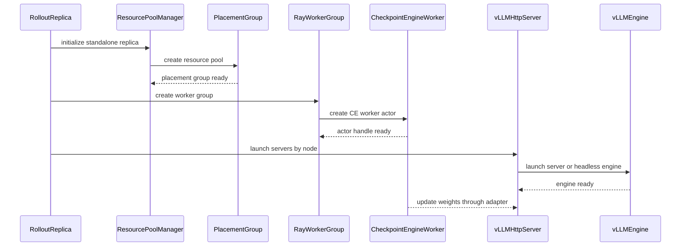
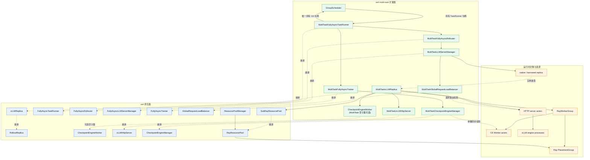
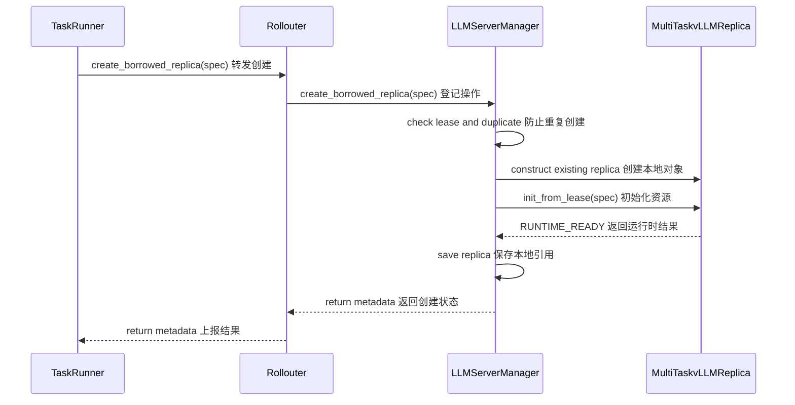
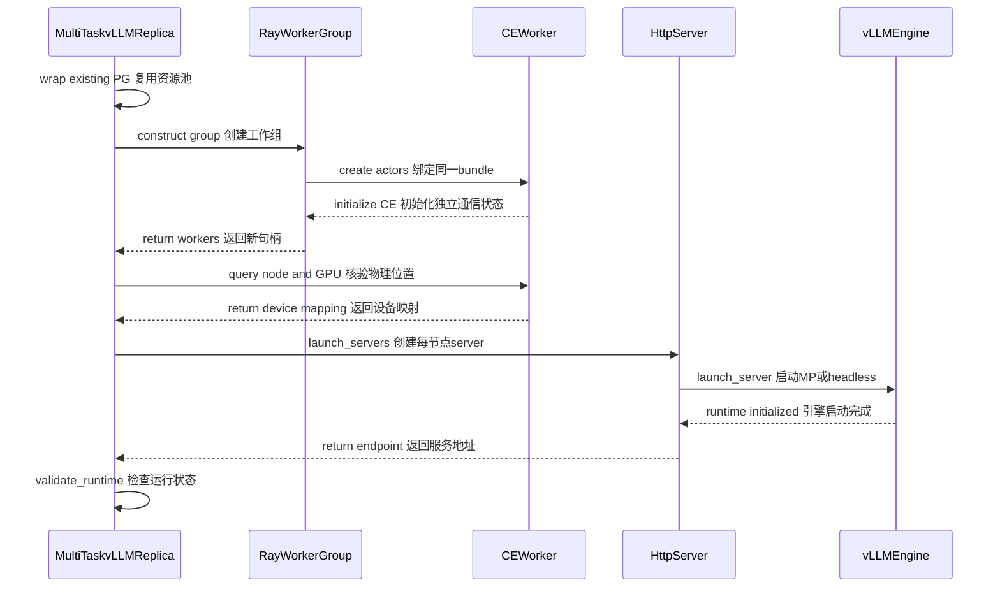
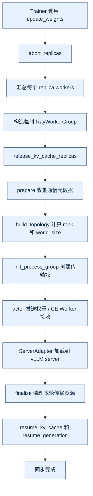
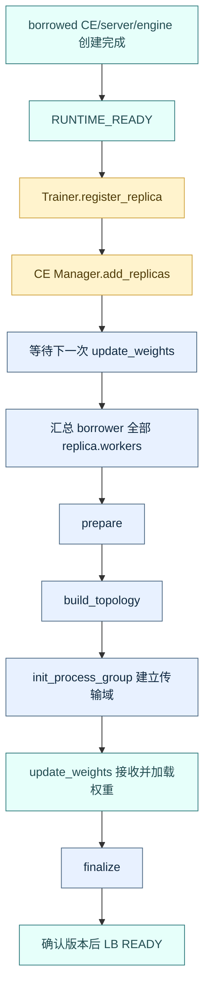

# verl 能力扩展设计：基于原生 Ray Replica 的生命周期扩展

## 0. 文档定位

本文是 verl-multi-task 对 verl 原生能力进行插件化扩展的设计说明，当前聚焦于 replica 的创建、销毁、sleep、reclaim 四类能力，以及为这些能力准备的扩展接口。文档首先还原 verl 当前创建 native replica 的真实代码路径，再说明如何在不修改 verl 原代码的前提下增加扩展。

本文不描述 GlobalScheduler、跨任务调度策略、完整 donor/borrower 调度时序、请求迁移策略或生产级故障恢复协议。那些内容属于上层编排；本文只规定 replica、Checkpoint Engine（CE）Worker、vLLM HTTP server/engine 和 Ray 资源之间的边界。

### 0.1 术语

| 术语 | 含义 |
| --- | --- |
| native replica | 由 verl 原生 RolloutReplica.init_standalone() 创建、拥有自己的 Ray placement group（PG）和 CE Worker 的推理副本 |
| borrowed replica | 借用已经分配给其他任务的物理 GPU slot 创建的副本；它拥有自己的 CE Worker、HTTP server 和 vLLM engine 进程，但不创建新的 GPU PG |
| CE Worker | Ray Actor CheckpointEngineWorker，负责接收训练侧权重、运行参数同步后端，并通过 ServerAdapter 将权重发送到 vLLM server |
| HTTP server | Ray Actor vLLMHttpServer，提供 HTTP/异步推理入口，并在其进程内启动 vLLM runtime |
| vLLM engine | vLLMHttpServer.launch_server() 启动的 vLLM MP 进程组；engine worker 不是 CE Worker |
| GPU slot | 本文指由 node ID 和 GPU UUID/物理索引标识的设备位置，绑定到 PG bundle；bundle 内的 `GPU=0.5` 是 Ray 逻辑配额，不是半张物理卡 |
| runtime | vLLM server actor 内部创建的 vLLM engine、其 worker 进程、通信组、权重和 KV cache 的运行时整体 |

## 1. verl 原生 native replica 的真实创建路径

### 1.1 Replica 计算并行规模

原生入口位于 [verl/workers/rollout/replica.py:189](../../verl/workers/rollout/replica.py:189)。RolloutReplica.init_standalone() 使用 rollout 配置计算：

~~~text
world_size = tensor_model_parallel_size
           × data_parallel_size
           × pipeline_model_parallel_size
gpus_per_replica_node = min(gpus_per_node, world_size)
nnodes = world_size / gpus_per_replica_node
~~~

这里的 world_size 是该 replica 的逻辑并行进程数。它决定需要多少个 CE Worker 和 vLLM engine rank；nnodes 与每节点 GPU 数决定 server 如何按节点分组。

### 1.2 ResourcePool 和 Ray placement group

init_standalone() 不接受外部 GPU slot 作为创建参数，而是自行创建资源池：

~~~python
resource_pool_spec = {
    resource_pool_name: [gpus_per_replica_node] * nnodes
}
pool_manager = ResourcePoolManager(
    resource_pool_spec=resource_pool_spec,
    mapping=...,
    max_colocate_count=2,
)
pool_manager.create_resource_pool()
self.resource_pool = pool_manager.get_resource_pool(resource_pool_name)
~~~

RayResourcePool.get_placement_groups()（[verl/single_controller/ray/base.py:131](../../verl/single_controller/ray/base.py:131)）随后为资源池创建 PG。每个节点 bundle 包含一个 GPU 资源和 max_colocate_count 个 CPU 资源，PG 默认使用 PACK/STRICT_PACK 策略。max_colocate_count=2 的含义是允许同一 GPU bundle 上放置两个使用者；RayWorkerGroup 创建 actor 时会将单个 actor 的 GPU 配额设为 1 / max_colocate_count，因此 native CE Worker 的 Ray 配额通常是 0.5 GPU，而 PG bundle 中仍声明一个 GPU。

**结论：** native replica 的 GPU 位置由 ResourcePool/PG 决定，init_standalone() 不会复用 donor 任务的 PG，也没有“给定 node ID/GPU ID 创建 replica”的公共原生接口。

#### `RayResourcePool` 与 `SubRayResourcePool`

两者都是 verl 原生普通类，定义在 [verl/single_controller/ray/base.py](../../verl/single_controller/ray/base.py)；`SubRayResourcePool` 继承 `RayResourcePool`。前者表示完整资源池，保存 `process_on_nodes`、`max_colocate_count` 等规格，若 `self.pgs` 为空则在调用 `get_placement_groups()` 时创建 PG，已有 PG 则直接返回；后者表示已有 PG 上的一个子视图，构造时接收 `placement_groups`、`start_bundle_index` 和 `subgroup_world_size`，直接复用传入的 PG，并让 `RayWorkerGroup` 从指定 bundle 偏移创建一组新的 actors。子视图可以覆盖完整 donor replica，不要求严格小于原池。

`SubRayResourcePool` 不会转移 PG 所有权、预留 GPU 显存或自动创建“第二个物理 GPU”。它只是把“使用哪些已有 bundle、使用多少个逻辑 rank”准确传给原生 `RayWorkerGroup._init_with_subresource_pool()`。因此它适合 borrowed 初始化，但不能单独证明 donor 的卡已经可以被 borrower 使用。

### 1.3 RayWorkerGroup 创建 CE Worker Actor

RolloutReplica.get_ray_class_with_init_args()（[verl/workers/rollout/replica.py:228](../../verl/workers/rollout/replica.py:228)）返回带初始化参数的 ray.remote(CheckpointEngineWorker)。随后 RayWorkerGroup（[verl/single_controller/ray/base.py:418](../../verl/single_controller/ray/base.py:418)）为每个 PG bundle 创建一个 actor：

1. 按 node IP 排序 PG，并为每个 bundle 分配 rank、local_rank。
2. 生成受保护的运行环境：WORLD_SIZE、RANK、MASTER_ADDR、MASTER_PORT、WG_PREFIX、WG_BACKEND、RAY_LOCAL_WORLD_SIZE。
3. 用 PlacementGroupSchedulingStrategy 把 actor 放到指定 PG 和 bundle index。
4. 使用 num_gpus=1 / max_colocate_count 创建 actor。
5. 将返回的 actor handles 保存到 RayWorkerGroup.workers，再由 replica 保存到 self.workers。

RayWorkerGroup 的 workers 是 CE Worker actor handles；它们不是 vLLM engine worker。RayWorkerGroup(worker_handles=workers) 只包装已有 handles，不会创建新 actor、移动 GPU 或改变 PG 所有权。

### 1.4 CheckpointEngineWorker 初始化和参数同步

CheckpointEngineWorker 位于 [verl/checkpoint_engine/base.py:304](../../verl/checkpoint_engine/base.py:304)，初始化顺序是：

1. Worker.__init__() 读取 WORLD_SIZE、RANK、master 地址/端口等环境，建立 worker 的 rank 视图。
2. 通过 CheckpointEngineRegistry.new(...) 创建 CE backend。
3. 创建 ServerAdapter（默认由 rollout 类型决定，例如 vLLM async adapter）。
4. 调用 initialize_global_process_group_ray(..., backend="cpu:gloo") 建立 Ray 控制面的全局进程组。

参数同步由 CheckpointEngineManager.update_weights()（[verl/checkpoint_engine/base.py:505](../../verl/checkpoint_engine/base.py:505)）编排：

~~~text
abort_all_requests on replicas
→ gather every replica.workers
→ RayWorkerGroup(worker_handles=workers)      # 临时包装已有 CE actors
→ release KV cache
→ prepare all actor/rollout workers
→ backend.build_topology()
→ backend.init_process_group()
→ actor workers update + CE workers update
→ backend.finalize()
→ resume KV cache and generation
~~~

因此，for replica in self.replicas: workers.extend(replica.workers) 收集的是 CE Worker handles。这个 `workers` 是同步方法的局部列表，manager 长期保存的是 `replicas`。每次同步调用建组流程，但底层通信域是否每次重建由 backend 决定：NCCL 默认可以保留旧组，NIXL 会在正常 finalize 中移除远端连接。通信域不等于 Ray actor 或 replica 对象，完整生命周期见第 6 节。

### 1.5 vLLM HTTP server 与 vLLM engine 的创建和绑定

后端 vLLMReplica.launch_servers() 位于 [verl/workers/rollout/vllm_rollout/vllm_async_server.py:1295](../../verl/workers/rollout/vllm_rollout/vllm_async_server.py:1295)，创建链路如下：

1. 对每个 CE Worker 执行 __ray_call__，读取其 node_id 和 Ray 分配的 accelerator/GPU index。
2. 按 gpus_per_replica_node 将 CE Worker handles 分组到各节点，并生成该节点的 CUDA_VISIBLE_DEVICES 列表。
3. 每个节点创建一个 ray.remote(vLLMHttpServer) actor，传入该节点的 CE Worker 列表、replica_rank、node_rank、nnodes、节点 GPU 数和可见设备列表。
4. 以严格 NodeAffinity 将 server actor 放到 CE Worker 所在节点，调用 launch_server.remote(...)。
5. server rank 0 执行 run_server()，创建 AsyncLLM.from_vllm_config、HTTP app 和 engine client；其他节点执行 run_headless()。
6. vLLM 使用 distributed_executor_backend="mp" 在 server actor 内启动 engine worker 进程。rank 0 的 HTTP 地址成为该 replica 的请求入口，其余节点只运行 headless engine。

CheckpointEngineWorker 与 vLLMHttpServer 是两个不同的 Ray Actor 层次。CE Worker 通过 ServerAdapter 找到 server actor，并调用 update_weights_from_ipc，再经 ZMQ/共享内存发送权重 bucket；server actor 内的 vLLM engine worker 最终接收并加载权重。因此不能把“复用 CE Worker”理解为自动复用 vLLM engine。

### 1.6 Native 创建结果和所有权

| 对象 | 创建者 | 绑定依据 | 生命周期所有者 |
| --- | --- | --- | --- |
| ResourcePool/PG | RolloutReplica.init_standalone() | 资源池规格、Ray 调度策略 | native replica / Ray |
| CE Worker actor | RayWorkerGroup | PG bundle、rank/world 环境 | native replica 的 workers |
| vLLM HTTP server actor | vLLMReplica.launch_servers() | CE Worker 的 node/GPU 映射 | native replica 的 servers |
| vLLM engine worker 进程 | vLLMHttpServer.launch_server() 内部 vLLM MP | server 的可见设备、node/rank 参数 | HTTP server runtime |
| endpoint/ServerAdapter | CE Worker + vLLM server | replica rank、Ray job、IPC/ZMQ 地址 | 当前 replica |

## 2. 扩展组件与职责

native 与 borrowed 均使用已有 `MultiTaskvLLMReplica(vLLMReplica)`，分别通过原生入口和新增借用入口初始化。资源输入使用普通字典，扩展集中在 `verl-multi-task` 的现有类中。

以下新增字段和方法均为待实现设计；标为原生或已有的能力直接复用。

### 2.1 组件扩展

| 已有组件及归属 | 本次扩展及用途 | 直接复用的行为 |
| --- | --- | --- |
| `MultiTaskFullyAsyncTaskRunner`，任务入口 Ray actor | 增加生命周期命令入口，通过 Rollouter 执行操作；通过 Trainer 处理 CE 变更；向 GS 返回元数据 | Rollouter、Trainer 的创建与句柄持有 |
| `MultiTaskFullyAsyncRollouter`，TaskRunner 创建的 Ray actor | 增加 `create_borrowed_replica(spec)`、`reclaim_replica(lease_id)`，调用本地 manager | manager 创建和 rollout 控制入口 |
| `MultiTaskLLMServerManager`，Rollouter 内的普通对象 | 管理 lease、创建记录和本任务 replica；组织创建、回收及失败回滚 | replica 列表、server 管理和 LB actor 句柄 |
| `MultiTaskvLLMReplica`，manager 创建的普通对象 | 增加借用初始化、生命周期状态和清理方法，详见第 3 节 | 并行配置计算、CE 类选择、`launch_servers()`、请求控制接口 |
| `CheckpointEngineWorker`，RayWorkerGroup 创建的 Ray actor | borrowed 直接复用原生 Worker；现有 `MultiTaskCheckpointEngineWorker` 若保留只作为空子类/类型选择，不增加生命周期行为 | CE backend、ServerAdapter、Gloo 初始化以及 `execute_checkpoint_engine()` |
| `MultiTaskvLLMHttpServer`，replica 创建的 Ray actor | 补齐 standalone donor 的 sleep/wake；增加 `shutdown()`，停止服务并等待 engine/子进程退出 | 原生 server、MP/headless engine 启动及请求控制 |
| `MultiTaskCheckpointEngineManager`，Trainer 内的普通对象 | 增加受同步 gate 保护的成员变更和清理入口，避免与权重同步交错 | 原生参数传输流程和列表注册能力 |
| `MultiTaskGlobalRequestLoadBalancer`，manager 持有的 Ray actor | 按需扩展摘流、移除和 READY 提交入口 | 原生路由、计数和 server 注册能力 |

### 2.2 所有权与并发边界

- 本地对象归属为 `TaskRunner → Rollouter → LLMServerManager → replica`；CE manager 位于 Trainer 内，由 Trainer 的入口更新，不能与 rollout manager 共用一把进程内锁。
- donor manager 记录 bundle 的租约占用，borrower manager 记录创建与清理结果。跨任务只传 placement 和结果元数据，不传 donor CE/server handles。
- manager 的锁保护本任务状态转换。TaskRunner 的长时 `run()` 需支持并发/异步管理入口，并防止命令与启动、退出交错。
- PG 保留原创建者和原生命周期。borrower 持有引用不转移所有权；donor 删除 PG 或恢复用卡前，必须确认借用资源已实际清理，不能用 lease 到期代替清理确认。

### 2.3 GS 句柄边界

GS 只由 MultiTaskFullyAsyncTaskRunner 持有。GS 与 TaskRunner 互持句柄，GS 通过 TaskRunner 暴露的任务入口间接触发其他组件操作；Rollouter、LLMServerManager、Replica、Trainer、CE Manager 和 LB 均不保存 GS 句柄，也不直接访问 GS。

当前源码仍把 `group_scheduler` 作为参数继续传入 Rollouter、LLMServerManager 和 LB；这是现有 wiring 与目标边界的偏差。本次只修订设计文档，不修改代码。后续实现删除这三个组件的 GS 参数、字段和下传逻辑，由 TaskRunner 接收 GS 指令，并分别沿以下路径调用：

- `TaskRunner → Rollouter → LLMServerManager → replica/LB`：处理本任务推理资源与路由。
- `TaskRunner → Trainer → CheckpointEngineManager → CE Workers`：处理参数同步与 CE 成员变更。
- 完成结果沿原调用链返回 TaskRunner，再由 TaskRunner 回复 GS；其他组件不发现 GS，也不通过回调或全局变量间接保存 GS 句柄。

GS 与 TaskRunner 的双向句柄只用于任务边界通信。GS 接收 placement、lease、状态等元数据，不接收下层 replica、CE/server 或 LB 的句柄。

### 2.4 原生类、扩展类与运行时关系

下图同时表示三种关系：虚线箭头表示继承，实线箭头表示创建或持有，虚线带标签箭头表示通过 RPC 或句柄协作。native replica 和 borrowed replica 不对应两个不同的 Python 类，二者都由 `MultiTaskvLLMReplica` 表示，通过初始化入口和 `allocation_kind` 区分。

图中的关键边界如下：

- 图示为目标设计：GS 只与 TaskRunner 互持句柄，不连接 Rollouter、Trainer、manager、LB 或 replica；当前源码的 GS 下传偏差见第 2.3 节。
- `MultiTaskvLLMReplica` 是唯一的 replica 具体类。native 路径调用 `init_standalone()` 创建自己的 PG；borrowed 路径调用 `init_from_lease()` 包装 donor PG。
- `MultiTaskvLLMReplica` 的 `get_ray_class_with_init_args()` 直接选择原生 `CheckpointEngineWorker`；如果现有插件 wiring 仍选择 `MultiTaskCheckpointEngineWorker`，该类只能作为不增加行为的空子类。二者仍分别是 CE actor 和 HTTP server actor。
- HTTP server actor 在内部启动 vLLM engine 进程，因此 `MultiTaskvLLMHttpServer` 不等于 engine worker。
- `MultiTaskLLMServerManager` 持有 replica 和 LB 句柄；`MultiTaskCheckpointEngineManager` 位于 Trainer 内，是对 CE worker 的独立同步投影。二者不能当作同一个 Python manager。
- native 和 borrowed 共用以上类关系。borrowed 不接管 donor 的 CE actor、HTTP server 或 engine，只复用 donor PG/bundle 的调度位置并创建自己的运行时对象。

## 3. 扩展类的原生成员与扩展成员

每个类先列原生成员，再列扩展成员。注释同时说明来源、实现状态和用途：`[原生继承]` 不需要重写；`[已有覆写]` 已在 multi-task 中替换实现；`[新增·待实现]` 和 `[覆写·待实现]` 仅为设计。原生字段只改变取值或具体类型时标记为“原生字段·已有扩展赋值”，不能算作新增字段。

以下只列与本设计相关的成员，不重复训练算法、指标和 profiling 的全部内部接口。签名保留参数顺序及默认值；原生缺少的类型注解按实际行为补注，`None` 默认值用联合类型表示。异步方法的返回类型指 `await` 后的业务结果，Ray `.remote()` 返回的 ObjectRef 不属于业务返回值。声明中的 `...` 表示省略函数体，不表示省略参数。

### 3.1 MultiTaskFullyAsyncTaskRunner

父类为 `FullyAsyncTaskRunner`，是任务入口 Ray Actor。它是任务内唯一保存 GS 句柄的组件。

**原生成员**

~~~python
running: bool                     # [原生继承] 当前训练循环是否运行
components: dict                  # [原生继承] tokenizer、Trainer、Rollouter、队列等组件
shutdown_event: threading.Event   # [原生继承] 通知训练入口退出的事件

def _initialize_components(self, config: DictConfig) -> None: ...  # [原生继承] 创建任务组件并建立内部引用
def _setup_hybrid_worker_group(self, config: DictConfig) -> None: ...  # [原生继承] 满足配置条件时创建共享训练/推理 WorkerGroup
def _run_training_loop(self) -> None: ...  # [原生继承] 启动并等待 Trainer、Rollouter 的训练/采样循环
~~~

**扩展成员**

~~~python
group_scheduler: ActorHandle | None  # [已有新增] GS actor 句柄；只允许本 TaskRunner 保存

def __init__(self) -> None: ...  # [已有覆写] 初始化原生状态，增加 GS 句柄字段
def run(self, config: DictConfig) -> None: ...  # [已有覆写] 发现 GS、注册本任务、运行原生训练并在退出时注销
def _create_rollouter(self, config: DictConfig) -> None: ...  # [已有覆写·待调整] 创建扩展 Rollouter；后续删除 GS 参数下传
def _create_trainer(self, config: DictConfig) -> None: ...  # [已有覆写] 创建扩展 Trainer，保留原生初始化步骤
async def execute_replica_operation(self, operation: str, request: dict) -> dict: ...  # [新增·待实现] 接收生命周期命令，调用任务内部入口并返回结果元数据
~~~

`run()` 的现有流程是：获取 GS → `attach_task(task_id, current_actor)` → `super().run(config)` → `finally` 中 `detach_task(task_id)`。GS 用已有 `task_runners: dict[str, ActorHandle]` 保存 TaskRunner 句柄，实现双向持有。

`execute_replica_operation()` 接受 `create/sleep/wake/reclaim/destroy` 操作名及对应的 placement、lease 或 replica 标识。它通过 `components["rollouter"]` 操作 replica/LB，通过 `components["trainer"]` 操作 CE；结果字典只包含操作名、目标标识、状态、版本或清理结果，不包含 CE/server/PG 对象。该方法是任务边界入口，具体全局调度策略不在本文定义。

当前 TaskRunner 的长时同步 `run()` 不能因“新增一个 async 方法”就被假定为可并发管理。落地时还须调整已有 actor 的执行方式，使训练等待不阻塞管理入口，并校验组件已就绪；这仍属于扩展 TaskRunner，不增加 Coordinator 类。

### 3.2 MultiTaskFullyAsyncTrainer

父类为 `FullyAsyncTrainer`，是 TaskRunner 创建的 Ray Actor；CE manager 是它内部的普通对象。

**原生成员**

~~~python
config: DictConfig                         # [原生继承] 任务训练配置
actor_wg: RayWorkerGroup                    # [原生继承] 产生训练权重的 WorkerGroup
rollouter: ActorHandle                      # [原生继承] 本任务 Rollouter 的远程句柄
checkpoint_manager: CheckpointEngineManager  # [原生继承] 本进程内的参数同步管理器
current_param_version: int                  # [原生继承] 当前训练参数版本

def __init__(  # [原生继承] 保存训练配置、角色映射和资源池
    self,
    config: DictConfig,
    tokenizer: Any,
    role_worker_mapping: dict[Role, WorkerType],
    resource_pool_manager: ResourcePoolManager,
    ray_worker_group_cls: type[RayWorkerGroup] = RayWorkerGroup,
    device_name: str | None = None,
) -> None: ...
async def init_workers(self) -> None: ...  # [原生继承] 初始化训练 workers
async def set_rollouter(self, rollouter: ActorHandle) -> None: ...  # [原生继承] 保存 Rollouter 并触发 CE manager 初始化
async def fit(self) -> None: ...  # [原生继承] 执行训练循环
async def fit_step(self, batch_dict: dict | None = None) -> None: ...  # [原生继承] 执行单次训练；不返回 DataProto
async def _fit_update_weights(self) -> dict | None: ...  # [原生继承] 按训练进度同步权重并返回指标；没有 global_steps 入参
~~~

**扩展成员**

~~~python
async def _setup_checkpoint_manager(self) -> None: ...  # [已有覆写] 在原生初始化时机选择扩展 CE manager
async def register_replica(self, replica_rank: int) -> None: ...  # [新增·待实现] 从 Rollouter 获取目标投影，再交给本地 CE manager 注册
async def unregister_replica(self, replica_rank: int) -> None: ...  # [新增·待实现] 在本地 CE 投影中定位目标并安全退出参数同步
~~~

`_setup_checkpoint_manager()` 的现有流程为：`rollouter.get_replicas.remote()` → 转换 CE 配置 → 构造 `MultiTaskCheckpointEngineManager`。当前该子类没有覆盖权重传输，因此参数同步仍执行原生实现。

新增注册入口按稳定的 `replica_rank` 定位 replica，获取其 borrower 自己的 worker handles，交给本地 CE manager；移除时查找 CE manager 已保存的对象，不能用一次新的 Ray 反序列化对象与旧对象做身份比较。这里的内部投影传递不经过 GS；Trainer 不保存 GS 句柄。

### 3.3 MultiTaskFullyAsyncRollouter

父类为 `FullyAsyncRollouter`，是 TaskRunner 创建的 Ray Actor，持有本地 LLMServerManager。

**原生成员**

~~~python
config: DictConfig                           # [原生继承] 任务配置
tokenizer: Any                               # [原生继承] tokenizer
processor: Any | None                        # [原生继承] 可选多模态预处理器
llm_server_manager: FullyAsyncLLMServerManager  # [原生继承] 本进程内的 replica/server 管理器
async_rollout_manager: FullyAsyncAgentLoopManager  # [原生继承] AgentLoop 调度与生成管理器

async def init_workers(self) -> None: ...  # [原生继承] 初始化推理资源及生成组件
async def fit(self) -> None: ...  # [原生继承] 执行异步采样循环
def get_replicas(self) -> list[RolloutReplica]: ...  # [原生继承] 返回 manager 的 replica 投影，供本任务 Trainer 使用
def set_hybrid_worker_group(self, worker_group: RayWorkerGroup) -> None: ...  # [原生继承] 注入预先创建的 hybrid WorkerGroup
def get_hybrid_worker_group(self) -> RayWorkerGroup | None: ...  # [原生继承] 查询已注入的 hybrid WorkerGroup
async def add_replicas(self, resource_ids: list[str]) -> int: ...  # [原生继承] 激活预注册 hybrid replicas，返回增加的数量
async def remove_replicas(self, resource_ids: list[str]) -> int: ...  # [原生继承] 停用预注册 hybrid replicas，返回移除的数量
~~~

**扩展成员**

~~~python
def __init__(  # [覆写调整·待实现] 恢复原生构造参数，删除当前扩展中的 group_scheduler 参数与字段
    self,
    config: DictConfig,
    tokenizer: Any,
    processor: Any | None = None,
    device_name: str | None = None,
) -> None: ...
async def _init_async_rollout_manager(self) -> None: ...  # [已有覆写·待调整] 创建扩展 manager 和原生 AgentLoopManager；删除 GS 下传
async def create_borrowed_replica(self, spec: dict) -> dict: ...  # [新增·待实现] 将创建请求转交本地 manager，返回创建元数据
async def reclaim_replica(self, lease_id: str) -> dict: ...  # [新增·待实现] 将回收请求转交本地 manager，返回实际清理结果
~~~

当前构造函数仍额外接受并保存 `group_scheduler`；上述无 GS 签名是目标设计。若删除该字段后不再需要其他构造逻辑，可以直接继承父类构造函数。

`_init_async_rollout_manager()` 创建 `MultiTaskLLMServerManager`，再将它提供的 client 交给原生 `FullyAsyncAgentLoopManager.create()`。生成逻辑保持原生；AgentLoop 侧的暂停/请求处理由 Rollouter 协调，不能仅摘除 LB 就认为所有已派发工作已经停止。原生 `add_replicas/remove_replicas` 操作的是 hybrid 注册表，不等于动态创建或销毁 borrowed runtime。

### 3.4 MultiTaskLLMServerManager

父类为 `FullyAsyncLLMServerManager`，间接继承 `LLMServerManager`；它是 Rollouter 内的普通对象。

**原生成员**

~~~python
config: DictConfig                          # [原生继承] 完整任务配置
rollout_config: DictConfig                  # [原生继承] manager 保存的 rollout 配置，创建 replica 时再转换
model_config: DictConfig                    # [原生继承] manager 保存的模型配置
worker_group: RayWorkerGroup | None         # [原生继承] 可选 hybrid WorkerGroup
rollout_resource_pool: RayResourcePool | None  # [原生继承] 可选已有资源池
start_rank: int                             # [原生继承] replica 编号的起始偏移
rollout_replicas: list[RolloutReplica]       # [原生继承] 本地管理的 standalone replica 对象
server_handles: list[ActorHandle]           # [原生继承] 对应的主 HTTP server 句柄
server_addresses: list[str]                 # [原生继承] 对应的 HTTP 地址
global_load_balancer: ActorHandle           # [原生继承] 本任务 LB actor 句柄，与 GS 无关
hybrid_replicas: dict[str, RolloutReplica]   # [原生继承] 预注册 hybrid replica 表
alive_replicas: dict[str, RolloutReplica]    # [原生继承] 已激活的 hybrid 子集，不是所有 borrowed 的通用状态表
alive_addresses: dict[str, str]             # [原生继承] 已激活 hybrid 的 resource_id 到 server 地址映射

@classmethod
async def create(cls, *args: Any, **kwargs: Any) -> LLMServerManager: ...  # [原生继承] 构造 cls、初始化 replicas、再初始化 LB
async def _initialize_llm_servers(self, start_rank: int = 0) -> None: ...  # [原生继承] 初始化 hybrid/standalone replicas 及其 server 列表
def get_replicas(self) -> list[RolloutReplica]: ...  # [原生继承] 查询本任务 replica 投影
def get_addresses(self) -> list[str]: ...  # [原生继承] 查询 server 地址
def get_client(self, client_cls: type[LLMServerClient] = FullyAsyncLLMServerClient, **kwargs: Any) -> LLMServerClient: ...  # [原生继承] 用 LB 句柄创建客户端
async def add_replicas(self, resource_ids: list[str]) -> int: ...  # [原生继承] 激活预注册 hybrid 资源，返回增加数量
async def remove_replicas(self, resource_ids: list[str]) -> int: ...  # [原生继承] 停用预注册 hybrid 资源，返回移除数量
~~~

**扩展成员**

~~~python
rollout_replica_class: type[MultiTaskvLLMReplica]  # [原生字段·已有扩展赋值] 指定创建扩展 Replica
_load_balancer_cls: type[MultiTaskGlobalRequestLoadBalancer]  # [原生字段·已有扩展赋值] 指定创建扩展 LB
bundle_leases: dict[str, dict]              # [新增·待实现] donor 本地 lease 表，记录被借用的 bundles 及归还状态
borrowed_operations: dict[str, dict]        # [新增·待实现] borrower 按 lease 保存创建状态、取消标记、局部 runtime 引用和结果
replica_operation_lock: asyncio.Lock       # [新增·待实现] 保护本进程租约登记及状态提交的短临界区

def __init__(  # [覆写调整·待实现] 保留扩展类型选择，增加生命周期状态，删除当前 GS 参数与字段
    self,
    config: DictConfig,
    worker_group: RayWorkerGroup | None = None,
    rollout_resource_pool: RayResourcePool | None = None,
) -> None: ...
async def _init_global_load_balancer(self) -> None: ...  # [已有覆写·待调整] 创建扩展 LB、传递原生路由配置，删除 GS 下传
def export_borrowable_placement(self, replica_id: str, lease_id: str) -> dict: ...  # [新增·待实现] 确认本地资源已可借并登记 lease，返回不含 runtime 句柄的 placement
async def create_borrowed_replica(self, spec: dict) -> dict: ...  # [新增·待实现] 创建本任务 borrowed runtime，返回 lease、replica_rank、状态等元数据
async def reclaim_replica(self, lease_id: str) -> dict: ...  # [新增·待实现] 在请求与 CE 退出条件满足后清理 borrower runtime
def confirm_lease_released(self, lease_id: str) -> None: ...  # [新增·待实现] donor 收到实际清理确认后解除本地 bundle 占用记录
~~~

当前构造函数先设置 `rollout_replica_class`，调用父类构造，再设置 `_load_balancer_cls`；两者会在继承的异步 `create()` 后续初始化阶段使用。当前签名仍有 `group_scheduler`，目标删除。直接父类本来就只接受 `config/worker_group/rollout_resource_pool`；更上层 `LLMServerManager` 的 `start_rank/load_balancer_cls` 并非直接父类暴露的构造参数，不应把当前签名误写为新增的兼容性缺陷。

创建流程为：检查 lease 和布局 → 短锁内登记 CREATING → 释放锁后创建 replica → 再次检查取消/过期 → 提交 RUNTIME_READY。失败由 replica 清理局部 runtime；重复请求读取同一 lease 的操作记录，不能重复创建。`borrowed_operations` 的内部引用不直接作为返回值传到 GS。

回收流程为：确认已摘流且请求已处理、由 TaskRunner 经 Trainer 确认 CE 退出 → 调用目标 `replica.reclaim()` → 清理本地投影并返回结果。manager 没有 Trainer 内 CE manager 的直接引用，也不向 GS 报告；跨 actor 的调用由 TaskRunner 转接。

### 3.5 MultiTaskvLLMReplica

父类为 `vLLMReplica`，继续继承 `RolloutReplica`。native 和 borrowed 共用这个已有扩展类，通过初始化入口区分；不新增独立 BorrowedReplica 层级。

**原生成员**

~~~python
replica_rank: int                           # [原生继承] 运行时 replica 编号，也用于 server/adapter 寻址
config: RolloutConfig                       # [原生继承] replica 使用的 rollout 配置
model_config: HFModelConfig                 # [原生继承] 模型配置
world_size: int                             # [原生继承] TP × DP × PP，即所需逻辑 rank 数
nnodes: int                                 # [原生继承] replica 的节点数
gpus_per_replica_node: int                  # [原生继承] 每节点使用的 GPU 数
workers: list[ActorHandle]                  # [原生继承] 每个 GPU rank 对应的 CE Worker handles
servers: list[ActorHandle]                  # [原生继承] 每节点的 HTTP/headless server handles
resource_pool: RayResourcePool | None       # [原生继承] 原生池或借用路径的 SubRayResourcePool 引用
bundle_indices: list[int]                   # [原生继承] 使用已有资源池路径时的 bundle 索引；不是通用物理 GPU 标识
rollout_mode: RolloutMode                   # [原生继承] STANDALONE/HYBRID/COLOCATED 模式
_server_handle: ActorHandle | None          # [原生继承] 主 HTTP server 句柄
_server_address: str | None                 # [原生继承] 主 HTTP server 地址

def __init__(  # [原生构造契约] 下方已有扩展通过 *args/**kwargs 透传这些完整参数
    self,
    replica_rank: int,
    config: RolloutConfig,
    model_config: HFModelConfig,
    gpus_per_node: int = 8,
    is_reward_model: bool = False,
    is_teacher_model: bool = False,
    name_suffix: str = "",
) -> None: ...
async def init_standalone(self) -> None: ...  # [原生继承] 创建自有 ResourcePool/PG、CE actors 和 servers
async def init_hybrid(self, worker_group: RayWorkerGroup) -> None: ...  # [原生继承] 绑定已有 hybrid workers 并启动 servers
async def launch_servers(self) -> None: ...  # [原生继承] 读取 CE 的 node/GPU，按节点启动 HTTP/headless servers
async def sleep(self) -> None: ...  # [原生继承] 等待请求排空，再调用各 server 的 sleep；是否释放显存取决于 server 实现
async def wake_up(self) -> None: ...  # [原生继承] 并发调用各 server 的 wake_up
async def abort_all_requests(self) -> dict[str, Any]: ...  # [原生继承] 暂停生成并汇总在飞请求的中断结果
async def abort_request(self, request_id: str) -> dict[str, Any]: ...  # [原生继承] 中断指定请求并返回结果
async def resume_generation(self) -> None: ...  # [原生继承] 恢复此前暂停的生成入口
async def release_kv_cache(self) -> None: ...  # [原生继承] 为权重同步释放 KV 显存，不能等同于捐卡休眠
async def resume_kv_cache(self) -> None: ...  # [原生继承] 恢复 KV cache 内存
async def clear_kv_cache(self) -> None: ...  # [原生继承] 清理缓存内容

@property
def server_handle(self) -> ActorHandle: ...  # [原生继承] 对外暴露主 HTTP server 句柄
@property
def server_address(self) -> str: ...  # [原生继承] 对外暴露主 HTTP 地址
@property
def max_concurrency(self) -> int: ...  # [原生继承] 返回 replica 的最大并发额度
~~~

**扩展成员**

~~~python
server_class: Any                         # [原生字段·已有扩展赋值] ray.remote(MultiTaskvLLMHttpServer)，不是普通 Python 类型
allocation_kind: str                      # [新增·待实现] native 或 borrowed，区分资源来源
lease_id: str | None                      # [新增·待实现] borrowed 的租约标识；native 为 None
donor_task_id: str | None                  # [新增·待实现] 提供 PG 的任务，仅用于校验和归还
donor_replica_id: str | None               # [新增·待实现] 提供完整 bundle 集合的 donor replica 标识
runtime_state: str                        # [新增·待实现] CREATING/RUNTIME_READY/READY/DRAINING/SLEEPING/DESTROYED/FAILED
owns_resource_pool: bool                  # [新增·待实现] 是否拥有 PG 清理权；borrowed 必须为 False
placement_spec: dict                      # [新增·待实现] lease、PG、bundle 和预期 node/GPU 等元数据
creation_actor_names: list[str]           # [新增·待实现] 本次精确 actor 名称，用于部分创建失败时清理
serving_version: int | None               # [新增·待实现] 已完成加载的权重版本；未确认时为 None

def __init__(self, *args: Any, **kwargs: Any) -> None: ...  # [已有覆写·待扩展] 透传原生构造、替换 server_class；后续初始化上述新增状态
def get_ray_class_with_init_args(self) -> RayClassWithInitArgs: ...  # [已有覆写] 选择原生 CheckpointEngineWorker，并传入 borrower 自己的模型及 replica_rank；MultiTask Worker 仅可作为空子类选择
async def init_from_lease(self, spec: dict) -> None: ...  # [新增·待实现] 在租借 PG/bundles 上创建独立 runtime，成功置 RUNTIME_READY
def validate_placement(self, spec: dict) -> None: ...  # [新增·待实现] 检查租约、PG、完整布局及配置一致性；不通过则抛异常
async def validate_runtime(self) -> None: ...  # [新增·待实现] 按已完成阶段核验 actor 就绪、实际 GPU 映射及 server 健康
async def destroy(self) -> None: ...  # [新增·待实现] 关闭本 replica 的 engine、CE 和 actors；失败抛异常，不能伪报已释放
async def reclaim(self) -> dict: ...  # [新增·待实现] 校验 borrowed 身份后执行 destroy，返回租约与实际清理结果
~~~

已有 `__init__(*args, **kwargs)` 必须继续接受并透传上方列出的全部原生构造参数。

`init_from_lease()`：校验 placement → 用 `SubRayResourcePool` 包装已有 PG → 用原生 `RayWorkerGroup` 创建新的 CE Workers → 核验 node/GPU → 继承的 `launch_servers()` 创建新 HTTP server/engine → 核验并设置 RUNTIME_READY。它不调用 `init_standalone()`，也不复用 donor CE/server。

`destroy()`：在外部完成 LB 摘流、CE 成员移除和本轮 `finalize()` 后，调用 server `shutdown()`，再销毁本 replica 的原生 CE Worker actors；Actor 进程退出负责释放其长期 adapter、控制连接和本地 Gloo 状态。只有 native 且无未归还 lease 时才允许清理其自有 PG。重复销毁已确认释放的对象直接返回，不按宽泛名称前缀误杀其他任务。`reclaim()` 成功结果为 `{"lease_id": str, "replica_rank": int, "state": "DESTROYED", "released": True}`；失败保留待清理状态并抛异常，不能仅凭 lease 过期设置 `released=True`。

sleep/wake 是 native donor 的能力；borrowed 在本设计范围内只创建、使用和回收。虽然同类继承了这些接口，上层不为 borrowed 编排 sleep/wake。replica 的 runtime_state 由本地 manager 统一提交，序列化给 Trainer 的投影不会自动共享该字段更新。

### 3.6 CheckpointEngineWorker（borrowed 复用原生类）

通信域的创建、重建和本轮清理由原生 `CheckpointEngineWorker` 与其 backend 完成，**不需要新增一个有行为的 `MultiTaskCheckpointEngineWorker`**。当前仓库中若保留同名扩展类，它只能作为空子类或 Ray class selector，以兼容已有插件 wiring；不能把它当作动态 replica 生命周期的必要组件。

**原生成员与方法**

~~~python
rollout_config: RolloutConfig        # [原生继承] rollout 和 CE backend 配置
model_config: HFModelConfig          # [原生继承] 模型配置
server_adapter: BaseRollout          # [原生继承] 通向本 replica 推理 server 的权重适配器
checkpoint_engine: CheckpointEngine  # [原生继承] NCCL/NIXL 等参数传输 backend 实例
extra_rollout_args: tuple            # [原生继承] 传给 adapter 的额外位置参数
extra_rollout_kwargs: dict           # [原生继承] 传给 adapter 的额外关键字参数，包括 replica_rank

def __init__(self, rollout_config: RolloutConfig, model_config: HFModelConfig,
             server_adapter: BaseRollout | None = None, *args: Any,
             **kwargs: Any) -> None: ...  # [原生继承] 创建 backend、adapter，并初始化原生控制组
async def update_weights(self, global_steps: int | None = None) -> None: ...  # [原生继承] 接收权重并交给 adapter 加载到 server
def execute_checkpoint_engine(self, method: str, *args: Any,
                              **kwargs: Any) -> Any: ...  # [原生继承] 分派 backend 的 prepare/build/init/finalize
def get_replica_rank(self) -> int: ...  # [原生继承] 从 adapter 读取 replica 编号
def is_leader_rank(self) -> bool: ...  # [原生继承] 从 adapter 读取 leader 标志
~~~

`prepare`、`build_topology`、`init_process_group` 和 `finalize` 是 backend 方法，不是 CE Worker 自己新增的方法；Manager 通过原生 `execute_checkpoint_engine()` 调用它们。borrowed Worker 只需使用 borrower 自己的 adapter、backend 配置和 rank/world size，donor Worker 不加入 borrower 的通信组。CE Manager 负责把 borrowed replica 纳入本次 `workers` 临时列表，并在 gate 内完成成员变更；底层建组仍走原生流程。

当前 MVP 的回收顺序是：完成本轮同步的原生 `finalize()` → 从 CE Manager 的 effective set 注销 → server `shutdown()` → 销毁 CE Worker actors。原生 backend 已负责本轮传输组、bucket、NIXL agent/注册内存等资源的正常 finalize；Actor 进程退出负责长期 adapter、控制连接和本地 Gloo 状态。因此 MVP 不增加 `close_transfer()` 或 `close_runtime()`，也不重复调用 `finalize()`。

只有未来要保留 CE Actor、实现真正的 borrowed sleep/wake 缓存时，才需要按具体 backend 增加可选的“长期连接清理”钩子；这不是通用 `MultiTaskCheckpointEngineWorker` 的必需职责，且不能假设一个方法可以统一销毁所有 backend、Gloo 或 vLLM 通信组。

borrowed 创建新的 CE actor：它与 donor 可以位于同一物理 GPU，但拥有不同 backend、adapter、通信组及 borrower 参数来源。

### 3.7 MultiTaskvLLMHttpServer

父类为 `vLLMHttpServer`，当前是空子类；每节点一个 server actor，内部启动 vLLM MP/headless runtime。

**原生成员**

~~~python
config: RolloutConfig                 # [原生继承] 推理配置，包括显存释放及 sleep 配置
model_config: HFModelConfig           # [原生继承] 模型配置
rollout_mode: RolloutMode             # [原生继承] 决定 sleep/wake 等原生行为的模式
workers: list[ActorHandle]            # [原生继承] 本节点 CE Worker handles
replica_rank: int                    # [原生继承] replica 编号，用于 actor/adapter 寻址
node_rank: int                       # [原生继承] 本节点在 replica 中的编号；0 提供主 HTTP 服务
gpus_per_node: int                   # [原生继承] 本节点使用的 GPU 数
nnodes: int                          # [原生继承] replica 总节点数
global_steps: int | None             # [原生继承] server 记录的权重版本/训练步标记
engine: Any                          # [原生继承] 主节点启动后持有的 AsyncLLM；headless 分支不能假定同样持有
_submission_paused: bool             # [原生继承] 是否暂停请求进入生成引擎
_admitting: int                      # [原生继承] 正在通过请求准入阶段的调用数
_resume_event: asyncio.Event         # [原生继承] 恢复准入时唤醒等待者的事件

def __init__(  # [原生继承] 保存节点/模型信息，设置可见设备及启动环境
    self,
    config: RolloutConfig,
    model_config: HFModelConfig,
    rollout_mode: RolloutMode,
    workers: list[ActorHandle],
    replica_rank: int,
    node_rank: int,
    gpus_per_node: int,
    nnodes: int,
    cuda_visible_devices: str,
    disaggregation_role: str = "null",
    disaggregation_kv_transfer_config: dict | None = None,
) -> None: ...
def get_master_address(self) -> tuple[str | None, int | None, int | None]: ...  # [原生继承] 返回 master 地址、端口和 DP RPC 端口
def get_server_address(self) -> tuple[str, int]: ...  # [原生继承] 返回 server 的地址和端口
async def launch_server(  # [原生继承] 生成 vLLM 配置并启动主 HTTP 或 headless 分支
    self,
    master_address: str | None = None,
    master_port: int | None = None,
    dp_rpc_port: int | None = None,
) -> None: ...
async def run_server(self, args: argparse.Namespace) -> None: ...  # [原生继承] 创建 AsyncLLM、HTTP app 与服务任务
async def run_headless(self, args: argparse.Namespace) -> None: ...  # [原生继承] 启动非主节点的 headless engine
async def collective_rpc(  # [原生继承] 将命令下发给 engine workers；不替代整个 replica 的生命周期管理
    self,
    method: str | Callable,
    timeout: float | None = None,
    args: tuple = (),
    kwargs: dict[str, Any] | None = None,
) -> None: ...
async def wait_for_requests_to_drain(self) -> None: ...  # [原生继承] 等待引擎中的当前请求排空
async def abort_all_requests(self, reset_prefix_cache: bool = True) -> dict[str, Any]: ...  # [原生继承] 暂停/中断当前生成并返回结果
async def abort_request(self, request_id: str, reset_prefix_cache: bool = True) -> dict[str, Any]: ...  # [原生继承] 中断指定请求并返回结果
async def resume_generation(self) -> None: ...  # [原生继承] 恢复暂停的生成入口
async def release_kv_cache(self) -> None: ...  # [原生继承] 暂时释放 KV 后唤醒 weights，供参数同步使用
async def resume_kv_cache(self) -> None: ...  # [原生继承] 恢复 KV 内存并清理失效缓存
async def clear_kv_cache(self) -> None: ...  # [原生继承] 清理前缀、多模态等缓存
~~~

`cuda_visible_devices` 是构造参数，用于设置进程环境；当前原生类没有同名 `self.cuda_visible_devices` 字段，不应把参数误列为继承字段。

**扩展成员**

~~~python
async def sleep(self) -> None: ...  # [覆写·待实现] 为 native standalone donor 增加真实 engine 休眠，其他模式保留父类行为
async def wake_up(self, tags: list[str] | None = None) -> None: ...  # [覆写·待实现] 为 native standalone donor 恢复 engine 内存，保留原生参数契约
async def shutdown(self) -> None: ...  # [新增·待实现] 停止准入、关闭 HTTP/engine 并等待本节点子进程退出
~~~

**原生实现与目标存在一处关键差异：STANDALONE 模式的 `sleep()/wake_up()` 直接跳过。** 见 [vllm_async_server.py](../../verl/workers/rollout/vllm_rollout/vllm_async_server.py) 中对应分支。因此，仅继承 replica.sleep 并不能让当前 standalone donor 真正释放权重/KV 显存。

后续覆盖应继续由 `node_rank == 0` 调用已有 engine 的 `sleep(level=...)` / `wake_up(tags=...)`，利用 engine 的跨 rank 控制路径；需检查 `free_cache_engine`、所选 sleep level 和启动配置确实支持休眠。配置不满足时报告不支持捐卡，不能返回虚假的 SLEEPING。唤醒内存后仍需确认权重版本并恢复正确缓存；sleep level 2 丢弃的权重不能靠内存分配自动恢复。原生 `release_kv_cache()` 会重新唤醒 weights，不等于完整捐卡。

`shutdown()` 要分别处理主节点 HTTP/AsyncLLM 与其他节点 headless 子进程；返回成功必须表示本节点实际清理完成，不能仅发出 `ray.kill()` 就承诺 GPU 可归还。

### 3.8 MultiTaskGlobalRequestLoadBalancer

父类为 `GlobalRequestLoadBalancer`，创建时包装为 Ray Actor。“Global”指本任务 AgentLoop 共享的路由器，不是跨任务 GS。

**原生成员**

~~~python
_servers: dict[str, ActorHandle]       # [原生继承] server_id 到 server actor 的映射
_inflight_requests: dict[str, int]     # [原生继承] 各 server 已 acquire、尚未 release 的请求计数
_request_id_to_server: LRUCache        # [原生继承] request_id 到 server_id 的粘性路由缓存
_full_determinism: bool               # [原生继承] 是否使用确定性哈希路由

def release_server(self, server_id: str, request_id: str | None = None) -> None: ...  # [原生继承] 请求结束后减少对应 server 计数
def require_acquire_fields(self) -> list[str]: ...  # [原生继承] 返回 acquire 所需额外字段；默认空列表
def require_release_fields(self) -> list[str]: ...  # [原生继承] 返回 release 所需额外字段；默认空列表
def add_servers(self, servers: dict[str, ActorHandle]) -> None: ...  # [原生继承] 注册 server 并初始化计数
def remove_servers(self, server_ids: list[str]) -> None: ...  # [原生继承] 删除 server 映射和对应计数
def get_inflight_count(self, server_id: str) -> int: ...  # [原生继承] 查询指定 server 的在飞数
def get_all_servers(self) -> list[str]: ...  # [原生继承] 返回已注册 server ID
def get_total_inflight(self) -> int: ...  # [原生继承] 汇总已注册 server 的在飞数
def get_status(self) -> dict: ...  # [原生继承] 返回 servers、total_inflight、active_servers 等诊断信息
def clear_sticky_cache(self) -> dict: ...  # [原生继承] 清空粘性缓存，返回清除数量及负载信息
~~~

**扩展成员**

~~~python
_draining_servers: set[str]           # [新增·待实现] 停止新路由但仍保留在飞计数的 server ID

def __init__(  # [覆写调整·待实现] 调用原生构造并初始化 drain 集合；删除当前 GS 参数与字段
    self,
    servers: dict[str, ActorHandle],
    max_cache_size: int = DEFAULT_ROUTING_CACHE_SIZE,
    full_determinism: bool = False,
) -> None: ...
def acquire_server(self, request_id: str) -> tuple[str, ActorHandle]: ...  # [覆写·待实现] 保留原生选路规则，所有分支排除 draining server
def begin_drain(self, server_ids: list[str]) -> None: ...  # [新增·待实现] 标记摘流，禁止后续 acquire 命中目标，保留计数供排空检查
def commit_remove(self, server_ids: list[str]) -> None: ...  # [新增·待实现] 确认在飞结束后清理路由缓存、server 映射、计数和 drain 标记
def commit_ready(self, servers: dict[str, ActorHandle]) -> None: ...  # [新增·待实现] 在运行时和版本已就绪后提交可路由 server
~~~

当前源码的扩展构造函数仍增加并保存 `group_scheduler`，其余方法继承父类；上述 drain/commit 方法尚未实现。目标删除 GS 参数和字段，只由 LLM manager 持有该 LB 句柄。

`begin_drain()` 与 `acquire_server()` 在同一个串行 LB actor 内生效；sticky、确定性哈希、最小负载三条路径都必须排除目标。`release_server()` 继续回收既有请求计数。`commit_remove()` 等计数归零且外部请求处理完成，再调用原生 `remove_servers()` 删除映射/计数，并清除指向目标的 sticky 项及 drain 标记。原生 remove 只清除映射和计数，sticky 项靠后续 acquire 惰性失效；需要立即清理时由扩展补齐。

`commit_ready()` 只添加新的、已就绪的 server；重复 READY 对已注册 server 应保持计数不变，不能重复调用原生 `add_servers()` 将已有在飞数重置为 0。以上均为同步业务方法，通过 Ray actor 远程调用执行。

### 3.9 MultiTaskCheckpointEngineManager

父类为 `CheckpointEngineManager`，当前为空子类；它在 Trainer 内运行，不能持有 GS，也不直接管理 LB。

**原生成员**

~~~python
config: CheckpointEngineConfig         # [原生继承] 参数同步配置
backend: str                          # [原生继承] CE backend 名称
backend_cls: type[CheckpointEngine]    # [原生继承] 构建通信拓扑所用 backend 类
actor_wg: RayWorkerGroup               # [原生继承] 训练侧权重生产者
replicas: list[RolloutReplica]         # [原生继承] 本次可参与同步的 replica 投影；不是 LLM manager 的共享 Python 列表

def build_process_group(self, rollout: RayWorkerGroup) -> None: ...  # [原生继承] prepare 收集元数据、build_topology、init_process_group
def add_replicas(self, replicas: list[RolloutReplica]) -> None: ...  # [原生继承] 扩展本地成员列表；不立即同步权重或重建通信组
def remove_replicas(self, replicas: list[RolloutReplica]) -> None: ...  # [原生继承] 移除本地列表成员；不自动关闭连接或销毁通信组
async def sleep_replicas(self) -> None: ...  # [原生继承] 对当前成员批量调用 replica.sleep
async def wake_up_replicas(self) -> None: ...  # [原生继承] 对当前成员批量调用 replica.wake_up
async def abort_replicas(self) -> None: ...  # [原生继承] 暂停/中断当前成员的请求
async def resume_generation_replicas(self) -> None: ...  # [原生继承] 恢复当前成员生成
async def release_kv_cache_replicas(self) -> None: ...  # [原生继承] 批量释放同步所需 KV 显存
async def resume_kv_cache_replicas(self) -> None: ...  # [原生继承] 同步结束后恢复 KV 内存
~~~

**扩展成员**

~~~python
sync_gate: asyncio.Lock               # [新增·待实现] Trainer 本进程内的同步互斥锁，串行化权重同步与 CE 成员变更
sync_state: str                       # [新增·待实现] IDLE/SYNCING/BLOCKED；只有 IDLE 允许正常成员变更
inflight_replicas: list[RolloutReplica]  # [新增·待实现] 本次同步的固定成员快照；失败时保留以定位清理对象
last_synced_versions: dict[int, int]   # [新增·待实现] replica_rank 到已确认加载的参数版本；不等同于 LB READY

def __init__(  # [覆写·待实现] 保留原生构造参数和初始化，增加 gate、同步状态、快照和版本记录
    self,
    config: CheckpointEngineConfig,
    actor_wg: RayWorkerGroup,
    replicas: list[RolloutReplica],
) -> None: ...
async def update_weights(self, global_steps: int | None = None) -> dict: ...  # [覆写·待实现] gate 内固定成员、复用原生同步；成功记录版本，失败阻断后续同步，返回原生指标
async def register_replica(self, replica: RolloutReplica) -> None: ...  # [新增·待实现] 在 gate 内校验并幂等加入成员投影，不宣告 LB READY
async def unregister_replica(self, replica: RolloutReplica) -> None: ...  # [新增·待实现] 在 gate 内等待旧同步完成、退出有效成员并清理相应传输状态
~~~

当前没有以上覆盖，`update_weights()` 直接继承原生实现。对于非 naive backend，原生流程是：中断生成 → 收集 `replica.workers` → 临时包装 RayWorkerGroup → 释放 KV → `build_process_group()` → 训练侧发送/CE 接收和加载 → `finalize()` → 恢复 KV 和生成；naive backend 则走训练 worker 自身的更新路径。新建 borrowed 的方案需要能覆盖独立 receiver 的 backend，不能假定 naive 分支适用。

本方案优先复用全量 NCCL backend，并在创建训练侧和接收侧 backend **之前**统一配置 `rebuild_group=True` 和本任务唯一的 `group_name`，正常同步每次 finalize 销毁传输组。不能只修改 manager 的配置对象，或只为新增 borrowed 设置该参数。可行性及通信域创建、销毁和清理方式见第 6 节。

扩展 `update_weights()` 在函数入口取得 gate，直到整个同步结束才释放；保留原生 `auto_await` 调用语义。`unregister_replica()` 在目标 sleep/destroy 前完成：等待正在执行的同步退出，按本地稳定标识移除目标，完成必要的 backend 清理。此后其他 replicas 可以同步，但不会再访问该目标；不能仅在修改列表那一瞬间加锁，而让旧同步继续持有目标 handles。

“清理旧通信域”不等于无条件销毁每个 CE Worker 的全局 Gloo group：应区分一次参数传输的 collective group、远端 agent/注册内存和 worker 的长期控制组。旧传输状态必须按 backend 的 `finalize` 及实际关闭接口释放；若 backend 保留了旧成员连接，还需显式断开。剩余成员的传输拓扑可在下一次原生 `build_process_group()` 中重新构建，无需把“列表移除”和“立即重建全部通信组”绑定为同一个操作。

`register_replica()` 只提交 CE 投影。bootstrap 权重与 LB READY 是后续独立条件；CE manager、LLM manager、LB 各自的本地锁不构成跨 actor 的原子事务。TaskRunner 必须等待相应远程操作结果，再允许下一项生命周期动作。

## 4. 创建方案选择

**选定：donor 保留 PG 和休眠的 native runtime，borrower 在相同 bundles 的剩余 fractional 配额上创建独立 CE/server/engine。** 目标是 donor 空泡期间由另一个任务使用这些物理 GPU，回收后 donor 唤醒原 replica；不要求把 PG 的创建者改成 borrower，也不要求 borrower 在 Ray 中申报 `GPU=1`。这是基于当前源码与 Ray 机制的设计判断，尚未经过真实多任务 GPU 验证。

### 4.1 为什么共享 bundle 能实现跨任务借卡

需要区分三个概念：

| 层次 | 本方案中的含义 | 是否在借用期间改变 |
| --- | --- | --- |
| Ray 资源预留 | PG 将指定 bundles 保留在节点上；donor/borrower CE actor 各请求该 bundle 的 `GPU=0.5` | PG 保留；borrower 新增一个 actor 的配额占用 |
| GPU 实际使用 | 在 GPU 上执行推理、参数加载，以及占用权重/KV/临时缓冲 | donor 休眠并退出同步；由 borrower 自己的 runtime 使用设备 |
| 任务归属 | 模型配置、权重版本、CE 同步来源、请求来源及 runtime 句柄 | 新 runtime 归 borrower，由 borrower 的 CE/LB 管理；donor 原 runtime 仍归 donor |

**`GPU=0.5` 是调度记账，不是 50% 算力上限或一半显存的硬分区。** 即使 donor CE actor 保留这个配额，只要不再进行 GPU 工作，borrower 也不会被 Ray 限制为只能使用半张卡。可以让 donor/borrower 进程同时存在，而有效的推理工作按时间切换。Ray 明确说明资源需求不限制实际物理资源使用，并支持多个 fractional actors 共享设备。见 [Ray 逻辑资源说明](https://docs.ray.io/en/latest/ray-core/scheduling/resources.html) 和 [fractional accelerators](https://docs.ray.io/en/latest/ray-core/scheduling/accelerators.html#fractional-accelerators)。

因此，“donor CE actor 还占 `0.5`，所以借卡不成立、必须先销毁 donor 并改成 `GPU=1`”这个推论不成立。保留 donor 并在归还时唤醒，正是本设计需要的行为。该方案也不保证 donor 残留显存为零，或提供两个任务之间的硬件隔离；即使申请 `GPU=1`，也不能阻止绕过 Ray 资源申报的进程访问设备。

以一个 `GPU=1` 的 bundle 为例，借用前后保持以下关系；多卡 replica 对每个 bundle 执行同样的管理：

| 阶段 | donor CE 的 Ray 配额 | borrower CE 的 Ray 配额 | donor engine | borrower engine |
| --- | --- | --- | --- | --- |
| donor 正常服务 | 0.5 | 无 | 运行 | 不存在 |
| 已批准借出 | 0.5 | 无 | 已休眠，停止用卡 | 不存在 |
| borrower 使用 | 0.5 | 0.5 | 保持休眠，禁止参数同步/自动唤醒 | 加载 borrower 权重，处理 borrower 请求 |
| borrower 清理完成 | 0.5 | 已释放 | 保持休眠，等待归还确认 | 已退出 |
| donor 恢复 | 0.5 | 无 | 唤醒并恢复所需权重 | 不存在 |

物理位置的连接链路全部保留 Ray：`donor PG/bundle → borrower CE actor 的 accelerator ID → 原生 launch_servers() → 同节点 HTTP server 的 CUDA_VISIBLE_DEVICES → borrower vLLM MP workers`。borrower 新 actor 由 borrower Rollouter 创建，不由 donor actor 代建；使用 donor PG 不会把 actor 的模型配置、请求或 CE 参数来源自动变成 donor 的。

### 4.2 成立条件与当前实现缺口

共享 PG 只解决放置。借用成功还必须满足以下条件：

1. **同一 Ray 集群与可解析的 PG。** 按本文的 metadata-only 契约，donor 上报 PG name/ID，borrower 在共同 namespace 内解析并核验。Ray 支持同 namespace 的其他 job 获取命名 PG。当前 multi-task 仅给 GS actor 指定固定 namespace，不能据此推断 donor/borrower driver 和 PG 已处于该 namespace；部署配置必须另行统一。PG 原创建者必须在借用期间存活，借用引用不转移 PG 生命周期。见 [Ray Named Placement Group](https://docs.ray.io/en/latest/ray-core/scheduling/placement-group.html#advanced-named-placement-group)。
2. **每个 bundle 真有剩余配额。** 当前原生 standalone 设置 `max_colocate_count=2`，bundle 声明 `CPU=2、GPU=1`，CE actor 请求 `GPU=0.5`。若已有第二个使用者或 CPU 配额不足，不能再创建 borrower；`SubRayResourcePool` 不会增加容量。每组 bundles 只授予一个有效 lease，防止多任务同时抢同一余量。
3. **donor 在整个 lease 内停止用卡。** LB 摘流后，还要处理已 acquire 的请求与 AgentLoop 任务、等待旧 CE 同步完成，并把 donor 从有效同步集合移除，避免原生同步或恢复逻辑将其唤醒。若同卡还有训练 worker、其他 engine 或后台 GPU 工作，也必须纳入准入判断；不能仅凭“这个 replica 没请求”就捐卡。
4. **sleep 实际释放足够显存。** 当前原生 STANDALONE server 的 `sleep()/wake_up()` 跳过执行，必须按第 3.7 节扩展；否则 actor 能创建但 borrower engine 仍可能 OOM。engine 休眠不保证 CUDA context、所有通信缓冲和其他进程显存归零。应对每张卡校验 `donor 残留 + borrower 启动/同步/服务峰值 + 余量 <= 可用总显存`，并覆盖 CPU offload 内存。vLLM sleep level 1 保留 CPU 权重副本，level 2 丢弃权重并要求恢复时重新加载。见 [vLLM Sleep Mode](https://docs.vllm.ai/en/latest/features/sleep_mode/)。
5. **独立且一致的任务运行时。** 新 CE 使用 borrower 的 model/rollout 配置，参数来自 borrower Trainer；新 server/engine 使用 borrower 权重，LB 只把 borrower 请求发给它。server 名称在共同 namespace 中不能冲突，adapter 与 engine 的 job ID、replica_rank、节点内 rank 和 IPC endpoint 必须匹配。共享 bundle 不要求共享 CE 通信域。
6. **实际映射和归还可验证。** 各 rank 查询实际 node、PG/bundle、GPU UUID，并检查原生 server 的节点分组。PG bundle 编号不等于物理 GPU 编号。回收时等待 borrower engine/子进程/CE actor 真正退出、显存和逻辑配额释放，再沿 `borrower TaskRunner → GS → donor TaskRunner` 完成确认；到期或 RPC 超时不能代替清理结果。

vLLM 的 `gpu_memory_utilization` 与 Ray 的 `num_gpus` 是两项独立配置，不能因为后者为 0.5 就把前者固定设为 0.5，也不能假定默认显存预算足够。启动和 bootstrap 还可能同时持有模型权重、KV/图捕获缓存及 CE bucket，峰值显存应单独验证。具体 backend 的缓冲释放参照其实现，例如 [NCCLCheckpointEngine.prepare/finalize](../../verl/checkpoint_engine/nccl_checkpoint_engine.py)。

### 4.3 是否有更简单的方法

| 方法 | 能否让另一个任务使用 donor 的卡 | 相比当前方案的主要变化 | 选择 |
| --- | --- | --- | --- |
| 保留 donor；在同一 PG/bundle 新建 borrower CE/server | 可以，前提见第 4.2 节 | 复用原生 PG 放置和 server 创建，新增 lease、休眠和清理能力 | **推荐，保留 donor 唤醒语义** |
| 直接传入 donor 的完整 RayResourcePool | 全池借用时可以复用相同 PG | 不一定需要 SubRayResourcePool，但传池对象违反当前跨任务只传元数据约定；手动给新池赋 pgs 又依赖内部字段 | 不减少整体工作，继续用原生 SubRayResourcePool 包装 |
| NodeAffinity + `num_gpus=0` + 手动 CUDA_VISIBLE_DEVICES | 物理上可以访问设备 | 零 GPU actor 没有原生期望的 accelerator IDs，需要改 CE 设备绑定、rank 初始化和 launch_servers 的设备来源；也不占 PG 的 GPU 配额 | 没有整体更简单 |
| donor actor 启动 borrower 子进程 | 物理上可行 | 要自己管理进程、rank、通信、IPC、故障和回收；进程也不直接满足原生 replica.workers 的 Ray Actor 接口 | 不采用 |
| 将 donor CE actor/engine 临时改为 borrower 使用 | 理论上可以设计独占切换协议 | 要重建或切换 model/backend/adapter/通信域及任务归属，并完整恢复 donor；不同模型不能仅重绑一个句柄 | 改动比独立新建多，不采用 |
| donor runtime 全部销毁，保留 PG 后重建 borrower | 可以；可释放 donor 残留状态 | 两边轮流冷启动，归还时 donor 需重建，不再是唤醒原 runtime；GPU 配额可调整为 1 | 仅在必须清空 donor 进程/显存时另行设计 |
| borrower 重新调用原生 init_standalone | 不能保证拿到 donor 的卡 | 会申请新 PG；donor 休眠不会释放原 PG 的资源预留，可能一直等待或拿到其他卡 | 不满足精确借卡目标 |

原生 `RayClassWithInitArgs.__call__(..., sharing_with=...)` 已有“查询另一 actor 的 node/可见设备后 NodeAffinity 创建”的分支，但它不是当前 CE 路径的直接替代：普通 `RayWorkerGroup._create_worker()` 不使用该参数，这条分支还将 `cuda_visible_devices` 作为构造参数传入，而当前 CE/adapter 构造链不能直接消费它。因此它也需要接口适配，不能据其名字认为已经实现 borrowed。

原生 `RolloutReplica.init_colocated(resource_pool)` 确实已有“已有池 → 新 CE → launch_servers”的创建骨架；它会设置 `RolloutMode.COLOCATED`，而原生 server 在此模式下跳过 `release_kv_cache/resume_kv_cache`，与本文沿用的 standalone 参数同步行为不同。不能为了少写几行就直接替换调用；本设计保留很薄的 `init_from_lease()`，只组织原生构件，避免无意改变运行语义。

### 4.4 保持实现简单的边界与性能判断

不增加 SlotSupervisor/ReplicaFactory/独立 Coordinator，不重写 Ray 调度器，不扩展 SubRayResourcePool。扩展点集中在现有类：manager 管理 lease，replica 的 `init_from_lease()` 包装已有 PG 并复用 RayWorkerGroup/launch_servers，HTTP server 补齐 standalone sleep/wake 和 shutdown，CE/LB 负责本任务成员的退出及接入。GS 仍只与 TaskRunner 通信。

共享 bundle 本身不会加速 borrower 的冷启动。每次新建仍可能包含 CE/Gloo 初始化、vLLM engine/并行组初始化、模型加载、编译或图捕获，以及当前权重 bootstrap。donor 保留 runtime 的收益是归还时可以唤醒，不必再冷启动一遍 donor。实现后必须测量这些阶段，不能仅凭少建一个 PG 就承诺适合所有短空泡。

按串行保守预算，只有可借窗口大于 `donor 休眠 + borrower 创建/加载 + 有效推理 + borrower 清理 + donor 恢复` 的总耗时，才适合在该窗口执行一次完整借用；实际可重叠阶段以测量为准。若窗口很短，应先减少借用频率或提前准备模型文件/编译缓存；保留跨窗口 sleeping borrower 或直接共享 engine 都会改变当前生命周期范围，不作为默认简化。

### 4.5 borrowed sleep/wake 与两个 fractional 配额的限制

本节是对理想能力与当前方案的补充审查，不把尚未实现的缓存策略写成已有能力。原始架构文档 [第 2.4 节与第 5.2 节](<../多RL任务资源共享调度对接VERL - 架构及组件.md>) 明确允许回收时“销毁或休眠推理实例”，并要求提供 native、borrowed 的休眠和唤醒能力。因此，borrowed sleep/wake 属于理想目标；但原文没有完整定义休眠实例缓存上限、下次是否命中、不同 borrower 切换时的驱逐策略。

**一个 lease 只覆盖一个 rollout 窗口，不等于对应进程必须在窗口结束时销毁。** 可以结束旧的 GPU 使用授权，保留休眠 runtime；以后重新取得兼容的新 lease 再唤醒。此前将 borrowed 的流程限制为 create → reclaim/destroy，是阶段性范围裁剪，不能据此断言理想架构不需要 borrowed sleep/wake。

#### 4.5.1 slot 的准确计量：限制的是常驻 Actor，不是 sleep 次数

“一个 PG 只有两个 slot”应准确表述为：当前每个 `GPU=1` 的 bundle，在 CE actor 均请求 `0.5 GPU` 且没有其他 GPU 使用者时，最多容纳两个此类 CE actors。一个多卡 PG 可以有多个这样的 bundles；限制按 bundle 和对应物理 GPU 分别成立。

原生 `RayWorkerGroup._create_worker()` 用 `1 / max_colocate_count` 设置每个 CE actor 的 GPU 需求。Ray 的 GPU 预留持续到 actor 生命周期结束；vLLM engine sleep、CE finalize、移出 effective set、lease 到期都不会自动释放该 actor 的逻辑 GPU 配额。`options(num_gpus=...)` 配置的是新 actor 创建，不能当作调整已存在 actor 配额的接口。见 [Ray ActorClass.options](https://docs.ray.io/en/latest/ray-core/api/doc/ray.actor.ActorClass.options.html)。

对于 donor A、borrower B/C，在每个 bundle 上：

| 场景 | 常驻 CE actors 的 GPU 配额 | 是否可行 |
| --- | --- | --- |
| A 休眠，B 运行 | A:0.5 + B:0.5 = 1 | 可行，需满足显存及 lease 条件 |
| B 休眠，A 恢复 | A:0.5 + B:0.5 = 1 | 配额不变；A 已存在，无需再创建 actor |
| A 再次休眠，同一个 B 获得新 lease 后唤醒 | A:0.5 + B:0.5 = 1 | 配额不变，可以热复用 |
| B 保留休眠状态，另一个 C 申请新建 | A:0.5 + B:0.5 + C:0.5 = 1.5 | C 无法在该 bundle 调度；不会自动超配运行 |
| 先销毁 B，再创建 C | 先回到 0.5，再变成 1 | 可行，C 承担冷启动成本 |
| 同一任务 B 未命中旧实例，又重复创建 B2 | A:0.5 + B:0.5 + B2:0.5 = 1.5 | 同样被阻塞；任务名相同不等于复用了同一个 runtime |

所以，**两个配额并不禁止 borrowed sleep/wake；它把每组借用 bundles 的完整 borrowed 常驻缓存限制为一个。** 该限制也不是 Ray/vLLM 的固定“两进程上限”，而是当前 actor 资源需求的结果。HTTP server/engine 子进程不应重复按“每个进程一个 0.5 slot”计数，但其物理内存和 CPU 使用仍须计入预算。

#### 4.5.2 真正的缺陷及最低成本的补救

固定 `0.5 + 0.5` 的缺点是：B 的休眠缓存占着唯一的 borrower 配额时，无法在相同卡上再缓存 C、D 的完整 replica。全局调度如果轮流选择不同 borrower，就必须驱逐旧缓存并冷启动新 borrower。因此，冷启动优化效果依赖缓存命中率；理想架构若期望同一组 GPU 上保留很多任务的 sleeping replicas，当前方案不能直接满足。

较小改动的扩展方向是**每组 bundles 最多保留一个 borrowed runtime，命中则唤醒，未命中先驱逐再创建**：

1. A 收回使用权时，B 排空请求、退出 CE/LB、真正 sleep。确认 B 残留显存与 A 恢复所需峰值兼容后，允许 A wake；B 保留对象和 actors，不再持有有效推理 lease。
2. 下次分配给 B，校验原 runtime 仍健康，task/job、PG ID、有序 bundle/GPU UUID、模型配置、并行布局和后端配置兼容。获得新 lease 后复用原实例，不调用创建新 CE 的入口。
3. B 完成必要的内存恢复、当前权重加载、CE 注册和 LB READY 提交后接流。B 同一任务的 serving version 可能已经变化，不能因为命中缓存就跳过权重检查。
4. 下次改分配给 C，GS 经 B 的 TaskRunner 下发驱逐；B manager 销毁缓存并确认配额和进程释放，然后 C TaskRunner 才创建 C。任何步骤失败都不能把旧缓存直接视为消失。
5. 缓存超过保留期限、模型/布局不兼容、任务退出或显存不足时，也应驱逐。睡眠 runtime 固定在原节点/设备上，不能拿另一组卡的 lease 直接唤醒它完成迁移。

上述策略只扩展现有组件：LLM manager 保留 inactive runtime 引用及缓存索引；现有 replica 处理 sleep/wake/destroy；TaskRunner 传递缓存元数据、执行控制命令；GS 根据任务上报知道哪些 bundles 还有常驻 borrower，并考虑切换成本。所有 GS 通信仍只经过 TaskRunner，不新增进程管理类。

这里必须区分三种事实：`使用 lease 已撤销`、`休眠 runtime 仍常驻`、`Ray 配额已释放`。若增加“回收后保留缓存”模式，现有结果字典和状态校验需要分别表达这些事实，不能继续返回当前“DESTROYED 且全部释放”的回执。每个有效 lease 可变，而缓存 runtime 的身份应稳定；不能仅用旧 lease_id 作为缓存的唯一检索键，也不能让已过期的 lease 再次授权 wake。

#### 4.5.3 增大缓存容量的其他选择

| 选择 | 能改善什么 | 需要付出的代价 |
| --- | --- | --- |
| 保持 0.5 + 0.5，单缓存 + 驱逐 | 支持 A/B 重复借用时快速恢复 | 多 borrower 轮换仍可能频繁冷启动；推荐先评估 |
| 降低每个新 borrower CE 的 fractional 配额 | 允许更多完整 sleeping borrower 常驻 | 同时重新预算 CPU、残留显存和 CPU offload；需要明确常驻上限与互斥策略 |
| 只保留 sleeping server/engine，销毁 borrower CE actors | 释放 CE 的 Ray GPU 配额，可能保留最昂贵的 engine 初始化结果 | CE 再创建、Gloo/adapter/IPC 重新连接、server.workers 旧句柄替换均需实现；不是现有 sleep 的直接效果 |
| 以零 GPU actor/外部进程托管休眠 runtime | 避开 CE fractional 配额对缓存数量的约束 | 设备绑定与资源准入更多交给插件，原生 launch_servers 的复用下降 |
| 每次完整销毁 | 生命周期最容易验证，无常驻缓存阻塞 | 每次 borrower 都冷启动，没有跨窗口热复用收益 |

容量按 `donor_fraction + Σ borrower_fraction <= bundle_GPU` 计算。例如现存 donor 已占 0.5，两个新 borrower 各请求 0.25，GPU 账面可以容纳 A+B+C；只把新 borrower 的 `max_colocate_count` 改成 3，使其请求约 1/3，并不能容纳两个这样的 borrower，因为 `0.5 + 1/3 + 1/3 > 1`。若 donor 和 borrower 都从创建起按 1/3 分配则是另一种配置，不能认为已存在 donor 的 0.5 会随配置修改而改变。

这种调小 fractional 的做法不增加物理 GPU 内存，也不会让已有 PG 的 `CPU=2` 自动变大。本文创建骨架对新 CE 显式请求 `CPU=1`；多个常驻 CE 与获取 master 端口的辅助任务都需要预算，GPU 足够仍可能被 CPU 约束阻塞。多卡缓存的准入和驱逐还必须覆盖 replica 的完整 bundle 集合，不能只看其中一张卡。

#### 4.5.4 能节约哪些启动成本

同一实例 wake 可以减少 Python/Actor 创建、engine 初始化等重复开销，但不保证免除所有参数恢复和通信成本。sleep level 1 保留 CPU 权重副本、丢弃 KV；level 2 丢弃权重，恢复时仍需加载正确权重。RL 训练继续进行时，缓存的 B 即使模型相同，也可能需要追平新 serving version。见 [vLLM Sleep Mode](https://docs.vllm.ai/en/latest/features/sleep_mode/)。

需要分别测量缓存命中/未命中的恢复耗时、权重追平耗时、donor wake 时的双进程显存峰值，以及多 borrower 轮换下的驱逐率。结论应表述为“当前方案支持单个 borrowed 缓存的技术路径，但还缺缓存生命周期实现；多任务缓存容量受固定 fractional 配额限制”，而不是“两个 slot 导致 borrowed 无法休眠”。

### 4.6 donor 与 borrower 的 world_size、节点布局和并行拓扑

当前文档第 5.1 节要求 borrowed 的 `world_size` 和节点分布与 donor 相同。这是本 MVP 的**保守准入条件**，不是 donor 与 borrower 必须共享同一个通信域所推出的结论。应明确区分以下三个概念：

1. **物理 slot 布局**：borrower 的每个 CE Worker 必须落在 donor PG 中仍有 fractional 配额的具体 bundle 上。
2. **borrower 的 CE/engine world size**：borrower 自己创建多少个 CE Worker 和 vLLM rank，由 borrower 的 TP/DP/PP 配置决定。
3. **donor 的 CE/engine world size**：donor 原有运行时的独立配置。donor 休眠后仍保留自己的 Actor 和 rank，但不参加 borrower 的通信组。

**目前实现路径实际强制同构布局。** `MultiTaskvLLMReplica.init_from_lease()` 当前使用 donor 的完整 bundle 集合；原生 `SubRayResourcePool` 保存 donor 的 `process_on_nodes`，`RayWorkerGroup._init_with_subresource_pool()` 又根据该池的本地 world size 和连续 bundle 范围计算 `rank/local_rank`。继承的 `launch_servers()` 按 borrower 自己的 `gpus_per_replica_node` 对 worker 列表做连续切片。若只改变 `world_size` 而不同时改变 bundle 选择、每节点进程数和 worker 顺序，可能出现以下错误：

- 创建了错误数量的 CE Actor，或把 rank 放到了错误的 PG/bundle；
- 多节点 worker 列表与 vLLM 的 `node_rank`、`gpus_per_replica_node` 不一致；
- 参数同步的 worker 数量与实际 server rank 数量不一致；
- 将 donor 的剩余 bundle、borrower 的本地 rank 和物理 GPU UUID 错误对应。

因此，**当前 MVP 应在校验阶段拒绝 `world_size_b != world_size_d` 或节点进程布局不一致的 lease**，而不是让 Ray 先创建、再依赖运行时报错。文档中的“须匹配 borrower 并行规模”和“完整 donor 布局”描述的就是这一限制。

这项限制不是 CE 本身的硬约束。borrower 拥有独立的 CE Worker、ServerAdapter、通信组和 vLLM engine；`CheckpointEngineManager.update_weights()` 将当前 active replicas 的 workers 收集成一个临时 `RayWorkerGroup`，backend 根据实际的 `rollout.world_size` 构建本次同步拓扑。donor 和 borrower 不共享这个 collective group 时，backend 没有要求两者的 world size 相等。`vLLMReplica` 也根据 borrower 自己的配置计算 `world_size`、`nnodes` 和本地 GPU 数，再创建自己的 HTTP server。因而 donor 的 TP/DP/PP 不必成为 borrower 的 TP/DP/PP。

#### 4.6.1 支持非同构 borrower 的扩展方案

若以后要允许 borrower 使用不同的 world size 或并行拓扑，应扩展现有初始化边界，而不是复用 donor 的布局字段：

1. **lease 描述 borrower 布局**：新增 `borrower_world_size`、`borrower_process_on_nodes`、`borrower_parallel_config` 和按节点分组的 `selected_bundles`。每条 bundle 记录至少包含 PG 标识、bundle index、node ID、GPU UUID 和剩余 fractional 配额；不能只传一个 `bundle_start`。
2. **按 borrower 规模准入**：要求 `sum(borrower_process_on_nodes) == borrower_world_size`，每节点选择数量满足 borrower 的 `gpus_per_replica_node`，并在所有涉及的 bundle 上验证 `donor_fraction + borrower_fraction <= 1`。borrower 可以少于 donor，但大于 donor 时必须同时取得其他 donor/PG 的 lease；单个 donor PG 不能凭空提供更多 bundle。
3. **构造有序资源视图**：在现有 `SubRayResourcePool` 的使用边界增加显式 bundle 索引和 borrower 的 `process_on_nodes`，或在扩展类中完成等价适配。`RayWorkerGroup` 必须按 borrower 的 node rank/local rank 创建恰好 `borrower_world_size` 个 CE Actor；不能继续把 donor 的 `store[0]` 和连续范围当作 borrower 布局。
4. **独立初始化通信**：新 CE Actor 使用 borrower 自己的 `WORLD_SIZE/RANK/MASTER_*`，建立自己的 Gloo/NCCL/NIXL/adapter 状态。相同物理 GPU 上 donor 与 borrower 的数值 rank 可以相同，但通信组名称和成员必须不同。
5. **按 borrower 拓扑启动 server**：沿用 `launch_servers()` 的创建机制，但以 borrower 的节点分组和并行配置切分 worker；server/engine 不读取 donor 的 TP/DP/PP 或 node rank。启动后逐 rank 核验实际 node、GPU UUID、worker 顺序和 server rank。
6. **按实际 worker 数同步参数**：borrower 加入 CE effective set 后，manager 使用实际 active workers 的总数构建本次拓扑；移除时先摘除 borrower，再由下一次同步重建剩余成员的拓扑。donor 和 borrower 不得共用旧的通信域。

同一个 borrower 的 sleeping runtime 另有更严格的条件：它只能在原来的 PG/bundle/GPU 映射以及兼容的 borrower 模型和 TP/DP/PP 配置上唤醒。这里要求的是“缓存 runtime 与它自己上次创建时一致”，不是“borrower 必须与 donor 一致”。如果新 lease 给了另一组卡，不能把旧 engine 当成可迁移的 runtime，必须销毁后按新布局创建。

因此，本设计的最终结论是：**当前 MVP 强制 donor/borrower 使用相同 world size 和节点布局；扩展后的目标设计可以允许不同 world size 和并行拓扑，但必须增加显式的 borrower bundle 映射与资源池适配。** 在完成该适配前，不应仅放宽 `spec["world_size"]` 校验，否则会产生 rank、server 和通信拓扑错配。

## 5. 选定方案的详细创建步骤

创建由 `MultiTaskLLMServerManager` 发起，`MultiTaskvLLMReplica.init_from_lease()` 完成资源初始化，失败时调用 `destroy()` 回滚。

### 5.1 输入：普通 placement 字典

donor 导出、上层交给 borrower 的 `spec` 包含以下元数据：

~~~python
spec = {
    "lease_id": ...,                # 一次借用的唯一标识，用于去重和回收
    "donor_task_id": ...,           # donor 任务标识
    "donor_replica_id": ...,        # donor replica 标识
    "pgs": [...],                   # 按原顺序排列的 PG id/name/namespace 字典
    "bundle_start": ...,           # 在有序 PG bundle 列表中的起始偏移
    "process_on_nodes": [...],      # 每个 PG 对应的本地 rank 数
    "world_size": ...,              # 借用的 GPU 总数，须匹配 borrower 并行规模
    "max_colocate_count": 2,        # 原生 standalone 配置，对应每个 CE actor 请求 0.5 GPU
    "expected_devices": [...],      # 每个 rank 的 node_id、GPU UUID 等预期物理映射
    "runtime_replica_rank": ...,    # 唯一的运行时 replica 标识，供 server 与 adapter 同时使用
    "expires_at": ...,              # 按上层协议解释的租约期限，不代表显存自动回收
}
~~~

borrower 在约定的共同 Ray namespace 中通过 `ray.util.get_placement_group(name)` 解析 PG，并核对 ID 和状态；当前不处理跨 namespace 查找。

当前 MVP 为复用 SubRayResourcePool 和原生 server 分组，输入须覆盖 **一个完整 donor replica 的全部 bundles**，每节点 GPU 数一致，borrower 的 world size 和节点分布相同。不能仅检查 bundle 连续性：从节点中间截取可能破坏 local rank、server 分组和 IPC 索引。未来若按第 4.6.1 节增加显式 `selected_bundles` 和 borrower 节点布局，才可放宽这一同构要求。

### 5.2 入口调用关系

图中业务方法为待新增方法，参与者均为已有类；所有箭头按顺序执行。

TaskRunner 调用 Rollouter 的远程方法，Rollouter 调用本地 manager 的普通方法。

### 5.3 步骤 1：manager 校验并登记创建

`MultiTaskLLMServerManager.create_borrowed_replica(spec)` 执行：

1. 检查 donor 已确认资源可借、lease 有效、同一 lease 是否已在创建或已成功。重复调用返回同一操作状态，不能再启动一份 actors。
2. 检查 PG 元数据、节点分布、bundle 范围和 borrower 配置；核验剩余逻辑 GPU/CPU 配额及显存准入条件。Ray 最终负责资源调度，前置检查不是资源预留。
3. 在短临界区中登记 CREATING，然后释放本地锁进行耗时创建；回收命令可以标记取消，后续各阶段及最终提交必须检查该标记和 lease 有效性。
4. 通过已有 `self.rollout_replica_class(...)` 构造 `MultiTaskvLLMReplica`，传入唯一的 `replica_rank`，再调用 `init_from_lease(spec)`。

唯一 replica_rank 必须覆盖同一 namespace 下所有使用相同 server 名称前缀的任务。它既传给 CE adapter，也用于 server actor 命名。当前普通 rollout 路径使用空 `name_suffix`：原生 server 支持后缀，但 adapter 的默认名称查找并不自动跟随该后缀；不能只给 server 加名字前缀就认为已完成隔离。

### 5.4 步骤 2：replica 包装已有 PG

`MultiTaskvLLMReplica.init_from_lease()` 设置 borrowed 的来源、lease 和状态，使用原生的并行规模计算结果。初始化骨架如下；校验和失败处理按本节其他步骤补齐：

~~~python
self.allocation_kind = "borrowed"
self.owns_resource_pool = False
self.lease_id = spec["lease_id"]
self.placement_spec = spec
self.runtime_state = "CREATING"
self.rollout_mode = RolloutMode.STANDALONE

# pgs 由 borrower 在约定 namespace 内解析，核对 ID/CREATED 后传入。
self.resource_pool = SubRayResourcePool(
    placement_groups=pgs,
    start_bundle_index=spec["bundle_start"],
    subgroup_world_size=self.world_size,
    process_on_nodes=spec["process_on_nodes"],
    use_gpu=True,
    max_colocate_count=spec["max_colocate_count"],
    name_prefix=f"borrowed_{self.lease_id}",
)
~~~

原生 SubRayResourcePool 的 `self.pgs` 指向已有 PG，`get_placement_groups()` 直接返回它们，保留原 PG 生命周期。

### 5.5 步骤 3：原生 RayWorkerGroup 创建新 CE Workers

继续在 `init_from_lease()` 内执行：

~~~python
worker_args = self.get_ray_class_with_init_args()
worker_args.update_options({"num_cpus": 1})  # 显式 CPU 请求，避免依赖默认 actor 计量

worker_group = RayWorkerGroup(
    resource_pool=self.resource_pool,
    ray_cls_with_init=worker_args,
    bin_pack=False,
    name_prefix=f"borrowed_ce_{self.lease_id}_",
    use_gpu=True,
    device_name=get_device_name(),
)
self.workers = worker_group.workers
~~~

`get_ray_class_with_init_args()` 选择原生 `CheckpointEngineWorker`；若为了兼容现有插件 wiring 仍返回 `MultiTaskCheckpointEngineWorker`，该类必须保持空子类，不增加通信域或清理行为。

原生 `_init_with_subresource_pool()` 按 PG/bundle 范围计算每个 rank 的位置，获取该组自己的 master 地址/端口；`_create_worker()` 设置 RANK/WORLD_SIZE 等环境，以 `PlacementGroupSchedulingStrategy` 和 `num_gpus=0.5` 创建 actor。不要手工覆盖受保护的 rank/master 环境。

新的 CE actor 复用原生构造函数，创建自己的 backend、ServerAdapter 和 Gloo group；**此时尚未等同于完成与训练 workers 的 CE 参数传输拓扑构建。** 后者由 borrower CE manager 在具体权重同步时建立。相同 GPU 上两个 worker 的 rank 数值可以相同，通信域仍必须相互独立。

### 5.6 步骤 4：核验实际 slot 绑定

`validate_runtime()` 的 worker 阶段复用原生 `__ray_call__` 查询 node ID 和 accelerator ID，逐 rank 核验：

- actor 数量、worker rank 和预期 world size 正确，actor 构造和 Gloo 初始化已完成。
- 实际 PG/bundle、节点和设备与 spec 一致。
- 多节点顺序与 `gpus_per_replica_node` 分组一致，每个本地 GPU 只出现一次。
- CUDA 可见设备与实际 GPU 对应；accelerator ID 可能是设备序号，不能直接拿它与 GPU UUID 字符串比较。需查询对应设备的 UUID 后再比对。

核验后的 CE 设备映射由原生 `launch_servers()` 用于启动 vLLM engine。

### 5.7 步骤 5：复用原生 launch_servers 创建 HTTP server 和 engine

`init_from_lease()` 调用继承的 `await self.launch_servers()`；已有 `server_class` 选择 `MultiTaskvLLMHttpServer`。

server 创建细节复用第 1.5 节：按 borrower CE 映射在每节点创建新 actor，rank 0 提供 HTTP 入口，其余节点启动 headless engine，并保存原生 server 字段。CE adapter 与 server 使用同一个 replica_rank，均由 borrower 创建链路启动，保持 IPC 所需的 job/rank 关系。

### 5.8 步骤 6：保存 RUNTIME_READY，并与服务 READY 区分

server 启动和健康检查成功后，replica 返回 `RUNTIME_READY`；manager 再次核验 lease、取消标记，保存本地 replica 引用，并通过 Rollouter、TaskRunner 返回元数据。

此状态只表示 CE/server/engine 已建好。若借用时需要 borrower 当前训练权重，还必须由上层通过 Trainer 内的 CE manager 按第 6.2 节完成 bootstrap，确认 serving_version 后才允许 LB 接入请求。不能因 native server 启动成功或 CE manager `add_replicas()` 列表更新，就直接宣称副本已经能使用当前版本服务。

CE manager 的 replica 列表是独立投影，需要显式更新；TaskRunner 或 Rollouter 中改一个本地 list，不会自动更新 Trainer。

### 5.9 步骤 7：创建失败时由已有类回滚

本节针对尚未进入跨训练端权重传输的 runtime 创建失败。若 runtime 已成功注册并在 bootstrap 中失败，须先确认失败传输已经终止并完成通信清理，不能直接跳到 server/CE Actor 销毁。

manager 捕获异常后调用已有 replica 类新增的 `destroy()`：

1. 禁止将此 endpoint 发布到 LB；若已有部分登记，撤销对应登记。
2. 对已启动 server 调用新增 `MultiTaskvLLMHttpServer.shutdown()`，等待 engine 和子进程退出；随后终止本次 server actors。
3. 对 CE actors 进行可执行的 backend/adapter 清理，并终止本次 CE actors。
4. 确认本次 actors 和 GPU 进程已退出，再保存 FAILED/清理完成的元数据；结果经 Rollouter、TaskRunner 返回。
5. donor 根据清理确认解除 lease，不能仅因 borrower 超时就立即唤醒 donor engine。

需要补齐两个异常边界：

- RayWorkerGroup 构造可能创建了一部分 actors 后抛异常，导致 `self.workers` 尚未赋值。replica 应预先记录本次唯一前缀及精确 actor 名称，按原生命名规则定位本次残留 actors；只清理本次资源。
- `ray.kill(server)` 不能直接当作所有 vLLM 子进程均已退出的证明。shutdown 必须针对当前 vLLM runtime 实现关闭和等待，无法确认时保持资源不可复用并报告清理失败。

**borrowed 回滚和 destroy 不调用 `remove_placement_group()`；PG 由原创建者最终清理。**

## 6. CE Manager 与 borrowed replica 的通信域生命周期

### 6.1 详细方案

**将完整的 borrowed replica 注册到 borrower 任务的 CE Manager，即可复用原生参数同步的建组流程。** Manager 保存的是 `replicas`，每次同步才汇总 `replica.workers`；没有另一份需要长期维护的 worker 列表。注册完整 replica 也让原生同步能够调用其暂停生成、释放/恢复 KV 等接口。

但“每轮执行建组函数”不代表底层通信组每轮都会重新创建。[NCCL 原生实现](../../verl/checkpoint_engine/nccl_checkpoint_engine.py:279) 默认 `rebuild_group=False`，会保留旧组并检查 rank/world_size 不变。因此，本方案在 backend 创建前，为**训练端、已有 native 接收端和新增 borrowed 接收端**统一设置 `engine_kwargs.nccl.rebuild_group=True`，使用本任务一致、跨任务独立的 `group_name`。这样上一轮正常 finalize 后已释放旧组，下一轮可按新成员建组。

通信参与者是 borrower 本任务的训练 workers 与 rollout CE Workers；donor 的 CE Workers 不加入。Manager 只负责编排，不是通信 rank。以下采用全量 NCCL 路径；`naive` 不适用于独立 borrowed 接收端。

#### 原生 verl 的一次参数同步流程与扩展插入点

原生 `CheckpointEngineManager.update_weights()` 的主流程如下。`workers` 是本次同步临时收集的 CE Worker handles，不是需要长期单独维护的列表。

创建和销毁只在这个原生流程的边界上插入少量步骤：

- **创建 borrowed**：`init_from_lease()` 创建好 CE/server/engine 并得到 `RUNTIME_READY` 后，调用扩展 `register_replica()` 加入 `manager.replicas`。不立即手动建组，下一次原生 `update_weights()` 会在“汇总 `replica.workers`”处自动包含 borrowed，并在 `init_process_group` 处建立通信域。
- **销毁 borrowed**：回收请求先等待当前同步走到 `finalize`，再调用扩展 `unregister_replica()` 从 `manager.replicas` 移除；随后才能销毁 borrowed 的 server 和 CE Actors。下一次同步只汇总剩余 replica，原生 `build_topology/init_process_group` 自动建立新的成员拓扑。

因此，不需要为 borrowed 另写一套参数传输协议，也不需要在每次 `add/remove` 时立即手动创建通信域。扩展点是成员注册、同步互斥和清理确认。

### 6.2 创建通信域

1. borrowed 的 CE Workers、HTTP server 和 engine 创建完成后，`Trainer.register_replica(replica_rank)` 获取本任务的 replica 投影。
2. 扩展 CE Manager 的 `register_replica(replica)` 在同步 gate 内去重，复用原生 `add_replicas([replica])` 加入成员。
3. 下一次 `update_weights()` 自动汇总所有 `replica.workers`，临时包装 `RayWorkerGroup`，调用原生 `build_process_group(rollout)`。
4. 该函数依次执行 `prepare → build_topology → init_process_group`：准备资源、计算传输 rank/连接关系、在训练与接收 workers 中建立通信域。同阶段的各 rank RPC 并发提交并等待。
5. 随后复用原生权重发送、接收和 ServerAdapter 加载流程；加载成功并确认参数版本后，borrowed 才能接入 LB。

这里创建的是权重传输域，不会重新创建 CE Actor，也不改变其 PG/GPU 绑定。

### 6.3 销毁通信域与重建

启用 `rebuild_group=True` 后，每轮权重同步成功结束时，原生 manager 会在训练端和接收端调用 backend 的 `finalize()`，由参与 rank 销毁 NCCL collective group 并释放本轮 bucket。**正常销毁已发生在同步收尾，不需要移除 replica 时再 finalize 一遍。**

回收 borrowed 时：

1. `unregister_replica(replica)` 获取同一个同步 gate，等待在途同步及其 finalize 完成；期间不能先销毁 server/CE Actor。
2. 完成必要的连接清理，复用原生 `remove_replicas([本地目标对象])` 移除成员。此后即可由本地 replica 生命周期方法销毁其 server 和 CE Actors，无需等待下一次同步。
3. 下一次 `update_weights()` 只汇总剩余成员，再通过 `prepare → build_topology → init_process_group` 创建新域；剩余集合为空时跳过同步。

因此，成员变更无需立即重建通信域，也不需要新增通信域管理类。同步或清理失败时不能报告“已安全移除”，应停止该同步通路并上报，待清理确认后再释放资源。

### 6.4 清理哪些资源

| 资源 | 如何处理 |
| --- | --- |
| 本轮参数传输组与 bucket | 复用 NCCL `finalize()`；NIXL 则由原生 finalize 移除 remote agents、注销内存并释放 buffers |
| NCCL 接收端的 ZMQ SUB 连接 | 当前原生 finalize 不承诺逐连接关闭；MVP 在 replica 回收时销毁 CE Actor，由进程退出关闭本地 socket。若未来保留 Actor 做 sleep/wake，才按具体 backend 增加显式连接清理 |
| CE Worker 的长期 Gloo、adapter/IPC 状态及 vLLM 并行组 | 不因 CE 成员变更统一销毁；replica 真正销毁时由 server `shutdown()` 和 CE Actor 退出分别清理。MVP 不调用通用 `close_runtime()` |

不能将这些清理统一替换为 `torch.distributed.destroy_process_group()`，以免误删训练组或仍需使用的长期控制组。整体只扩展现有 CE Manager 的成员注册/移除与同步互斥；创建和销毁传输组及本轮资源继续复用原生 backend，CE Worker 不需要新增通用清理方法。

## 7. 生命周期能力的调用边界

只定义接口职责，不在本节展开全局调度事务：

| 操作 | 已有类中的扩展入口 | 必要行为和完成条件 |
| --- | --- | --- |
| 创建 borrowed | manager.create_borrowed_replica → replica.init_from_lease | 包装已有 PG、创建新 CE/server/engine；成功返回 RUNTIME_READY；失败按第 5.9 节清理 |
| native sleep | TaskRunner 分别经 Rollouter/Trainer 完成前置条件，再调用继承的 replica.sleep 和扩展的 server.sleep | 阻止冲突的参数同步与新请求；处理在飞请求、退出 CE effective set 并清理所需通信状态，再实际休眠 engine；原生 standalone server 会跳过 sleep，必须按第 3.7 节扩展并确认显存释放 |
| native wake | TaskRunner 经 Rollouter 调用 replica.wake_up 和扩展的 server.wake_up，经 Trainer 恢复所需权重 | borrowed 已完成实际回收后才允许恢复；原生 standalone server 会跳过 wake，扩展后仍需确认参数版本正确再接入请求 |
| 销毁 | replica.destroy | 先完成 CE Manager 注销和本轮 finalize，再调用 server.shutdown 并销毁原生 CE Worker actors；native 删除 PG 前须确认无未归还 lease，borrowed 永不删除 PG |
| borrowed reclaim | manager.reclaim_replica → replica.reclaim → destroy | 摘流、处理请求、等待 CE 同步退出后销毁 borrower runtime；返回清理结果，由 donor manager 接收归还确认 |

`replica.destroy/reclaim` 只负责本 replica 的底层清理，不能在内部猜测或直接访问另一 actor 内的 CE manager/LB。摘流和 CE 成员变更由拥有相应句柄的已有组件完成。

CE 清理也不是统一调用一次 `finalize()` 即可：需按当前 backend 处理 collective group、远端 agent、注册内存和 adapter；worker 的全局 Gloo group 与一次 CE 参数传输通信域是不同对象。借用期 donor 保留 CE actors 时，按恢复需要保留或显式重建其长期状态；borrower 销毁时清理自身全部相关状态。

## 8. 文档方案的实现与验证边界

实现顺序：replica 的 `init_from_lease/destroy` → manager 和 Rollouter 入口 → TaskRunner、Trainer 命令及 CE/LB 投影更新。

落地需要真实 Ray/GPU 验证以下条件，文档分析不等同于这些测试已通过：

- donor/borrower 新 CE actors 使用同一 PG/bundle 和预期物理 GPU，逻辑配额为各 0.5；没有新增冲突 PG。
- 分属不同 Ray job 的任务能够按约定解析同一命名 PG；不能只验证单 job，或把同一个 GS namespace 当成所有任务的 namespace。
- donor sleep 后剩余显存足够启动 borrower；残留 CUDA context、CE buffer 等仍须计入预算。
- 整个 lease 内 donor 不推理、不做该 replica 的参数传输，也不会被原生批量 wake/sync 自动唤醒；borrower 实际处理本任务请求并加载本任务权重。
- 多卡/跨机分组正确；CE 自身 rank、参数传输拓扑 rank 和 vLLM 并行 rank 按各自规则工作，不能简单断言三者始终相等。
- HTTP server 名称、job/IPC、通信域和权重更新正确隔离；borrower 权重只到 borrower engine。
- 重复创建、创建中回收、部分 rank 失败均不会留下多份 runtime，且清理前 donor 不会提前复用 GPU。
- donor 正常退出等待 outstanding leases；创建者异常退出时上报 lease/PG 失效，不宣称 borrower 可以继续服务。
- TaskRunner 的管理命令在长时训练期间可执行；跨 actor 的成员变更不会与参数同步并发冲突。
- 实测 sleep、borrower 冷启动与 bootstrap、有效推理、reclaim、donor 恢复的耗时及峰值显存，判断借用窗口是否足够。

## 9. 当前 MVP 范围

- 只扩展已有 MultiTask 类；native/borrowed 共用 MultiTaskvLLMReplica，保留原生 Ray、CE 和 vLLM 创建机制。
- 使用完整 donor replica 的同构布局；不支持任意 bundle 重组，要求 donor PG 原创建者在借用期间存活。
- 当前已展开的执行路径仍是 borrowed 在一个允许的 rollout 窗口内 create → 使用 → reclaim/destroy；创建时加载正确的 serving version。这是阶段范围裁剪，不是原始架构排除 borrowed sleep/wake，也不是两个 fractional 配额使其不可实现。第 4.5 节补充了单缓存复用与驱逐的后续设计选项，尚未替换第 3/5/7 节的严格销毁回收契约。
- CE 动态接入优先采用第 6 节的全量 NCCL、全体参与端 `rebuild_group=True` 路径；每轮成功收尾后变更成员，下一轮复用原生建组。该路径只需扩展 CE Manager 的成员管理，不需要有行为的 `MultiTaskCheckpointEngineWorker`。NIXL 需完成连接清理验证后启用，其他 backend 不因符合统一接口就自动获得动态接入能力。
- 全局公平性、完整请求迁移和生产级故障恢复不属于本次能力扩展。
