# verl 能力扩展设计：基于原生 Ray Replica 的生命周期扩展

## 0. 文档定位

本文是 verl-multi-task 对 verl 原生能力进行插件化扩展的设计说明，当前重点是 replica 的创建；sleep、wake、reclaim、destroy 及 LB 闭流只保留接口、字段和 receipt 约定，不设计其内部流程。文档首先还原 verl 当前创建 native replica 的真实代码路径，再说明如何在不修改 verl 原代码的前提下增加扩展。本文新增接口是设计目标，不代表当前 D0 代码已经实现。

本文不描述 GlobalScheduler 的跨任务调度策略、完整 donor/borrower 调度时序、LB 闭流编排或生产级故障恢复协议；第 10 章只登记 LB 创建提交和后续生命周期接口边界。

### 0.1 术语

| 术语 | 含义 |
| --- | --- |
| native replica | 由 verl 原生 RolloutReplica.init_standalone() 创建、拥有自己的 Ray placement group（PG）和 CE Worker 的推理副本 |
| borrowed replica | 借用已经分配给其他任务的物理 GPU slot 创建的副本；它拥有自己的 CE Worker、HTTP server 和 vLLM engine 进程，但不创建新的 GPU PG |
| CE Worker | Ray Actor CheckpointEngineWorker，负责接收训练侧权重、运行参数同步后端，并通过 ServerAdapter 将权重发送到 vLLM server |
| HTTP server | Ray Actor vLLMHttpServer，提供 HTTP/异步推理入口，并在其进程内启动 vLLM runtime |
| vLLM engine | vLLMHttpServer.launch_server() 启动的 vLLM MP 进程组；engine worker 不是 CE Worker |
| GPU slot / claim | 物理设备由 node ID 和 GPU UUID/物理索引标识，Ray 调度由 PG bundle 指定；同一个 bundle 可以包含多个带有不同 fractional GPU/CPU 配额的 claim，fractional 配额不是显存或算力隔离 |
| runtime | vLLM server actor 内部创建的 vLLM engine、其 worker 进程、通信组、权重和 KV cache 的运行时整体 |

## 1. verl 原生 native replica 的真实创建路径

### 1.1 Replica 计算并行规模

原生入口位于 [verl/workers/rollout/replica.py:189](../../verl/workers/rollout/replica.py:189)。RolloutReplica.init_standalone() 使用 rollout 配置计算：

~~~text
world_size = tensor_model_parallel_size
           × data_parallel_size
           × pipeline_model_parallel_size
gpus_per_replica_node = min(gpus_per_node, world_size)
nnodes = world_size / gpus_per_replica_node
~~~

这里的 world_size 是该 replica 的逻辑并行进程数。它决定需要多少个 CE Worker 和 vLLM engine rank；nnodes 与每节点 GPU 数决定 server 如何按节点分组。

### 1.2 ResourcePool 和 Ray placement group

init_standalone() 不接受外部 GPU slot 作为创建参数，而是自行创建资源池：

~~~python
resource_pool_spec = {
    resource_pool_name: [gpus_per_replica_node] * nnodes
}
pool_manager = ResourcePoolManager(
    resource_pool_spec=resource_pool_spec,
    mapping=...,
    max_colocate_count=M,
)
pool_manager.create_resource_pool()
self.resource_pool = pool_manager.get_resource_pool(resource_pool_name)
~~~

上面的 `M` 是本扩展引入的配置抽象；verl 原生 `init_standalone()` 当前把它写死为 `2`。为了支持多 Worker 共 bundle，`MultiTaskvLLMReplica` 的 native 初始化需要在不修改 verl 原文件的前提下覆盖该入口，把配置中的 `M` 传给原生 `ResourcePoolManager`；已有按 `M=2` 创建的 PG 不能被运行时改写。

RayResourcePool.get_placement_groups()（[verl/single_controller/ray/base.py:131](../../verl/single_controller/ray/base.py:131)）随后为资源池创建 PG。每个节点 bundle 包含一个 GPU/NPU 资源和 `M=max_colocate_count` 个 CPU 资源，PG 默认使用 PACK/STRICT_PACK 策略；RayWorkerGroup 创建每个 actor 时将 GPU 配额设为 `1/M`。本方案将 `M=4` 作为支持多 Worker 共 bundle 的推荐创建值，因此一个新 PG 的 bundle 通常记账为 `GPU/NPU=1、CPU=4`，每个 CE Worker 请求 `GPU/NPU=0.25、CPU=1`。`M` 必须在创建 PG 时确定，修改 borrower 的 actor 参数不会扩大已经存在的 donor PG 容量。

**结论：** native replica 的 GPU 位置由 ResourcePool/PG 决定，init_standalone() 不会复用 donor 任务的 PG，也没有“给定 node ID/GPU ID 创建 replica”的公共原生接口。

#### `RayResourcePool` 与 `SubRayResourcePool`

两者都是 verl 原生普通类，定义在 [verl/single_controller/ray/base.py](../../verl/single_controller/ray/base.py)；`SubRayResourcePool` 继承 `RayResourcePool`。前者表示完整资源池，保存 `process_on_nodes`、`max_colocate_count` 等规格，若 `self.pgs` 为空则在调用 `get_placement_groups()` 时创建 PG，已有 PG 则直接返回；后者表示已有 PG 上的一个子视图，构造时接收 `placement_groups`、`start_bundle_index` 和 `subgroup_world_size`，直接复用传入的 PG，并让 `RayWorkerGroup` 从指定 bundle 偏移创建一组新的 actors。子视图可以覆盖完整 donor replica，不要求严格小于原池。

`SubRayResourcePool` 不会转移 PG 所有权、预留 GPU 显存或自动创建“第二个物理 GPU”。它只是把“使用哪些已有 bundle、使用多少个逻辑 rank”准确传给原生 `RayWorkerGroup._init_with_subresource_pool()`。因此它适合 borrowed 初始化，但不能单独证明 donor 的卡已经可以被 borrower 使用。

### 1.3 RayWorkerGroup 创建 CE Worker Actor

RolloutReplica.get_ray_class_with_init_args()（[verl/workers/rollout/replica.py:228](../../verl/workers/rollout/replica.py:228)）返回带初始化参数的 ray.remote(CheckpointEngineWorker)。随后 RayWorkerGroup（[verl/single_controller/ray/base.py:418](../../verl/single_controller/ray/base.py:418)）为每个 PG bundle 创建一个 actor：

1. 按 node IP 排序 PG，并为每个 bundle 分配 rank、local_rank。
2. 生成受保护的运行环境：WORLD_SIZE、RANK、MASTER_ADDR、MASTER_PORT、WG_PREFIX、WG_BACKEND、RAY_LOCAL_WORLD_SIZE。
3. 用 PlacementGroupSchedulingStrategy 把 actor 放到指定 PG 和 bundle index。
4. 使用 num_gpus=1 / max_colocate_count 创建 actor；多 Worker 是否能够共用一个 bundle 由该 bundle 的 GPU/CPU 剩余 fractional 配额共同决定。
5. 将返回的 actor handles 保存到 RayWorkerGroup.workers，再由 replica 保存到 self.workers。

RayWorkerGroup 的 workers 是 CE Worker actor handles；它们不是 vLLM engine worker。RayWorkerGroup(worker_handles=workers) 只包装已有 handles，不会创建新 actor、移动 GPU 或改变 PG 所有权。

### 1.4 CheckpointEngineWorker 初始化和参数同步

CheckpointEngineWorker 位于 [verl/checkpoint_engine/base.py:304](../../verl/checkpoint_engine/base.py:304)，初始化顺序是：

1. Worker.__init__() 读取 WORLD_SIZE、RANK、master 地址/端口等环境，建立 worker 的 rank 视图。
2. 通过 CheckpointEngineRegistry.new(...) 创建 CE backend。
3. 创建 ServerAdapter（默认由 rollout 类型决定，例如 vLLM async adapter）。
4. 调用 initialize_global_process_group_ray(..., backend="cpu:gloo") 建立 Ray 控制面的全局进程组。

参数同步由 CheckpointEngineManager.update_weights()（[verl/checkpoint_engine/base.py:505](../../verl/checkpoint_engine/base.py:505)）编排：

~~~text
abort_all_requests on replicas
→ gather every replica.workers
→ RayWorkerGroup(worker_handles=workers)      # 临时包装已有 CE actors
→ release KV cache
→ prepare all actor/rollout workers
→ backend.build_topology()
→ backend.init_process_group()
→ actor workers update + CE workers update
→ backend.finalize()
→ resume KV cache and generation
~~~

因此，for replica in self.replicas: workers.extend(replica.workers) 收集的是 CE Worker handles。这个 `workers` 是同步方法的局部列表，manager 长期保存的是 `replicas`。每次同步调用建组流程，但底层通信域是否每次重建由 backend 决定：NCCL 默认可以保留旧组，NIXL 会在正常 finalize 中移除远端连接。通信域不等于 Ray actor 或 replica 对象，完整生命周期见第 6 节。

### 1.5 vLLM HTTP server 与 vLLM engine 的创建和绑定

后端 vLLMReplica.launch_servers() 位于 [verl/workers/rollout/vllm_rollout/vllm_async_server.py:1295](../../verl/workers/rollout/vllm_rollout/vllm_async_server.py:1295)，创建链路如下：

1. 对每个 CE Worker 执行 __ray_call__，读取其 node_id 和 Ray 分配的 accelerator/GPU index。
2. 按 gpus_per_replica_node 将 CE Worker handles 分组到各节点，并生成该节点的 CUDA_VISIBLE_DEVICES 列表。
3. 每个节点创建一个 ray.remote(vLLMHttpServer) actor，传入该节点的 CE Worker 列表、replica_rank、node_rank、nnodes、节点 GPU 数和可见设备列表。
4. 以严格 NodeAffinity 将 server actor 放到 CE Worker 所在节点，调用 launch_server.remote(...)。
5. server rank 0 执行 run_server()，创建 AsyncLLM.from_vllm_config、HTTP app 和 engine client；其他节点执行 run_headless()。
6. vLLM 使用 distributed_executor_backend="mp" 在 server actor 内启动 engine worker 进程。rank 0 的 HTTP 地址成为该 replica 的请求入口，其余节点只运行 headless engine。

CheckpointEngineWorker 与 vLLMHttpServer 是两个不同的 Ray Actor 层次。CE Worker 通过 ServerAdapter 找到 server actor，并调用 update_weights_from_ipc，再经 ZMQ/共享内存发送权重 bucket；server actor 内的 vLLM engine worker 最终接收并加载权重。因此不能把“复用 CE Worker”理解为自动复用 vLLM engine。

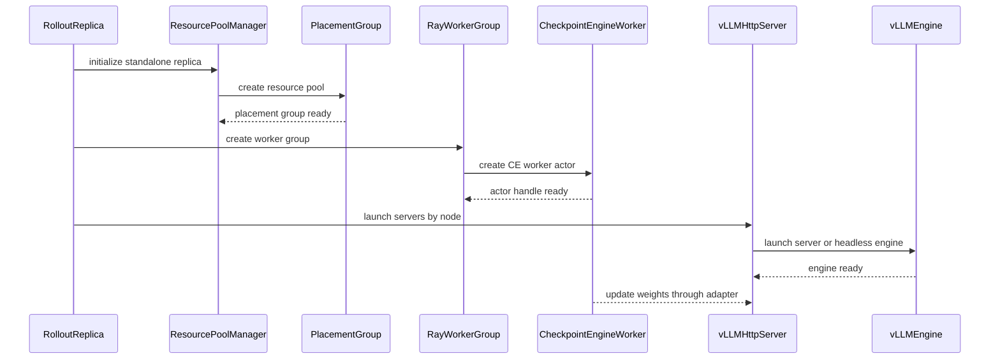

### 1.6 Native 创建结果和所有权

| 对象 | 创建者 | 绑定依据 | 生命周期所有者 |
| --- | --- | --- | --- |
| ResourcePool/PG | RolloutReplica.init_standalone() | 资源池规格、Ray 调度策略 | native replica / Ray |
| CE Worker actor | RayWorkerGroup | PG bundle、rank/world 环境 | native replica 的 workers |
| vLLM HTTP server actor | vLLMReplica.launch_servers() | CE Worker 的 node/GPU 映射 | native replica 的 servers |
| vLLM engine worker 进程 | vLLMHttpServer.launch_server() 内部 vLLM MP | server 的可见设备、node/rank 参数 | HTTP server runtime |
| endpoint/ServerAdapter | CE Worker + vLLM server | replica rank、Ray job、IPC/ZMQ 地址 | 当前 replica |

## 2. 扩展组件与职责

native 与 borrowed 均使用已有 `MultiTaskvLLMReplica(vLLMReplica)`，分别通过原生入口和新增借用入口初始化。资源输入使用普通字典，扩展集中在 `verl-multi-task` 的现有类中。

以下新增字段和方法均为待实现设计；标为原生或已有的能力直接复用。

### 2.1 组件扩展

| 已有组件及归属 | 本次扩展及用途 | 直接复用的行为 |
| --- | --- | --- |
| `MultiTaskFullyAsyncTaskRunner`，任务入口 Ray actor | 增加生命周期命令入口，通过 Rollouter 执行操作；通过 Trainer 处理 CE 变更；向 GS 返回元数据 | Rollouter、Trainer 的创建与句柄持有 |
| `MultiTaskFullyAsyncRollouter`，TaskRunner 创建的 Ray actor | 增加 `create_borrowed_replica(spec)`、`reclaim_replica(lease_id)`，调用本地 manager | manager 创建和 rollout 控制入口 |
| `MultiTaskLLMServerManager`，Rollouter 内的普通对象 | 管理本任务 lease 投影、创建记录和 replica；提供创建和回收接口边界 | replica 列表、server 管理和 LB actor 句柄 |
| `MultiTaskvLLMReplica`，manager 创建的普通对象 | 增加借用初始化、生命周期状态和 sleep/reclaim/destroy 预留接口，详见第 3 节 | 并行配置计算、CE 类选择、`launch_servers()`、请求控制接口 |
| `CheckpointEngineWorker`，RayWorkerGroup 创建的 Ray actor | borrowed 直接复用原生 Worker；现有 `MultiTaskCheckpointEngineWorker` 若保留只作为空子类/类型选择，不增加生命周期行为 | CE backend、ServerAdapter、Gloo 初始化以及 `execute_checkpoint_engine()` |
| `MultiTaskvLLMHttpServer`，replica 创建的 Ray actor | 保留 sleep/wake/shutdown 预留入口，创建阶段只负责启动 borrower server/engine | 原生 server、MP/headless engine 启动及请求控制 |
| `MultiTaskCheckpointEngineManager`，Trainer 内的普通对象 | 增加受同步 gate 保护的成员变更和清理入口，避免与权重同步交错 | 原生参数传输流程和列表注册能力 |
| `MultiTaskGlobalRequestLoadBalancer`，manager 持有的 Ray actor | 按需扩展摘流、移除和 READY 提交入口 | 原生路由、计数和 server 注册能力 |

### 2.2 所有权与并发边界

- 本地对象归属为 `TaskRunner → Rollouter → LLMServerManager → replica`；CE manager 位于 Trainer 内，由 Trainer 的入口更新，不能与 rollout manager 共用一把进程内锁。
- GS 维护跨任务的 `bundle_leases`/`claim_index` 权威账本；donor 的资源视图在任务注册或资源状态更新时由 TaskRunner 上报，borrower manager 只保存 GS 已授权 claims 的本地投影和创建/清理结果。跨任务只传 placement 和结果元数据，不传 donor CE/server handles。
- manager 的锁保护本任务状态转换。TaskRunner 的长时 `run()` 需支持并发/异步管理入口，并防止命令与启动、退出交错。
- PG 保留原创建者和原生命周期。borrower 持有引用不转移所有权；donor 删除 PG 或恢复用卡前，必须确认借用资源已实际清理，不能用 lease 到期代替清理确认。

### 2.3 GS 句柄边界

GS 只由 MultiTaskFullyAsyncTaskRunner 持有。GS 与 TaskRunner 互持句柄，GS 通过 TaskRunner 暴露的任务入口间接触发其他组件操作；Rollouter、LLMServerManager、Replica、Trainer、CE Manager 和 LB 均不保存 GS 句柄，也不直接访问 GS。

当前源码仍把 `group_scheduler` 作为参数继续传入 Rollouter、LLMServerManager 和 LB；这是现有 wiring 与目标边界的偏差。本次只修订设计文档，不修改代码。后续实现删除这三个组件的 GS 参数、字段和下传逻辑，由 TaskRunner 接收 GS 指令，并分别沿以下路径调用：

- `TaskRunner → Rollouter → LLMServerManager → replica/LB`：处理本任务推理资源与路由。
- `TaskRunner → Trainer → CheckpointEngineManager → CE Workers`：处理参数同步与 CE 成员变更。
- 完成结果沿原调用链返回 TaskRunner，再由 TaskRunner 回复 GS；其他组件不发现 GS，也不通过回调或全局变量间接保存 GS 句柄。

GS 与 TaskRunner 的双向句柄只用于任务边界通信。GS 接收 placement、lease、状态等元数据，不接收下层 replica、CE/server 或 LB 的句柄。

### 2.4 原生类、扩展类与运行时关系

下图同时表示三种关系：虚线箭头表示继承，实线箭头表示创建或持有，虚线带标签箭头表示通过 RPC 或句柄协作。native replica 和 borrowed replica 不对应两个不同的 Python 类，二者都由 `MultiTaskvLLMReplica` 表示，通过初始化入口和 `allocation_kind` 区分。

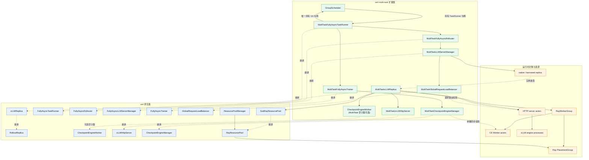

图中的关键边界如下：

- 图示为目标设计：GS 只与 TaskRunner 互持句柄，不连接 Rollouter、Trainer、manager、LB 或 replica；当前源码的 GS 下传偏差见第 2.3 节。
- `MultiTaskvLLMReplica` 是唯一的 replica 具体类。native 路径调用 `init_standalone()` 创建自己的 PG；borrowed 路径调用 `init_from_lease()` 包装 donor PG。
- `MultiTaskvLLMReplica` 的 `get_ray_class_with_init_args()` 直接选择原生 `CheckpointEngineWorker`；如果现有插件 wiring 仍选择 `MultiTaskCheckpointEngineWorker`，该类只能作为不增加行为的空子类。二者仍分别是 CE actor 和 HTTP server actor。
- HTTP server actor 在内部启动 vLLM engine 进程，因此 `MultiTaskvLLMHttpServer` 不等于 engine worker。
- `MultiTaskLLMServerManager` 持有 replica 和 LB 句柄；`MultiTaskCheckpointEngineManager` 位于 Trainer 内，是对 CE worker 的独立同步投影。二者不能当作同一个 Python manager。
- native 和 borrowed 共用以上类关系。borrowed 不接管 donor 的 CE actor、HTTP server 或 engine，只复用 donor PG/bundle 的调度位置并创建自己的运行时对象。

## 3. 扩展类的成员、方法与实现理由

本节只描述“原生 verl 仍保留什么、multi-task 为什么扩展什么、扩展方法怎样工作”。`[原生继承]` 表示直接复用 verl 的字段或方法；`[原生覆写]` 表示保留原生对外契约，但改变初始化或提交时机；`[新增]` 表示 multi-task 新增的状态或入口。所有新增接口都必须保持原生调用方能够理解的 `replica_rank`、`workers`、`servers`、`server_address` 等字段，避免为 borrowed replica 再造一套不兼容的对象模型。

本版本的资源模型是 **claim（容量声明）**，而不是“一个 bundle 只能属于一个 replica”。`max_colocate_count=M` 是一个 bundle 的逻辑容量；推荐新建 PG 时使用 `CPU=M、GPU=1`，每个 CE Worker 默认申请 `cpu_request=1、gpu_fraction=1/M`。因此同一 `(pg_id, bundle_index)` 可以出现多个不同 `claim_id`，但其 `gpu_fraction` 和 `cpu_request` 的累计值不能超过 bundle 容量。borrowed replica 可以从多个 PG、多个 donor replica 取得 claims，`world_size` 等于 claims 数量，因而允许 donor/borrower 的 world_size 不同以及碎片化 bundle。

### 3.0 字典和句柄的共同约定

扩展字段中的字典有明确的 key/value 结构。下列结构是组件之间传递的协议；Ray ActorHandle、PlacementGroup handle 和 Python 对象只保留在本地 manager/replica 中，不能序列化给 GS。

**Claim 记录（`claim: dict`）**

```python
{
    "claim_id": str,             # 全局唯一的容量声明 ID
    "lease_id": str,             # donor 授权的租约 ID
    "donor_task_id": str,
    "donor_replica_rank": int,   # donor 任务内稳定的 replica_rank
    "pg_id": str,
    "bundle_index": int,
    "node_id": str,
    "gpu_uuid": str,
    "local_gpu_index": int | None,
    "node_rank": int,
    "local_rank": int,
    "gpu_fraction": float,       # 该 Worker 在 bundle 上占用的 GPU 份额
    "cpu_request": float,        # 该 Worker 在 bundle 上占用的 CPU 份额
}
```

同一 bundle 的 `claim_id` 必须不同；`pg_id/bundle_index` 可以相同。`node_id/gpu_uuid` 用于校验实际设备和生成 `CUDA_VISIBLE_DEVICES`，不直接替代 Ray 的 PlacementGroup 调度键。

**Placement 规格（`spec: dict`）**

```python
{
    "operation_id": str,
    "lease_id": str,                 # borrower 侧本次 replica 的主租约；Rollouter 回收时使用
    "lease_ids": list[str],           # donor/source lease 列表；兼容旧 placement contract
    "borrower_task_id": str,
    "borrower_replica_id": str,       # [兼容字段] 外部不透明标识；任务内定位以 replica_rank 为准
    "replica_rank": int | None,      # 由 manager 分配；重试时可从已有 operation 记录恢复
    "claims": list[Claim],            # 外部旧名称 selected_slots 进入 manager 后归一化为 claims
    "world_size": int,
    "max_colocate_count": int,
    "expires_at": float,
    "placement_epoch": int,
}
```

`claims` 是唯一的资源真相；`world_size` 只是校验值，必须等于 `len(claims)`。`lease_ids` 允许一个 borrowed replica 由多个 donor/source lease 拼成，而顶层 `lease_id` 是 borrower 对这次完整运行时借用的主租约。spec 中不包含 actor handles、Ray worker group 或 GS 句柄。

第 4、5 节为了保持已有 placement contract，仍使用 `selected_slots` 这个字段名。实现入口必须先执行 `selected_slots -> claims` 的归一化；归一化后，manager、replica 和 CE manager 只使用同一份 claim list，不能同时维护两份可变列表。

**跨组件返回值**统一使用可序列化的 receipt：`{"operation_id", "lease_id(s)", "replica_rank", "state", "released", "error"}`。成功返回 `released=True` 的前提是实际 Actor、server 和 claim 都已清理；仅收到超时或取消不能伪造成功。

这里需要区分两种容易被同名字段混淆的租约标识：

- Rollouter 的 `reclaim_replica(lease_id)` 使用的是**本次 borrowed replica 的 borrower lease**。它标识一个完整的借用生命周期，覆盖该 replica 的全部 claims，因此可作为回收、幂等重试和过期校验的主键。
- `Claim` 中的 `lease_id` 表示 donor 对某个 claim 的授权。一个碎片化 replica 可能由多个 donor lease 组成，因此 spec 需要同时保存 `lease_ids`。实现时建议将 Claim 字段内部重命名为 `source_lease_id`，或至少在边界归一化时明确它不是 Rollouter 回收接口的主 lease。

如果暂时不能改字段名，manager 必须在 `create_borrowed_replica()` 登记时建立 `borrower_lease_id -> source_lease_ids -> claim_ids` 的映射。Rollouter 只把 borrower lease 传给回收入口，manager 再根据映射一次性释放所有 source claims；不能把其中一个 donor lease 当成整个 replica 的回收依据。

**`lease_id`、`claim_id` 和 `replica_rank` 的区别**

| 标识 | 表示什么 | 主要用途 |
| --- | --- | --- |
| `lease_id` | 一次资源借用授权；关联 borrower、资源范围、有效期和归还状态 | 校验借用是否有效，组织创建、回收和重试 |
| `claim_id` | 一个 bundle 上的一笔资源份额占用；关联 PG、bundle、GPU fraction、CPU 数量和所属 source lease | 逐笔预留、容量记账、冲突检查和释放 |
| `replica_rank` | 一个任务内具体 replica 的稳定编号 | 定位运行时对象；跨任务使用 `(task_id, replica_rank)` |

一个 lease 可以覆盖多个 claims，一个 replica 通常也对应多个 claims。`claim_id` 不代表整个 replica，也不代表物理 GPU；不同借用可以在同一 bundle 上拥有不同 claim，累计份额仍须受 bundle 容量约束。fractional GPU 是 Ray 记账份额，不代表物理显存隔离。

例如，borrower 借用两张卡创建一个两卡 replica：

```text
borrower 主 lease：L1；borrower replica_rank：7
  donor source lease：S1
    claim C1：PG-A / bundle 0，GPU fraction=0.25，CPU=该 claim 的申请量
    claim C2：PG-A / bundle 3，GPU fraction=0.25，CPU=该 claim 的申请量
```

回收 L1 时，先安全退出并销毁 replica 7，再逐笔确认 C1、C2 的资源已释放，恢复相应容量。跨 donor 时，L1 可以汇总多个 source leases，每个 claim 仍关联自己的资源来源。lease 到期不等于 claims 已释放；同一 claim 的重复释放不能重复恢复容量。

这些 lease、claim 和操作表是插件新增的设计，不是 Ray 或 verl 自动提供的租约机制；有效期、撤销和实际释放确认需要由扩展组件维护。

### 3.1 `MultiTaskFullyAsyncTaskRunner`

父类是 `FullyAsyncTaskRunner`，它是任务边界上的 Ray Actor。GS 只与这个对象通信，因此只有该类持有 `group_scheduler`；Trainer、Rollouter、LLMServerManager 和 CE Worker 都不保存 GS 句柄。

**原生成员与方法**

```python
running: bool                         # [原生继承] 训练循环是否运行
components: dict                      # [原生继承] 组件名到本任务对象/句柄的映射；key 是 tokenizer/trainer/rollouter 等名称
shutdown_event: threading.Event       # [原生继承] 训练入口退出事件

def _initialize_components(self, config: DictConfig) -> None: ...  # [原生继承] 创建本任务组件

def _setup_hybrid_worker_group(self, config: DictConfig) -> None: ...  # [原生继承] 按原生配置创建 hybrid WorkerGroup

def _run_training_loop(self) -> None: ...  # [原生继承] 启动训练和 rollout 循环
```

`components` 的 value 是同一 TaskRunner 内可直接调用的对象或 Ray handle；它不应放置全局共享表。原生循环仍负责训练，扩展只增加生命周期命令入口。

**扩展成员与方法**

```python
group_scheduler: ActorHandle | None       # [新增] 本任务唯一的 GS 句柄；None 表示未启用全局调度

def __init__(self) -> None: ...           # [原生覆写] 初始化父类状态并把 group_scheduler 置空

def run(self, config: DictConfig) -> None: ...  # [原生覆写]

def _create_rollouter(self, config: DictConfig) -> None: ...  # [原生覆写] 创建 MultiTaskFullyAsyncRollouter 并写入 components
def _create_trainer(self, config: DictConfig) -> None: ...    # [原生覆写] 创建 MultiTaskFullyAsyncTrainer 并写入 components

async def execute_replica_operation(
    self,
    operation: str,
    request: dict,
) -> dict: ...                             # [新增] 执行一次任务内 replica 事务

async def publish_resource_view(self) -> dict: ...  # [新增] 从本地 manager/replica 汇总 placement metadata 并上报 GS
```

`run()` 的扩展理由是建立任务注册边界。步骤是：读取 task id → 获取 GS 句柄 → 调用 GS 的 `attach_task(task_id, self)` → 执行原生组件初始化 → 调用 `publish_resource_view()` 上报 native PG/bundle/node/GPU 元数据 → 进入训练 → 在 `finally` 中调用 `detach_task`。注册失败不进入训练，注销必须在异常和正常退出两条路径执行。资源状态发生变化时，由同一 TaskRunner 再次发布新视图；GS 据此更新自己的全局 `bundle_leases`，而不是在 borrowed 创建请求到达时让 manager 临时导出资源。

`_create_rollouter()` 和 `_create_trainer()` 只替换工厂选择：保留父类的 tokenizer、role mapping、resource pool 和 worker group 参数，分别实例化本设计的 Rollouter/Trainer，并把对象写入 `components`。它们扩展的原因是让原生训练循环拿到扩展 manager/CE manager；不把 GS 句柄继续作为构造参数向下传递。

`execute_replica_operation()` 是 GS 唯一能够触发的任务内入口。它按 `operation` 分派：borrowed `create` 串联 runtime 创建、Trainer 注册/bootstrap 和 LB READY；borrowed `reclaim/destroy` 与 native `sleep/wake` 只校验请求并转发到预留接口，不在 TaskRunner 中编排摘流、请求处理、CE 注销或物理清理。它校验租约和目标、检查组件就绪、等待各本地入口返回并组装可序列化 receipt，不把 CE manager 或 server handle 返回给 GS。由于原生 `run()` 可能长期占用 actor 执行上下文，落地时需保证管理方法可以被调度到；这属于 TaskRunner 的并发入口改造，不引入 Coordinator。

`publish_resource_view()` 只在任务注册和 donor 资源状态改变时使用：它从本地已存在的 replica/PG 元数据生成可序列化视图，交给 GS 更新全局候选资源；它不生成 `selected_slots`、不创建 lease，也不参与某一次 borrowed replica 创建。borrowed 创建直接消费 GS 已经下发的 `spec.selected_slots`。

### 3.2 `MultiTaskFullyAsyncTrainer`

父类是 `FullyAsyncTrainer`。Trainer 生成训练权重并在本进程拥有 CE manager；它不持有 GS，也不直接调用 LB。

**原生成员与方法**

```python
config: DictConfig                          # [原生继承] 训练配置
actor_wg: RayWorkerGroup                    # [原生继承] 训练侧 worker 集合
rollouter: ActorHandle                      # [原生继承] 本任务 Rollouter 句柄
checkpoint_manager: CheckpointEngineManager # [原生继承] 本进程 CE manager
current_param_version: int                  # [原生继承] 已产生的参数版本
parameter_snapshot_gate: asyncio.Lock       # [新增] 保护参数快照与版本读取的一致性；bootstrap 在此门内只读取一次版本

async def init_workers(self) -> None: ...   # [原生继承] 创建训练 workers
async def set_rollouter(self, rollouter: ActorHandle) -> None: ...  # [原生继承] 设置 Rollouter 并初始化 CE
async def fit(self) -> None: ...            # [原生继承] 训练循环
async def fit_step(self, batch_dict: dict | None = None) -> None: ...  # [原生继承] 单步训练
async def _fit_update_weights(self) -> dict | None: ...  # [原生继承] 按原生路径同步权重
```

**扩展成员与方法**

```python
async def _setup_checkpoint_manager(self) -> None: ...
    # [原生覆写] 选择 MultiTaskCheckpointEngineManager，但保留原生参数同步入口

async def register_replica(self, replica_rank: int) -> None: ...
    # [新增] 将 borrower worker 投影注册到本地 CE effective set

async def bootstrap_replica(
    self,
    replica_rank: int,
) -> dict: ...
    # [新增] 在安全快照点读取一次 current_param_version，并为目标 replica 执行 target-only bootstrap

async def unregister_replica(self, replica_rank: int) -> None: ...
    # [新增] 在同步 gate 内移除目标并清理本轮传输状态
```

`_setup_checkpoint_manager()` 的步骤是从 Rollouter 获取 `replica` 投影 → 构造扩展 CE manager → 保持原生 `fit_step/_fit_update_weights` 调用链。扩展的目的只是让后续 `register_replica` 和 `bootstrap_replica` 能更新同一个 CE manager，不复制第二套参数同步算法。

`register_replica()` 先通过 Rollouter 查询 `replica_rank` 对应的 worker handles 和 `world_size` → 在 CE manager 的 `sync_gate` 内幂等加入 replica registry，并标记为 pending；pending 成员不会被普通全成员同步选入。它不立即宣告 LB READY，也不传递 GS 句柄；注册成功后必须紧接着调用 `bootstrap_replica()`，而不是等待下一个周期性的全成员同步。

`bootstrap_replica()` 由 Trainer 在确认训练侧权重处于稳定快照后调用 CE manager 的 target-only bootstrap 入口。它只把当前 borrower 的训练 workers 和目标 borrowed workers 放入本次临时通信域，完成权重加载、版本确认和 backend 清理；既不把所有现有 rollout replica 拉进来，也不把一次完整的 `update_weights()` 插入当前训练 step。它返回目标版本、通信域清理结果和 server adapter 的加载结果，只有成功结果才能继续向 LB 提交 READY。

**版本参数决策：** Trainer 对外只暴露 `bootstrap_replica(replica_rank)`，不要求调用方传 `target_version`。方法在 `parameter_snapshot_gate` 内读取一次 `current_param_version` 并冻结为本次操作的 `V`。CE manager 的内部实现仍接收名为 `snapshot_version` 的不可变值；这是跨组件传递“本次到底发送哪一个快照”的边界数据，不是再次查询“当前最新版本”。如果连这个内部值也删除，就必须让 CE manager 持有 Trainer 的版本提供器或复制版本状态，反而增加耦合并重新引入竞态。

`unregister_replica()` 等待当前同步的 `finalize()` 返回 → 以稳定的 `replica_rank` 从 effective set 删除 → 清理该 replica 的版本记录→ 返回。它只完成 CE 投影注销，不负责销毁 worker/server；后续物理清理由预留的 `reclaim`/`destroy` 接口承接。Trainer 保存的是本地 CE 对象引用；不能用一次新的 Ray 反序列化对象进行 Python 身份比较。

#### Trainer 与 CE manager 为什么各有注册/注销方法

两层方法不是重复实现，而是“任务编排入口”和“参数同步实现”的分层：

| 层次 | 方法职责 | 持有的对象 | 不负责的事情 |
|---|---|---|---|
| `MultiTaskFullyAsyncTrainer` | 对 TaskRunner/Rollouter 暴露任务级生命周期入口；按 `replica_rank` 找到当前 replica 投影，校验操作时机，统一处理异常和返回结果 | `rollouter` 句柄、`checkpoint_manager` 对象、训练循环状态 | 不直接修改 backend 的 process group，不自己维护 `replicas` effective set |
| `MultiTaskCheckpointEngineManager` | 在 `sync_gate` 内真正加入/删除 CE effective set，并使下一次原生同步使用新的 worker 列表 | `replicas` 列表、backend、当前同步快照和临时通信状态 | 不持有 GS、LB，也不决定 AgentLoop 何时摘流 |

因此，外部流程只能调用 Trainer 的 `register_replica()`、`bootstrap_replica()` 和 `unregister_replica()`；Trainer 再调用 CE manager 的对应方法。注册的实际步骤是：Trainer 接收请求 → 向 Rollouter 查询当前 replica 投影 → 把投影交给 CE manager → CE manager 在 gate 内校验并提交 → Trainer 在最早安全快照点启动 target-only bootstrap → 返回已确认版本。注销只负责在同步 gate 内更新 CE 成员投影和传输状态；是否以及何时销毁 server/worker，留待后续生命周期接口。这样可以防止外部组件在参数同步仍持有旧 worker handle 时直接销毁 actor。

#### `replica_rank` 的含义和来源

`replica_rank` 是**任务内 replica 的稳定身份编号**，用于在 CE manager、Rollouter、server adapter 和版本表之间关联同一个 replica。它不是：

- replica 内部某张卡的 `rank`；
- `node_rank` 或 `local_rank`；
- PG 的 `bundle_index`；
- 全局 GS 分配的 GPU 编号。

一个 replica 内部仍有自己的 `worker rank`（通常是 `0..world_size-1`）；`replica_rank` 位于更外层，两个概念不能混用。native 初始 replica 使用原生的 `start_rank + index` 编号；动态 borrowed replica 使用 manager 的单调分配器，从初始编号之后继续递增。因此它在本设计中是“单调递增的任务内身份号”，但不保证当前 active replica 的编号连续。

因此，原生 verl 的现有实现只是按初始化批次计算编号，并没有一个处理动态销毁和重建的全局自增注册表；“动态创建时单调递增且销毁后不复用”是本扩展在 `MultiTaskLLMServerManager` 中补充的规则。

Trainer 的接口只接收一个整数，是为了避免把包含 Ray handle 的 replica 对象跨 TaskRunner、Rollouter 和 Trainer 反复序列化。Trainer 之所以仍要从 Rollouter 获取 replica，是因为 Rollouter 才拥有当前 manager 和最新的 `workers`、`world_size`、server 状态：

1. Trainer 根据 `replica_rank` 请求 Rollouter 定位当前对象；
2. Rollouter 在本地 `MultiTaskLLMServerManager` 中读取 replica，并返回只供本任务内部使用的投影；
3. Trainer 将投影中的 `workers`、`world_size` 和版本信息交给 CE manager。

如果调用方已经知道正确的 `replica_rank`，当然可以直接把这个整数传给 Trainer；但不能绕过 Rollouter 直接从 GS 或调用方取得一份 replica 对象。那样无法保证对象仍然属于当前 manager，也可能拿到已回收 replica 的旧 worker handles。Rollouter 查询是为了取得权威的当前投影，而不是因为 `replica_rank` 本身只能由 Rollouter 生成。

销毁时不压缩编号，也不把编号返还给下一个 borrowed replica。例如初始 replica 为 `[0, 1]`，新建 borrowed 得到 `2`，销毁 `0` 后 active 集合是 `[1, 2]`，下一次创建得到 `3`。这个空洞不会造成通信 rank 混乱：当前 CE 同步会把 active replica 快照重新映射为连续的传输成员，例如 `{1: 0, 2: 1}`；replica 内部的 worker rank 也始终从 `0` 到 `world_size - 1` 重新建立。`replica_rank` 只用于身份、server/adapter 命名、版本表和诊断标签。

不复用已销毁的 `replica_rank` 是 MVP 的安全规则，原因是 Ray named actor、IPC/ZMQ endpoint、指标标签和延迟 RPC 可能在销毁后仍短暂存在。只有未来实现了带 generation/epoch 的全链路命名和消息校验，才可以考虑回收编号；当前不做 rank compaction，也不要求 active replica 的编号连续。

因此，动态路径不能写成 `rollout_replicas[replica_rank]`，也不能用 `replica_rank * world_size` 推导 borrowed 的 bundle。当前先遍历原生 `rollout_replicas`，按对象的 `replica_rank` 查找；尚未完成创建的 borrowed 从 `borrowed_operations` 获取本地引用。列表位置只用于遍历和展示，不额外维护编号注册表。后续只有测得查询瓶颈时再增加派生索引。

#### 版本记录的含义

`last_synced_versions: dict[int, int]` 位于 CE manager 中，key 是 `replica_rank`，value 是该 replica 已确认加载完成的训练参数版本。例如 `{3: 108, 7: 107}` 表示 replica 3 已加载版本 108，replica 7 仍停在版本 107。它与 Trainer 的 `current_param_version` 不同：后者表示训练侧刚产生的全局版本，前者表示每个接收端实际完成加载的版本。

版本记录的用途有四个：

1. **判断 bootstrap 是否完成**：新 borrowed replica 只有在记录为当前版本后才能进入 LB READY；
2. **检测漏同步或陈旧 replica**：下一次同步前可发现某个 replica 落后，避免把旧 server 当作可服务实例；
3. **辅助重试判断**：记录已经确认的版本，但不能仅凭版本号跳过 collective 中的某个接收端；是否重试仍由完整同步和成员规则决定；
4. **辅助回收和故障定位**：注销时删除对应 key，失败时保留版本和错误信息，能够判断失败发生在建组、传输还是 server 加载阶段。

这里的版本记录只表示“参数加载确认”，不表示请求路由 READY，也不表示 replica 正在使用哪个 LB 版本；后两者由 Rollouter/LB 单独管理。


### 3.3 `MultiTaskCheckpointEngineManager`

父类为 `CheckpointEngineManager`，运行在 Trainer 进程中，不持有 GS 或 LB。

**原生成员与方法**

```python
config: CheckpointEngineConfig          # [原生继承] CE backend 配置
backend: str                            # [原生继承] backend 名称
backend_cls: type[CheckpointEngine]     # [原生继承] backend 类
actor_wg: RayWorkerGroup                # [原生继承] 训练侧权重生产者
replicas: list[RolloutReplica]          # [原生继承] 本轮 effective replica 投影

def build_process_group(self, rollout: RayWorkerGroup) -> None: ...  # [原生继承] 建立本轮传输域

def add_replicas(self, replicas: list[RolloutReplica]) -> None: ...  # [原生继承] 更新成员列表

def remove_replicas(self, replicas: list[RolloutReplica]) -> None: ...
    # [原生继承] 更新成员列表；不自动保证旧 backend 已清理
```

**扩展成员与方法**

```python
sync_gate: asyncio.Lock                    # [新增] 参数同步和成员变更的互斥门
sync_state: str                            # [新增] IDLE/SYNCING/BLOCKED
inflight_replicas: list[RolloutReplica]    # [新增] 当前同步固定的成员快照
last_synced_versions: dict[int, int]       # [新增] key=replica_rank，value=最近一次确认加载完成的参数版本；缺 key 表示尚未确认
pending_bootstrap: dict[int, int | None]   # [新增] key=replica_rank，value=待追平版本；None 表示在最早安全快照点绑定当前版本，此表用于bootstrap_replica方法的参数

def __init__(self, config: CheckpointEngineConfig, actor_wg: RayWorkerGroup, replicas: list[RolloutReplica]) -> None: ...  # [原生覆写]

async def update_weights(self, global_steps: int | None = None) -> dict: ...  # [原生覆写]
async def register_replica(self, replica: RolloutReplica) -> None: ...         # [新增]
async def bootstrap_replica(
    self,
    replica: RolloutReplica,
    snapshot_version: int,
) -> dict: ...                                                   # [新增·内部] Trainer 已冻结的一次性版本快照
async def unregister_replica(self, replica: RolloutReplica) -> None: ...       # [新增]
```

`last_synced_versions` 的 key 是稳定的 `replica_rank`，value 是该 replica 已完成加载的训练参数版本；`pending_bootstrap` 的 key 也是 `replica_rank`，value 是必须追平的目标版本；`None` 表示由 Trainer 在最早安全快照点读取并绑定当前稳定版本。它不等于 LB 的 READY，因为 READY 还要求请求路由和 engine 健康。

`update_weights()` 在整个原生同步期间持有 `sync_gate`：固定已完成 bootstrap 的 `inflight_replicas` 快照（过滤 `pending_bootstrap`）→ 中断或释放需要的 KV → 收集每个 replica 的 workers → 调原生 `prepare/build/init/update/finalize` → 恢复 KV/生成 → 写入版本。失败时状态变为 BLOCKED，保留快照供清理；不能只在修改 `replicas` 列表的瞬间加锁。

`register_replica()` 在 gate 内校验 rank 唯一、worker 数与 world_size 一致，再加入 replica registry 并写入 `pending_bootstrap[replica_rank]`；pending 成员只允许被同一事务的 target-only bootstrap 选中，不会被普通全成员同步选入。首次注册不向 `last_synced_versions` 写入未经确认的版本，也不让 LB 路由。注册成功后由 Trainer 在最早可用的训练权重稳定点调用 `bootstrap_replica()`；不能把请求拖到下一个周期性的全成员同步。相同实例重复注册保留已有确认记录，不清空或覆盖；同 rank 对应不同 Worker handles 时拒绝注册。

`bootstrap_replica()` 是新增的 target-only 同步入口：Trainer 先在安全快照点捕获一次 `current_param_version`，再把冻结的版本值传给 CE manager。CE manager 在 `sync_gate` 内固定目标 `replica` 和该版本，构造只包含训练 workers 与目标 borrowed workers 的临时 `RayWorkerGroup`，复用原生 `prepare → build_topology → init_process_group → actor send → CE receive/ServerAdapter.load → finalize`，成功后写入 `last_synced_versions` 并删除 `pending_bootstrap`。它不能直接调用原生 `update_weights()`，因为原生入口会对整个 `self.replicas` 执行 `abort_replicas()`，把当前正在服务的其他 replica 也纳入一次全量切换；target-only 路径只影响新 replica。

该方法内部使用的冻结版本必须来自 Trainer 的参数快照，不能在传输中途重新读取不断变化的 `current_param_version`。`target_version` 不再是 Trainer 对外 API 的入参；内部参数命名为 `snapshot_version`，由 Trainer 在 `parameter_snapshot_gate` 内捕获后传给 CE manager。bootstrap 期间需要同时满足 CE gate 和训练侧的 `parameter_snapshot_gate`：前者防止正常同步或成员变更并发，后者防止 optimizer/参数 shard 正在写入。若当前处于不可打断的 optimizer collective，方法应等待该 collective 完成后立即执行，而不是等下一个正常同步节点；若在本次 lease/rollout 窗口内仍拿不到稳定快照，则返回未就绪并由上层回收，不得用猜测版本提交 READY。

`unregister_replica()` 在 gate 内等待旧同步结束 → 确认本轮 `finalize()` 是否已经成功 → 从列表和版本表删除目标 → 返回


#### `sync_state` 的三个状态

`sync_state` 描述 CE manager 当前是否可以接受成员变更：

| 状态      | 含义                                                         | 允许的操作                                                   | 进入/退出条件                                                |
| --------- | ------------------------------------------------------------ | ------------------------------------------------------------ | ------------------------------------------------------------ |
| `IDLE`    | 没有正在执行的参数同步，当前 effective set 稳定              | 可以在 `sync_gate` 内注册或注销 replica，也可以开始下一次同步 | 初始化完成、一次同步或清理成功后进入                         |
| `SYNCING` | `update_weights()` 已固定本次参与者并正在执行 `prepare → build → init → update → finalize` | 不允许改变本次参与者；注册/注销请求等待 gate 释放            | `update_weights()` 获取 gate 后设置；整个同步收尾后回到 `IDLE` |
| `BLOCKED` | 上一次同步失败，或通信域/Worker 清理尚未确认完成             | 暂停新的注册、注销和 LB READY；只允许执行故障清理、重建或人工恢复 | 同步异常、部分 finalize 失败时进入；清理并重新建立一致状态后才能回到 `IDLE` |

`sync_gate` 是互斥锁，`sync_state` 是可观测的状态机。仅有锁而没有状态，外部无法区分“正在等待正常同步”和“上一次同步已失败”；仅有状态而没有锁，又不能阻止两个异步调用同时修改 effective set。两者必须配合使用。


#### 为什么维护每个 replica 的参数版本

`last_synced_versions: dict[int, int]` 位于 CE manager 中，key 是 `replica_rank`，value 是该 replica 已确认加载完成的训练参数版本。例如 `{3: 108, 7: 107}` 表示 replica 3 已加载版本 108，replica 7 仍停在版本 107。它与 Trainer 的 `current_param_version` 不同：后者表示训练侧刚产生的全局版本，前者表示每个接收端实际完成加载的版本。`last_synced_versions` 是 CE manager 的接收端确认表，不是训练侧的版本表。一次同步只有在 CE Worker 和 server adapter 都返回成功后才更新该值。

动态 replica 必须维护这张表，因为不同 replica 可能在不同时间加入、回收或同步失败：

1. 新 borrowed replica 创建时，需要判断它是否完成当前版本的 bootstrap，未完成就不能加入 LB READY；
2. 某个 replica 在同步失败或暂时落后时，可以与 `current_param_version` 比较，识别陈旧服务；
3. 重试同一个版本时，可据此检查过去的确认结果；但版本号本身不保证幂等，不能据此让某个 Worker 单独跳过已建立 collective 中的传输，否则可能使其他参与者一直等待；
4. 注销或回收时，可以删除对应版本记录，避免旧 rank 的版本状态被误用于新对象。

因此它与 CE manager 直接相关：CE manager 在 `update_weights()` 的成功收尾处写入版本，在 `unregister_replica()` 的 gate 内删除版本。它不负责决定 LB 路由，但为“CE 已同步”和“server 可服务”之间提供可验证的前置条件。版本记录使用 `replica_rank` 作为 key，是因为该编号在 replica 生命周期内稳定；它不使用 Worker 的临时通信 rank，后者会在每次重建通信域时变化。

#### bootstrap 与注册、同步、注销的版本规则

**bootstrap 指新 replica 首次加载 borrower 当前训练权重并确认可供推理的过程。** 创建 CE Worker、HTTP server 和 engine 只完成 `RUNTIME_READY`；engine 可能加载了磁盘初始模型或 dummy 权重，并不因此拥有本次训练的参数版本。

本方案明确选择“**注册后在最早安全快照点立即 target-only bootstrap**”，不选择“等到下一次周期性的全成员参数同步”。这里的“立即”不是在任意 Ray 回调或 optimizer collective 中途强行插入，而是：borrowed runtime 达到 `RUNTIME_READY` 后，Trainer 取得当前稳定的 borrower 权重版本，在同一 rollout 窗口内建立一次临时通信域并完成目标 replica 的加载。这样才能让 borrowed replica 覆盖当前长尾空泡；如果等下一个正常同步节点，当前窗口很可能已经结束，借卡只剩创建成本而没有有效服务时间。

target-only bootstrap 不等于对全体 replica 立即执行一次原生 `update_weights()`。它需要单独固定训练侧权重快照，并建立一个**短生命周期、仅服务本次 bootstrap 的通信组**；完成 `finalize()` 后立即销毁。该路径增加一次通信域建立和一次完整权重传输的开销，也需要处理显存峰值、NCCL/NIXL 初始化失败和与正常同步的串行化，但它不会中断已经在服务的其他 replica，也不会把全量 `abort_replicas()` 引入当前 rollout。实现上仍复用原生 backend、`CheckpointEngineWorker` 和 `ServerAdapter` 的传输原语，只新增 CE manager 的 target-only 编排入口，因此比复制一套传输协议可控。

只有在当前训练侧参数不再被 optimizer 修改、且正常 `update_weights()` 没有持有 `sync_gate` 时才能启动 bootstrap。若此刻正在进行不可打断的 optimizer collective，等待该 collective 返回后立即重试；不能把“安全等待”扩大成等待下一个正常同步周期。若在本次 lease/rollout 窗口内始终拿不到稳定快照，必须取消创建或保持不可服务并回收，不能用未确认的版本强行进入 READY。

因此，bootstrap 采用“**同窗口、最早安全点、目标单独同步**”的折中：延迟足够低以覆盖长尾空泡，通信影响限定在新 replica，且保留原生同步 backend 的实现。下一个正常 `update_weights()` 仍会把已经 `WEIGHTS_READY` 的 borrowed replica 纳入全成员同步，使它继续追随 borrower 的后续参数版本。

bootstrap 复用原生权重传输原语，但不复用原生 `update_weights()` 的全成员编排，也不增加训练 step。

本方案保留 `last_synced_versions: dict[int, int]`，**缺少 key 表示尚无确认版本**，不填 `0`、`-1`、目标版本或推测值。具体时点如下：

| 操作/时点 | CE 成员与版本表如何处理 | 是否允许新 replica 进入 LB |
| --- | --- | --- |
| 新 replica `register_replica(r)` | 加入 `replicas` registry 并写入 pending，版本表暂不新增 `r.replica_rank`；普通全成员同步过滤 pending | 否；注册只表示等待 target-only bootstrap |
| 同一实例重复注册 | 幂等返回，保留已有的确认版本 | 不因此改变路由状态 |
| target-only `bootstrap_replica(r, snapshot_version=V)` 完整成功 | 只对目标写入 `last_synced_versions[r.replica_rank] = V`，删除目标 pending 标记，并将结果传回 serving version 投影 | 还需检查健康、租约和任务要求的 serving version |
| 后续全成员 `update_weights(global_steps=V)` 完整成功 | 对本轮所有确认参与者写入 `last_synced_versions[r.replica_rank] = V`，保持 borrowed 与 borrower 的版本追随 | 已完成 bootstrap 且健康的 replica 可以继续保持 READY |
| 同步失败或加载结果不确定 | 不写入目标 `V`，进入 `BLOCKED`；可能已被部分覆盖的 replica 不能以旧记录证明当前 engine 权重有效，须使其确认记录失效并重新确认 | 否 |
| `unregister_replica(r)` 成功 | 在 gate 内等待旧同步退出、移出成员，再执行 `last_synced_versions.pop(r.replica_rank, None)` | 不再具备本 manager 的同步确认 |

例如目标版本为 `108`，新 replica 编号为 `7`：

```text
创建完成：        RUNTIME_READY，版本表没有 key 7
register(7)：     已加入 CE，版本表仍没有 key 7
bootstrap(108)：  安全同步点发送版本 108，engine 加载并完成同步收尾
同步成功：        last_synced_versions[7] = 108
服务条件确认：    再由上层提交 LB READY
unregister(7)：   等待旧同步完成并移除成员，删除 key 7
```

因此顺序必须是 **先注册 CE 成员 → bootstrap → 确认版本 → LB READY**。bootstrap 的目标 `V` 要由 Trainer 在安全同步点读取一次并冻结；CE gate 只防止成员与同步交错，不能代替训练侧防止优化器并发修改权重的边界。异步训练继续推进时，上层应按任务约定的 serving version 校验，不能在同步完成时读取一个更大的 Trainer 版本再填入记录。对外调用不需要传版本参数，但内部传输和确认记录必须使用明确的冻结整数版本。

`last_synced_versions` 确认的是 **CE 接收并经 adapter 加载到 engine** 的结果，不仅是 CE Worker 收到数据。`MultiTaskvLLMReplica.serving_version` 是该结果提供给 Rollouter/LLM manager 的投影，不应独立猜测版本；跨 Actor 的 replica 副本不会自动共享字段更新，必须显式传递确认结果。

如果重新注册的是已有权重的实例，理论上可以导入已验证的版本；但必须确认是同一运行时实例、权重没有在休眠/失败中丢失，而且版本来自真实的加载完成结果。仅复制序列化对象的 `serving_version` 或 Trainer 的版本号不构成确认。当前简化方案在正式注销时删除记录，重新加入后仍通过一次成功同步确认；不增加注册时自动导入旧版本的分支。相同实例未注销时的重复注册则保留原记录。

`unregister_replica()` 删除的是 manager 的确认记录，不会清空 engine 权重或销毁 Actor；物理 sleep/destroy 由后续生命周期操作负责。正常同步已经成功 `finalize()` 后，注销不再重复执行 backend 清理。

#### `inflight_replicas` 保存什么以及为什么需要它

`replicas` 是长期的、可变的 registry；只有不在 `pending_bootstrap` 中的成员才构成普通同步的 effective set。`inflight_replicas` 是一次 CE 操作开始时固定的参与者快照。对 target-only bootstrap，它只包含目标 borrowed replica（以及由该操作固定的 borrower 训练发送端）；对全成员 `update_weights()`，它包含已经完成 bootstrap、runtime 可参与同步的 native/borrowed replica。尚未完成 bootstrap 的新 replica 不能被误放进普通服务路由，但必须出现在自己的 target-only 快照中，否则它永远无法接收第一轮权重。仍在 `CREATING`、已从 CE 注销或已销毁的对象不参与。LB 的 `commit_remove` 只改变路由，不能代替 CE 注销或单独决定 CE 快照成员。

快照中的每个 `RolloutReplica` 至少需要冻结以下信息：

```python
{
    "replica_rank": int,                 # 稳定身份，用于版本和错误定位
    "workers": list[ActorHandle],       # 本次传输实际访问的 CE Worker
    "world_size": int,                  # 本 replica 的 Worker 数
    "worker_rank_map": dict[int, int],  # replica 内 rank 到本次 backend rank 的映射
    "server_handles": list[ActorHandle],# 同步前后执行 abort/KV 恢复所需
    "serving_version": int | None,      # server 当前版本的诊断值
    "runtime_state": str,               # 开始同步时的状态
    "claim_ids": list[str],             # borrowed 的资源定位；native 可为空
}
```

这里的字典是快照投影：key 是字段名，value 是开始同步时的值；实际实现也可以继续保存 `RolloutReplica` 对象，但必须把上述字段视为不可变快照，不能在同步过程中重新读取可变的 `workers` 列表。

维护快照有三个目的：

1. **固定通信参与者**：`prepare/build/init/update/finalize` 的所有阶段使用同一批 Worker，注册或注销请求只能等待下一轮；
2. **防止旧句柄失效**：如果某个 replica 在同步中失败，manager 可以根据快照精确找到它的 Worker、server 和 claim，完成 abort 或 backend 清理；
3. **支持版本和错误定位**：以快照中的 `replica_rank`、`serving_version` 和 `claim_ids` 报告哪一个接收端失败，而不是只得到一个整体同步失败。

同步成功后，快照被丢弃，长期 `replicas` 列表保留；target-only bootstrap 成功时只清除目标 pending 标记，全成员同步成功时更新本轮所有成员的版本。同步失败时快照暂时保留在 `BLOCKED` 状态，直到旧通信域和相关 Worker 的清理结果确认。这样 `inflight_replicas` 不是第二份长期注册表，而是一次同步事务的参与者和回滚依据。


### 3.3 `MultiTaskFullyAsyncRollouter`

父类是 `FullyAsyncRollouter`，是 AgentLoop 的任务内入口，持有本任务的 `MultiTaskLLMServerManager`。

**原生成员与方法**

```python
config: DictConfig                                      # [原生继承] rollout 配置
tokenizer: Any                                          # [原生继承] tokenizer
processor: Any | None                                   # [原生继承] 多模态 processor
llm_server_manager: FullyAsyncLLMServerManager          # [原生继承] replica/server manager
async_rollout_manager: FullyAsyncAgentLoopManager       # [原生继承] AgentLoop 调度器

async def init_workers(self) -> None: ...               # [原生继承] 初始化推理资源
async def fit(self) -> None: ...                        # [原生继承] 运行采样循环
def get_replicas(self) -> list[RolloutReplica]: ...     # [原生继承] 返回 CE 所需的 replica 投影
def set_hybrid_worker_group(self, worker_group: RayWorkerGroup) -> None: ...  # [原生继承]
def get_hybrid_worker_group(self) -> RayWorkerGroup | None: ...                # [原生继承]
async def add_replicas(self, resource_ids: list[str]) -> int: ...              # [原生继承]
async def remove_replicas(self, resource_ids: list[str]) -> int: ...           # [原生继承]
```

**扩展成员与方法**

```python
def __init__(
    self,
    config: DictConfig,
    tokenizer: Any,
    processor: Any | None = None,
    device_name: str | None = None,
) -> None: ...                                      # [原生覆写] 删除 GS 参数，保持父类参数兼容

async def _init_async_rollout_manager(self) -> None: ...  # [原生覆写] 创建扩展 manager 和原生 AgentLoop manager
def _update_max_concurrent_samples(self) -> None: ...    # [原生覆写·待实现] 按可接流的 READY replica 数更新采样并发上限

async def create_borrowed_replica(self, spec: dict) -> dict: ...  # [新增·薄转发入口]
async def reclaim_replica(self, lease_id: str) -> dict: ...       # [新增·薄转发入口]
```

`_init_async_rollout_manager()` 的步骤是创建 `MultiTaskLLMServerManager` → 取得其 LB client → 调用原生 `FullyAsyncAgentLoopManager.create()`。创建时仍使用原生 AgentLoop；扩展只替换 manager 和 LB 的类选择。

`create_borrowed_replica()` 在 Rollouter 层只做**本地 runtime 子流程的转发**：把 spec 交给 `MultiTaskLLMServerManager.create_borrowed_replica()`，等待 manager 返回 `RUNTIME_READY` 和健康检查结果，再把这个中间 receipt 返回给 TaskRunner。它不解析 PG、不创建 Actor、不建立 CE 通信域，也不直接调用 Trainer；这些动作分别属于 manager/replica 和 Trainer/CE manager。它也不能把 `RUNTIME_READY` 误报成最终 `READY`。

跨组件的完整创建顺序由 `TaskRunner.execute_replica_operation()` 编排：

1. 调 Rollouter 的薄入口，取得 `RUNTIME_READY`；
2. 调 Trainer `register_replica()` 和 `bootstrap_replica()`，在当前权重稳定的最早安全点完成 target-only bootstrap；
3. 再调 Rollouter/manager 的 LB `commit_ready()`，确认路由条件后返回最终 receipt。

`reclaim_replica(lease_id)` 保留为 Rollouter 的回收薄入口：它只把 borrower 主 lease 传给 manager，并返回可序列化 receipt；LB 摘流、请求收尾和 Trainer/CE 注销的前置条件及调用顺序留待后续生命周期实现。`lease_id` 仍用于校验回收权限、定位完整 claims 并保证重复请求幂等，不能用 `replica_rank` 替代。

`lease_id` 之所以必须作为回收参数，是因为 `replica_rank` 只是 borrower 任务内的运行时身份，不能证明调用方拥有该物理资源，也不能覆盖一个跨多个 donor 的 replica。manager 用 borrower lease 做四件事：校验租约属于当前 borrower 且未被替换、定位完整的 claims、使重复回收返回原 receipt、阻止过期或旧命令误删新创建的 replica。当前 MVP 一条 borrower lease 对应一个 borrowed replica；若将来允许一个 lease 包含多个 replica，则接口必须改为传 `operation_id` 或明确的 `(borrower_task_id, replica_rank)`，不能靠猜测 rank 回收。

### 3.4 `MultiTaskLLMServerManager`

父类是 `FullyAsyncLLMServerManager`，间接继承 `LLMServerManager`。它是 Rollouter 内的普通对象，不是 Ray actor，也不持有 GS。它负责“本任务的 replica、server、lease 投影和创建操作状态”，不负责全局公平调度或全局 claim 账本；sleep/reclaim/destroy 只在这里登记状态和入口，不在 manager 内编排完整生命周期。

**原生成员与方法**

```python
config: DictConfig                                      # [原生继承] 完整任务配置
rollout_config: DictConfig                              # [原生继承] rollout 配置
model_config: DictConfig                                # [原生继承] 模型配置
worker_group: RayWorkerGroup | None                     # [原生继承] hybrid WorkerGroup
rollout_resource_pool: RayResourcePool | None           # [原生继承] native/hybrid 资源池
start_rank: int                                         # [原生继承] replica rank 起始偏移
rollout_replicas: list[RolloutReplica]                   # [原生继承] 本任务 replica 列表
server_handles: list[ActorHandle]                        # [原生继承] server handles
server_addresses: list[str]                              # [原生继承] server 地址
global_load_balancer: ActorHandle | None                  # [原生继承] 本任务 LB actor
hybrid_replicas: dict[str, RolloutReplica]               # [原生继承] resource_id -> hybrid replica
alive_replicas: dict[str, RolloutReplica]                # [原生继承] 已激活 hybrid replica
alive_addresses: dict[str, str]                          # [原生继承] resource_id -> 地址

@classmethod
async def create(cls, *args: Any, **kwargs: Any) -> LLMServerManager: ...  # [原生继承]
async def _initialize_llm_servers(self, start_rank: int = 0) -> None: ...   # [原生继承]
def get_replicas(self) -> list[RolloutReplica]: ...       # [原生继承]
def get_addresses(self) -> list[str]: ...                # [原生继承]
def get_client(self, client_cls: type[LLMServerClient] = FullyAsyncLLMServerClient, **kwargs: Any) -> LLMServerClient: ...  # [原生继承]
async def add_replicas(self, resource_ids: list[str]) -> int: ...            # [原生继承]
async def remove_replicas(self, resource_ids: list[str]) -> int: ...         # [原生继承]
```

`hybrid_replicas`、`alive_replicas` 的 key 是原生 `resource_id`，value 是本地 replica 对象；它们只服务于原生 hybrid 预注册路径，不能拿来表示跨任务 lease。`server_handles` 与 `server_addresses` 的下标必须和 `rollout_replicas` 的顺序保持一致，以兼容父类调用方。

**扩展成员**

```python
rollout_replica_class: type[MultiTaskvLLMReplica]  # [原生字段·扩展赋值] native 和 borrowed 都使用该类
_load_balancer_cls: type[MultiTaskGlobalRequestLoadBalancer]  # [原生字段·扩展赋值] 选择扩展 LB
max_colocate_count: int=10                       # [新增] 本任务采用的 bundle 容量 M；由配置读取，默认为10
next_replica_rank: int                           # [新增] 下一个未使用编号；首次登记新创建时递增，失败或销毁均不回退
borrowed_operations: dict[str, dict]             # [新增] key=borrower 主 lease_id；value=本次创建的输入、编号、局部 runtime 和结果
replica_operation_lock: asyncio.Lock             # [新增] 保护查重、取号、登记、结果提交；不跨 Ray RPC 或长时间 await

def __init__(
    self,
    config: DictConfig,
    worker_group: RayWorkerGroup | None = None,
    rollout_resource_pool: RayResourcePool | None = None,
    start_rank: int = 0,
    load_balancer_cls: type | None = None,
) -> None: ...                                      # [原生覆写] 设置类选择、M 和生命周期表

async def _init_global_load_balancer(self) -> None: ...  # [原生覆写] 创建扩展 LB，不传 GS

def _allocate_replica_rank_locked(self) -> int: ...  # [新增·内部] 调用方已持锁；返回计数器旧值并递增，不处理 lease 或创建幂等
def _validate_create_spec(self, spec: dict) -> dict: ...  # [新增·内部] 锁外校验并返回归一化的 metadata 副本；非法输入抛 ValueError
async def create_borrowed_replica(self, spec: dict) -> dict: ...                    # [新增]创建borrowed replica类
async def reclaim_replica(self, lease_id: str) -> dict: ...                         # [新增]回收某个replica，预留接口
```


#### 方法和字段精简结论

本次核对的原生依据是 [LLMServerManager._initialize_llm_servers()](../../verl/workers/rollout/llm_server.py) 的 `start_rank + replica_rank` 初始化，以及 [vLLMReplica.launch_servers()](../../verl/workers/rollout/vllm_rollout/vllm_async_server.py) 对 `replica_rank` 的 server 命名使用。原生没有动态编号分配/退役方法；当前插件 manager 也只有类选择和 LB 初始化覆写。以下均是待实现设计，不能当作已有能力。

| 原设计 | 结论 | 原因与替代方式 |
| --- | --- | --- |
| `allocate_replica_rank(owner_id)` | 简化为 `_allocate_replica_rank_locked() -> int` | 保留任务内取号；创建去重统一交给 lease 记录，不再用 `owner_id` 做第二套去重 |
| `retire_replica_rank(replica_rank, owner_id)` | 删除，不新增对应方法 | 编号从分配起就永不复用；销毁只改变 runtime 状态，计数器不回退 |
| `_validate_imported_claims_locked(spec)` | 替换为 `_validate_create_spec(spec) -> dict`，状态检查放回创建入口 | 纯输入校验无需持锁；重复请求检查需要锁；实际 PG/设备检查属于 replica |
| `allocated_replica_ranks` | 删除 | borrowed 的编号、输入和实例已经在 `borrowed_operations`；native 编号在原生 replica 对象中 |
| `borrowed_operations` | 保留名称，收敛为创建记录表 | GS 不能替任务侧记录尚未创建完成的对象、部分 Actor 和一次创建是否已经执行 |
| `retired_replica_ranks` | 删除 | 单调计数器足以保证不复用，无需保存全部历史编号集合 |
| `local_claims_by_id` | 删除独立表 | claim 元数据已经在记录的 `spec["claims"]` 中；当前按 lease 操作，暂不需要额外 O(1) claim 索引 |

#### 编号分配：只保留一个计数器

native 初始化完成后，令 `next_replica_rank = max(已有全部 replica_rank, default=-1) + 1`，再开放动态创建入口。统计时须包含原生 standalone 和已预注册的 hybrid replica，不能只统计当前 LB 活跃成员。后续不再按列表长度或当前最大存活编号重算。

`_allocate_replica_rank_locked()` 要求调用方已经持有 `replica_operation_lock`，自身不再重复加锁。它只执行“读取旧值 → 计数器加一 → 返回旧值”，没有 `await`。创建入口在同一个临界区完成“查 lease 记录 → 首次取号 → 插入 CREATING 记录”；重复请求先找到旧记录，直接复用其中的编号，不再次取号。

例如 native 为 `[0, 1]`，lease L1 首次创建分配 `2`，重复 L1 仍返回 `2`；即使这次创建失败或最终销毁，下一个新 lease L2 也分配 `3`。编号允许有空洞，不需要 `retire` 操作。新请求的 `spec.replica_rank` 必须缺省或为 `None`；重试若携带编号，只能与已有记录一致，不能让 GS 指定一个新任务内编号。

此保证限于当前任务/manager 生命周期。进程重启后若仍要接管旧 Actors，必须先恢复计数器和创建记录，或使用新的任务运行标识并隔离旧实例；不能重置为零后继续沿用原命名空间。本阶段不承诺自动恢复。

#### `borrowed_operations` 的最小记录

**key** 是 borrower 主 `lease_id`。当前约定一条主 lease 只创建一个 borrowed replica，失败后不能用同一 lease 静默创建第二份 runtime；重新创建须由 GS 授予新的 lease。**value** 是普通字典：

```python
{
    "spec": dict,                         # 归一化后只读的创建输入：operation_id、borrower_task_id、placement_epoch、有效期、claims、source leases 和并行规格
    "replica_rank": int,                  # 首次登记时分配；始终存在，不因失败而清空
    "state": str,                         # 创建状态：CREATING/RUNTIME_READY/FAILED；DESTROYED 为后续生命周期预留终态
    "replica": MultiTaskvLLMReplica | None, # await init_from_lease 前保存；构造失败可为 None，仅限本任务使用
    "created_actor_names": list[str],     # 本次预登记的精确 Actor 名称，用于 handle 未返回时定位，不是按前缀批量清理
    "create_result": dict | None,         # 创建终态 receipt，含结果或错误；不存 ActorHandle，不用于回答 reclaim 结果
    "cancel_requested": bool,             # 默认 False；预留创建期间取消的标志，不展开 reclaim 内部流程
}
```

保留整份归一化 `spec`，才能比较同一 lease 的重试输入；原方案只存 claim ID 或 operation ID，无法判断同一个 ID 是否被改写了 PG、bundle、配额或并行配置。`operation_id`、`borrower_task_id`、`claim_ids`、`source_lease_ids` 从 `spec` 读取/派生，不再平铺重复保存。`spec` 中的 `replica_rank` 不作为另一个真相来源：完成匹配检查后移除该输入字段，结果编号只存记录的 `replica_rank`。

`replica.workers`、`replica.servers` 继续保存原生 handles，不在操作表中复制 `worker_handles/server_handles`。这一精简要求创建代码每取得一个 handle 就写入 replica，即使后续初始化失败也保留已经取得的引用；不能等全部创建成功后才统一赋值。manager 必须在第一次异步初始化前保存 replica 引用。初始化请求发出前预登记精确 Actor 名称，用于 RPC 结果不确定时核实。实际清理由后续接口定义，`FAILED` 本身不代表清理完成。

这里的 `state` 表示创建操作进度，`replica.runtime_state` 表示已有运行时对象状态。对象还不存在时也需要 CREATING/FAILED 记录，所以两者并非完全重复；操作表不再复制 CE_REGISTERED、权重版本、LB READY 等其他组件的状态。成功时 `create_result` 只证明 RUNTIME_READY，不能代替 TaskRunner 的最终 READY receipt。

| 请求情况 | 处理方式 |
| --- | --- |
| 首次收到 lease | 校验输入，在锁内取号并登记，然后只启动一次初始化 |
| 同 lease、同归一化输入，正在创建 | 返回包含同一 rank 的 CREATING 进度；不持锁等待、不再创建 |
| 同 lease、同输入，已有终态 | 返回同一次创建结果；若已销毁则返回终态，不能重放旧成功结果为当前可用 |
| 同 lease 改变 operation_id、placement_epoch、claims 或并行规格 | 返回冲突，不覆盖原记录；租约更新协议不在本阶段设计 |
| 新 lease 重复使用本任务已登记的 claim_id | 拒绝本地重复使用；同 bundle 的不同 claim_id 则允许按 GS 授权执行 |
| 创建失败或收到预留的取消命令 | 保留输入、编号和局部 runtime 引用，便于后续核实；不自行恢复 GS 容量 |

表中重试是重复投递同一次操作，不是自动重启失败的创建。调用链遇到 CREATING 必须等待后续结果或重试查询，不能继续 bootstrap。当前保留该任务生命周期内的终态记录以识别迟到请求；未来要删除记录，需先有能拒绝旧 lease 的上层机制。普通内存字典不提供持久化日志或崩溃恢复。


borrowed 创建阶段不再调用 donor 的 placement 导出方法。GS 已在任务注册或资源状态更新阶段取得 donor 的 placement view，并在全局账本中完成 claim 选择和预留；因此 `spec.selected_slots` 已是本次创建的最终资源输入。borrower manager 只校验这些 slots，不能重新扫描本地 Ray 余量、重新选择 bundle 或覆盖 GS 的 claim 状态。

`_init_global_load_balancer()` 的步骤是用 `_load_balancer_cls` 创建本任务 LB actor → 传入本任务当前 server 映射和路由配置 → 保存返回的 actor handle。它必须只初始化本任务路由表，不能把 GS 或 donor 的全局资源表传给 LB；borrowed server 只有在 CE 注册、权重版本确认和健康检查完成后才通过 `commit_ready()` 加入。

`_validate_create_spec(spec) -> dict` 的步骤是：复制 metadata → 将 `selected_slots` 归一化为按 rank 排序的 `claims`（同时提供两种字段时必须一致）→ 检查 lease/operation/epoch、claims 必需字段及类型 → 检查 claim ID 唯一、正的资源配额、rank 覆盖和 world_size 一致 → 返回归一化副本。它不读取 `borrowed_operations`、不加锁、不查询 Ray、不预留资源；非法输入抛出 `ValueError`，在创建入口转换为失败 receipt。物理拓扑和配置适配由 `replica.validate_placement()` 检查，不在两个方法中复制一套全局资源校验。

可变状态检查直接放在 `create_borrowed_replica()` 的短临界区：比较已有 lease 的输入和编号、检查其他记录是否重复使用 claim_id、拒绝已取消或不允许重建的终态、首次请求检查有效期后取号并登记。已结束操作的迟到重试可以返回终态，即使 lease 已过期也不能重建。`placement_epoch` 只能与本地收到的记录比较；manager 没有 GS 句柄，不能仅凭这个整数断言它仍是全局最新授权。TaskRunner 负责将已接受的 GS 命令和撤销通知交给本任务，GS 在旧创建结果/释放仍不确定时不能重授同一 claim；本地校验不代替这条授权边界。

`create_borrowed_replica()` 的步骤是：锁外归一化输入 → 锁内按 lease 查重、用 `_allocate_replica_rank_locked()` 首次取号并写入 `borrowed_operations` → 构造 replica 并在第一次异步初始化前保存引用 → 锁外执行 `init_from_lease()` → 核验成功后在锁内提交 RUNTIME_READY 与 `create_result`。具体步骤见第 5.3 节。异常则保存 FAILED、错误结果和部分资源引用，经 TaskRunner 报告 GS；不在本地直接释放全局 claims，不因一次重试分配第二个编号。sleep/reclaim/destroy 继续只预留接口。

`reclaim_replica(lease_id)` 是 manager 的回收入口合同。它接收 borrower 主 lease，校验本地操作记录和 GS 下发的关联 claims，返回可序列化 receipt；不在内部越过 TaskRunner 直接调用 Trainer/CE Manager，也不在当前阶段规定是否立即调用 replica 的 `reclaim/destroy`。实际 runtime 清理确认前，manager 只能把结果报告给 TaskRunner，不能自行修改 GS 的 claims 状态。一个 borrowed replica 可能关联多个 donor source lease，因此不能把参数解释成“任意一个 donor lease”。

`confirm_lease_released(source_lease_id)` 不属于 `MultiTaskLLMServerManager`。donor 的 `TaskRunner` 在本地 manager/replica 已核实实际 runtime 和 claim 使用已结束后，向 GS 发送确认；GS 再更新指定 source lease 关联 claims 的释放状态和全局容量账。lease 过期、RPC 超时或仅收到“开始回收”通知都不能直接视为已释放。具体核实由后续生命周期实现定义。

### GS placement 账本与创建入口边界

本节只说明 GS placement view、borrowed 创建 spec 和释放确认之间的边界，不描述 borrowed 的完整创建、使用、回收或销毁时序。donor 的资源视图在任务注册或资源状态更新时由 TaskRunner 上报；GS 据此选择 `selected_slots`、创建 claims 并冻结 `RESERVED` 状态。borrowed 创建直接消费 GS 下发的 spec，不再调用 manager 侧的 placement 导出方法。`confirm_lease_released()` 由 donor TaskRunner 发给 GS，在上层确认实际释放后完成全局账务确认。两者之间的 `RESERVED` 状态不能由任务侧或超时直接改成 `RELEASED`。

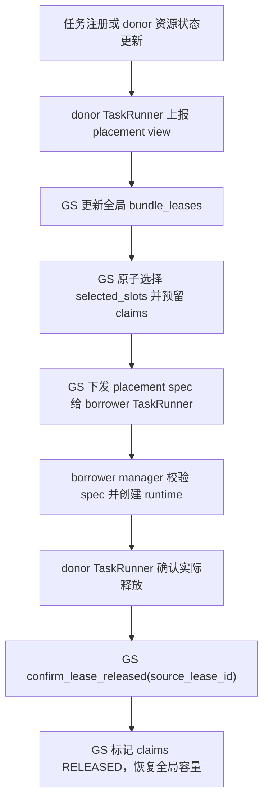

`borrower` 回收使用 borrower 主 `lease_id`，donor 确认使用对应的 `source_lease_id`；`claim_id` 是逐笔资源占用的清理凭据。`bundle_leases` 的读写只发生在 GS；TaskRunner 只传输 placement、状态和确认结果，manager 不持有全局表。borrowed 的创建失败边界见第 5.8 节；接流、闭流与回收只保留第 10 章的接口声明，其内部实现仍按后续开发步骤展开。

### 3.5 `MultiTaskvLLMReplica`

父类为 `vLLMReplica`，继续实现 `RolloutReplica` 的对外契约。native 与 borrowed 使用同一个扩展类；`allocation_kind` 只选择初始化和清理路径，不改变 `workers`、`servers`、`sleep`、`wake_up` 等原生接口。

**原生成员与方法**

```python
replica_rank: int                           # [原生继承] server/adapter 寻址及 CE 稳定身份
config: RolloutConfig                       # [原生继承] rollout 配置
model_config: HFModelConfig                 # [原生继承] 模型配置
world_size: int                             # [原生继承] 实际 CE rank 数；borrowed 为 claims 数
nnodes: int                                 # [原生继承] 实际涉及的节点数
gpus_per_replica_node: int                  # [原生继承] native/borrowed 均匀布局下每个节点使用的 GPU 数
workers: list[ActorHandle]                  # [原生继承] rank 顺序的 CE Worker handles
servers: list[ActorHandle]                  # [原生继承] 每节点 HTTP/headless server handles
resource_pool: RayResourcePool | None       # [原生继承] native 单一资源池；borrowed 单 PG 时可填
bundle_indices: list[int]                   # [原生继承] native 路径兼容字段
rollout_mode: RolloutMode                   # [原生继承] STANDALONE/HYBRID/COLOCATED
_server_handle: ActorHandle | None          # [原生继承] 主 HTTP server
_server_address: str | None                 # [原生继承] 主 HTTP 地址

async def init_standalone(self) -> None: ...  # [原生继承] 创建 native PG、CE Worker 和 server
async def init_hybrid(self, worker_group: RayWorkerGroup) -> None: ...  # [原生继承]
async def launch_servers(self) -> None: ...  # [原生继承] 按节点启动 server
async def sleep(self) -> None: ...          # [原生继承·预留] 生命周期休眠入口
async def wake_up(self) -> None: ...        # [原生继承·预留] 生命周期唤醒入口
async def abort_all_requests(self) -> dict[str, Any]: ...  # [原生继承]
async def abort_request(self, request_id: str) -> dict[str, Any]: ...
async def resume_generation(self) -> None: ...
async def release_kv_cache(self) -> None: ...
async def resume_kv_cache(self) -> None: ...
async def clear_kv_cache(self) -> None: ...
@property
def server_handle(self) -> ActorHandle: ...
@property
def server_address(self) -> str: ...
@property
def max_concurrency(self) -> int: ...
```

`gpus_per_replica_node` 是 native 和 borrowed 都使用的均匀布局参数；borrowed 的每个节点必须使用相同数量的 GPU，`self.workers` 按节点和 borrower rank 排序后即可复用原生 server 启动逻辑。

**扩展成员**

```python
server_class: Any                         # [原生字段·覆写赋值] native 为 ray.remote(vLLMHttpServer)，扩展实例改为 ray.remote(MultiTaskvLLMHttpServer)
allocation_kind: str                      # [新增] "native" 或 "borrowed"
lease_id: str | None                      # [新增] borrower 侧该 replica 的主租约；native 为 None
source_lease_ids: list[str]               # [新增] donor 授权的全部源 lease；可跨多个 donor
runtime_state: str                         # [新增] CREATING/RUNTIME_READY/READY/DRAINING/DESTROYED/FAILED
claims: list[dict]                         # [新增] 归一化后的 rank 顺序 claim；创建后作为唯一 placement 记录
serving_version: int | None                # [新增] 已确认加载的参数版本
```

`claims` 是从外部 `selected_slots` 或 `spec["claims"]` 归一化后的唯一列表，按 borrower rank 排序；输入字段 `selected_slots` 在归一化后不再作为 replica 成员保存。每条 claim 自带预期的 node_id、gpu_uuid、node_rank 和 local_rank，创建后直接与 Worker runtime context 查询到的实际映射比较。Ray `PlacementGroup` handles 只在创建 Worker 的方法内部作为临时局部变量，创建结束后不需要由 replica 长期持有；borrowed 不删除 donor PG。


**扩展/覆写方法**

```python
def __init__(
    self,
    replica_rank: int,
    config: RolloutConfig,
    model_config: HFModelConfig,
    gpus_per_node: int = 8,
    is_reward_model: bool = False,
    is_teacher_model: bool = False,
    name_suffix: str = "",
    max_colocate_count: int | None = None,
    allocation_kind: str = "native",
) -> None: ...                                      # [原生覆写]根据allocation_kind走不同创建路径(init_standalone or init_from_lease)

async def init_standalone(self) -> None: ...        # [原生覆写]native_replica创建路径,覆盖max_colocate_count=2写死值
async def init_from_lease(self, spec: dict) -> None:  # [新增]borrowed replica创建路径,接收GS传过来的spec用于创建

def validate_placement(self, spec: dict) -> None: ...           # [新增] 校验placement是否可用
async def _create_workers_from_claims(self) -> None: ...        # [新增] 使用归一化后的 claims 创建 Worker

async def validate_runtime(self) -> dict: ...        # [新增]创建replica后进行校验


async def destroy(self) -> dict: ...                 # [新增·预留] 销毁 replica；返回可序列化 receipt
async def reclaim(self, lease_id: str) -> dict: ...  # [新增·预留] 按 borrower 主 lease 回收 replica
```

`__init__()` 为什么扩展：原生构造没有 lease、claims、M 等概念，但父类和 CE manager 仍要求同一组原生字段。因此它先调用父类构造，再初始化扩展字段；`allocation_kind="native"` 走原生 PG，`"borrowed"` 只接受外部 spec，不自行申请新 PG。构造参数 `max_colocate_count` 如果保留，只是 native PG 创建时的临时配置输入，不写入 replica 长期状态；borrowed 的 placement 以 claims 中的 fractional 配额为准。

`init_standalone()` 的改动很小但必须存在：原生资源池实现通常把每个 bundle 的 CPU 配额固定为 2；扩展读取 `max_colocate_count=M`，创建 `CPU=M/GPU=1` 的 PG，然后复用原生 `RayWorkerGroup`、CE Worker 和 server 初始化。已有 PG 不能在 Ray 中动态把 M=2 改成 M=4，因此 M 必须在建 PG 时确定。

`validate_placement()` 面向已归一化的 spec：核对 borrower 配置与 world_size、均匀节点布局和 node/local rank 映射，核实 PG/bundle 存在，并按 bundle 的实际 GPU/CPU 总容量检查本次申请。解析 PG 和后续 Ray RPC 必须在 manager 锁外执行；manager 的输入校验不能替代这些实际检查。当前任务无法查询 GS 的全部已授权 claims，因此不在此重算全局剩余容量；真正落到哪个设备由创建后的 `validate_runtime()` 再核验。

`_create_workers_from_claims()` 是 borrowed 创建的核心。方法入口读取已归一化的 `self.claims`，并在方法内部建立临时的 `pg_by_id` 映射；再对每个 rank：解析对应 PG → 使用 `PlacementGroupSchedulingStrategy(placement_group=pg, placement_group_bundle_index=bundle_index, capture_child_tasks=True)` → 以 claim 的 `num_gpus=gpu_fraction`、`num_cpus=cpu_request` 创建新的 CE Worker Actor → 按 rank 顺序写入继承的 `workers`。同一 bundle 的多个 claim 会产生多个不同 actor；不调用 donor worker 的方法，也不复制 donor 的通信组。多个 PG 或非连续 bundle 只是多个调度策略的集合，不要求一个连续 `SubRayResourcePool`。

`launch_servers()` 使用原生逻辑从每个 Worker 读取 node id 和 accelerator/device 标识；在均匀布局下按 `gpus_per_replica_node` 将已经按 borrower rank 排序的 Worker 切成节点组，并生成每个节点的可见设备列表。Ray 的 bundle index 只决定 CE Worker 的调度位置，不能直接当作 CUDA device index。

borrowed 采用与 native 相同的均匀节点布局，因此不再覆写 `launch_servers()`。`init_from_lease()` 只需按 borrower 的 node rank/local rank 对 `self.workers` 排序，设置 `nnodes` 和 `gpus_per_replica_node`，然后调用继承的 `vLLMReplica.launch_servers()`；原生方法会按节点查询 Worker、使用 NodeAffinity 创建 `MultiTaskvLLMHttpServer`，并传入该节点的设备列表。

`init_from_lease()` 的完整步骤是：保存只读 claims → `validate_placement()` → 在局部变量中取得 PG handles → `_create_workers_from_claims()` → 按 borrower 的 node rank/local rank 排序 `self.workers` → 设置 `nnodes` 和 `gpus_per_replica_node` → 调用继承的 `launch_servers()` → `validate_runtime()` → 将状态提交为 `RUNTIME_READY`。每次获得 Worker/server handle 都立即保存在 replica 中。任一步失败都把当前引用及错误交回 manager；`borrowed_operations[lease_id]["created_actor_names"]` 保留精确名称以辅助核实，不在这里展开销毁顺序。它绝不调用 native `init_standalone()`，也不复用 donor CE Worker、server 或 resource pool 的所有权。

`validate_runtime()` 读取新 Actor 的健康状态、实际 node/GPU、server 地址和 engine rank，逐 rank 与 claims 中的预期 node/GPU 比较；确认每个 rank 有且只有一个 Worker、每个节点的 Worker 数等于 `gpus_per_replica_node`、主 server 可接受健康检查后返回诊断字典。只有 manager 拿到成功结果才可让 CE 注册和 LB READY。

`destroy()` 和 `reclaim(lease_id)` 目前只确定入口签名、租约校验边界和可序列化 receipt 约定。`destroy()` 面向 replica 自身的销毁请求；`reclaim(lease_id)` 必须校验 `allocation_kind == "borrowed"`、主 lease 与 claims 的归属，并把结果返回给 manager。两者内部是否关闭 server、engine、CE Worker、通信域或 PG，以及这些动作的顺序，留待后续生命周期实现；borrowed 不得擅自删除 donor PG。重复调用应保持幂等，但当前文档不展开清理流程。`sleep()`/`wake_up()` 继续保留父类接口，暂不为 borrowed 设计具体行为。

### 3.6 `CheckpointEngineWorker`

**原生成员与方法**

```python
rollout_config: RolloutConfig        # [原生继承] rollout/CE 配置
model_config: HFModelConfig          # [原生继承] 模型配置
server_adapter: BaseRollout          # [原生继承] 连接本 replica server 的 adapter
checkpoint_engine: CheckpointEngine  # [原生继承] NCCL/NIXL 等 backend
extra_rollout_args: tuple            # [原生继承] adapter 位置参数
extra_rollout_kwargs: dict            # [原生继承] adapter 关键字参数；key 包含 replica_rank 等

async def update_weights(self, global_steps: int | None = None) -> None: ...
    # [原生继承] 接收训练权重并让 adapter 加载到 server

def execute_checkpoint_engine(self, method: str, *args: Any, **kwargs: Any) -> Any: ...
    # [原生继承] 分派 prepare/build/init/finalize
```

直接复用原生`CheckpointEngineWorker` 类，无需创建扩展类

### 3.7 `MultiTaskvLLMHttpServer`

父类为 `vLLMHttpServer`，每个涉及的 node 一个 actor。server 是 HTTP/控制面，engine 是 server 内部启动的 vLLM runtime；server 通过 workers/adapter 与 CE 参数同步连接，不能把 HTTP actor 当作 CE Worker。

**原生成员与方法**

```python
config: RolloutConfig                 # [原生继承] 推理及 sleep 配置
model_config: HFModelConfig           # [原生继承] 模型配置
rollout_mode: RolloutMode             # [原生继承] server 模式
workers: list[ActorHandle]            # [原生继承] 本 node 的 CE Worker handles
replica_rank: int                      # [原生继承] replica 身份
node_rank: int                         # [原生继承] node 在 replica 中的序号
engine: Any                            # [原生继承] 主 node 的 AsyncLLM；headless 进程不保证持有
_submission_paused: bool               # [原生继承] 是否停止请求准入
_admitting: int                        # [原生继承] 正在准入的请求数
_resume_event: asyncio.Event           # [原生继承] 恢复准入事件

async def launch_server(self, master_address: str | None = None, master_port: int | None = None, dp_rpc_port: int | None = None) -> None: ...  # [原生继承]
async def run_server(self, args: argparse.Namespace) -> None: ...  # [原生继承] 创建 AsyncLLM 和 HTTP app
async def run_headless(self, args: argparse.Namespace) -> None: ... # [原生继承] 启动 headless engine
async def collective_rpc(self, method: str | Callable, timeout: float | None = None, args: tuple = (), kwargs: dict[str, Any] | None = None) -> None: ...
async def wait_for_requests_to_drain(self) -> None: ...
async def abort_all_requests(self, reset_prefix_cache: bool = True) -> dict[str, Any]: ...
async def resume_generation(self) -> None: ...
```

**扩展方法**

```python
async def sleep(self) -> None: ...       # [原生覆写·预留] server 休眠入口
async def wake_up(self, tags: list[str] | None = None) -> None: ...  # [原生覆写·预留]
async def shutdown(self) -> None: ...    # [新增·预留] server/runtime 销毁入口
```

`launch_server()` 建立 HTTP server 与 vLLM engine 的绑定：主 node 创建 `AsyncLLM`/HTTP app，headless node 通过 master 地址加入同一 vLLM runtime；`CUDA_VISIBLE_DEVICES` 来自原生 `launch_servers()` 根据 Worker runtime context 收集的本节点设备列表，不是 donor server 的环境变量复制。HTTP actor 只负责控制和请求，真正的模型执行在其 engine/worker 进程。

`sleep()`、`wake_up()` 和 `shutdown()` 目前只作为 server 侧预留接口，保留原生参数和 `None` 返回契约；TaskRunner/manager 如需跨组件回执，应在外层包装 receipt。是否调用 vLLM engine 的 sleep/wake、是否等待请求或子进程退出，以及失败状态如何恢复，留待后续生命周期实现。本阶段不在 server 类中编排完整的摘流、通信域清理或资源归还流程。

### 3.8 `MultiTaskGlobalRequestLoadBalancer`

父类为 `GlobalRequestLoadBalancer`，是本任务 AgentLoop 共享的 LB actor；“Global”不表示跨任务。

LB 的职责是**原子选路、记录已分配请求、提交路由成员变化**，不负责创建 replica、同步权重或归还 GPU。borrowed 接入的是 borrower 自己的 LB。调用链为 TaskRunner → Rollouter → 本地 LLMServerManager → LB actor；LB 不持有 GS 或 CE Manager 句柄。创建阶段只使用 `commit_ready()` 提交新 server，其他路由成员变化接口留待生命周期实现。

#### 逻辑摘流与物理摘流

LB 的“摘流”分为两个阶段，不能把二者合并成一次 `remove_servers()`：

| 阶段 | 对外含义 | LB 内部处理 | 是否保留 server 和在飞计数 |
| --- | --- | --- | --- |
| **逻辑摘流** `begin_drain(server_ids)` | 目标 replica 不再接收新请求 | 将目标加入 `_draining_servers`，清除指向目标的粘性选路；后续 `acquire_server()` 排除目标 | 是；保留 `_servers`、ActorHandle 和 `_inflight_requests` |
| **物理摘流** `commit_remove(server_ids)` | 目标 replica 已经完成 LB 层闭流 | 确认目标仍处于 DRAINING 且在飞计数为 0，然后删除路由映射、计数、粘性项和 drain 标记 | 否；LB 不再保存目标路由，但 server/CE/runtime 仍由后续回收流程清理 |

逻辑摘流后目标仍暂时存在于原生 `_servers` 和 `_inflight_requests` 中，这是为了让摘流之前已经 `acquire_server()` 成功的请求继续使用原 server，并在客户端 `finally` 中调用 `release_server()`。因此扩展后的 `acquire_server()` 必须在粘性、确定性哈希和最少在飞三条选路分支中都排除 `_draining_servers`；否则目标仍可能被新请求选中。

不能在 `begin_drain()` 中直接调用原生 `remove_servers()`。立即物理删除会丢失在飞计数，使旧请求的 `release_server()` 找不到计数项，也无法判断目标是否真正排空；已经取得句柄但尚未提交到 engine 的请求仍可能迟到到达旧 server。只有 `get_drain_status()` 确认计数为零、server engine 完成排空后，才能提交 `commit_remove()`。所以这里的“摘流”是**先从可路由集合移除，再从登记和计账集合删除**。

可以把 LB 的集合关系理解为：`READY` 是可被 `acquire_server()` 选中的集合，`REGISTERED` 是仍保留 server 句柄和 inflight 账本的集合，`DRAINING = REGISTERED - READY` 是逻辑摘流到物理摘流之间的过渡集合。`commit_remove()` 成功只代表 LB 路由状态清理完成，不代表 CE 注销、server 销毁或 GPU lease 已归还。

**原生成员与方法**

```python
_servers: dict[str, ActorHandle]       # [原生继承] key=server_id，value=本任务主 HTTP server 的 ActorHandle
_inflight_requests: dict[str, int]     # [原生继承] key=server_id，value=已 acquire、LB 尚未处理 release 的数量
_request_id_to_server: LRUCache        # [原生继承] key=客户端 request_id，value=粘性选路的 server_id；不是在飞请求清单
_full_determinism: bool                # [原生继承] 是否使用哈希选路

def add_servers(self, servers: dict[str, ActorHandle]) -> None: ...  # [原生继承·底层原语] 写入映射并把对应计数置零
def remove_servers(self, server_ids: list[str]) -> None: ...         # [原生继承·底层原语] 删除映射和计数，不等待请求收尾
def release_server(self, server_id: str, request_id: str | None = None) -> None: ...  # [原生继承] 客户端 finally 中归还一次 acquire 的计数
def get_inflight_count(self, server_id: str) -> int: ...             # [原生继承] 返回单 server 计数；不存在时也返回 0
def get_total_inflight(self) -> int: ...                             # [原生继承] 返回本任务全部已注册 server 的计数之和
def get_all_servers(self) -> list[str]: ...                          # [原生继承] 返回已注册 ID，扩展后可能包含 DRAINING
def get_status(self) -> dict: ...                                   # [原生继承] 返回全池计数和映射诊断，不能单独用于判断 READY
```

**扩展成员与方法**

```python
_draining_servers: set[str]  # [新增·待实现] 元素为禁止新分配的 server_id；保留其映射和在飞计数用于旧请求收尾

def __init__(
    self,
    servers: dict[str, ActorHandle],
    max_cache_size: int = DEFAULT_ROUTING_CACHE_SIZE,
    full_determinism: bool = False,
) -> None: ...  # [原生覆写] 复用父类初始化并创建 draining 集合，不接收 GS 句柄

def acquire_server(self, request_id: str) -> tuple[str, ActorHandle]: ...  # [原生覆写·待实现] 所有选路分支都排除 draining，选中后原子加一并返回句柄
def commit_ready(self, servers: dict[str, ActorHandle]) -> None: ...       # [新增·待实现] 接收已验证的主 server 映射，提交接流
def begin_drain(self, server_ids: list[str]) -> None: ...                  # [新增·待实现] 批量禁止新分配、清除目标粘性路由，保留旧计数
def get_drain_status(self, server_ids: list[str]) -> dict[str, dict]: ...  # [新增·待实现] 一次返回目标的注册状态和在飞计数快照
def commit_remove(self, server_ids: list[str]) -> None: ...                # [新增·待实现] 确认目标均已摘流且计数为零后，原子删除路由状态
```

`server_id` 沿用原生 manager 的 server 地址键；每个普通 vLLM replica 只提交 `{replica.server_address: replica.server_handle}`，其中 handle 是主节点请求入口。跨机 replica 的 headless server 和 CE Workers 不分别进入 LB，不能把每个 GPU 当成一个独立服务端。manager 通过 lease、稳定的 `replica_rank` 和创建操作记录校验身份，禁止旧操作在回收后重新接流；同一地址后续复用也不能沿用旧 runtime 的完成结果。

| 方法 | 参数、返回与主要步骤 | 扩展原因 |
| --- | --- | --- |
| `commit_ready(servers)` | 参数 key 为 server_id，value 为主 server handle；调用者已确认租约、健康、bootstrap 和 serving version。先校验整批 ID/handle，再只对新 ID 调 `super().add_servers()`；相同 ID/handle 已 READY 时不改计数；ID 被不同 runtime 占用或处于 DRAINING 时拒绝。成功返回 `None`，失败抛错 | 原生 `add_servers()` 对已有 ID 也重置计数，不能直接用于重复 READY；LB 自己不访问 CE 去验证版本 |
| `acquire_server(request_id)` | 粘性命中、确定性哈希和最少在飞三条分支均只选 `_servers - _draining_servers`；选路、写粘性缓存和计数加一在同一次调用中完成，返回 `(server_id, handle)`；空候选集沿用原生无可用 server 错误 | 仅清粘性缓存无法阻止其他选路分支再次选中摘流目标 |
| `begin_drain(server_ids)` | 校验目标存在后，批量加入 draining 集合，删除缓存中 value 属于目标的条目；不删除 server handle、不清零计数、不取消推理。重复摘流不改变计数，成功返回 `None` | 将“禁止新请求”与“删除旧请求账本”分开；RPC 返回代表摘流已提交 |
| `get_drain_status(server_ids)` | 返回下方字典；同步读快照，立即返回，不在 LB 内等待计数归零 | 原生单项查询对不存在的 ID 也返回 0，容易把错误 ID 或已丢失状态误判为成功排空；等待必须在 actor 外完成 |
| `commit_remove(server_ids)` | 先校验整批仍注册的目标都在 draining 集合且计数为 0，再调用 `super().remove_servers()` 删除映射/计数，清除目标粘性条目和 drain 标记；已经不存在的 ID 作为路由级无操作。成功返回 `None`，仍有请求则抛错且不部分删除 | 原生 remove 不检查在飞请求，也不主动清粘性缓存；路由删除成功不等于 runtime 已销毁或 lease 已归还 |

`get_drain_status()` 的 **key** 是每个输入 server_id，**value** 是：

```python
{
    "state": "READY|DRAINING|ABSENT",  # READY=可选路；DRAINING=只允许旧请求收尾；ABSENT=本 LB 无记录
    "inflight": int | None,           # 已注册时为计数；ABSENT 时为 None，不能当作已排空的证据
}
```

这里的 READY 是 LB 局部路由状态，依赖上层接流前的校验；不等于 LB 持续监测了 engine 健康。`begin_drain()` 遇到未知 ID 应报错；回收重试由 manager 的操作记录识别已经完成的阶段。`commit_remove()` 对缺失 ID 的无操作只提供路由级重试能力，不能用来证明 CE 或资源已经清理。

上述 LB 方法保持短的同步方法、在串行 actor 上执行，不在临界区调用远端 RPC 或等待排空；批次先完整校验再修改。这样 `acquire_server()` 和 `begin_drain()` 有明确先后：摘流前已取得句柄的请求计入旧请求，摘流后执行的 acquire 必须改选其他 READY 实例。不能依赖来自不同 Actor 的 RPC 发送顺序，必须等待摘流调用的返回。

`release_server()` 继续接受 DRAINING server 的旧请求归还。原生实现忽略 `request_id`，不具备按请求去重能力，正常路径依赖每次成功 acquire 对应客户端一次 finally/release；不能由回收代码补发 release 或强制清零。borrowed 生命周期统一使用 `commit_ready/begin_drain/commit_remove`，不直接调用原生 `add_servers/remove_servers` 绕过检查。

原生 `get_status()` 的 `servers` 为 `server_id -> inflight`，`total_inflight` 为全池总数，`active_servers` 为注册数量，`registered_handles` 为已注册 ID 列表。引入 DRAINING 后，这些统计包含正在收尾的实例；接流容量使用 READY 投影，等待单个 borrowed 回收使用 `get_drain_status(target_ids)`，不能等待整个任务的 `get_total_inflight()` 归零。


## 1. 创建方案：异构 world_size 与碎片化 bundle

**当前规范方案：donor 保留 PG 的所有权，borrower 从一个或多个 donor lease 获得具体 slot，并创建独立 CE/server/engine。** borrower 的 `world_size` 可以小于、大于或不同于 donor；selected slots 可以来自多个 PG，也可以在每个 PG 内非连续。donor 与 borrower 的运行时状态切换不在当前创建方案中定义；borrower 不复用 donor 的 Worker、engine、ServerAdapter 或通信域。

### 1.1 核心结论和边界

支持以下两类异构转换：

| 场景 | donor 资源 | borrower 资源 | 设计结论 |
| --- | --- | --- | --- |
| 一拆二 | 一个 `world_size=4` 的 donor，释放 4 个 slot | 两个 `world_size=2` 的 borrower，各取得其中 2 个 slot | 可行；两个 borrower 分别建立独立 CE 通信域、HTTP server、engine 和 LB |
| 二合一 | 两个 `world_size=2` 的 donor，各释放 2 个 slot | 一个 `world_size=4` 的 borrower，取得两个 donor 的 4 个 slot | 可行；borrower 的 4 个 rank 可以跨两个 PG，按实际节点布局创建 server/engine |
| 任意碎片组合 | 多个 donor 释放的非连续 bundle | 一个或多个 borrower | 可行，但必须逐 rank 指定 `(PG, bundle_index)`，不能继续使用 `bundle_start` 推导位置 |

这里的“可行”有一个重要前提：donor 必须把其原有推理 runtime 作为一个整体安全摘除。一个 vLLM replica 通常是一个完整的 CE/engine 通信组，不能只因为其中两个 rank 暂时空闲，就把另外两个 rank 留在原 engine 中并同时把前两个 rank 借出去。因而：

- `4 → 2 + 2`：将四个可授权 slot 分成两个 lease，再分别创建两个两卡 borrower；donor 的运行时状态切换留待生命周期接口实现；
- `2 + 2 → 4`：两个 donor 都完整 drain 并释放各自的两个 slot，再由一个 borrower 组成新的 4 rank runtime；
- 若未来要支持 donor 保留剩余 rank、只借出部分 rank，必须把 donor 本身拆成多个独立 replica，或实现 vLLM/CE 的可分区执行组；本节不把它假定为已具备的能力。

donor 的原 `world_size` 只决定它如何被安全停止和回收；borrower 的 `world_size` 决定新 CE Worker 数量、`WORLD_SIZE`、vLLM rank 数和参数同步拓扑。两者不共享 rank、engine、ServerAdapter 或通信域。

### 1.2 非连续 bundle 的统一 placement contract

旧方案使用 `bundle_start + world_size`，隐含了一个 PG 内连续区间和固定的 `process_on_nodes`。新方案改为显式 `selected_slots`；它是 borrower 创建的唯一物理 placement 输入：

```python
spec = {
    "lease_id": "borrow-...",          # 本次 borrower 运行时的租约
    "donor_leases": [                   # 一个或多个 donor 的授权
        {
            "donor_task_id": "task-a",
            "donor_replica_rank": 0,
            "pg_namespace": "verl-...",
            "pg_id": "...",
            "slots": [
                {
                    "bundle_index": 1,
                    "node_id": "...",
                    "gpu_uuid": "GPU-...",
                    "available_gpu": 0.75,
                    "available_cpu": 3.0,
                    "allocated_gpu": 0.25,
                    "allocated_cpu": 1.0,
                },
                # 可以是非连续的 bundle index
            ],
        },
        # 可继续包含 donor-b 的 PG/slots
    ],
    "selected_slots": [                 # 按 borrower rank 排序的最终映射
        {
            "claim_id": "borrow-...-rank-0",  # 同一 bundle 内的 fractional claim 唯一标识
            "rank": 0,
            "pg_id": "...",
            "bundle_index": 1,
            "node_id": "...",
            "gpu_uuid": "GPU-...",
            "node_rank": 0,					   #两个rank由GS编号,rank对应的
            "local_rank": 0,
            "gpu_fraction": 0.25,              # 本 rank 在该 bundle 上请求的 GPU/NPU 配额
            "cpu_request": 1.0,                # 本 rank 在该 bundle 上请求的 CPU 配额
        },
    ],
    "borrower_world_size": 4,
    "borrower_process_on_nodes": [2, 2],          # borrower 每个节点的进程数；所有节点必须相同
    "borrower_parallel_config": {"tp": 4, "dp": 1, "pp": 1},
    "max_colocate_count": 4,                  # 新 PG 推荐值；每个 CE actor 请求 1/4 GPU/NPU
    "replica_rank": None,                    # manager 分配；幂等重试从 operation 记录恢复
    "expires_at": 0,
}
```

`selected_slots` 必须满足：

1. `len(selected_slots) == borrower_world_size`，且 rank 恰好覆盖 `0..world_size-1`；
2. 每个 claim 的 `(pg_id, bundle_index, claim_id)` 只出现一次，且必须出现在对应 donor lease 中；同一 `(pg_id, bundle_index)` 可以出现多次，但每次必须是不同 claim；
3. `node_rank/local_rank` 由 borrower 重新编号，不能复制 donor 的 rank；
4. 按 `node_rank` 分组后，每个节点的 slot 数都等于同一个 `gpus_per_replica_node`，并满足 `borrower_process_on_nodes == [gpus_per_replica_node] * nnodes`；
5. 每条记录的 PG ID、bundle index、node ID、GPU UUID 和剩余 CPU/GPU 配额在创建前再次查询并核对；
6. 所有 donor lease 必须属于同一个 Ray 集群和可解析的 PG namespace；PG 原创建者在借用期间必须存活；
7. 对每个 bundle 分别累计所有 donor 和 borrower claim：`sum(gpu_fraction) <= bundle_gpu_capacity`、`sum(cpu_request) <= bundle_cpu_capacity`；同时必须为显存、端口、IPC 和 engine 通信缓冲留出预算。

Ray 的 `PlacementGroupSchedulingStrategy` 接受指定的 `placement_group_bundle_index`，不要求 bundle index 连续；但相邻 bundle 也不保证是相邻物理 GPU。因此，bundle index 只能用于调度，GPU UUID 才是创建后的核验依据。见 [Ray PlacementGroupSchedulingStrategy](https://docs.ray.io/en/latest/_modules/ray/util/scheduling_strategies.html) 和 [Ray Placement Groups](https://docs.ray.io/en/latest/ray-core/scheduling/placement-group.html)。

### 4.4 创建路径：从多个 donor lease 到一个 borrower replica

创建仍由现有类协作完成，不增加 `SlotSupervisor`、`ReplicaFactory` 或新的资源池类：

1. `TaskRunner` 收到 GS 的 placement metadata，调用 borrower `Rollouter` 的创建方法。GS 只与各 TaskRunner 通信。
2. `MultiTaskLLMServerManager.create_borrowed_replica(spec)` 校验 GS 下发的 lease 状态、重复操作、PG namespace 和所有 `selected_slots`，在本地登记 `CREATING`。
3. manager 只核对每个 selected claim 的 `claim_id`、`source_lease_id`、fractional 配额和 placement epoch；同一 bundle 的多 claim 容量已经由 GS 原子确认，manager 不重新分配或扣减全局容量。
4. `MultiTaskvLLMReplica` 根据 borrower 配置计算自己的 `world_size`、`nnodes`、每节点 GPU 数和 server 拓扑；不从 donor 复制这些字段。
5. replica 解析每个 PG，得到 `PlacementGroup` handle；不调用 `init_standalone()`，因为那会创建新的 PG；也不把多个 PG 合并成一个新的 PG。
6. replica 按 `selected_slots` 逐 rank 创建新的 CE Worker。每个 Actor 的 Ray 调度策略同时指定对应 PG 和 bundle index，并使用该 claim 的 `gpu_fraction`/`cpu_request`；多个 rank 可以指向同一个 bundle，但必须使用不同 claim 且累计配额不超过 bundle 容量。
7. 所有 CE Actor 提交后统一等待构造完成，再核验实际 Actor node、PG/bundle、GPU UUID、rank、`WORLD_SIZE` 和 borrower 的独立 Gloo/CE 初始化。
8. 将 Worker handles 按 borrower rank 写入 `replica.workers`，并用 borrower 的节点分组调用继承的 `launch_servers()` 语义；server 每节点接收本节点 Worker 对应的 CUDA visible devices。
9. 每个 HTTP server 在自己的 node 上启动 borrower vLLM engine，使用唯一 `replica_rank`、job ID 和 IPC endpoint；engine 使用 borrower 的 TP/DP/PP，不读取 donor 的配置。
10. TaskRunner 先让 Trainer 注册该 replica 的 CE 投影，再在当前训练权重的最早安全快照点调用 target-only bootstrap。该 bootstrap 只用训练 Worker 和新 borrowed Worker 建立短生命周期通信域；完成版本确认和 backend `finalize()` 后，才由 Rollouter/manager 向 LB 提交 READY。它不等待下一个周期性的全成员参数同步。
11. 任一步骤失败，manager 必须按已创建的 server、engine、CE Worker 顺序清理，并分别确认每个 donor lease 释放；不能只返回 `CREATE_FAILED` 就把资源视为已经归还。

### 4.5 CE Worker 的碎片化创建与原生实现复用

原生 `SubRayResourcePool` 和 `RayWorkerGroup._init_with_subresource_pool()` 仍可作为**单 donor、连续 bundle 且每个 bundle 只分配一个 claim**的快速路径，但不能用于新的多 claim 路径：它用 `start_bundle_index` 和连续范围推导 `pg_idx/local_rank`，也无法表达同一 bundle 的多份 fractional 配额。扩展路径在现有 `MultiTaskvLLMReplica` 内增加一个按 claim 创建 Worker 的方法，复用原生 `RayClassWithInitArgs` 和 `RayWorkerGroup` 的方法绑定能力：

```python
for slot in sorted(spec["selected_slots"], key=lambda item: item["rank"]):
    worker_args = self.get_ray_class_with_init_args()
    worker_args.update_options({
        "num_cpus": slot["cpu_request"],
        "name": unique_worker_name(spec, slot),
        "runtime_env": {"env_vars": borrower_rank_env(spec, slot)},
    })
    worker = worker_args(
        placement_group=pg_by_id[slot["pg_id"]],
        placement_group_bundle_idx=slot["bundle_index"],
        use_gpu=True,
        num_gpus=slot["gpu_fraction"],
        device_name=get_device_name(),
    )
    workers.append(worker)
```

这是创建逻辑的示意，实际实现必须先提交完整 Worker 集合，再等待所有 Actor；不能串行等待第一个 CE Worker 的进程组初始化。完成后以 `RayWorkerGroup.from_detached(worker_handles=workers, ...)` 或等价的原生 WorkerGroup 包装 handles，使 CE Manager 仍能调用原生 dispatch 方法。`replica.workers` 仍是原生参数同步所需的 ActorHandle 列表。同一 bundle 的多个 claim 必须分别生成 actor name、rank 环境和清理句柄，不能按 bundle key 覆盖前一个 Worker。

每个 borrower Worker 使用自己的 `WORLD_SIZE`、`RANK`、`MASTER_ADDR/MASTER_PORT`、通信域名称、backend 配置、`replica_rank`、ServerAdapter 和 IPC endpoint。donor 和 borrower 即使落在同一物理 GPU，数值 rank 可以重复，但绝不能共用同一个 Gloo/NCCL/NIXL collective 或 ServerAdapter。

### 4.6 HTTP Server 与 vLLM engine 的绑定

原生 `vLLMReplica.launch_servers()` 可以直接复用。borrowed 创建前只需保证 `self.workers` 已按 borrower 的 `node_rank/local_rank` 排序，并设置 `nnodes`、`gpus_per_replica_node` 以及均匀的 `borrower_process_on_nodes=[gpus_per_replica_node] * nnodes`。原生方法会从 Worker 查询 `(node_id, accelerator_id)`，按固定的每节点 Worker 数切分，使用 `NodeAffinitySchedulingStrategy` 创建每节点一个 `MultiTaskvLLMHttpServer`，并把本节点设备列表传给 server。server 只使用 borrower Worker handles 和 borrower engine 参数，不能连接 donor server。启动后仍需核验 node ID、设备 UUID、Worker 数和 engine rank，全部成功后才设置 `RUNTIME_READY`。
NodeAffinity 只能选择节点，不能替代 CE Worker 的 PG/bundle GPU 资源分配。直接创建 `num_gpus=0` 的 CE Actor，再手工写 `CUDA_VISIBLE_DEVICES` 会失去原生 Worker 的 accelerator ID、fractional 配额和设备初始化假设，需要额外重构 `Worker`、`CheckpointEngineWorker` 和 `launch_servers()`；因此不作为本方案的主路径。

### 4.7 两种异构转换的具体编排

#### 4.7.1 一个四卡 donor 拆为两个两卡 borrower

假设 donor D 的四个可借 slot 为 `D[0], D[1], D[2], D[3]`，上层要创建 borrower B1/B2：

| replica | selected slots | borrower world size | 说明 |
| --- | --- | --- | --- |
| B1 | `D[0], D[2]` | 2 | 可以是非连续 bundle；按 B1 的节点布局重新编号 |
| B2 | `D[1], D[3]` | 2 | 与 B1 使用不同 lease，不能重复 slot |

D 的完整 runtime 状态切换不属于创建阶段。B1/B2 分别创建自己的 CE Worker、通信域、server、engine 和 LB；它们不共享 D 的 handles，也不共享彼此的通信域。任一 borrowed lease 后续如何回收、是否恢复 D，以及部分 rank 是否需要重建，均留待生命周期接口实现。

#### 4.7.2 两个两卡 donor 合为一个四卡 borrower

假设 D1 提供 `D1[1], D1[4]`，D2 提供 `D2[0], D2[3]`：

| borrower rank | 来源 | PG/bundle | borrower 节点 rank |
| --- | --- | --- | --- |
| 0 | D1 | `PG1/1` | 由 borrower 重新分配 |
| 1 | D1 | `PG1/4` | 由 borrower 重新分配 |
| 2 | D2 | `PG2/0` | 由 borrower 重新分配 |
| 3 | D2 | `PG2/3` | 由 borrower 重新分配 |

D1 和 D2 的 runtime 状态切换不属于当前创建方案。borrower 取得两个 donor lease 后一次性创建四个 CE Worker，并要求这些 slot 能组成均匀的节点布局，例如两个节点各 2 个 Worker；如果选出的 slot 不能组成均匀布局，则拒绝创建，而不是强行使用不支持的切分方式。

### 4.8 创建准入与失败边界

跨 donor 操作不是 Ray 的原子事务。当前只定义创建阶段的状态边界：

1. GS/TaskRunner 下发已预留的 `selected_slots`/claims 后，manager 在短临界区登记本地投影，状态设为 `CREATING`；
2. 逐 slot 创建 CE Worker、HTTP server 和 vLLM engine，但在 `RUNTIME_READY` 之前不发布可服务结果；
3. 任一 PG 不可解析、配额不足、CE 初始化失败、server 启动失败或拓扑核验失败时，manager 必须记录失败、保留精确 handles/actor names，并返回待清理状态；
4. 只有创建资源的实际清理得到后续实现确认后，TaskRunner 才能向 GS 报告释放并由 GS 更新 claims 和 lease 的最终状态。回滚顺序、reclaim、destroy、sleep、wake 以及缓存策略不在本节设计。

同一个 fractional claim 不能被两个操作重复授权；但同一 bundle 可以被多个不同 claim 使用。lease 记录的资源冲突键仍是 `(pg_id, bundle_index)`，只是冲突判断从“是否已占用”改为“累计 GPU/CPU claim 是否超容量”，每个 claim 另有唯一 `claim_id`。这样才能覆盖一个 donor 拆成多个 borrower、多个 donor 合成一个 borrower、多个 CE Worker 共用一个 bundle 和跨 PG 碎片化选择。

本阶段只记录 claims 的生命周期状态，不规定 borrowed runtime 的 sleep/wake 缓存、迁移或复用条件。若后续实现这些能力，必须另行定义 runtime 身份、显存占用和 claim 是否继续保留，不能把本节的 `RESERVED` 或 `RUNTIME_READY` 直接解释成可休眠或可唤醒。

### 4.9 与原生类和资源池的关系

本扩展仍以现有类为主：

- `MultiTaskLLMServerManager` 增加多 donor lease 校验、操作状态和回滚入口；
- `MultiTaskvLLMReplica` 增加 `selected_slots`、borrower 拓扑和碎片化 Worker 创建逻辑，继续继承 `vLLMReplica`；
- `MultiTaskCheckpointEngineWorker` 继续使用原生 Worker 的构造和 dispatch，不通过 donor Worker 复用通信域；
- `MultiTaskCheckpointEngineManager` 使用实际 borrower workers 建立/销毁本任务参数同步拓扑；
- `MultiTaskvLLMHttpServer` 继续继承原生 HTTP Server，接收 borrower 的节点设备映射；
- `SubRayResourcePool` 只保留为连续单 PG 的快捷路径，不能作为碎片化路径的 placement contract；
- 不新增 SlotSupervisor、ReplicaFactory、跨 actor Coordinator 或独立资源池类。

完整设计的创建判定是：**borrower 的 world size 可以小于、大于或不同于任一 donor；borrower 可以跨多个 donor PG，使用非连续 bundle，并在同一 bundle 上占用多个 fractional claim。** 实现的关键不是修改 Ray 的 PG 规则，而是停止用连续区间推导 rank，改为显式 claim 映射，再按 borrower 的拓扑创建 CE 和 HTTP server。`max_colocate_count=M` 必须在 PG 创建时统一配置；GS 按 bundle 累计 GPU/CPU claim，manager 只检查 GS 下发的结果是否一致。donor 运行时的退出、恢复和借用期隔离属于后续生命周期实现，不在本节展开。

### 4.10 历史方案：连续 bundle 的共享路径（兼容说明）

需要区分三个概念：

| 层次 | 本方案中的含义 | 是否在借用期间改变 |
| --- | --- | --- |
| Ray 资源预留 | PG 将指定 bundles 保留在节点上；donor/borrower CE actor 各请求该 bundle 的 `GPU=0.5` | PG 保留；borrower 新增一个 actor 的配额占用 |
| GPU 实际使用 | 在 GPU 上执行推理、参数加载，以及占用权重/KV/临时缓冲 | 由当前被授权的 runtime 使用设备；具体切换和隔离策略暂不定义 |
| 任务归属 | 模型配置、权重版本、CE 同步来源、请求来源及 runtime 句柄 | 新 runtime 归 borrower，由 borrower 的 CE/LB 管理；donor 原 runtime 仍归 donor |

**`GPU=0.5` 是调度记账，不是 50% 算力上限或一半显存的硬分区。** 即使 donor CE actor 保留这个配额，只要不再进行 GPU 工作，borrower 也不会被 Ray 限制为只能使用半张卡。可以让 donor/borrower 进程同时存在，而有效的推理工作按时间切换。Ray 明确说明资源需求不限制实际物理资源使用，并支持多个 fractional actors 共享设备。见 [Ray 逻辑资源说明](https://docs.ray.io/en/latest/ray-core/scheduling/resources.html) 和 [fractional accelerators](https://docs.ray.io/en/latest/ray-core/scheduling/accelerators.html#fractional-accelerators)。

因此，“donor CE actor 还占 `0.5`，所以借卡不成立、必须先销毁 donor 并改成 `GPU=1`”这个推论不成立。当前创建方案只要求 manager 按 fractional claim 记账，并不预设 donor 是否休眠或唤醒。该方案也不保证 donor 残留显存为零，或提供两个任务之间的硬件隔离；即使申请 `GPU=1`，也不能阻止绕过 Ray 资源申报的进程访问设备。

以一个 `GPU=1` 的 bundle 为例，借用前后保持以下关系；多卡 replica 对每个 bundle 执行同样的管理：

| 阶段 | donor CE 的 Ray 配额 | borrower CE 的 Ray 配额 | donor engine | borrower engine |
| --- | --- | --- | --- | --- |
| donor 使用 | 0.5 | 无 | donor runtime 持有 | 不存在 |
| borrower 创建完成 | 0.5 | 0.5 | donor runtime 的运行状态由后续生命周期决定 | borrower runtime 持有 |
| borrower lease 状态变更 | 0.5 | 按 claims 记账 | 由后续生命周期实现决定 | 由后续生命周期实现决定 |

物理位置的连接链路全部保留 Ray：`donor PG/bundle → borrower CE actor 的 accelerator ID → 原生 launch_servers() → 同节点 HTTP server 的 CUDA_VISIBLE_DEVICES → borrower vLLM MP workers`。borrower 新 actor 由 borrower Rollouter 创建，不由 donor actor 代建；使用 donor PG 不会把 actor 的模型配置、请求或 CE 参数来源自动变成 donor 的。借用期间如何切换 donor/borrower 的运行状态不属于当前创建设计。

### 4.11 历史方案的成立条件与实现缺口

共享 PG 只解决放置。借用成功还必须满足以下条件：

1. **同一 Ray 集群与可解析的 PG。** 按本文的 metadata-only 契约，donor 上报 PG name/ID，borrower 在共同 namespace 内解析并核验。Ray 支持同 namespace 的其他 job 获取命名 PG。当前 multi-task 仅给 GS actor 指定固定 namespace，不能据此推断 donor/borrower driver 和 PG 已处于该 namespace；部署配置必须另行统一。PG 原创建者必须在借用期间存活，借用引用不转移 PG 生命周期。见 [Ray Named Placement Group](https://docs.ray.io/en/latest/ray-core/scheduling/placement-group.html#advanced-named-placement-group)。
2. **每个 bundle 真有剩余配额。** 旧的 native 默认是 `max_colocate_count=2`、`CPU=2、GPU=1`、每个 CE actor 请求 `GPU=0.5`；当前扩展推荐新 PG 使用 `M=4`、`CPU=4、GPU=1`、每个 claim 请求 `GPU=0.25、CPU=1`。同一 bundle 可以有多个有效 lease，但 GS 必须在全局事务中累计 GPU/CPU claim，不能让并发操作共同超配；`SubRayResourcePool` 不会增加已有 PG 容量。manager 只能核对 GS 下发的 claim。
3. **donor 运行时的资源准入。** 创建前必须由上层确认 donor、训练 worker、其他 engine 和后台 GPU/NPU 工作不会使新增 borrower 超出显存、CPU、端口或 IPC 预算；本节不规定如何摘流或暂停 donor。
4. **运行时显存与权重版本。** borrower 创建和 bootstrap 仍需校验模型、显存峰值、KV/临时缓冲、CPU offload 和 serving version；是否通过 sleep/wake 释放或恢复这些资源，留待后续接口实现。见 [vLLM Sleep Mode](https://docs.vllm.ai/en/latest/features/sleep_mode/)。
5. **独立且一致的任务运行时。** 新 CE 使用 borrower 的 model/rollout 配置，参数来自 borrower Trainer；新 server/engine 使用 borrower 权重，LB 只把 borrower 请求发给它。server 名称在共同 namespace 中不能冲突，adapter 与 engine 的 job ID、replica_rank、节点内 rank 和 IPC endpoint 必须匹配。共享 bundle 不要求共享 CE 通信域。
6. **实际映射可验证。** 各 rank 查询实际 node、PG/bundle、GPU UUID，并检查原生 server 的节点分组。PG bundle 编号不等于物理 GPU 编号。lease 的最终归还确认只在后续生命周期实现核实实际释放后进行；到期或 RPC 超时不能代替清理结果。

vLLM 的 `gpu_memory_utilization` 与 Ray 的 `num_gpus` 是两项独立配置，不能因为 claim 的 `gpu_fraction` 为 0.25 就把前者固定设为 0.25，也不能假定 M=4 后显存自动被硬切成四份。启动和 bootstrap 还可能同时持有模型权重、KV/图捕获缓存及 CE bucket，峰值显存应单独验证。具体 backend 的缓冲释放参照其实现，例如 [NCCLCheckpointEngine.prepare/finalize](../../verl/checkpoint_engine/nccl_checkpoint_engine.py)。

### 4.12 历史方案的备选比较

| 方法 | 能否让另一个任务使用 donor 的卡 | 相比当前方案的主要变化 | 选择 |
| --- | --- | --- | --- |
| 保留 donor；在同一 PG/bundle 新建 borrower CE/server | 可以，前提见第 4.2 节 | 复用原生 PG 放置和 server 创建；sleep/reclaim/destroy 只作为后续接口 | **当前创建方案** |
| 直接传入 donor 的完整 RayResourcePool | 全池借用时可以复用相同 PG | 不一定需要 SubRayResourcePool，但传池对象违反当前跨任务只传元数据约定；手动给新池赋 pgs 又依赖内部字段 | 不减少整体工作，继续用原生 SubRayResourcePool 包装 |
| NodeAffinity + `num_gpus=0` + 手动 CUDA_VISIBLE_DEVICES | 物理上可以访问设备 | 零 GPU actor 没有原生期望的 accelerator IDs，需要改 CE 设备绑定、rank 初始化和 launch_servers 的设备来源；也不占 PG 的 GPU 配额 | 没有整体更简单 |
| donor actor 启动 borrower 子进程 | 物理上可行 | 要自己管理进程、rank、通信、IPC、故障和回收；进程也不直接满足原生 replica.workers 的 Ray Actor 接口 | 不采用 |
| 将 donor CE actor/engine 临时改为 borrower 使用 | 理论上可以设计独占切换协议 | 要重建或切换 model/backend/adapter/通信域及任务归属，并完整恢复 donor；不同模型不能仅重绑一个句柄 | 改动比独立新建多，不采用 |
| donor runtime 全部销毁，保留 PG 后重建 borrower | 可以；可释放 donor 残留状态 | 两边轮流冷启动；具体归还和 donor 恢复另行设计 | 后续比较 |
| borrower 重新调用原生 init_standalone | 不能保证拿到 donor 的卡 | 会申请新 PG，无法表达精确 selected slots | 不满足精确借卡目标 |

原生 `RayClassWithInitArgs.__call__(..., sharing_with=...)` 已有“查询另一 actor 的 node/可见设备后 NodeAffinity 创建”的分支，但它不是当前 CE 路径的直接替代：普通 `RayWorkerGroup._create_worker()` 不使用该参数，这条分支还将 `cuda_visible_devices` 作为构造参数传入，而当前 CE/adapter 构造链不能直接消费它。因此它也需要接口适配，不能据其名字认为已经实现 borrowed。

原生 `RolloutReplica.init_colocated(resource_pool)` 确实已有“已有池 → 新 CE → launch_servers”的创建骨架；它会设置 `RolloutMode.COLOCATED`，而原生 server 在此模式下跳过 `release_kv_cache/resume_kv_cache`，与本文沿用的 standalone 参数同步行为不同。不能为了少写几行就直接替换调用；本设计保留很薄的 `init_from_lease()`，只组织原生构件，避免无意改变运行语义。

### 4.13 历史方案的实现边界与性能判断

不增加 SlotSupervisor/ReplicaFactory/独立 Coordinator，不重写 Ray 调度器，不扩展 SubRayResourcePool。扩展点集中在现有类：GS 管理跨任务 lease，manager 管理本任务 lease 投影和操作状态，replica 的 `init_from_lease()` 包装已有 PG 并复用 RayWorkerGroup/launch_servers，HTTP server 和 replica 只保留 sleep/wake/destroy/reclaim 的预留接口，CE/LB 只保留后续成员变更所需的边界。GS 仍只与 TaskRunner 通信。

共享 bundle 本身不会加速 borrower 的冷启动。每次新建仍可能包含 CE/Gloo 初始化、vLLM engine/并行组初始化、模型加载、编译或图捕获，以及当前权重 bootstrap。当前只测量这些创建阶段，不能仅凭少建一个 PG 就承诺适合所有短空泡。

创建性能只按 `borrower CE/server/engine 创建 + bootstrap` 测量；donor 状态切换、borrower reclaim/destroy 和后续 wake 的耗时不在当前设计中建模。若创建窗口不足，应先调整创建频率或准备模型文件/编译缓存。

### 4.14 sleep/wake/reclaim/destroy 的范围声明

原始架构文档把 sleep、wake、reclaim 和 destroy 作为理想生命周期能力。本扩展当前只为这些操作保留方法名、参数、状态字段和 receipt 约定，不定义缓存命中、请求摘流、通信域清理、显存释放、进程退出或 donor 恢复的执行顺序。`max_colocate_count` 只用于创建阶段的 fractional claim 容量计算；它不意味着当前已经支持 sleeping runtime 常驻或跨窗口复用。

后续若实现生命周期行为，必须先补充独立的状态机、幂等语义、资源释放确认和失败回滚设计，再接入 TaskRunner、CE、LB、AgentLoop 与 vLLM server。当前文档的创建方案不得引用未实现的 sleep/wake/reclaim/destroy 流程作为前置条件。

#### 4.14.1 fractional claim 计量（创建阶段）

每个 `GPU/NPU=1` 的 bundle 最多容纳 `M` 个各请求 `1/M` 的 CE claim，实际数量还受 CPU 配额和运行时显存约束。原生 `RayWorkerGroup._create_worker()` 的 `1 / max_colocate_count` 只影响新建 actor 的 Ray 记账；本阶段不把它解释成 sleep、wake 或 reclaim 的行为。`options(num_gpus=...)` 也不能调整已存在 actor 的配额，见 [Ray ActorClass.options](https://docs.ray.io/en/latest/ray-core/api/doc/ray.actor.ActorClass.options.html)。

#### 4.14.2 生命周期策略（后续设计）

固定 `M=2` 或 `M=4` 只决定创建阶段的 fractional claim 容量，不决定 sleeping runtime 的数量、缓存命中或冷启动收益。休眠实例是否常驻、何时驱逐、是否重新绑定 lease，以及 server/CE/engine 如何恢复，均需另行设计状态机和资源确认协议；本阶段不提供这些流程。

#### 4.14.5 新方案：一个 bundle 多个 CE Worker

为支持一个 bundle 上同时存在多个 CE Worker，`max_colocate_count` 由“固定为 2 的 native 默认值”提升为**PG 创建时的资源容量参数**。推荐新建 donor PG 使用 `M=4`；如果需要更多常驻 Worker，可使用更大的 M，但必须重新评估 CPU、显存和 engine 进程数量。

当 `M=4` 时，一个 bundle 的逻辑配额为：

```text
bundle capacity: GPU/NPU=1, CPU=4
每个 CE claim:  GPU/NPU=1/4, CPU=1
```

典型分配如下：

| bundle | donor claim | borrower claims | GPU/NPU 账面占用 | Ray 调度结果 |
| --- | --- | --- | --- | --- |
| `PG1/3` | 1 × 0.25 | 3 × 0.25 | 1.00 | 可以创建 4 个 CE Worker |
| `PG1/3` | 1 × 0.25 | 2 × 0.25 | 0.75 | 还剩 1 个 claim 容量 |
| `PG1/3` | donor 已销毁 | 4 × 0.25 | 1.00 | 可以创建 4 个 borrower CE Worker |

实现要求如下：

1. **native 创建统一使用 M。** `MultiTaskvLLMReplica` 的 native 初始化必须把配置中的 `max_colocate_count=M` 传给 `ResourcePoolManager`，不能继续无条件使用原生 `init_standalone()` 中的 `2`。同一个 PG 内 donor actor 和后续 borrower actor 必须使用同一套 fractional 计量。
2. **已有 PG 不支持动态扩容。** 原 PG 若按 `M=2` 创建，其 bundle 的 CPU 容量通常是 2，已有 donor actor 也按 0.5 GPU 申请；不能只在 borrowed `spec` 中写 `M=4` 就获得三个新 claim。要提高容量，必须在 donor 启动时使用 M=4，或先停止任务并重建 PG。
3. **selected_slots 改为 claim 列表。** `selected_slots` 仍按 borrower rank 排序，但每条记录必须增加 `claim_id`、`gpu_fraction` 和 `cpu_request`。同一个 `(pg_id, bundle_index)` 可以出现多次，只要每个 claim 唯一且累计资源不超限。
4. **GS 按 bundle 原子预留。** GS 维护每个 bundle 的 `capacity_gpu/capacity_cpu` 和已登记 claims；创建前在一次全局事务中计算新增 claim 的累计值。`MultiTaskLLMServerManager` 只校验 GS 下发的结果，不能分别检查本地副本后再做第二次分配。
5. **actor 使用 claim 的配额。** `MultiTaskvLLMReplica` 创建 Actor 时传入 `num_gpus=claim.gpu_fraction` 和 `num_cpus=claim.cpu_request`，并用 `claim_id` 生成唯一 actor name、通信域前缀和清理记录。
6. **同一物理设备上的 engine 仍需单独准入。** Ray 允许 fractional actor 共置，不代表多个 vLLM engine 能安全同时加载权重和 KV cache。manager 还要核验模型显存峰值、KV cache、CUDA/NPU context、CE buffer、端口和 IPC；任何一项不足都拒绝创建。
7. **资源账务按 claim 维护。** 后续 reclaim 实现只能减少对应 bundle 的 GPU/CPU 累计值；不能因为一个 claim 释放就删除 donor 的 PG 或其他 borrower claims。是否以及何时恢复 donor runtime，不属于创建阶段设计。

这里的多 Worker 共 bundle 允许不同 replica 的 CE Worker 共用同一个物理 GPU，但不允许它们共用 CE 通信域、ServerAdapter、vLLM engine 或权重状态。若多个 rank 属于同一个 borrower，它们可以在资源账面上共 bundle，但其 vLLM 并行配置必须明确支持这种物理布局；默认优先让一个 borrower 的不同 rank 分布到不同 GPU，只有调度确实要求共卡时才启用。

### 4.15 donor 与 borrower 的 world_size、节点布局和并行拓扑

早期版本的第 5.1 节曾要求 borrowed 的 `world_size` 和节点分布与 donor 相同；这只是连续 bundle 快捷路径的**保守准入条件**，不是 donor 与 borrower 必须共享同一个通信域所推出的结论。当前规范路径已改用 selected slots。应明确区分以下三个概念：

1. **物理 slot 布局**：borrower 的每个 CE Worker 必须落在 donor PG 中仍有 fractional 配额的具体 bundle 上。
2. **borrower 的 CE/engine world size**：borrower 自己创建多少个 CE Worker 和 vLLM rank，由 borrower 的 TP/DP/PP 配置决定。
3. **donor 的 CE/engine world size**：donor 原有运行时的独立配置。borrower 不复制 donor 的 Worker、rank 或通信组；donor 生命周期状态由后续接口实现决定。

**当前规范路径允许 donor 与 borrower 的 `world_size` 不同，但要求 borrower 自身采用均匀节点布局。** `MultiTaskvLLMReplica.init_from_lease()` 按显式 claims 创建 borrower Worker，并保证每个节点使用相同的 `gpus_per_replica_node`；继承的 `launch_servers()` 据此按连续 rank 切分 Worker。donor 的 `process_on_nodes` 不能直接复制，必须重新计算 borrower 的节点和本地 rank。

如果不同时维护这些映射，可能出现：
- 创建了错误数量的 CE Actor，或把 rank 放到了错误的 PG/bundle；
- 多节点 worker 列表与 vLLM 的 `node_rank`、`gpus_per_replica_node` 不一致；
- 参数同步的 worker 数量与实际 server rank 数量不一致；
- 将 donor 的剩余 bundle、borrower 的本地 rank 和物理 GPU UUID 错误对应。

因此，旧的连续 bundle 快捷路径仍应在校验阶段拒绝 `world_size_b != world_size_d` 或节点布局不一致的 lease；新的 selected_slots 路径可以支持不同 `world_size`，但必须校验所有节点的 GPU 数相同。

这项限制不是 CE 本身的硬约束。borrower 拥有独立的 CE Worker、ServerAdapter、通信组和 vLLM engine；`CheckpointEngineManager.update_weights()` 将当前 active replicas 的 workers 收集成一个临时 `RayWorkerGroup`，backend 根据实际的 `rollout.world_size` 构建本次同步拓扑。donor 和 borrower 不共享这个 collective group 时，backend 没有要求两者的 world size 相等。`vLLMReplica` 也根据 borrower 自己的配置计算 `world_size`、`nnodes` 和本地 GPU 数，再创建自己的 HTTP server。因而 donor 的 TP/DP/PP 不必成为 borrower 的 TP/DP/PP。

当前不支持每节点 GPU 数不同的 borrower 布局。跨 PG、非连续 bundle 和 donor/borrower 不同 `world_size` 仍然可用，但 selected slots 必须能够重新排列成 `[gpus_per_replica_node] * nnodes`；否则在创建 HTTP server 前拒绝该 placement。通信组、server 和 engine 仍完全按 borrower 自己的 world size 创建。

borrower 的后续 sleep/wake/reclaim/destroy 约束不在当前创建方案中定义。若将来保留 runtime，必须另行校验原 PG/bundle/GPU 映射、模型和 TP/DP/PP 配置；如果 lease 选择了另一组卡，不能默认把旧 engine 当作可迁移 runtime。

因此，连续 bundle 快捷路径的历史限制仍只适用于快捷路径；规范路径通过显式 slot 映射、borrower 自己的均匀节点布局和独立通信域支持不同 `world_size`。

## 5. native 与 borrowed replica 的具体创建方案

本章把 native 和 borrowed 两条创建链路放在一起比较，再把第 4 节的 `selected_slots` contract 落到现有 verl 类的调用边界。两条链路最终都得到同一种 `MultiTaskvLLMReplica` 运行时、CE Worker 列表、HTTP server 和 vLLM engine；差异只在资源入口：native 创建并拥有自己的 PG，borrowed 复用 donor 授权的 PG/bundle claim，但创建 borrower 自己的 Worker、通信域、server 和 engine。

先澄清一个容易混淆的点：**borrowed 路径不是绕过 Ray，也不是仅凭 `node_id/gpu_id` 创建 RayWorkerGroup。** 要绕过的是 `SubRayResourcePool` 和 `RayWorkerGroup._init_with_subresource_pool()` 对“单个 PG、连续 bundle 区间、固定本地 world size”的假设。真正创建 CE Worker 时仍然使用 Ray 的 `PlacementGroupSchedulingStrategy`，以 `(pg_id, bundle_index)` 指定资源槽位；`node_id` 和 `gpu_uuid` 只用于校验实际落点以及后续 HTTP server 的 NodeAffinity/设备映射。

### 5.0 两条创建链路的线性对比

下面两张图只画创建流程，不包含 reclaim、sleep、wake 或 LB 闭流。每个箭头表示前一步成功后才进入下一步；黄色步骤是扩展入口，蓝色步骤是原生能力复用，绿色步骤表示运行时就绪。

#### Native replica：创建自己的 PG 和运行时

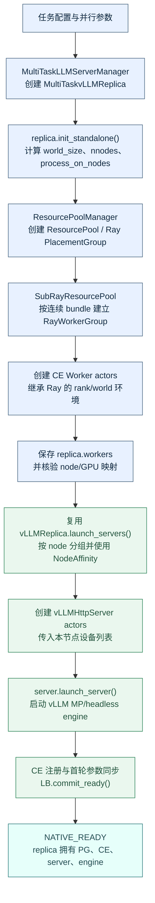

native 路径的关键结果是：`init_standalone()` 创建了新的 PG，`RayWorkerGroup` 从该 PG 的资源池推导 Worker placement，replica 对 PG 和所有运行时对象拥有完整所有权。后续销毁 native replica 时，PG 也属于可回收对象。

#### Borrowed replica：复用 donor placement，重新创建 borrower runtime

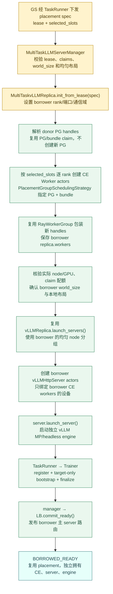

borrowed 路径的“复用”只发生在资源调度键和原生创建方法上：复用 donor PG handle、bundle index，以及 `RayClassWithInitArgs`、`RayWorkerGroup`、`launch_servers()` 和 server 的启动协议；不复用 donor 的 CE Worker actor、rank/world 环境、ServerAdapter、通信域、HTTP server 或 vLLM engine。图中 `B3` 是“复用 placement”，`B4` 之后的每个运行时对象都是新建的 borrower 对象。

两条链路的差异可以归纳为：

| 比较项 | Native | Borrowed |
| --- | --- | --- |
| 资源入口 | `init_standalone()` 创建新的 ResourcePool/PG | `init_from_lease(spec)` 解析已有 donor PG，并使用显式 claims |
| bundle 选择 | 原生资源池推导连续 bundle | `selected_slots` 逐 rank 指定 `(pg_id, bundle_index)`，可跨 PG、非连续、同 bundle 多 claim |
| Worker | 创建并拥有 native CE Workers | 创建 borrower 自己的 CE Workers，不接管 donor handles |
| 拓扑 | 从 native 配置计算 | 从 borrower spec 重新计算，不能复制 donor rank、端口或通信域 |
| HTTP server/engine | 由 native replica 启动 | 调用相同的 `launch_servers()`，但传入 borrower workers 和 borrower 设备映射 |
| 参数同步 | 进入普通全成员同步 | 先 target-only bootstrap，确认版本后再加入 LB；后续才参加普通同步 |
| 资源所有权 | replica 拥有 PG，可随 replica 销毁 | donor 保留 PG 所有权，borrower 只在 lease 有效期间占用 claims |

#### 两条路径如何复用同一套原生组件

下面的交互图展示 borrowed 创建时哪些调用回到原生实现，以及哪些对象明确不复用。它不是第三条替代流程，而是对上面两条线性流程中“复用”关系的展开。

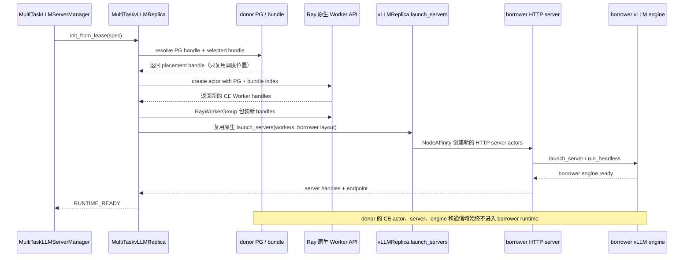

交互图中的 `P` 只返回 placement handle，不能返回 donor Worker 或 server handle；`RW` 返回的新 handles 必须写入 borrower 的 `replica.workers`。因此 borrowed 与 native 能共用原生类方法，但不会因为共用方法而共享运行时状态。

### 5.1 创建边界和组件职责

创建链路只扩展已有类，不增加 `SlotSupervisor`、`ReplicaFactory` 或独立资源池类：

| 组件 | 本方案中的具体职责 | 是否创建新的 Ray 资源池 |
| --- | --- | --- |
| `TaskRunner`/`Rollouter` | 接收 GS 下发的 placement metadata，调用本任务 manager | 否 |
| `MultiTaskLLMServerManager` | 校验 lease、锁定 slot、创建/登记 `MultiTaskvLLMReplica`、统一回滚 | 否 |
| `MultiTaskvLLMReplica` | native 路径把配置的 `M=max_colocate_count` 传给原生 PG 创建；borrowed 路径按 borrower 拓扑创建 CE Worker，保存 handles，启动 server/engine | 不创建新 PG；只覆盖入口参数 |
| 原生 `RayClassWithInitArgs` | 为每个 selected slot 提交一个 Ray actor | 否 |
| 原生 `RayWorkerGroup.from_detached()` | 将已经创建的 actor handles 包装成可被 CE manager dispatch 的 worker group | 否 |
| 原生 `vLLMReplica.launch_servers()` | 在均匀节点布局下复用 server 创建流程 | 否 |
| `MultiTaskvLLMHttpServer` | 在每个实际节点启动 borrower 的 HTTP server 和 vLLM engine | 否 |

`MultiTaskvLLMReplica` 的 native 路径仍调用原生 `init_standalone()`；borrowed 路径新增 `init_from_lease(spec)`。后者绝不能调用 `init_standalone()`，因为该方法会新建 `ResourcePool/PlacementGroup`，无法保证使用 donor 释放的具体 bundle。

### 5.2 placement 输入：slot 是调度键，设备信息是校验键

`MultiTaskLLMServerManager.create_borrowed_replica(spec)` 接收第 4 节定义的字典。创建路径至少需要以下字段：

```python
spec = {
    "lease_id": "borrow-...",                    # 本次借用操作的唯一标识
    "pg_namespace": "verl-...",                  # donor PG 所在 Ray namespace
    "selected_slots": [                           # 必须按 borrower rank 排序
        {
            "rank": 0,                            # borrower 的全局 rank
            "pg_id": "...",                      # 调度时解析为 PlacementGroup handle
            "bundle_index": 3,                    # 该 PG 中的精确 bundle，不要求连续
            "claim_id": "borrow-...-rank-0",      # 同一 bundle 内 claim 的唯一标识
            "node_id": "...",                    # 创建后核验 Actor 实际节点
            "gpu_uuid": "GPU-...",               # 创建后核验实际 accelerator 对应设备
            "node_rank": 0,                        # borrower 重新计算的节点 rank
            "local_rank": 0,                       # borrower 在节点内重新计算的 rank
            "gpu_fraction": 0.25,                  # 本 rank 的 GPU/NPU fractional 请求
            "cpu_request": 1.0,                    # 本 rank 的 CPU 请求
        },
    ],
    "borrower_world_size": 4,                     # 新 runtime 的 worker/server world size
    "borrower_process_on_nodes": [2, 2],          # borrower 每个节点的进程数
    "borrower_parallel_config": {"tp": 4, "dp": 1, "pp": 1},
    "max_colocate_count": 4,                      # 新 PG 推荐值；每个 CE actor 默认请求 1/4 GPU/NPU
    "replica_rank": None,                  # manager 分配；server、adapter、IPC 使用该编号
}
```

校验顺序如下：

1. `len(selected_slots) == borrower_world_size`，rank 恰好覆盖 `0..world_size-1`。
2. 每个 `(pg_id, bundle_index, claim_id)` 只出现一次；同一 `(pg_id, bundle_index)` 可以有多个 claim，但必须属于 donor 已授权的 lease。
3. `sum(borrower_process_on_nodes) == borrower_world_size` 且 `len(set(borrower_process_on_nodes)) == 1`；节点布局由 borrower 重新计算，不能复制 donor 的 `process_on_nodes`。
4. 在共同 Ray namespace 中解析每个 `pg_id`，确认 PG 存在且状态为 `CREATED`；跨 namespace 的 PG 不支持。
5. 读取 bundle 的总容量，确认本次 spec 内同一 bundle 的 `sum(gpu_fraction) <= bundle_gpu_capacity`、`sum(cpu_request) <= bundle_cpu_capacity`；这只能排除输入自身超限。其他任务 claims 的累计准入属于 GS，不能从本地记录推算全局余量。
6. `node_id/gpu_uuid` 只作为预期值保存。PG 的 bundle index 不等于物理 GPU 序号，创建后必须从 Actor runtime context 查询实际映射再比较。

因此，碎片化场景不是“把 GPU ID 传给 Ray，让 Ray 直接按 GPU ID 调度”。Ray actor 的精确资源绑定仍由 PG handle 和 bundle index 完成；GPU ID 是创建后的事实核验和 server 设备列表输入。

### 5.3 manager 入口：登记一次可回滚的创建操作

`MultiTaskLLMServerManager.create_borrowed_replica(spec) -> dict` 的流程：

1. 锁外调用 `_validate_create_spec(spec)`，得到不含运行时句柄的归一化副本。
2. 获取 `replica_operation_lock`，按 borrower 主 `lease_id` 查 `borrowed_operations`：相同输入返回已有进度或结果；不同输入报冲突；请求中的非空 replica_rank 只能与旧记录匹配。
3. 仅首次请求检查有效期、任务边界的授权和本地 claim 重复使用情况，调用 `_allocate_replica_rank_locked()` 取号，并在同一临界区写入包含 `spec/replica_rank/CREATING` 的记录。这里没有全局资源预留；GS 已经完成预留。
4. 构造 `MultiTaskvLLMReplica` 后，在调用任何异步初始化前将引用写入记录；然后锁外执行 `await replica.init_from_lease(spec)`。传入 borrower 的并行配置，逐个保存获得的 Worker/server handle。任何阶段失败都保留该 rank 和部分资源记录，不自动重建。
5. 初始化成功后重新持锁，确认仍是本次记录、未收到取消/撤销、lease 允许提交，再将 replica 加入原生列表并登记主 server，写入 RUNTIME_READY 与 `create_result`。失败或取消只记录结果和待核实资源，不伪造已释放。receipt 不包含 runtime 句柄。
6. TaskRunner 只有收到 RUNTIME_READY 才继续 Trainer 注册和当前窗口内的 target-only bootstrap，最后提交 LB READY；收到 CREATING 只可继续等待或重试获取结果。后续 reclaim 仅保留 `reclaim_replica(lease_id)`，不通过额外的编号退役接口处理。

下面的流程图明确两个新增方法的调用时机：`_validate_create_spec()` 在进入锁之前调用，负责无副作用的输入归一化；`_allocate_replica_rank_locked()` 只在“新 lease 首次登记”分支中、持有 `replica_operation_lock` 时调用。重复请求、参数冲突、非法 spec 和创建失败重试都不会再次取号。`init_from_lease()`、PG 解析、Actor 创建和 server 启动全部在释放锁后执行，避免 Ray/VLLM 的长耗时操作阻塞其他管理请求。

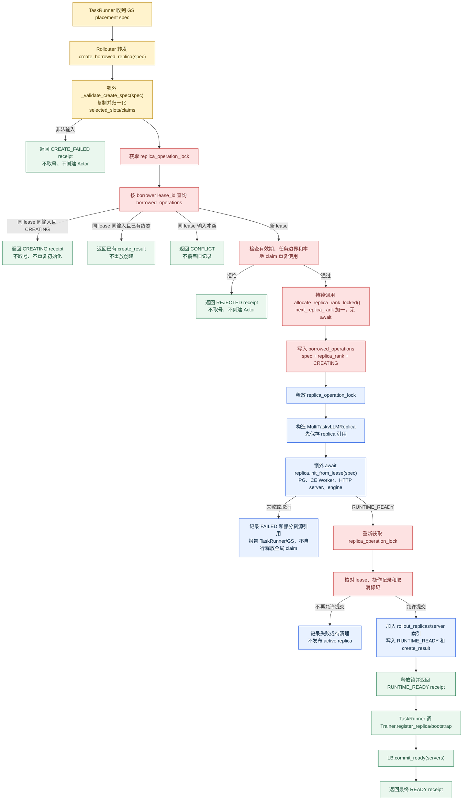

### 5.4 `init_from_lease()`：解析 PG、重排 borrower 拓扑

`MultiTaskvLLMReplica.init_from_lease(spec) -> None` 只负责建立 borrowed runtime，不负责把它直接接入全局 LB。方法内部按以下顺序执行：

1. 设置 `allocation_kind="borrowed"`、`owns_resource_pool=False`、`lease_id`、`runtime_state="CREATING"` 和 `rollout_mode=STANDALONE`。
2. 根据 `pg_namespace` 和 `pg_id` 得到 `PlacementGroup` handles；不调用 `ResourcePoolManager.create_resource_pool()`，也不调用 `init_standalone()`。
3. 按 `selected_slots.rank` 排序，重新生成 borrower 的 `rank/node_rank/local_rank` 视图。donor 的 rank、master port、local world size 和 server 拓扑全部丢弃。
4. 设置 `self.world_size`、`self.nnodes`、`self.gpus_per_replica_node` 和 `process_on_nodes=[gpus_per_replica_node] * nnodes`；borrowed 直接复用原生均匀布局的 server 切分。
5. 根据 borrower world size 生成独立的 `MASTER_ADDR/MASTER_PORT`、`WORLD_SIZE`、`RANK` 和通信域前缀；这些信息只属于本次 borrower runtime。
6. 调用本章 5.5 的碎片化 Worker 创建方法；所有 Worker 和 server 成功后才把状态改为 `RUNTIME_READY`。

### 5.5 按显式 `(PG, bundle_index)` 创建 CE Worker

原生 `RayWorkerGroup(resource_pool=...)` 的构造路径只能从 `ResourcePool.store` 推导 PG 顺序和连续 local rank，所以不能直接表达 `PG1/1、PG1/4、PG2/0、PG2/3` 或同一 `PG1/3` 上的多个 fractional claim。扩展路径在 `MultiTaskvLLMReplica` 内增加一个私有方法 `_create_workers_from_claims()`，但不新增类，具体做法如下：

1. 调用继承/扩展后的 `get_ray_class_with_init_args()` 得到原生 `RayClassWithInitArgs`。它的 class 仍然是 `CheckpointEngineWorker` 或当前插件已接入的 `MultiTaskCheckpointEngineWorker`；两者均创建 borrower 自己的 CE actor。
2. 为每个 selected slot 创建一个新的 `RayClassWithInitArgs` 包装对象，避免上一个 actor 的 `name`、`runtime_env` 选项泄露给下一个 actor。
3. 给该 actor 设置唯一名称、claim 对应的 `num_cpus=cpu_request`、borrower 生成的 protected env vars，并请求 `num_gpus=gpu_fraction`。这个 fractional GPU 只是 Ray 记账，不是物理显存隔离。
4. 调用 `RayClassWithInitArgs.__call__()`，传入当前 slot 的 PG handle 和 bundle index。该原生方法内部使用 `PlacementGroupSchedulingStrategy(placement_group=pg, placement_group_bundle_index=bundle_index)`，因此不要求 bundle index 连续。
5. 每取得一个 handle 就追加到 `self.workers`，不能等全体初始化成功后才保存。全体 Actor 提交后，用 `RayWorkerGroup.from_detached(worker_handles=self.workers, ray_cls_with_init=bind_args, ...)` 包装 handles。`from_detached()` 在这里的含义是“接管已有 handles 并绑定 dispatch 方法”，不是连接 donor actor，也不是让 Worker 脱离 PG。
6. 保持 `self.workers` 按 borrower rank 排序，供原生 CE manager 汇总和 dispatch；包装或初始化失败时，manager 仍能通过已登记 replica 找到部分 handles。

等价伪代码如下；其中 `create_workers_from_selected_slots` 只是 `MultiTaskvLLMReplica` 的私有方法名，不是要求新增的全局 Factory：

```python
async def _create_workers_from_claims(self, spec, pg_by_id):
    base = self.get_ray_class_with_init_args()
    workers = self.workers  # manager 已保存 self；逐个追加，失败时仍能找回局部 handles

    master_addr, master_port = await self._get_master_addr_port_for_slot(
        pg_by_id[spec["selected_slots"][0]["pg_id"]],
        spec["selected_slots"][0]["bundle_index"],
    )

    for slot in sorted(self.claims, key=lambda item: item["rank"]):
        actor_args = RayClassWithInitArgs(base.cls, *base.args, **base.kwargs)
        actor_args.update_options({
            "name": self._worker_name(spec, slot),
            "num_cpus": slot["cpu_request"],
            "runtime_env": {
                "env_vars": {
                    "WORLD_SIZE": str(spec["borrower_world_size"]),
                    "RANK": str(slot["rank"]),
                    "RAY_LOCAL_WORLD_SIZE": str(
                        spec["borrower_process_on_nodes"][slot["node_rank"]]
                    ),
                    "MASTER_ADDR": master_addr,
                    "MASTER_PORT": master_port,
                    "WG_PREFIX": self._worker_prefix(spec),
                    "WG_BACKEND": "ray",
                }
            },
        })
        workers.append(
            actor_args(
                placement_group=pg_by_id[slot["pg_id"]],
                placement_group_bundle_idx=slot["bundle_index"],
                use_gpu=True,
                num_gpus=slot["gpu_fraction"],
                device_name=get_device_name(),
            )
        )

    bind_args = RayClassWithInitArgs(base.cls, *base.args, **base.kwargs)
    return RayWorkerGroup.from_detached(
        worker_handles=workers,
        ray_cls_with_init=bind_args,
        name_prefix=self._worker_prefix(spec),
        use_gpu=True,
        device_name=get_device_name(),
    )
```

伪代码中的 `_get_master_addr_port_for_slot()` 应复用原生 `get_master_addr_port` actor 的逻辑，并把该辅助 actor 调度到第一个 selected bundle；不能使用 donor 的 master 地址或通信域。创建后还必须调用 worker 的 `get_node_id`/accelerator 查询，确认实际 PG、节点和 GPU UUID 与 lease 一致。同一 bundle 上的多个 claim 要使用不同的 `claim_id`、actor name 和清理记录，但仍可通过相同 `placement_group_bundle_idx` 调度；其 `gpu_fraction` 与 `cpu_request` 参与 GS 的全局配额检查，任务侧只校验本次输入和实际落点。

### 5.6 创建 HTTP server 与 vLLM engine

CE Worker 创建成功后，`MultiTaskvLLMReplica` 按 borrower rank 排序 `self.workers`，设置 `nnodes` 和统一的 `gpus_per_replica_node`，然后直接调用继承的 `vLLMReplica.launch_servers()`。原生方法负责查询每个 Worker 的实际 `(node_id, accelerator_id)`，按固定的每节点 Worker 数分组，使用 `NodeAffinitySchedulingStrategy` 创建每节点一个 `MultiTaskvLLMHttpServer`，并传入本节点设备列表。server 内部启动 borrower 自己的 vLLM engine、TP/DP/PP 通信组和 HTTP endpoint；启动后执行健康检查，确认 engine、Worker 数量、节点和设备映射正确后，返回 `RUNTIME_READY`。NodeAffinity 只负责 HTTP server 的节点位置，CE Worker 的 PG/bundle 绑定仍由前面的 Actor 创建步骤完成。
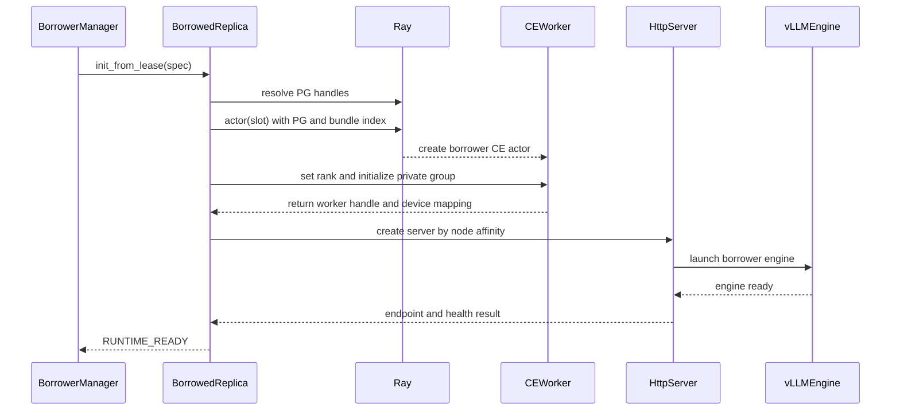

### 5.7 CE 注册和参数同步边界

`RUNTIME_READY` 只表示 borrower 的 CE actor、server 和 engine 已建立。manager 随后把完整 `MultiTaskvLLMReplica` 加入 borrower 任务的 replica 列表并登记 `pending_bootstrap`；Trainer 在同一 rollout 窗口内取得稳定的 borrower 参数快照，调用 target-only `bootstrap_replica()`，只为这个新 replica 建立短生命周期通信域并加载权重。创建 borrowed 时不复用 donor 的 CE Worker、ServerAdapter、engine 或 collective group；bootstrap 完成后，后续正常同步才把它纳入全成员拓扑。

先执行 CE effective set 注册，再在 Trainer 的安全同步点完成 bootstrap 并提交确认版本，最后执行 LB `commit_ready`；不能要求 bootstrap 完成后才允许加入 CE，否则会阻断首次参数同步。因此以下三个状态必须分开记录：`RUNTIME_READY`、`WEIGHTS_READY`、`LB_READY`。

### 5.8 失败回滚和资源归还

创建路径不是 Ray 原子事务，manager 必须记录已创建的每个 actor/server handle 和精确 actor name。任一 PG 无法解析、bundle 配额不足、CE 初始化失败、设备核验失败或 engine 启动失败时，停止发布 endpoint/LB READY，返回 `CREATE_FAILED` 或待清理状态，并保留这些记录供后续生命周期实现处理。资源清理顺序、通信域销毁、claim 最终释放以及是否调用 `destroy()`/`reclaim(lease_id)` 不在本节展开；不得在未核实实际释放前把 claims 报告为空闲，也不得调用 `remove_placement_group()` 删除 donor PG。

### 5.9 原生能力复用和扩展点

| 原生能力 | 创建路径如何使用 | 是否需要扩展 |
| --- | --- | --- |
| `vLLMReplica.init_standalone()` | native replica 继续使用；borrowed 不调用 | 否 |
| `get_ray_class_with_init_args()` | 选择原生 CE Worker 或当前插件 worker class | 只保留现有插件选择逻辑 |
| `RayClassWithInitArgs.__call__()` | 对每个 `(PG, bundle_index)` 提交新 CE actor | 复用 |
| `max_colocate_count` / `M` | 在 native PG 创建时确定 bundle 的 CPU 容量和每个 CE actor 的默认 fractional GPU；borrower 使用 claim 覆盖值，但不能扩大已有 PG | native 初始化需从硬编码 2 改为配置值；manager 增加累计 claim 校验 |
| `RayWorkerGroup._init_with_subresource_pool()` | 仅用于单 PG 连续 bundle 快捷路径 | 碎片化路径绕过 |
| `RayWorkerGroup.from_detached()` | 包装新建的 borrower actor handles，绑定 dispatch 方法 | 复用 |
| `vLLMReplica.launch_servers()` | native/borrowed 均匀节点布局直接复用 | 不扩展 |
| `NodeAffinitySchedulingStrategy` | 仅用于 HTTP server 固定到 worker 所在节点 | 复用 |
| `SubRayResourcePool` | 仅作为连续单 PG 的兼容快捷路径 | 不扩展为碎片化资源池 |

最终边界是：**borrower world size 由 borrower 自己决定，碎片化资源由显式 selected slots/claims 决定，Ray 仍使用 PG/bundle 进行实际调度，node/GPU ID 只用于核验和 server 绑定。** 这同时支持一个四卡 donor 拆成两个两卡 borrower、两个两卡 donor 合成一个四卡 borrower、同一 bundle 多个 CE Worker，以及跨 PG 的非连续 bundle 组合。

## 6. CE Manager 与 borrowed replica 的通信域生命周期

### 6.1 详细方案

**将完整的 borrowed replica 注册到 borrower 任务的 CE Manager，并由同一个 manager 提供 target-only bootstrap 和后续全成员同步。** Manager 保存的是 `replicas`，target-only 操作只在事务期间生成临时 worker 投影；没有另一份需要长期维护的 worker 列表。注册完整 replica 也让原生同步能够调用其暂停生成、释放/恢复 KV 等接口。

但“每轮执行建组函数”不代表底层通信组每轮都会重新创建。[NCCL 原生实现](../../verl/checkpoint_engine/nccl_checkpoint_engine.py:279) 默认 `rebuild_group=False`，会保留旧组并检查 rank/world_size 不变。因此，本方案在 backend 创建前，为**训练端、已有 native 接收端和新增 borrowed 接收端**统一设置 `engine_kwargs.nccl.rebuild_group=True`，使用 `task_id + operation_id/bootstrap_id` 命名空间隔离的 `group_name`。这样上一轮正常 finalize 后已释放旧组，target-only bootstrap 和下一轮全成员同步都能按当次成员建组，不会把旧拓扑误当成当前拓扑。

通信参与者是 borrower 本任务的训练 workers 与 rollout CE Workers；donor 的 CE Workers 不加入。Manager 只负责编排，不是通信 rank。以下采用全量 NCCL 路径；`naive` 不适用于独立 borrowed 接收端。

#### 原生 verl 的一次参数同步流程与扩展插入点

原生 `CheckpointEngineManager.update_weights()` 的主流程如下。`workers` 是本次同步临时收集的 CE Worker handles，不是需要长期单独维护的列表。

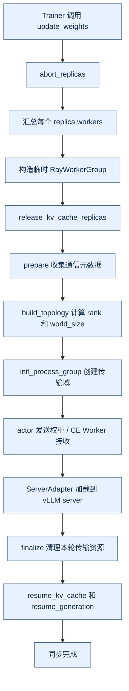

创建只在这个原生流程的边界上插入 target-only bootstrap；销毁/reclaim 目前只保留成员注销和生命周期接口边界：

- **创建 borrowed**：`init_from_lease()` 创建好 CE/server/engine 并得到 `RUNTIME_READY` 后，调用扩展 `register_replica()` 加入 `manager.replicas`；Trainer 在当前 rollout 窗口的最早安全参数快照点调用 `bootstrap_replica(replica_rank)`。该方法在“临时汇总目标 `replica.workers`”后建立目标专用通信域并加载权重，成功后才允许 LB 接流；下一次原生 `update_weights()` 才把 borrowed 纳入全成员同步。
- **销毁 borrowed**：后续实现可在合适的同步边界调用扩展 `unregister_replica()`；server、CE Actor 和 claims 的实际清理不在本节规定。下一次同步只汇总当前成员，继续复用原生 `build_topology/init_process_group`。

因此，不需要为 borrowed 另写一套参数传输协议或新增独立 backend；创建时只增加一次 target-only 通信事务，普通成员快照仍由原生同步处理。扩展点是成员注册、target-only 编排和同步互斥；物理清理确认留待后续生命周期实现。

### 6.2 创建通信域

1. borrowed 的 CE Workers、HTTP server 和 engine 创建完成后，`Trainer.register_replica(replica_rank)` 获取本任务的 replica 投影。
2. 扩展 CE Manager 的 `register_replica(replica)` 在同步 gate 内去重，复用原生 `add_replicas([replica])` 加入成员，并写入 `pending_bootstrap`。
3. Trainer 在 `parameter_snapshot_gate` 内读取一次 `current_param_version`，冻结为内部版本 `V`，再调用 CE manager 的 `bootstrap_replica(replica, snapshot_version=V)`；对外的 Trainer 方法不暴露 `target_version` 参数。该方法只临时汇总目标 `replica.workers` 与 borrower 训练 workers，包装 `RayWorkerGroup`，调用原生 `build_process_group(rollout)`。
4. 该函数依次执行 `prepare → build_topology → init_process_group`：准备资源、计算传输 rank/连接关系、在训练与目标接收 workers 中建立通信域。同阶段的各 rank RPC 并发提交并等待；全程持有 CE gate，并受训练侧参数快照 gate 保护。
5. 随后复用原生权重发送、接收和 ServerAdapter 加载流程；target-only `finalize()` 成功、版本确认并通过健康检查后，borrowed 才能接入 LB。后续全成员同步再按常规路径重建/复用完整拓扑。

这里创建的是权重传输域，不会重新创建 CE Actor，也不改变其 PG/GPU 绑定。

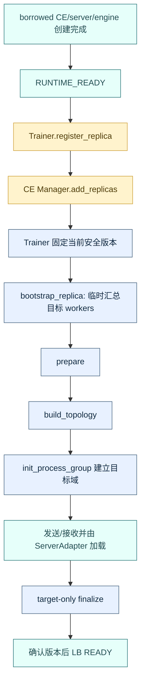

### 6.3 销毁通信域与重建

启用 `rebuild_group=True` 后，每轮权重同步成功结束时，原生 manager 会在训练端和接收端调用 backend 的 `finalize()`，由参与 rank 销毁本轮 collective group 并释放本轮 bucket。target-only bootstrap 也复用同一条原生 `prepare → build_topology → init_process_group → finalize` 边界。

本节只定义 CE 成员接口：`register_replica()` 把新 borrowed replica 加入 manager 的成员投影，`unregister_replica()` 将其从后续同步快照中移除；成员变更必须受现有同步 gate 保护。至于何时调用 `reclaim(lease_id)`、何时销毁 server/CE Actor、如何处理在途请求和失败回滚，留待后续生命周期实现。下一次 `update_weights()` 只汇总当前成员，继续复用原生 backend 建组逻辑。

### 6.4 清理哪些资源

| 资源 | 如何处理 |
| --- | --- |
| 本轮参数传输组与 bucket | 复用 NCCL `finalize()`；NIXL 则由原生 finalize 移除 remote agents、注销内存并释放 buffers |
| NCCL 接收端的 ZMQ SUB 连接 | 当前文档只要求由对应 backend/Actor 生命周期负责；具体关闭时机和确认接口留待生命周期实现 |
| CE Worker 的长期 Gloo、adapter/IPC 状态及 vLLM 并行组 | 不因成员登记变更自动推断销毁；replica 的 destroy/reclaim 只预留入口，具体清理由后续实现定义 |

不能将这些清理统一替换为 `torch.distributed.destroy_process_group()`，以免误删训练组或仍需使用的长期控制组。当前只扩展 CE Manager 的成员注册/移除与同步互斥；通信域和 runtime 的实际清理接口留待后续实现，CE Worker 不新增通用生命周期方法。

## 7. 生命周期能力的调用边界

本节只定义接口、输入和返回约定，不展开全局调度事务或组件执行顺序。创建仍按第 5 节实现；其余操作是预留入口。

| 操作 | 已有类中的扩展入口 | 当前只确定的输入/输出 |
| --- | --- | --- |
| 创建 borrowed | manager.create_borrowed_replica(spec) → replica.init_from_lease(spec) | 使用 placement spec 创建 runtime；成功返回 `RUNTIME_READY` receipt |
| native/borrowed sleep | replica.sleep()、server.sleep() | 仅预留无参入口，沿原生返回 `None`；外层 receipt、level、请求处理和显存语义待定 |
| native/borrowed wake | replica.wake_up(tags=None)、server.wake_up(tags=None) | 仅预留兼容原生参数的入口，沿原生返回 `None`；具体权重追平和接流语义待定 |
| 销毁 | replica.destroy()、server.shutdown() | replica 预留返回可序列化 receipt，server 保持 `None` 返回；不在本节决定是否删除 PG |
| borrowed reclaim | manager.reclaim_replica(lease_id) → replica.reclaim(lease_id) | `lease_id` 是 borrower 主 lease；返回包含 `lease_id`、`claim_ids`、状态和错误信息的 receipt，具体资源清理顺序待定 |

这些接口不能在内部猜测或直接访问另一 actor 内的 CE manager/LB。后续实现应由拥有相应句柄的已有组件完成摘流、成员变更和资源核实，再调用 replica/server 的预留入口。

CE 清理也不是统一调用一次 `finalize()` 即可：需按当前 backend 处理 collective group、远端 agent、注册内存和 adapter；worker 的全局 Gloo group 与一次 CE 参数传输通信域是不同对象。上述差异只作为后续实现约束记录，不在当前文档编排完整流程。

## 8. 文档方案的实现与验证边界

实现顺序：先实现 replica 的 `init_from_lease` 和创建期校验，再实现 manager/Rollouter 创建入口，最后接入 TaskRunner、Trainer 的 CE bootstrap。sleep/wake/reclaim/destroy 只做接口占位，不进入本阶段的运行时流程。

落地需要真实 Ray/GPU 验证以下条件，文档分析不等同于这些测试已通过：

- donor/borrower 新 CE actors 使用同一 PG/bundle 和预期物理 GPU；在 M=4 测试中分别使用 0.25 GPU/1 CPU claim，累计配额不超过 bundle 容量，没有新增冲突 PG。
- 同一 bundle 上创建多个 borrower CE Worker 时，重复 bundle key 但 claim_id、rank、actor name、通信域均不同；并发创建不能突破累计 GPU/CPU 配额。
- 分属不同 Ray job 的任务能够按约定解析同一命名 PG；不能只验证单 job，或把同一个 GS namespace 当成所有任务的 namespace。
- 创建前的 donor/borrower 显存、CPU、端口和 IPC 预算满足准入条件；具体 donor 状态切换不在本阶段验证。
- borrower 实际处理本任务请求并加载本任务权重；不会复用 donor 的 Worker、engine、ServerAdapter 或通信域。
- 多卡/跨机分组正确；CE 自身 rank、参数传输拓扑 rank 和 vLLM 并行 rank 按各自规则工作，不能简单断言三者始终相等。
- HTTP server 名称、job/IPC、通信域和权重更新正确隔离；borrower 权重只到 borrower engine。
- 重复创建和部分 rank 创建失败不会提交多份 `RUNTIME_READY`；失败记录保留精确 actor 名称和 claims 状态，供后续清理实现使用。
- TaskRunner 的创建命令在长时训练期间可执行；CE 注册和 target-only bootstrap 不与参数同步并发冲突。
- 本阶段只实测 borrower CE/server/engine 创建与 bootstrap 的耗时及峰值显存；reclaim/destroy/sleep/wake 的耗时另行验证。

## 9. 当前 MVP 范围

- 只扩展已有 MultiTask 类；native/borrowed 共用 MultiTaskvLLMReplica，保留原生 Ray、CE 和 vLLM 创建机制。
- 使用显式 `selected_slots`/fractional claim，支持 donor/borrower 的非同构 world_size、跨 PG 非连续 bundle 和同一 bundle 多 CE Worker；要求 donor PG 原创建者在借用期间存活，且新 PG 从创建时统一使用 M=4 或其他明确的 M。
- 当前 MVP 只展开 borrowed 的 create → `RUNTIME_READY` → CE bootstrap 路径；sleep/wake/reclaim/destroy 只保留接口、字段和 receipt 约定，不设计完整调用流程或缓存策略。
- CE 动态接入优先采用第 6 节的全量 NCCL、全体参与端 `rebuild_group=True` 路径；每轮成功收尾后变更成员，下一轮复用原生建组。该路径只需扩展 CE Manager 的成员管理，不需要有行为的 `MultiTaskCheckpointEngineWorker`。NIXL 需完成连接清理验证后启用，其他 backend 不因符合统一接口就自动获得动态接入能力。
- 全局公平性、完整请求迁移和生产级故障恢复不属于本次能力扩展。

## 10. LB 接口范围声明

本章只记录 LB 侧需要预留的状态和方法，不设计 borrowed 的接流、闭流、请求排空或资源归还完整流程。创建成功后何时 `commit_ready()`、何时 `begin_drain()`/`commit_remove()`，由后续生命周期设计确定；本阶段只实现创建所需的 `READY` 提交边界。

### 10.1 管理对象和完成条件

一个 borrowed replica 在 borrower 的 LB 中对应一个主 server 路由项。manager 保存 runtime、lease 和操作状态；CE Manager 保存参数同步投影；LB 只保存 server 入口、路由状态和请求计数。`commit_ready()`、`begin_drain()`、`commit_remove()` 的具体状态迁移和完成条件留待后续生命周期实现，不能在本阶段把本地状态更新当作 LB 已完成操作。

### 10.2 LB 接口边界图

下图只表示创建阶段需要的 LB 提交边界；`begin_drain()`、`commit_remove()` 和请求排空属于后续生命周期设计，不在当前图中展开。

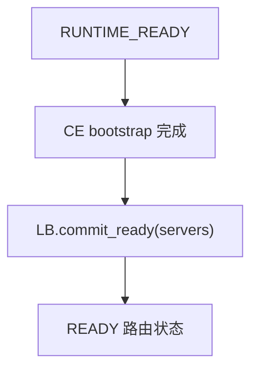

### 10.3 接流边界（预留）

创建阶段只需要保留以下调用边界：`create_borrowed_replica(spec)` 返回 `RUNTIME_READY` → Trainer 完成 `register_replica()` 与 target-only bootstrap → manager 调用 LB `commit_ready(servers)` → 返回最终创建 receipt。LB 的请求计数、粘性路由、并发额度和后续 `acquire/release` 行为沿用原生接口，接流后的运行时流程不在当前文档设计。

### 10.4 闭流、回收和销毁边界（预留）

`begin_drain()`、`commit_remove()`、`unregister_replica()`、`reclaim_replica(lease_id)` 和 `destroy()` 只在本节登记为后续接口。它们的调用顺序、在飞请求处理、AgentLoop abort/续推、CE gate 协调、server/engine 退出和 claim 归还均不在当前设计；实现时必须以 receipt 和状态字段表示“已请求”“进行中”“已确认”，不能用 `None` 或单个 LB 状态推断完整回收成功。

### 10.5 在飞请求、AgentLoop 与重试（后续设计）

当前文档不选择自然排空、强制 abort、partial rollout 或 AgentLoop 续推方案，也不把 `abort_all_requests()` 等原生方法组合成回收流程。后续实现必须单独验证迟到 RPC、LB 计数、客户端重试和 CE 同步之间的竞态。

### 10.6 LB 验证边界

本阶段只验证 `commit_ready()` 能够在 CE bootstrap 成功后提交新 server，并且重复创建不会生成重复路由。`begin_drain()`、`commit_remove()`、在飞请求排空、AgentLoop abort/续推、完整回收和资源归还确认不属于当前 MVP 验证范围。
