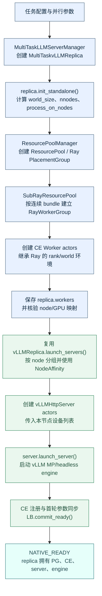
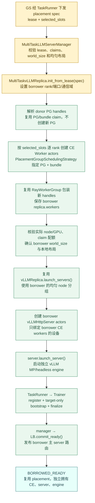
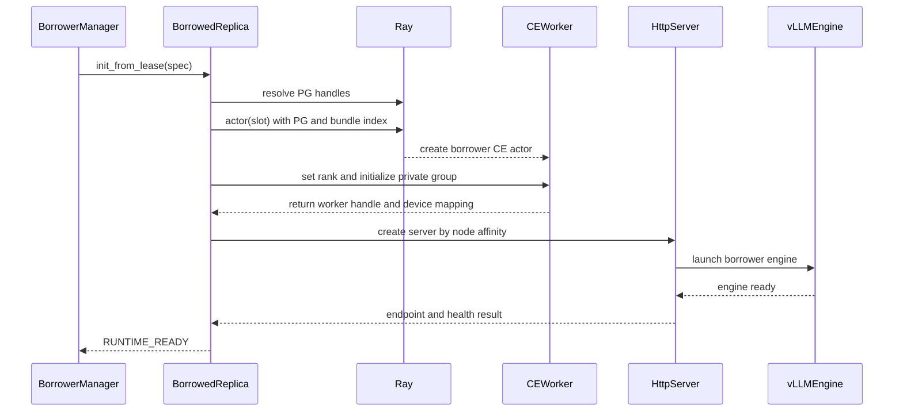
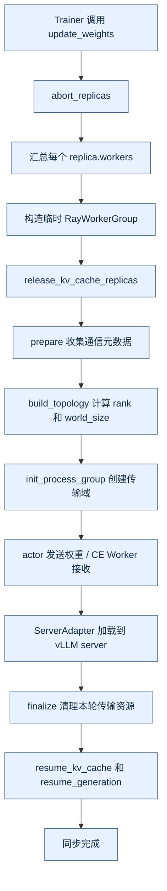
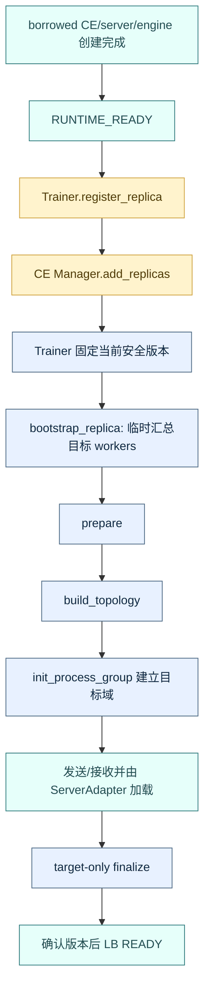

# verl 能力扩展设计：基于原生 Ray Replica 的生命周期扩展


## 1. 创建方案：异构 world_size 与碎片化 bundle

**当前规范方案：donor 保留 PG 的所有权，borrower 从一个或多个 donor lease 获得具体 slot，并创建独立 CE/server/engine。** borrower 的 `world_size` 可以小于、大于或不同于 donor；selected slots 可以来自多个 PG，也可以在每个 PG 内非连续。donor 与 borrower 的运行时状态切换不在当前创建方案中定义；borrower 不复用 donor 的 Worker、engine、ServerAdapter 或通信域。

### 1.1 核心结论和边界

支持以下两类异构转换：

| 场景         | donor 资源                                     | borrower 资源                                                | 设计结论                                                     |
| ------------ | ---------------------------------------------- | ------------------------------------------------------------ | ------------------------------------------------------------ |
| 一拆二       | 一个 `world_size=4` 的 donor，释放 4 个 slot   | 两个 `world_size=2` 的 borrower，各取得其中 2 个 slot        | 可行；两个 borrower 分别建立独立 CE 通信域、HTTP server、engine 和 LB |
| 二合一       | 两个 `world_size=2` 的 donor，各释放 2 个 slot | 一个 `world_size=4` 的 borrower，取得两个 donor 的 4 个 slot | 可行；borrower 的 4 个 rank 可以跨两个 PG，按实际节点布局创建 server/engine |
| 任意碎片组合 | 多个 donor 释放的非连续 bundle                 | 一个或多个 borrower                                          | 可行，但必须逐 rank 指定 `(PG, bundle_index)`，不能继续使用 `bundle_start` 推导位置 |

这里的“可行”有一个重要前提：donor 必须把其原有推理 runtime 作为一个整体安全摘除。一个 vLLM replica 通常是一个完整的 CE/engine 通信组，不能只因为其中两个 rank 暂时空闲，就把另外两个 rank 留在原 engine 中并同时把前两个 rank 借出去。因而：

- `4 → 2 + 2`：将四个可授权 slot 分成两个 lease，再分别创建两个两卡 borrower；donor 的运行时状态切换留待生命周期接口实现；
- `2 + 2 → 4`：两个 donor 都完整 drain 并释放各自的两个 slot，再由一个 borrower 组成新的 4 rank runtime；
- 若未来要支持 donor 保留剩余 rank、只借出部分 rank，必须把 donor 本身拆成多个独立 replica，或实现 vLLM/CE 的可分区执行组；本节不把它假定为已具备的能力。

donor 的原 `world_size` 只决定它如何被安全停止和回收；borrower 的 `world_size` 决定新 CE Worker 数量、`WORLD_SIZE`、vLLM rank 数和参数同步拓扑。两者不共享 rank、engine、ServerAdapter 或通信域。


## 1.borrowed replica 的具体创建方案

**当前规范方案：donor 保留 PG 的所有权，borrower 从一个或多个 donor lease 获得具体 slot，并创建独立 CE/server/engine。** borrower 的 `world_size` 可以小于、大于或不同于 donor；selected slots 可以来自多个 PG，也可以在每个 PG 内非连续。donor 与 borrower 的运行时状态切换不在当前创建方案中定义；borrower 不复用 donor 的 Worker、engine、ServerAdapter 或通信域。

先澄清一个容易混淆的点：**不是绕过 Ray，也不是仅凭 `node_id/gpu_id` 创建 RayWorkerGroup。** 要绕过的是 `SubRayResourcePool` 和 `RayWorkerGroup._init_with_subresource_pool()` 对“单个 PG、连续 bundle 区间、固定本地 world size”的假设。真正创建 CE Worker 时仍然使用 Ray 的 `PlacementGroupSchedulingStrategy`，以 `(pg_id, bundle_index)` 指定资源槽位；`node_id` 和 `gpu_uuid` 只用于校验实际落点以及后续 HTTP server 的 NodeAffinity/设备映射。

### 1.1 创建边界和组件职责

创建链路只扩展已有类，不增加 `SlotSupervisor`、`ReplicaFactory` 或独立资源池类：

| 组件                                  | 本方案中的具体职责                                           | 是否创建新的 Ray 资源池     |
| ------------------------------------- | ------------------------------------------------------------ | --------------------------- |
| `TaskRunner`/`Rollouter`              | 接收 GS 下发的 placement metadata，调用本任务 manager        | 否                          |
| `MultiTaskLLMServerManager`           | 校验 lease、锁定 slot、创建/登记 `MultiTaskvLLMReplica`、统一回滚 | 否                          |
| `MultiTaskvLLMReplica`                | native 路径把配置的 `M=max_colocate_count` 传给原生 PG 创建；borrowed 路径按 borrower 拓扑创建 CE Worker，保存 handles，启动 server/engine | 不创建新 PG；只覆盖入口参数 |
| 原生 `RayClassWithInitArgs`           | 为每个 selected slot 提交一个 Ray actor                      | 否                          |
| 原生 `RayWorkerGroup.from_detached()` | 将已经创建的 actor handles 包装成可被 CE manager dispatch 的 worker group | 否                          |
| 原生 `vLLMReplica.launch_servers()`   | 在均匀节点布局下复用 server 创建流程                         | 否                          |
| `MultiTaskvLLMHttpServer`             | 在每个实际节点启动 borrower 的 HTTP server 和 vLLM engine    | 否                          |

`MultiTaskvLLMReplica` 的 native 路径仍调用原生 `init_standalone()`；borrowed 路径新增 `init_from_lease(spec)`。后者绝不能调用 `init_standalone()`，因为该方法会新建 `ResourcePool/PlacementGroup`，无法保证使用 donor 释放的具体 bundle。

### 1.2 placement 输入：slot 是调度键，设备信息是校验键

`MultiTaskLLMServerManager.create_borrowed_replica(spec)` 接收第 4 节定义的字典。创建路径至少需要以下字段：

```python
spec = {
    "lease_id": "borrow-...",          # 本次 borrower 运行时的租约
    "donor_leases": [                   # 一个或多个 donor 的授权
        {
            "donor_task_id": "task-a",
            "donor_replica_rank": 0,
            "pg_namespace": "verl-...",
            "pg_id": "...",
            "slots": [
                {
                    "bundle_index": 1,
                    "node_id": "...",
                    "gpu_uuid": "GPU-...",
                    "available_gpu": 0.75,
                    "available_cpu": 3.0,
                    "allocated_gpu": 0.25,
                    "allocated_cpu": 1.0,
                },
                # 可以是非连续的 bundle index
            ],
        },
        # 可继续包含 donor-b 的 PG/slots
    ],
    "selected_slots": [                 # 按 borrower rank 排序的最终映射
        {
            "claim_id": "borrow-...-rank-0",  # 同一 bundle 内的 fractional claim 唯一标识
            "rank": 0,
            "pg_id": "...",
            "bundle_index": 1,
            "node_id": "...",
            "gpu_uuid": "GPU-...",
            "node_rank": 0,					   #两个rank由GS编号,rank对应的bundle逻辑上连续，物理上可以不连续
            "local_rank": 0,
            "gpu_fraction": 0.25,              # 本 rank 在该 bundle 上请求的 GPU/NPU 配额
            "cpu_request": 1.0,                # 本 rank 在该 bundle 上请求的 CPU 配额
        },
    ],
    "borrower_world_size": 4,
    "borrower_process_on_nodes": [2, 2],          # borrower 每个节点的进程数；所有节点必须相同
    "borrower_parallel_config": {"tp": 4, "dp": 1, "pp": 1},
    "max_colocate_count": 4,                  # 新 PG 推荐值；每个 CE actor 请求 1/4 GPU/NPU
    "replica_rank": None,                    # manager 分配；幂等重试从 operation 记录恢复
    "expires_at": 0,
}
```

`selected_slots` 必须满足：

1. `len(selected_slots) == borrower_world_size`，且 rank 恰好覆盖 `0..world_size-1`；
2. 每个 claim 的 `(pg_id, bundle_index, claim_id)` 只出现一次，且必须出现在对应 donor lease 中；同一 `(pg_id, bundle_index)` 可以出现多次，但每次必须是不同 claim；
3. `node_rank/local_rank` 由 borrower 重新编号，不能复制 donor 的 rank；
4. 按 `node_rank` 分组后，每个节点的 slot 数都等于同一个 `gpus_per_replica_node`，并满足 `borrower_process_on_nodes == [gpus_per_replica_node] * nnodes`；
5. 每条记录的 PG ID、bundle index、node ID、GPU UUID 和剩余 CPU/GPU 配额在创建前再次查询并核对；
6. 所有 donor lease 必须属于同一个 Ray 集群和可解析的 PG namespace；PG 原创建者在借用期间必须存活；
7. 对每个 bundle 分别累计所有 donor 和 borrower claim：`sum(gpu_fraction) <= bundle_gpu_capacity`、`sum(cpu_request) <= bundle_cpu_capacity`；同时必须为显存、端口、IPC 和 engine 通信缓冲留出预算。

#### Native replica：创建自己的 PG 和运行时



native 路径的关键结果是：`init_standalone()` 创建了新的 PG，`RayWorkerGroup` 从该 PG 的资源池推导 Worker placement，replica 对 PG 和所有运行时对象拥有完整所有权。后续销毁 native replica 时，PG 也属于可回收对象。

#### Borrowed replica：复用 donor placement，重新创建 borrower runtime



borrowed 路径的“复用”只发生在资源调度键和原生创建方法上：复用 donor PG handle、bundle index，以及 `RayClassWithInitArgs`、`RayWorkerGroup`、`launch_servers()` 和 server 的启动协议；不复用 donor 的 CE Worker actor、rank/world 环境、ServerAdapter、通信域、HTTP server 或 vLLM engine。图中 `B3` 是“复用 placement”，`B4` 之后的每个运行时对象都是新建的 borrower 对象。

两条链路的差异可以归纳为：

| 比较项             | Native                                       | Borrowed                                                     |
| ------------------ | -------------------------------------------- | ------------------------------------------------------------ |
| 资源入口           | `init_standalone()` 创建新的 ResourcePool/PG | `init_from_lease(spec)` 解析已有 donor PG，并使用显式 claims |
| bundle 选择        | 原生资源池推导连续 bundle                    | `selected_slots` 逐 rank 指定 `(pg_id, bundle_index)`，可跨 PG、非连续、同 bundle 多 claim |
| Worker             | 创建并拥有 native CE Workers                 | 创建 borrower 自己的 CE Workers，不接管 donor handles        |
| 拓扑               | 从 native 配置计算                           | 从 borrower spec 重新计算，不能复制 donor rank、端口或通信域 |
| HTTP server/engine | 由 native replica 启动                       | 调用相同的 `launch_servers()`，但传入 borrower workers 和 borrower 设备映射 |
| 参数同步           | 进入普通全成员同步                           | 先 target-only bootstrap，确认版本后再加入 LB；后续才参加普通同步 |
| 资源所有权         | replica 拥有 PG，可随 replica 销毁           | donor 保留 PG 所有权，borrower 只在 lease 有效期间占用 claims |

### 1.3 manager 入口：登记一次可回滚的创建操作

`MultiTaskLLMServerManager.create_borrowed_replica(spec) -> dict` 的流程：

1. 检查 `lease_id` 是否已处于 `CREATING`、`RUNTIME_READY` 或 `FAILED`。重复请求返回已有状态，不能重复创建 Actor。
2. 在 manager 的短临界区中按 `(pg_id, bundle_index)` 锁定所有受影响 bundle，并登记每个 `claim_id` 的 GPU/CPU 需求；同一 bundle 可以存在多个 claim，但累计资源不得超过 bundle 容量。
3. 临界区外构造 `MultiTaskvLLMReplica`，传入 borrower 的 `world_size`、`process_on_nodes` 和并行配置；不从 donor 复制这些字段。
4. 调用 `await replica.init_from_lease(spec)`。创建期间任何异常都进入统一回滚；回收请求只能设置取消标记，不能并发销毁正在初始化的半成品。
5. 收到 `RUNTIME_READY` 后，再次检查 lease 和取消标记，保存 replica 引用并向上层返回 endpoint、实际设备映射和 `replica_rank`。
6. runtime 就绪后由 TaskRunner 调 Trainer 注册 CE 投影，并在当前训练权重稳定的最早安全边界执行 target-only bootstrap；确认权重版本和服务条件后再向 LB 提交 READY。`RUNTIME_READY` 和 CE 已注册都不等于已经可以接收请求，也不能把等待下一个周期性全成员同步当作 bootstrap。

### 1.4 `init_from_lease()`：解析 PG、重排 borrower 拓扑

`MultiTaskvLLMReplica.init_from_lease(spec) -> None` 只负责建立 borrowed runtime，不负责把它直接接入全局 LB。方法内部按以下顺序执行：

1. 设置 `allocation_kind="borrowed"`、`owns_resource_pool=False`、`lease_id`、`runtime_state="CREATING"` 和 `rollout_mode=STANDALONE`。
2. 根据 `pg_namespace` 和 `pg_id` 得到 `PlacementGroup` handles；不调用 `ResourcePoolManager.create_resource_pool()`，也不调用 `init_standalone()`。
3. 按 `selected_slots.rank` 排序，重新生成 borrower 的 `rank/node_rank/local_rank` 视图。donor 的 rank、master port、local world size 和 server 拓扑全部丢弃。
4. 设置 `self.world_size`、`self.nnodes`、`self.gpus_per_replica_node` 和 `process_on_nodes=[gpus_per_replica_node] * nnodes`；borrowed 直接复用原生均匀布局的 server 切分。
5. 根据 borrower world size 生成独立的 `MASTER_ADDR/MASTER_PORT`、`WORLD_SIZE`、`RANK` 和通信域前缀；这些信息只属于本次 borrower runtime。
6. 调用本章 5.5 的碎片化 Worker 创建方法；所有 Worker 和 server 成功后才把状态改为 `RUNTIME_READY`。

### 1.5 按显式 `(PG, bundle_index)` 创建 CE Worker

原生 `RayWorkerGroup(resource_pool=...)` 的构造路径只能从 `ResourcePool.store` 推导 PG 顺序和连续 local rank，所以不能直接表达 `PG1/1、PG1/4、PG2/0、PG2/3` 或同一 `PG1/3` 上的多个 fractional claim。扩展路径在 `MultiTaskvLLMReplica` 内增加一个私有方法 `_create_workers_from_claims()`，但不新增类，具体做法如下：

1. 调用继承/扩展后的 `get_ray_class_with_init_args()` 得到原生 `RayClassWithInitArgs`。它的 class 仍然是 `CheckpointEngineWorker` 或当前插件已接入的 `MultiTaskCheckpointEngineWorker`；两者均创建 borrower 自己的 CE actor。
2. 为每个 selected slot 创建一个新的 `RayClassWithInitArgs` 包装对象，避免上一个 actor 的 `name`、`runtime_env` 选项泄露给下一个 actor。
3. 给该 actor 设置唯一名称、claim 对应的 `num_cpus=cpu_request`、borrower 生成的 protected env vars，并请求 `num_gpus=gpu_fraction`。这个 fractional GPU 只是 Ray 记账，不是物理显存隔离。
4. 调用 `RayClassWithInitArgs.__call__()`，传入当前 slot 的 PG handle 和 bundle index。该原生方法内部使用 `PlacementGroupSchedulingStrategy(placement_group=pg, placement_group_bundle_index=bundle_index)`，因此不要求 bundle index 连续。
5. 所有 actor handle 提交后，使用 `RayWorkerGroup.from_detached(worker_handles=workers, ray_cls_with_init=bind_args, ...)` 包装 handles。`from_detached()` 在这里的含义是“接管已有 handles 并绑定 dispatch 方法”，不是连接 donor actor，也不是让 Worker 脱离 PG。
6. 把包装后的 `worker_group.workers` 按 borrower rank 写入 `self.workers`，供原生 CE manager 汇总和 dispatch。

等价伪代码如下；其中 `create_workers_from_selected_slots` 只是 `MultiTaskvLLMReplica` 的私有方法名，不是要求新增的全局 Factory：

```python
async def _create_workers_from_claims(self, spec, pg_by_id):
    base = self.get_ray_class_with_init_args()
    workers = []

    master_addr, master_port = await self._get_master_addr_port_for_slot(
        pg_by_id[spec["selected_slots"][0]["pg_id"]],
        spec["selected_slots"][0]["bundle_index"],
    )

    for slot in sorted(self.claims, key=lambda item: item["rank"]):
        actor_args = RayClassWithInitArgs(base.cls, *base.args, **base.kwargs)
        actor_args.update_options({
            "name": self._worker_name(spec, slot),
            "num_cpus": slot["cpu_request"],
            "runtime_env": {
                "env_vars": {
                    "WORLD_SIZE": str(spec["borrower_world_size"]),
                    "RANK": str(slot["rank"]),
                    "RAY_LOCAL_WORLD_SIZE": str(
                        spec["borrower_process_on_nodes"][slot["node_rank"]]
                    ),
                    "MASTER_ADDR": master_addr,
                    "MASTER_PORT": master_port,
                    "WG_PREFIX": self._worker_prefix(spec),
                    "WG_BACKEND": "ray",
                }
            },
        })
        workers.append(
            actor_args(
                placement_group=pg_by_id[slot["pg_id"]],
                placement_group_bundle_idx=slot["bundle_index"],
                use_gpu=True,
                num_gpus=slot["gpu_fraction"],
                device_name=get_device_name(),
            )
        )

    bind_args = RayClassWithInitArgs(base.cls, *base.args, **base.kwargs)
    return RayWorkerGroup.from_detached(
        worker_handles=workers,
        ray_cls_with_init=bind_args,
        name_prefix=self._worker_prefix(spec),
        use_gpu=True,
        device_name=get_device_name(),
    )
```

伪代码中的 `_get_master_addr_port_for_slot()` 应复用原生 `get_master_addr_port` actor 的逻辑，并把该辅助 actor 调度到第一个 selected bundle；不能使用 donor 的 master 地址或通信域。创建后还必须调用 worker 的 `get_node_id`/accelerator 查询，确认实际 PG、节点和 GPU UUID 与 lease 一致。同一 bundle 上的多个 claim 要使用不同的 `claim_id`、actor name 和清理记录，但仍可通过相同 `placement_group_bundle_idx` 调度；其 `gpu_fraction` 与 `cpu_request` 必须分别参与 manager 的累计配额检查。

### 1.6 创建 HTTP server 与 vLLM engine

CE Worker 创建成功后，`MultiTaskvLLMReplica` 按 borrower rank 排序 `self.workers`，设置 `nnodes` 和统一的 `gpus_per_replica_node`，然后直接调用继承的 `vLLMReplica.launch_servers()`。原生方法负责查询每个 Worker 的实际 `(node_id, accelerator_id)`，按固定的每节点 Worker 数分组，使用 `NodeAffinitySchedulingStrategy` 创建每节点一个 `MultiTaskvLLMHttpServer`，并传入本节点设备列表。server 内部启动 borrower 自己的 vLLM engine、TP/DP/PP 通信组和 HTTP endpoint；启动后执行健康检查，确认 engine、Worker 数量、节点和设备映射正确后，返回 `RUNTIME_READY`。NodeAffinity 只负责 HTTP server 的节点位置，CE Worker 的 PG/bundle 绑定仍由前面的 Actor 创建步骤完成。



### 1.7 CE 注册和参数同步边界

`RUNTIME_READY` 只表示 borrower 的 CE actor、server 和 engine 已建立。manager 随后把完整 `MultiTaskvLLMReplica` 加入 borrower 任务的 replica 列表并登记 `pending_bootstrap`；Trainer 在同一 rollout 窗口内取得稳定的 borrower 参数快照，调用 target-only `bootstrap_replica()`，只为这个新 replica 建立短生命周期通信域并加载权重。创建 borrowed 时不复用 donor 的 CE Worker、ServerAdapter、engine 或 collective group；bootstrap 完成后，后续正常同步才把它纳入全成员拓扑。

先执行 CE effective set 注册，再在 Trainer 的安全同步点完成 bootstrap 并提交确认版本，最后执行 LB `commit_ready`；不能要求 bootstrap 完成后才允许加入 CE，否则会阻断首次参数同步。因此以下三个状态必须分开记录：`RUNTIME_READY`、`WEIGHTS_READY`、`LB_READY`。

### 1.8 失败回滚和资源归还

创建路径不是 Ray 原子事务，manager 必须记录已创建的每个 actor/server handle 和精确 actor name。任一 PG 无法解析、bundle 配额不足、CE 初始化失败、设备核验失败或 engine 启动失败时，停止发布 endpoint/LB READY，返回 `CREATE_FAILED` 或待清理状态，并保留这些记录供后续生命周期实现处理。资源清理顺序、通信域销毁、claim 最终释放以及是否调用 `destroy()`/`reclaim(lease_id)` 不在本节展开；不得在未核实实际释放前把 claims 报告为空闲，也不得调用 `remove_placement_group()` 删除 donor PG。

### 1.9 原生能力复用和扩展点

| 原生能力                                       | 创建路径如何使用                                             | 是否需要扩展                                                 |
| ---------------------------------------------- | ------------------------------------------------------------ | ------------------------------------------------------------ |
| `vLLMReplica.init_standalone()`                | native replica 继续使用；borrowed 不调用                     | 否                                                           |
| `get_ray_class_with_init_args()`               | 选择原生 CE Worker 或当前插件 worker class                   | 只保留现有插件选择逻辑                                       |
| `RayClassWithInitArgs.__call__()`              | 对每个 `(PG, bundle_index)` 提交新 CE actor                  | 复用                                                         |
| `max_colocate_count` / `M`                     | 在 native PG 创建时确定 bundle 的 CPU 容量和每个 CE actor 的默认 fractional GPU；borrower 使用 claim 覆盖值，但不能扩大已有 PG | native 初始化需从硬编码 2 改为配置值；manager 增加累计 claim 校验 |
| `RayWorkerGroup._init_with_subresource_pool()` | 仅用于单 PG 连续 bundle 快捷路径                             | 碎片化路径绕过                                               |
| `RayWorkerGroup.from_detached()`               | 包装新建的 borrower actor handles，绑定 dispatch 方法        | 复用                                                         |
| `vLLMReplica.launch_servers()`                 | native/borrowed 均匀节点布局直接复用                         | 不扩展                                                       |
| `NodeAffinitySchedulingStrategy`               | 仅用于 HTTP server 固定到 worker 所在节点                    | 复用                                                         |
| `SubRayResourcePool`                           | 仅作为连续单 PG 的兼容快捷路径                               | 不扩展为碎片化资源池                                         |

最终边界是：**borrower world size 由 borrower 自己决定，碎片化资源由显式 selected slots/claims 决定，Ray 仍使用 PG/bundle 进行实际调度，node/GPU ID 只用于核验和 server 绑定。** 这同时支持一个四卡 donor 拆成两个两卡 borrower、两个两卡 donor 合成一个四卡 borrower、同一 bundle 多个 CE Worker，以及跨 PG 的非连续 bundle 组合。

## 2. CE Manager 与 borrowed replica 的通信域生命周期

### 2.1 详细方案

**将完整的 borrowed replica 注册到 borrower 任务的 CE Manager，并由同一个 manager 提供 target-only bootstrap 和后续全成员同步。** Manager 保存的是 `replicas`，target-only 操作只在事务期间生成临时 worker 投影；没有另一份需要长期维护的 worker 列表。注册完整 replica 也让原生同步能够调用其暂停生成、释放/恢复 KV 等接口。

但“每轮执行建组函数”不代表底层通信组每轮都会重新创建。[NCCL 原生实现](../../verl/checkpoint_engine/nccl_checkpoint_engine.py:279) 默认 `rebuild_group=False`，会保留旧组并检查 rank/world_size 不变。因此，本方案在 backend 创建前，为**训练端、已有 native 接收端和新增 borrowed 接收端**统一设置 `engine_kwargs.nccl.rebuild_group=True`，使用 `task_id + operation_id/bootstrap_id` 命名空间隔离的 `group_name`。这样上一轮正常 finalize 后已释放旧组，target-only bootstrap 和下一轮全成员同步都能按当次成员建组，不会把旧拓扑误当成当前拓扑。

通信参与者是 borrower 本任务的训练 workers 与 rollout CE Workers；donor 的 CE Workers 不加入。Manager 只负责编排，不是通信 rank。以下采用全量 NCCL 路径；`naive` 不适用于独立 borrowed 接收端。

#### 原生 verl 的一次参数同步流程与扩展插入点

原生 `CheckpointEngineManager.update_weights()` 的主流程如下。`workers` 是本次同步临时收集的 CE Worker handles，不是需要长期单独维护的列表。



创建只在这个原生流程的边界上插入 target-only bootstrap；销毁/reclaim 目前只保留成员注销和生命周期接口边界：

- **创建 borrowed**：`init_from_lease()` 创建好 CE/server/engine 并得到 `RUNTIME_READY` 后，调用扩展 `register_replica()` 加入 `manager.replicas`；Trainer 在当前 rollout 窗口的最早安全参数快照点调用 `bootstrap_replica(replica_rank)`。该方法在“临时汇总目标 `replica.workers`”后建立目标专用通信域并加载权重，成功后才允许 LB 接流；下一次原生 `update_weights()` 才把 borrowed 纳入全成员同步。
- **销毁 borrowed**：后续实现可在合适的同步边界调用扩展 `unregister_replica()`；server、CE Actor 和 claims 的实际清理不在本节规定。下一次同步只汇总当前成员，继续复用原生 `build_topology/init_process_group`。

因此，不需要为 borrowed 另写一套参数传输协议或新增独立 backend；创建时只增加一次 target-only 通信事务，普通成员快照仍由原生同步处理。扩展点是成员注册、target-only 编排和同步互斥；物理清理确认留待后续生命周期实现。

### 2.2 创建通信域

1. borrowed 的 CE Workers、HTTP server 和 engine 创建完成后，`Trainer.register_replica(replica_rank)` 获取本任务的 replica 投影。
2. 扩展 CE Manager 的 `register_replica(replica)` 在同步 gate 内去重，复用原生 `add_replicas([replica])` 加入成员，并写入 `pending_bootstrap`。
3. Trainer 在 `parameter_snapshot_gate` 内读取一次 `current_param_version`，冻结为内部版本 `V`，再调用 CE manager 的 `bootstrap_replica(replica, snapshot_version=V)`；对外的 Trainer 方法不暴露 `target_version` 参数。该方法只临时汇总目标 `replica.workers` 与 borrower 训练 workers，包装 `RayWorkerGroup`，调用原生 `build_process_group(rollout)`。
4. 该函数依次执行 `prepare → build_topology → init_process_group`：准备资源、计算传输 rank/连接关系、在训练与目标接收 workers 中建立通信域。同阶段的各 rank RPC 并发提交并等待；全程持有 CE gate，并受训练侧参数快照 gate 保护。
5. 随后复用原生权重发送、接收和 ServerAdapter 加载流程；target-only `finalize()` 成功、版本确认并通过健康检查后，borrowed 才能接入 LB。后续全成员同步再按常规路径重建/复用完整拓扑。

这里创建的是权重传输域，不会重新创建 CE Actor，也不改变其 PG/GPU 绑定。



### 2.3 销毁通信域与重建

启用 `rebuild_group=True` 后，每轮权重同步成功结束时，原生 manager 会在训练端和接收端调用 backend 的 `finalize()`，由参与 rank 销毁本轮 collective group 并释放本轮 bucket。target-only bootstrap 也复用同一条原生 `prepare → build_topology → init_process_group → finalize` 边界。

本节只定义 CE 成员接口：`register_replica()` 把新 borrowed replica 加入 manager 的成员投影，`unregister_replica()` 将其从后续同步快照中移除；成员变更必须受现有同步 gate 保护。至于何时调用 `reclaim(lease_id)`、何时销毁 server/CE Actor、如何处理在途请求和失败回滚，留待后续生命周期实现。下一次 `update_weights()` 只汇总当前成员，继续复用原生 backend 建组逻辑。

### 2.4 清理哪些资源

| 资源                                                  | 如何处理                                                     |
| ----------------------------------------------------- | ------------------------------------------------------------ |
| 本轮参数传输组与 bucket                               | 复用 NCCL `finalize()`；NIXL 则由原生 finalize 移除 remote agents、注销内存并释放 buffers |
| NCCL 接收端的 ZMQ SUB 连接                            | 当前文档只要求由对应 backend/Actor 生命周期负责；具体关闭时机和确认接口留待生命周期实现 |
| CE Worker 的长期 Gloo、adapter/IPC 状态及 vLLM 并行组 | 不因成员登记变更自动推断销毁；replica 的 destroy/reclaim 只预留入口，具体清理由后续实现定义 |

不能将这些清理统一替换为 `torch.distributed.destroy_process_group()`，以免误删训练组或仍需使用的长期控制组。当前只扩展 CE Manager 的成员注册/移除与同步互斥；通信域和 runtime 的实际清理接口留待后续实现，CE Worker 不新增通用生命周期方法。

## 3. 扩展类的成员、方法与实现理由

本节只描述“原生 verl 仍保留什么、multi-task 为什么扩展什么、扩展方法怎样工作”。`[原生继承]` 表示直接复用 verl 的字段或方法；`[原生覆写]` 表示保留原生对外契约，但改变初始化或提交时机；`[新增]` 表示 multi-task 新增的状态或入口。所有新增接口都必须保持原生调用方能够理解的 `replica_rank`、`workers`、`servers`、`server_address` 等字段，避免为 borrowed replica 再造一套不兼容的对象模型。

本版本的资源模型是 **claim（容量声明）**，而不是“一个 bundle 只能属于一个 replica”。`max_colocate_count=M` 是一个 bundle 的逻辑容量；推荐新建 PG 时使用 `CPU=M、GPU=1`，每个 CE Worker 默认申请 `cpu_request=1、gpu_fraction=1/M`。因此同一 `(pg_id, bundle_index)` 可以出现多个不同 `claim_id`，但其 `gpu_fraction` 和 `cpu_request` 的累计值不能超过 bundle 容量。borrowed replica 可以从多个 PG、多个 donor replica 取得 claims，`world_size` 等于 claims 数量，因而允许 donor/borrower 的 world_size 不同以及碎片化 bundle。

### 3.0 字典和句柄的共同约定

扩展字段中的字典有明确的 key/value 结构。下列结构是组件之间传递的协议；Ray ActorHandle、PlacementGroup handle 和 Python 对象只保留在本地 manager/replica 中，不能序列化给 GS。

**Claim 记录（`claim: dict`）**

```python
{
    "claim_id": str,             # 全局唯一的容量声明 ID
    "lease_id": str,             # donor 授权的租约 ID
    "donor_task_id": str,
    "donor_replica_rank": int,   # donor 任务内稳定的 replica_rank
    "pg_id": str,
    "bundle_index": int,
    "node_id": str,
    "gpu_uuid": str,
    "local_gpu_index": int | None,
    "node_rank": int,
    "local_rank": int,
    "gpu_fraction": float,       # 该 Worker 在 bundle 上占用的 GPU 份额
    "cpu_request": float,        # 该 Worker 在 bundle 上占用的 CPU 份额
}
```

同一 bundle 的 `claim_id` 必须不同；`pg_id/bundle_index` 可以相同。`node_id/gpu_uuid` 用于校验实际设备和生成 `CUDA_VISIBLE_DEVICES`，不直接替代 Ray 的 PlacementGroup 调度键。

**Placement 规格（`spec: dict`）**

```python
{
    "operation_id": str,
    "lease_id": str,                 # borrower 侧本次 replica 的主租约；Rollouter 回收时使用
    "lease_ids": list[str],           # donor/source lease 列表；兼容旧 placement contract
    "borrower_task_id": str,
    "borrower_replica_id": str,       # [兼容字段] 外部不透明标识；任务内定位以 replica_rank 为准
    "replica_rank": int | None,      # 由 manager 分配；重试时可从已有 operation 记录恢复
    "claims": list[Claim],            # 外部旧名称 selected_slots 进入 manager 后归一化为 claims
    "world_size": int,
    "max_colocate_count": int,
    "expires_at": float,
    "placement_epoch": int,
}
```

`claims` 是唯一的资源真相；`world_size` 只是校验值，必须等于 `len(claims)`。`lease_ids` 允许一个 borrowed replica 由多个 donor/source lease 拼成，而顶层 `lease_id` 是 borrower 对这次完整运行时借用的主租约。spec 中不包含 actor handles、Ray worker group 或 GS 句柄。

第 4、5 节为了保持已有 placement contract，仍使用 `selected_slots` 这个字段名。实现入口必须先执行 `selected_slots -> claims` 的归一化；归一化后，manager、replica 和 CE manager 只使用同一份 claim list，不能同时维护两份可变列表。

**跨组件返回值**统一使用可序列化的 receipt：`{"operation_id", "lease_id(s)", "replica_rank", "state", "released", "error"}`。成功返回 `released=True` 的前提是实际 Actor、server 和 claim 都已清理；仅收到超时或取消不能伪造成功。

这里需要区分两种容易被同名字段混淆的租约标识：

- Rollouter 的 `reclaim_replica(lease_id)` 使用的是**本次 borrowed replica 的 borrower lease**。它标识一个完整的借用生命周期，覆盖该 replica 的全部 claims，因此可作为回收、幂等重试和过期校验的主键。
- `Claim` 中的 `lease_id` 表示 donor 对某个 claim 的授权。一个碎片化 replica 可能由多个 donor lease 组成，因此 spec 需要同时保存 `lease_ids`。实现时建议将 Claim 字段内部重命名为 `source_lease_id`，或至少在边界归一化时明确它不是 Rollouter 回收接口的主 lease。

如果暂时不能改字段名，manager 必须在 `create_borrowed_replica()` 登记时建立 `borrower_lease_id -> source_lease_ids -> claim_ids` 的映射。Rollouter 只把 borrower lease 传给回收入口，manager 再根据映射一次性释放所有 source claims；不能把其中一个 donor lease 当成整个 replica 的回收依据。

**`lease_id`、`claim_id` 和 `replica_rank` 的区别**

| 标识           | 表示什么                                                     | 主要用途                                             |
| -------------- | ------------------------------------------------------------ | ---------------------------------------------------- |
| `lease_id`     | 一次资源借用授权；关联 borrower、资源范围、有效期和归还状态  | 校验借用是否有效，组织创建、回收和重试               |
| `claim_id`     | 一个 bundle 上的一笔资源份额占用；关联 PG、bundle、GPU fraction、CPU 数量和所属 source lease | 逐笔预留、容量记账、冲突检查和释放                   |
| `replica_rank` | 一个任务内具体 replica 的稳定编号                            | 定位运行时对象；跨任务使用 `(task_id, replica_rank)` |

一个 lease 可以覆盖多个 claims，一个 replica 通常也对应多个 claims。`claim_id` 不代表整个 replica，也不代表物理 GPU；不同借用可以在同一 bundle 上拥有不同 claim，累计份额仍须受 bundle 容量约束。fractional GPU 是 Ray 记账份额，不代表物理显存隔离。

例如，borrower 借用两张卡创建一个两卡 replica：

```text
borrower 主 lease：L1；borrower replica_rank：7
  donor source lease：S1
    claim C1：PG-A / bundle 0，GPU fraction=0.25，CPU=该 claim 的申请量
    claim C2：PG-A / bundle 3，GPU fraction=0.25，CPU=该 claim 的申请量
```

回收 L1 时，先安全退出并销毁 replica 7，再逐笔确认 C1、C2 的资源已释放，恢复相应容量。跨 donor 时，L1 可以汇总多个 source leases，每个 claim 仍关联自己的资源来源。lease 到期不等于 claims 已释放；同一 claim 的重复释放不能重复恢复容量。

这些 lease、claim 和操作表是插件新增的设计，不是 Ray 或 verl 自动提供的租约机制；有效期、撤销和实际释放确认需要由扩展组件维护。

### 3.1 `MultiTaskFullyAsyncTaskRunner`

父类是 `FullyAsyncTaskRunner`，它是任务边界上的 Ray Actor。GS 只与这个对象通信，因此只有该类持有 `group_scheduler`；Trainer、Rollouter、LLMServerManager 和 CE Worker 都不保存 GS 句柄。

**原生成员与方法**

```python
running: bool                         # [原生继承] 训练循环是否运行
components: dict                      # [原生继承] 组件名到本任务对象/句柄的映射；key 是 tokenizer/trainer/rollouter 等名称
shutdown_event: threading.Event       # [原生继承] 训练入口退出事件

def _initialize_components(self, config: DictConfig) -> None: ...  # [原生继承] 创建本任务组件

def _setup_hybrid_worker_group(self, config: DictConfig) -> None: ...  # [原生继承] 按原生配置创建 hybrid WorkerGroup

def _run_training_loop(self) -> None: ...  # [原生继承] 启动训练和 rollout 循环
```

`components` 的 value 是同一 TaskRunner 内可直接调用的对象或 Ray handle；它不应放置全局共享表。原生循环仍负责训练，扩展只增加生命周期命令入口。

**扩展成员与方法**

```python
group_scheduler: ActorHandle | None       # [新增] 本任务唯一的 GS 句柄；None 表示未启用全局调度

def __init__(self) -> None: ...           # [原生覆写] 初始化父类状态并把 group_scheduler 置空

def run(self, config: DictConfig) -> None: ...  # [原生覆写]

def _create_rollouter(self, config: DictConfig) -> None: ...  # [原生覆写] 创建 MultiTaskFullyAsyncRollouter 并写入 components
def _create_trainer(self, config: DictConfig) -> None: ...    # [原生覆写] 创建 MultiTaskFullyAsyncTrainer 并写入 components

async def execute_replica_operation(
    self,
    operation: str,
    request: dict,
) -> dict: ...                             # [新增] 执行一次任务内 replica 事务
```

`run()` 的扩展理由是建立任务注册边界。步骤是：读取 task id → 获取 GS 句柄 → 调用 GS 的 `attach_task(task_id, self)` → 执行原生组件初始化和训练 → 在 `finally` 中调用 `detach_task`。注册失败不进入训练，注销必须在异常和正常退出两条路径执行。

`_create_rollouter()` 和 `_create_trainer()` 只替换工厂选择：保留父类的 tokenizer、role mapping、resource pool 和 worker group 参数，分别实例化本设计的 Rollouter/Trainer，并把对象写入 `components`。它们扩展的原因是让原生训练循环拿到扩展 manager/CE manager；不把 GS 句柄继续作为构造参数向下传递。

`execute_replica_operation()` 是 GS 唯一能够触发的任务内入口。它按 `operation` 分派：borrowed `create` 串联 runtime 创建、Trainer 注册/bootstrap 和 LB READY；borrowed `reclaim/destroy` 与 native `sleep/wake` 只校验请求并转发到预留接口，不在 TaskRunner 中编排摘流、请求处理、CE 注销或物理清理。它校验租约和目标、检查组件就绪、等待各本地入口返回并组装可序列化 receipt，不把 CE manager 或 server handle 返回给 GS。由于原生 `run()` 可能长期占用 actor 执行上下文，落地时需保证管理方法可以被调度到；这属于 TaskRunner 的并发入口改造，不引入 Coordinator。

### 3.2 `MultiTaskFullyAsyncTrainer`

父类是 `FullyAsyncTrainer`。Trainer 生成训练权重并在本进程拥有 CE manager；它不持有 GS，也不直接调用 LB。

**原生成员与方法**

```python
config: DictConfig                          # [原生继承] 训练配置
actor_wg: RayWorkerGroup                    # [原生继承] 训练侧 worker 集合
rollouter: ActorHandle                      # [原生继承] 本任务 Rollouter 句柄
checkpoint_manager: CheckpointEngineManager # [原生继承] 本进程 CE manager
current_param_version: int                  # [原生继承] 已产生的参数版本
parameter_snapshot_gate: asyncio.Lock       # [新增] 保护参数快照与版本读取的一致性；bootstrap 在此门内只读取一次版本

async def init_workers(self) -> None: ...   # [原生继承] 创建训练 workers
async def set_rollouter(self, rollouter: ActorHandle) -> None: ...  # [原生继承] 设置 Rollouter 并初始化 CE
async def fit(self) -> None: ...            # [原生继承] 训练循环
async def fit_step(self, batch_dict: dict | None = None) -> None: ...  # [原生继承] 单步训练
async def _fit_update_weights(self) -> dict | None: ...  # [原生继承] 按原生路径同步权重
```

**扩展成员与方法**

```python
async def _setup_checkpoint_manager(self) -> None: ...
    # [原生覆写] 选择 MultiTaskCheckpointEngineManager，但保留原生参数同步入口

async def register_replica(self, replica_rank: int) -> None: ...
    # [新增] 将 borrower worker 投影注册到本地 CE effective set

async def bootstrap_replica(
    self,
    replica_rank: int,
) -> dict: ...
    # [新增] 在安全快照点读取一次 current_param_version，并为目标 replica 执行 target-only bootstrap

async def unregister_replica(self, replica_rank: int) -> None: ...
    # [新增] 在同步 gate 内移除目标并清理本轮传输状态
```

`_setup_checkpoint_manager()` 的步骤是从 Rollouter 获取 `replica` 投影 → 构造扩展 CE manager → 保持原生 `fit_step/_fit_update_weights` 调用链。扩展的目的只是让后续 `register_replica` 和 `bootstrap_replica` 能更新同一个 CE manager，不复制第二套参数同步算法。

`register_replica()` 先通过 Rollouter 查询 `replica_rank` 对应的 worker handles 和 `world_size` → 在 CE manager 的 `sync_gate` 内幂等加入 replica registry，并标记为 pending；pending 成员不会被普通全成员同步选入。它不立即宣告 LB READY，也不传递 GS 句柄；注册成功后必须紧接着调用 `bootstrap_replica()`，而不是等待下一个周期性的全成员同步。

`bootstrap_replica()` 由 Trainer 在确认训练侧权重处于稳定快照后调用 CE manager 的 target-only bootstrap 入口。它只把当前 borrower 的训练 workers 和目标 borrowed workers 放入本次临时通信域，完成权重加载、版本确认和 backend 清理；既不把所有现有 rollout replica 拉进来，也不把一次完整的 `update_weights()` 插入当前训练 step。它返回目标版本、通信域清理结果和 server adapter 的加载结果，只有成功结果才能继续向 LB 提交 READY。

**版本参数决策：** Trainer 对外只暴露 `bootstrap_replica(replica_rank)`，不要求调用方传 `target_version`。方法在 `parameter_snapshot_gate` 内读取一次 `current_param_version` 并冻结为本次操作的 `V`。CE manager 的内部实现仍接收名为 `snapshot_version` 的不可变值；这是跨组件传递“本次到底发送哪一个快照”的边界数据，不是再次查询“当前最新版本”。如果连这个内部值也删除，就必须让 CE manager 持有 Trainer 的版本提供器或复制版本状态，反而增加耦合并重新引入竞态。

`unregister_replica()` 等待当前同步的 `finalize()` 返回 → 以稳定的 `replica_rank` 从 effective set 删除 → 清理该 replica 的版本记录→ 返回。它只完成 CE 投影注销，不负责销毁 worker/server；后续物理清理由预留的 `reclaim`/`destroy` 接口承接。Trainer 保存的是本地 CE 对象引用；不能用一次新的 Ray 反序列化对象进行 Python 身份比较。

#### Trainer 与 CE manager 为什么各有注册/注销方法

两层方法不是重复实现，而是“任务编排入口”和“参数同步实现”的分层：

| 层次                               | 方法职责                                                     | 持有的对象                                                | 不负责的事情                                                 |
| ---------------------------------- | ------------------------------------------------------------ | --------------------------------------------------------- | ------------------------------------------------------------ |
| `MultiTaskFullyAsyncTrainer`       | 对 TaskRunner/Rollouter 暴露任务级生命周期入口；按 `replica_rank` 找到当前 replica 投影，校验操作时机，统一处理异常和返回结果 | `rollouter` 句柄、`checkpoint_manager` 对象、训练循环状态 | 不直接修改 backend 的 process group，不自己维护 `replicas` effective set |
| `MultiTaskCheckpointEngineManager` | 在 `sync_gate` 内真正加入/删除 CE effective set，并使下一次原生同步使用新的 worker 列表 | `replicas` 列表、backend、当前同步快照和临时通信状态      | 不持有 GS、LB，也不决定 AgentLoop 何时摘流                   |

因此，外部流程只能调用 Trainer 的 `register_replica()`、`bootstrap_replica()` 和 `unregister_replica()`；Trainer 再调用 CE manager 的对应方法。注册的实际步骤是：Trainer 接收请求 → 向 Rollouter 查询当前 replica 投影 → 把投影交给 CE manager → CE manager 在 gate 内校验并提交 → Trainer 在最早安全快照点启动 target-only bootstrap → 返回已确认版本。注销只负责在同步 gate 内更新 CE 成员投影和传输状态；是否以及何时销毁 server/worker，留待后续生命周期接口。这样可以防止外部组件在参数同步仍持有旧 worker handle 时直接销毁 actor。

#### `replica_rank` 的含义和来源

`replica_rank` 是**任务内 replica 的稳定身份编号**，用于在 CE manager、Rollouter、server adapter 和版本表之间关联同一个 replica。它不是：

- replica 内部某张卡的 `rank`；
- `node_rank` 或 `local_rank`；
- PG 的 `bundle_index`；
- 全局 GS 分配的 GPU 编号。

一个 replica 内部仍有自己的 `worker rank`（通常是 `0..world_size-1`）；`replica_rank` 位于更外层，两个概念不能混用。native 初始 replica 使用原生的 `start_rank + index` 编号；动态 borrowed replica 使用 manager 的单调分配器，从初始编号之后继续递增。因此它在本设计中是“单调递增的任务内身份号”，但不保证当前 active replica 的编号连续。

因此，原生 verl 的现有实现只是按初始化批次计算编号，并没有一个处理动态销毁和重建的全局自增注册表；“动态创建时单调递增且销毁后不复用”是本扩展在 `MultiTaskLLMServerManager` 中补充的规则。

Trainer 的接口只接收一个整数，是为了避免把包含 Ray handle 的 replica 对象跨 TaskRunner、Rollouter 和 Trainer 反复序列化。Trainer 之所以仍要从 Rollouter 获取 replica，是因为 Rollouter 才拥有当前 manager 和最新的 `workers`、`world_size`、server 状态：

1. Trainer 根据 `replica_rank` 请求 Rollouter 定位当前对象；
2. Rollouter 在本地 `MultiTaskLLMServerManager` 中读取 replica，并返回只供本任务内部使用的投影；
3. Trainer 将投影中的 `workers`、`world_size` 和版本信息交给 CE manager。

如果调用方已经知道正确的 `replica_rank`，当然可以直接把这个整数传给 Trainer；但不能绕过 Rollouter 直接从 GS 或调用方取得一份 replica 对象。那样无法保证对象仍然属于当前 manager，也可能拿到已回收 replica 的旧 worker handles。Rollouter 查询是为了取得权威的当前投影，而不是因为 `replica_rank` 本身只能由 Rollouter 生成。

销毁时不压缩编号，也不把编号返还给下一个 borrowed replica。例如初始 replica 为 `[0, 1]`，新建 borrowed 得到 `2`，销毁 `0` 后 active 集合是 `[1, 2]`，下一次创建得到 `3`。这个空洞不会造成通信 rank 混乱：当前 CE 同步会把 active replica 快照重新映射为连续的传输成员，例如 `{1: 0, 2: 1}`；replica 内部的 worker rank 也始终从 `0` 到 `world_size - 1` 重新建立。`replica_rank` 只用于身份、server/adapter 命名、版本表和诊断标签。

不复用已销毁的 `replica_rank` 是 MVP 的安全规则，原因是 Ray named actor、IPC/ZMQ endpoint、指标标签和延迟 RPC 可能在销毁后仍短暂存在。只有未来实现了带 generation/epoch 的全链路命名和消息校验，才可以考虑回收编号；当前不做 rank compaction，也不要求 active replica 的编号连续。

因此，动态路径不能写成 `rollout_replicas[replica_rank]`，也不能用 `replica_rank * world_size` 推导 borrowed 的 bundle。manager 应使用 `dict[int, RolloutReplica]` 或 `allocated_replica_ranks` 按编号查找；列表中的位置只用于遍历和展示。

#### 版本记录的含义

`last_synced_versions: dict[int, int]` 位于 CE manager 中，key 是 `replica_rank`，value 是该 replica 已确认加载完成的训练参数版本。例如 `{3: 108, 7: 107}` 表示 replica 3 已加载版本 108，replica 7 仍停在版本 107。它与 Trainer 的 `current_param_version` 不同：后者表示训练侧刚产生的全局版本，前者表示每个接收端实际完成加载的版本。

版本记录的用途有四个：

1. **判断 bootstrap 是否完成**：新 borrowed replica 只有在记录为当前版本后才能进入 LB READY；
2. **检测漏同步或陈旧 replica**：下一次同步前可发现某个 replica 落后，避免把旧 server 当作可服务实例；
3. **辅助重试判断**：记录已经确认的版本，但不能仅凭版本号跳过 collective 中的某个接收端；是否重试仍由完整同步和成员规则决定；
4. **辅助回收和故障定位**：注销时删除对应 key，失败时保留版本和错误信息，能够判断失败发生在建组、传输还是 server 加载阶段。

这里的版本记录只表示“参数加载确认”，不表示请求路由 READY，也不表示 replica 正在使用哪个 LB 版本；后两者由 Rollouter/LB 单独管理。


### 3.3 `MultiTaskCheckpointEngineManager`

父类为 `CheckpointEngineManager`，运行在 Trainer 进程中，不持有 GS 或 LB。

**原生成员与方法**

```python
config: CheckpointEngineConfig          # [原生继承] CE backend 配置
backend: str                            # [原生继承] backend 名称
backend_cls: type[CheckpointEngine]     # [原生继承] backend 类
actor_wg: RayWorkerGroup                # [原生继承] 训练侧权重生产者
replicas: list[RolloutReplica]          # [原生继承] 本轮 effective replica 投影

def build_process_group(self, rollout: RayWorkerGroup) -> None: ...  # [原生继承] 建立本轮传输域

def add_replicas(self, replicas: list[RolloutReplica]) -> None: ...  # [原生继承] 更新成员列表

def remove_replicas(self, replicas: list[RolloutReplica]) -> None: ...
    # [原生继承] 更新成员列表；不自动保证旧 backend 已清理
```

**扩展成员与方法**

```python
sync_gate: asyncio.Lock                    # [新增] 参数同步和成员变更的互斥门
sync_state: str                            # [新增] IDLE/SYNCING/BLOCKED
inflight_replicas: list[RolloutReplica]    # [新增] 当前同步固定的成员快照
last_synced_versions: dict[int, int]       # [新增] key=replica_rank，value=最近一次确认加载完成的参数版本；缺 key 表示尚未确认
pending_bootstrap: dict[int, int | None]   # [新增] key=replica_rank，value=待追平版本；None 表示在最早安全快照点绑定当前版本，此表用于bootstrap_replica方法的参数

def __init__(self, config: CheckpointEngineConfig, actor_wg: RayWorkerGroup, replicas: list[RolloutReplica]) -> None: ...  # [原生覆写]

async def update_weights(self, global_steps: int | None = None) -> dict: ...  # [原生覆写]
async def register_replica(self, replica: RolloutReplica) -> None: ...         # [新增]
async def bootstrap_replica(
    self,
    replica: RolloutReplica,
    snapshot_version: int,
) -> dict: ...                                                   # [新增·内部] Trainer 已冻结的一次性版本快照
async def unregister_replica(self, replica: RolloutReplica) -> None: ...       # [新增]
```

`last_synced_versions` 的 key 是稳定的 `replica_rank`，value 是该 replica 已完成加载的训练参数版本；`pending_bootstrap` 的 key 也是 `replica_rank`，value 是必须追平的目标版本；`None` 表示由 Trainer 在最早安全快照点读取并绑定当前稳定版本。它不等于 LB 的 READY，因为 READY 还要求请求路由和 engine 健康。

`update_weights()` 在整个原生同步期间持有 `sync_gate`：固定已完成 bootstrap 的 `inflight_replicas` 快照（过滤 `pending_bootstrap`）→ 中断或释放需要的 KV → 收集每个 replica 的 workers → 调原生 `prepare/build/init/update/finalize` → 恢复 KV/生成 → 写入版本。失败时状态变为 BLOCKED，保留快照供清理；不能只在修改 `replicas` 列表的瞬间加锁。

`register_replica()` 在 gate 内校验 rank 唯一、worker 数与 world_size 一致，再加入 replica registry 并写入 `pending_bootstrap[replica_rank]`；pending 成员只允许被同一事务的 target-only bootstrap 选中，不会被普通全成员同步选入。首次注册不向 `last_synced_versions` 写入未经确认的版本，也不让 LB 路由。注册成功后由 Trainer 在最早可用的训练权重稳定点调用 `bootstrap_replica()`；不能把请求拖到下一个周期性的全成员同步。相同实例重复注册保留已有确认记录，不清空或覆盖；同 rank 对应不同 Worker handles 时拒绝注册。

`bootstrap_replica()` 是新增的 target-only 同步入口：Trainer 先在安全快照点捕获一次 `current_param_version`，再把冻结的版本值传给 CE manager。CE manager 在 `sync_gate` 内固定目标 `replica` 和该版本，构造只包含训练 workers 与目标 borrowed workers 的临时 `RayWorkerGroup`，复用原生 `prepare → build_topology → init_process_group → actor send → CE receive/ServerAdapter.load → finalize`，成功后写入 `last_synced_versions` 并删除 `pending_bootstrap`。它不能直接调用原生 `update_weights()`，因为原生入口会对整个 `self.replicas` 执行 `abort_replicas()`，把当前正在服务的其他 replica 也纳入一次全量切换；target-only 路径只影响新 replica。

该方法内部使用的冻结版本必须来自 Trainer 的参数快照，不能在传输中途重新读取不断变化的 `current_param_version`。`target_version` 不再是 Trainer 对外 API 的入参；内部参数命名为 `snapshot_version`，由 Trainer 在 `parameter_snapshot_gate` 内捕获后传给 CE manager。bootstrap 期间需要同时满足 CE gate 和训练侧的 `parameter_snapshot_gate`：前者防止正常同步或成员变更并发，后者防止 optimizer/参数 shard 正在写入。若当前处于不可打断的 optimizer collective，方法应等待该 collective 完成后立即执行，而不是等下一个正常同步节点；若在本次 lease/rollout 窗口内仍拿不到稳定快照，则返回未就绪并由上层回收，不得用猜测版本提交 READY。

`unregister_replica()` 在 gate 内等待旧同步结束 → 确认本轮 `finalize()` 是否已经成功 → 从列表和版本表删除目标 → 返回


#### `sync_state` 的三个状态

`sync_state` 描述 CE manager 当前是否可以接受成员变更：

| 状态      | 含义                                                         | 允许的操作                                                   | 进入/退出条件                                                |
| --------- | ------------------------------------------------------------ | ------------------------------------------------------------ | ------------------------------------------------------------ |
| `IDLE`    | 没有正在执行的参数同步，当前 effective set 稳定              | 可以在 `sync_gate` 内注册或注销 replica，也可以开始下一次同步 | 初始化完成、一次同步或清理成功后进入                         |
| `SYNCING` | `update_weights()` 已固定本次参与者并正在执行 `prepare → build → init → update → finalize` | 不允许改变本次参与者；注册/注销请求等待 gate 释放            | `update_weights()` 获取 gate 后设置；整个同步收尾后回到 `IDLE` |
| `BLOCKED` | 上一次同步失败，或通信域/Worker 清理尚未确认完成             | 暂停新的注册、注销和 LB READY；只允许执行故障清理、重建或人工恢复 | 同步异常、部分 finalize 失败时进入；清理并重新建立一致状态后才能回到 `IDLE` |

`sync_gate` 是互斥锁，`sync_state` 是可观测的状态机。仅有锁而没有状态，外部无法区分“正在等待正常同步”和“上一次同步已失败”；仅有状态而没有锁，又不能阻止两个异步调用同时修改 effective set。两者必须配合使用。


#### 为什么维护每个 replica 的参数版本

`last_synced_versions: dict[int, int]` 位于 CE manager 中，key 是 `replica_rank`，value 是该 replica 已确认加载完成的训练参数版本。例如 `{3: 108, 7: 107}` 表示 replica 3 已加载版本 108，replica 7 仍停在版本 107。它与 Trainer 的 `current_param_version` 不同：后者表示训练侧刚产生的全局版本，前者表示每个接收端实际完成加载的版本。`last_synced_versions` 是 CE manager 的接收端确认表，不是训练侧的版本表。一次同步只有在 CE Worker 和 server adapter 都返回成功后才更新该值。

动态 replica 必须维护这张表，因为不同 replica 可能在不同时间加入、回收或同步失败：

1. 新 borrowed replica 创建时，需要判断它是否完成当前版本的 bootstrap，未完成就不能加入 LB READY；
2. 某个 replica 在同步失败或暂时落后时，可以与 `current_param_version` 比较，识别陈旧服务；
3. 重试同一个版本时，可据此检查过去的确认结果；但版本号本身不保证幂等，不能据此让某个 Worker 单独跳过已建立 collective 中的传输，否则可能使其他参与者一直等待；
4. 注销或回收时，可以删除对应版本记录，避免旧 rank 的版本状态被误用于新对象。

因此它与 CE manager 直接相关：CE manager 在 `update_weights()` 的成功收尾处写入版本，在 `unregister_replica()` 的 gate 内删除版本。它不负责决定 LB 路由，但为“CE 已同步”和“server 可服务”之间提供可验证的前置条件。版本记录使用 `replica_rank` 作为 key，是因为该编号在 replica 生命周期内稳定；它不使用 Worker 的临时通信 rank，后者会在每次重建通信域时变化。

#### bootstrap 与注册、同步、注销的版本规则

**bootstrap 指新 replica 首次加载 borrower 当前训练权重并确认可供推理的过程。** 创建 CE Worker、HTTP server 和 engine 只完成 `RUNTIME_READY`；engine 可能加载了磁盘初始模型或 dummy 权重，并不因此拥有本次训练的参数版本。

本方案明确选择“**注册后在最早安全快照点立即 target-only bootstrap**”，不选择“等到下一次周期性的全成员参数同步”。这里的“立即”不是在任意 Ray 回调或 optimizer collective 中途强行插入，而是：borrowed runtime 达到 `RUNTIME_READY` 后，Trainer 取得当前稳定的 borrower 权重版本，在同一 rollout 窗口内建立一次临时通信域并完成目标 replica 的加载。这样才能让 borrowed replica 覆盖当前长尾空泡；如果等下一个正常同步节点，当前窗口很可能已经结束，借卡只剩创建成本而没有有效服务时间。

target-only bootstrap 不等于对全体 replica 立即执行一次原生 `update_weights()`。它需要单独固定训练侧权重快照，并建立一个**短生命周期、仅服务本次 bootstrap 的通信组**；完成 `finalize()` 后立即销毁。该路径增加一次通信域建立和一次完整权重传输的开销，也需要处理显存峰值、NCCL/NIXL 初始化失败和与正常同步的串行化，但它不会中断已经在服务的其他 replica，也不会把全量 `abort_replicas()` 引入当前 rollout。实现上仍复用原生 backend、`CheckpointEngineWorker` 和 `ServerAdapter` 的传输原语，只新增 CE manager 的 target-only 编排入口，因此比复制一套传输协议可控。

只有在当前训练侧参数不再被 optimizer 修改、且正常 `update_weights()` 没有持有 `sync_gate` 时才能启动 bootstrap。若此刻正在进行不可打断的 optimizer collective，等待该 collective 返回后立即重试；不能把“安全等待”扩大成等待下一个正常同步周期。若在本次 lease/rollout 窗口内始终拿不到稳定快照，必须取消创建或保持不可服务并回收，不能用未确认的版本强行进入 READY。

因此，bootstrap 采用“**同窗口、最早安全点、目标单独同步**”的折中：延迟足够低以覆盖长尾空泡，通信影响限定在新 replica，且保留原生同步 backend 的实现。下一个正常 `update_weights()` 仍会把已经 `WEIGHTS_READY` 的 borrowed replica 纳入全成员同步，使它继续追随 borrower 的后续参数版本。

bootstrap 复用原生权重传输原语，但不复用原生 `update_weights()` 的全成员编排，也不增加训练 step。

本方案保留 `last_synced_versions: dict[int, int]`，**缺少 key 表示尚无确认版本**，不填 `0`、`-1`、目标版本或推测值。具体时点如下：

| 操作/时点                                                    | CE 成员与版本表如何处理                                      | 是否允许新 replica 进入 LB                           |
| ------------------------------------------------------------ | ------------------------------------------------------------ | ---------------------------------------------------- |
| 新 replica `register_replica(r)`                             | 加入 `replicas` registry 并写入 pending，版本表暂不新增 `r.replica_rank`；普通全成员同步过滤 pending | 否；注册只表示等待 target-only bootstrap             |
| 同一实例重复注册                                             | 幂等返回，保留已有的确认版本                                 | 不因此改变路由状态                                   |
| target-only `bootstrap_replica(r, snapshot_version=V)` 完整成功 | 只对目标写入 `last_synced_versions[r.replica_rank] = V`，删除目标 pending 标记，并将结果传回 serving version 投影 | 还需检查健康、租约和任务要求的 serving version       |
| 后续全成员 `update_weights(global_steps=V)` 完整成功         | 对本轮所有确认参与者写入 `last_synced_versions[r.replica_rank] = V`，保持 borrowed 与 borrower 的版本追随 | 已完成 bootstrap 且健康的 replica 可以继续保持 READY |
| 同步失败或加载结果不确定                                     | 不写入目标 `V`，进入 `BLOCKED`；可能已被部分覆盖的 replica 不能以旧记录证明当前 engine 权重有效，须使其确认记录失效并重新确认 | 否                                                   |
| `unregister_replica(r)` 成功                                 | 在 gate 内等待旧同步退出、移出成员，再执行 `last_synced_versions.pop(r.replica_rank, None)` | 不再具备本 manager 的同步确认                        |

例如目标版本为 `108`，新 replica 编号为 `7`：

```text
创建完成：        RUNTIME_READY，版本表没有 key 7
register(7)：     已加入 CE，版本表仍没有 key 7
bootstrap(108)：  安全同步点发送版本 108，engine 加载并完成同步收尾
同步成功：        last_synced_versions[7] = 108
服务条件确认：    再由上层提交 LB READY
unregister(7)：   等待旧同步完成并移除成员，删除 key 7
```

因此顺序必须是 **先注册 CE 成员 → bootstrap → 确认版本 → LB READY**。bootstrap 的目标 `V` 要由 Trainer 在安全同步点读取一次并冻结；CE gate 只防止成员与同步交错，不能代替训练侧防止优化器并发修改权重的边界。异步训练继续推进时，上层应按任务约定的 serving version 校验，不能在同步完成时读取一个更大的 Trainer 版本再填入记录。对外调用不需要传版本参数，但内部传输和确认记录必须使用明确的冻结整数版本。

`last_synced_versions` 确认的是 **CE 接收并经 adapter 加载到 engine** 的结果，不仅是 CE Worker 收到数据。`MultiTaskvLLMReplica.serving_version` 是该结果提供给 Rollouter/LLM manager 的投影，不应独立猜测版本；跨 Actor 的 replica 副本不会自动共享字段更新，必须显式传递确认结果。

如果重新注册的是已有权重的实例，理论上可以导入已验证的版本；但必须确认是同一运行时实例、权重没有在休眠/失败中丢失，而且版本来自真实的加载完成结果。仅复制序列化对象的 `serving_version` 或 Trainer 的版本号不构成确认。当前简化方案在正式注销时删除记录，重新加入后仍通过一次成功同步确认；不增加注册时自动导入旧版本的分支。相同实例未注销时的重复注册则保留原记录。

`unregister_replica()` 删除的是 manager 的确认记录，不会清空 engine 权重或销毁 Actor；物理 sleep/destroy 由后续生命周期操作负责。正常同步已经成功 `finalize()` 后，注销不再重复执行 backend 清理。

#### `inflight_replicas` 保存什么以及为什么需要它

`replicas` 是长期的、可变的 registry；只有不在 `pending_bootstrap` 中的成员才构成普通同步的 effective set。`inflight_replicas` 是一次 CE 操作开始时固定的参与者快照。对 target-only bootstrap，它只包含目标 borrowed replica（以及由该操作固定的 borrower 训练发送端）；对全成员 `update_weights()`，它包含已经完成 bootstrap、runtime 可参与同步的 native/borrowed replica。尚未完成 bootstrap 的新 replica 不能被误放进普通服务路由，但必须出现在自己的 target-only 快照中，否则它永远无法接收第一轮权重。仍在 `CREATING`、已从 CE 注销或已销毁的对象不参与。LB 的 `commit_remove` 只改变路由，不能代替 CE 注销或单独决定 CE 快照成员。

快照中的每个 `RolloutReplica` 至少需要冻结以下信息：

```python
{
    "replica_rank": int,                 # 稳定身份，用于版本和错误定位
    "workers": list[ActorHandle],       # 本次传输实际访问的 CE Worker
    "world_size": int,                  # 本 replica 的 Worker 数
    "worker_rank_map": dict[int, int],  # replica 内 rank 到本次 backend rank 的映射
    "server_handles": list[ActorHandle],# 同步前后执行 abort/KV 恢复所需
    "serving_version": int | None,      # server 当前版本的诊断值
    "runtime_state": str,               # 开始同步时的状态
    "claim_ids": list[str],             # borrowed 的资源定位；native 可为空
}
```

这里的字典是快照投影：key 是字段名，value 是开始同步时的值；实际实现也可以继续保存 `RolloutReplica` 对象，但必须把上述字段视为不可变快照，不能在同步过程中重新读取可变的 `workers` 列表。

维护快照有三个目的：

1. **固定通信参与者**：`prepare/build/init/update/finalize` 的所有阶段使用同一批 Worker，注册或注销请求只能等待下一轮；
2. **防止旧句柄失效**：如果某个 replica 在同步中失败，manager 可以根据快照精确找到它的 Worker、server 和 claim，完成 abort 或 backend 清理；
3. **支持版本和错误定位**：以快照中的 `replica_rank`、`serving_version` 和 `claim_ids` 报告哪一个接收端失败，而不是只得到一个整体同步失败。

同步成功后，快照被丢弃，长期 `replicas` 列表保留；target-only bootstrap 成功时只清除目标 pending 标记，全成员同步成功时更新本轮所有成员的版本。同步失败时快照暂时保留在 `BLOCKED` 状态，直到旧通信域和相关 Worker 的清理结果确认。这样 `inflight_replicas` 不是第二份长期注册表，而是一次同步事务的参与者和回滚依据。


### 3.3 `MultiTaskFullyAsyncRollouter`

父类是 `FullyAsyncRollouter`，是 AgentLoop 的任务内入口，持有本任务的 `MultiTaskLLMServerManager`。

**原生成员与方法**

```python
config: DictConfig                                      # [原生继承] rollout 配置
tokenizer: Any                                          # [原生继承] tokenizer
processor: Any | None                                   # [原生继承] 多模态 processor
llm_server_manager: FullyAsyncLLMServerManager          # [原生继承] replica/server manager
async_rollout_manager: FullyAsyncAgentLoopManager       # [原生继承] AgentLoop 调度器

async def init_workers(self) -> None: ...               # [原生继承] 初始化推理资源
async def fit(self) -> None: ...                        # [原生继承] 运行采样循环
def get_replicas(self) -> list[RolloutReplica]: ...     # [原生继承] 返回 CE 所需的 replica 投影
def set_hybrid_worker_group(self, worker_group: RayWorkerGroup) -> None: ...  # [原生继承]
def get_hybrid_worker_group(self) -> RayWorkerGroup | None: ...                # [原生继承]
async def add_replicas(self, resource_ids: list[str]) -> int: ...              # [原生继承]
async def remove_replicas(self, resource_ids: list[str]) -> int: ...           # [原生继承]
```

**扩展成员与方法**

```python
def __init__(
    self,
    config: DictConfig,
    tokenizer: Any,
    processor: Any | None = None,
    device_name: str | None = None,
) -> None: ...                                      # [原生覆写] 删除 GS 参数，保持父类参数兼容

async def _init_async_rollout_manager(self) -> None: ...  # [原生覆写] 创建扩展 manager 和原生 AgentLoop manager
def _update_max_concurrent_samples(self) -> None: ...    # [原生覆写·待实现] 按可接流的 READY replica 数更新采样并发上限

async def create_borrowed_replica(self, spec: dict) -> dict: ...  # [新增·薄转发入口]
async def reclaim_replica(self, lease_id: str) -> dict: ...       # [新增·薄转发入口]
```

`_init_async_rollout_manager()` 的步骤是创建 `MultiTaskLLMServerManager` → 取得其 LB client → 调用原生 `FullyAsyncAgentLoopManager.create()`。创建时仍使用原生 AgentLoop；扩展只替换 manager 和 LB 的类选择。

`create_borrowed_replica()` 在 Rollouter 层只做**本地 runtime 子流程的转发**：把 spec 交给 `MultiTaskLLMServerManager.create_borrowed_replica()`，等待 manager 返回 `RUNTIME_READY` 和健康检查结果，再把这个中间 receipt 返回给 TaskRunner。它不解析 PG、不创建 Actor、不建立 CE 通信域，也不直接调用 Trainer；这些动作分别属于 manager/replica 和 Trainer/CE manager。它也不能把 `RUNTIME_READY` 误报成最终 `READY`。

跨组件的完整创建顺序由 `TaskRunner.execute_replica_operation()` 编排：

1. 调 Rollouter 的薄入口，取得 `RUNTIME_READY`；
2. 调 Trainer `register_replica()` 和 `bootstrap_replica()`，在当前权重稳定的最早安全点完成 target-only bootstrap；
3. 再调 Rollouter/manager 的 LB `commit_ready()`，确认路由条件后返回最终 receipt。

`reclaim_replica(lease_id)` 保留为 Rollouter 的回收薄入口：它只把 borrower 主 lease 传给 manager，并返回可序列化 receipt；LB 摘流、请求收尾和 Trainer/CE 注销的前置条件及调用顺序留待后续生命周期实现。`lease_id` 仍用于校验回收权限、定位完整 claims 并保证重复请求幂等，不能用 `replica_rank` 替代。

`lease_id` 之所以必须作为回收参数，是因为 `replica_rank` 只是 borrower 任务内的运行时身份，不能证明调用方拥有该物理资源，也不能覆盖一个跨多个 donor 的 replica。manager 用 borrower lease 做四件事：校验租约属于当前 borrower 且未被替换、定位完整的 claims、使重复回收返回原 receipt、阻止过期或旧命令误删新创建的 replica。当前 MVP 一条 borrower lease 对应一个 borrowed replica；若将来允许一个 lease 包含多个 replica，则接口必须改为传 `operation_id` 或明确的 `(borrower_task_id, replica_rank)`，不能靠猜测 rank 回收。

### 3.4 `MultiTaskLLMServerManager`

父类是 `FullyAsyncLLMServerManager`，间接继承 `LLMServerManager`。它是 Rollouter 内的普通对象，不是 Ray actor，也不持有 GS。它负责“本任务的 replica、server 和 claim 状态”，不负责全局公平调度；sleep/reclaim/destroy 只在这里登记状态和入口，不在 manager 内编排完整生命周期。

**原生成员与方法**

```python
config: DictConfig                                      # [原生继承] 完整任务配置
rollout_config: DictConfig                              # [原生继承] rollout 配置
model_config: DictConfig                                # [原生继承] 模型配置
worker_group: RayWorkerGroup | None                     # [原生继承] hybrid WorkerGroup
rollout_resource_pool: RayResourcePool | None           # [原生继承] native/hybrid 资源池
start_rank: int                                         # [原生继承] replica rank 起始偏移
rollout_replicas: list[RolloutReplica]                   # [原生继承] 本任务 replica 列表
server_handles: list[ActorHandle]                        # [原生继承] server handles
server_addresses: list[str]                              # [原生继承] server 地址
global_load_balancer: ActorHandle | None                  # [原生继承] 本任务 LB actor
hybrid_replicas: dict[str, RolloutReplica]               # [原生继承] resource_id -> hybrid replica
alive_replicas: dict[str, RolloutReplica]                # [原生继承] 已激活 hybrid replica
alive_addresses: dict[str, str]                          # [原生继承] resource_id -> 地址

@classmethod
async def create(cls, *args: Any, **kwargs: Any) -> LLMServerManager: ...  # [原生继承]
async def _initialize_llm_servers(self, start_rank: int = 0) -> None: ...   # [原生继承]
def get_replicas(self) -> list[RolloutReplica]: ...       # [原生继承]
def get_addresses(self) -> list[str]: ...                # [原生继承]
def get_client(self, client_cls: type[LLMServerClient] = FullyAsyncLLMServerClient, **kwargs: Any) -> LLMServerClient: ...  # [原生继承]
async def add_replicas(self, resource_ids: list[str]) -> int: ...            # [原生继承]
async def remove_replicas(self, resource_ids: list[str]) -> int: ...         # [原生继承]
```

`hybrid_replicas`、`alive_replicas` 的 key 是原生 `resource_id`，value 是本地 replica 对象；它们只服务于原生 hybrid 预注册路径，不能拿来表示跨任务 lease。`server_handles` 与 `server_addresses` 的下标必须和 `rollout_replicas` 的顺序保持一致，以兼容父类调用方。

**扩展成员**

```python
rollout_replica_class: type[MultiTaskvLLMReplica]  # [原生字段·扩展赋值] native 和 borrowed 都使用该类
_load_balancer_cls: type[MultiTaskGlobalRequestLoadBalancer]  # [原生字段·扩展赋值] 选择扩展 LB
max_colocate_count: int=10                       # [新增] 本任务采用的 bundle 容量 M；由配置读取，默认为10
next_replica_rank: int                           # [新增] 下一个从未分配过的任务内 replica 身份编号,每创建一个replica自增1
retired_replica_ranks: set[int]                  # [新增] 已完成销毁的编号；当前任务生命周期内永不复用,校验用,销毁一个replica后更新该表

borrowed_operations: dict[str, dict]             # [新增] borrower 按 lease_id 保存创建/回收事务状态
replica_operation_lock: asyncio.Lock             # [新增] 保护上述表的短临界区，不跨 await Ray 调用

def __init__(
    self,
    config: DictConfig,
    worker_group: RayWorkerGroup | None = None,
    rollout_resource_pool: RayResourcePool | None = None,
    start_rank: int = 0,
    load_balancer_cls: type | None = None,
) -> None: ...                                      # [原生覆写] 设置类选择、M 和生命周期表

async def _init_global_load_balancer(self) -> None: ...  # [原生覆写] 创建扩展 LB，不传 GS

async def create_borrowed_replica(self, spec: dict) -> dict: ...                    # [新增]创建borrowed replica类
async def reclaim_replica(self, lease_id: str) -> dict: ...                         # [新增]回收某个replica，预留接口
```


`borrowed_operations` 是 borrower manager 的**运行时管理表**，主要用于控制创建、取消、失败清理和回收。它按 borrower 主 `lease_id` 保存一次借用生命周期的当前状态、已创建资源及操作结果。

| 场景               | manager 如何使用记录                                         |
| ------------------ | ------------------------------------------------------------ |
| 创建请求重复到达   | 检查同一 lease 的 spec 和当前状态；输入一致则等待或返回已有进度，避免重复分配 rank、创建 Worker/server；输入冲突则拒绝 |
| 创建过程中收到回收 | 写入 `cancel_requested`，由创建流程检查并清理已创建资源，避免并发销毁仍在初始化的半成品 |
| 创建失败           | 根据保存的 Worker/server handles 和精确 Actor 名称清理局部资源；清理未确认前保留记录及占用 |
| 正常回收           | 通过 lease 找到 replica、source leases 和全部 claims，更新回收状态并返回 receipt；具体清理顺序暂不规定 |
| 回收请求重试       | 根据操作状态返回幂等 receipt；是否继续清理和何时释放容量由后续生命周期实现决定 |

同一条记录会随着 `CREATING → RUNTIME_READY → CE_REGISTERED → READY → RECLAIMING → DESTROYED` 更新，并不是每次调用都追加一条历史日志。`FAILED` 还可能保留待清理资源，不能把失败状态等同于资源已归还。重试必须同时检查 lease、操作类型和当前状态，不能把旧的 create 成功回执作为 reclaim 成功回执返回。

该表可以辅助排查，但普通内存 `dict` 不提供持久化审计或 manager 进程重启后的自动恢复能力。回收完成后如何移除运行时对象引用、保留多长时间的 receipt，以及是否写入持久化日志，留待生命周期实现。

**key** 是 borrower 侧的 `lease_id`；**value** 是：

```python
{
    "operation_id": str,
    "borrower_task_id": str,
    "replica_rank": int | None,
    "claim_ids": list[str],                  # 本租约覆盖的全部 claims
    "source_lease_ids": list[str],           # donor 授权的源 lease；可跨多个 donor
    "state": "CREATING|RUNTIME_READY|CE_REGISTERED|READY|RECLAIMING|DESTROYED|FAILED",  # CREATING=创建中；RUNTIME_READY=server/engine/CE runtime 健康；CE_REGISTERED=已进 CE registry 但尚未完成 bootstrap；READY=权重确认且 LB 可路由；RECLAIMING=摘流/注销/销毁中；DESTROYED=清理已确认；FAILED=创建或回收失败，禁止接流
    "cancel_requested": bool,
    "replica": MultiTaskvLLMReplica | None,       # 仅本地引用，不序列化给 GS
    "worker_handles": list[ActorHandle],         # 仅本地清理用
    "server_handles": list[ActorHandle],         # 仅本地清理用
    "created_actor_names": list[str],
    "result": dict | None,
    "error": dict | None,
}
```


`_init_global_load_balancer()` 的步骤是用 `_load_balancer_cls` 创建本任务 LB actor → 传入本任务当前 server 映射和路由配置 → 保存返回的 actor handle。它必须只初始化本任务路由表，不能把 GS 或 donor 的全局资源表传给 LB；borrowed server 只有在 CE 注册、权重版本确认和健康检查完成后才通过 `commit_ready()` 加入。

`create_borrowed_replica()` 的步骤是：校验 GS 下发的 spec 和 `world_size == len(claims)` → 短锁内幂等登记 `CREATING`、保存 `local_claims_by_id` 并调用 `allocate_replica_rank()`（spec 未提供 rank 时由 manager 分配）→ 锁外实例化 `MultiTaskvLLMReplica` → 通过 claim 对应的 PG/bundle 调度新的 CE Worker → 按 node 分组创建新的 HTTP server/vLLM engine → 读取实际 node/GPU 并与 spec 校验 → 提交 `RUNTIME_READY`。之后由 TaskRunner 调 Trainer 完成 CE 注册和**当前窗口内的 target-only bootstrap**，再由 Rollouter/manager 提交 LB READY；不等待下一个周期性的全成员同步。异常或取消时调用 replica 的局部 destroy，并向 TaskRunner 报告失败，由 TaskRunner 将结果转发 GS；GS 决定 claims 的 `RELEASING/RELEASED` 状态，manager 不得在本地直接把全局容量改为空闲。重复 `operation_id` 只返回已有 receipt，不重复创建。

`reclaim_replica(lease_id)` 是 manager 的回收入口合同。它接收 borrower 主 lease，校验本地操作记录和 GS 下发的关联 claims，返回可序列化 receipt；不在内部越过 TaskRunner 直接调用 Trainer/CE Manager，也不在当前阶段规定是否立即调用 replica 的 `reclaim/destroy`。实际 runtime 清理确认前，manager 只能把结果报告给 TaskRunner，不能自行修改 GS 的 claims 状态。一个 borrowed replica 可能关联多个 donor source lease，因此不能把参数解释成“任意一个 donor lease”。


### 3.5 `MultiTaskvLLMReplica`

父类为 `vLLMReplica`，继续实现 `RolloutReplica` 的对外契约。native 与 borrowed 使用同一个扩展类；`allocation_kind` 只选择初始化和清理路径，不改变 `workers`、`servers`、`sleep`、`wake_up` 等原生接口。

**原生成员与方法**

```python
replica_rank: int                           # [原生继承] server/adapter 寻址及 CE 稳定身份
config: RolloutConfig                       # [原生继承] rollout 配置
model_config: HFModelConfig                 # [原生继承] 模型配置
world_size: int                             # [原生继承] 实际 CE rank 数；borrowed 为 claims 数
nnodes: int                                 # [原生继承] 实际涉及的节点数
gpus_per_replica_node: int                  # [原生继承] native/borrowed 均匀布局下每个节点使用的 GPU 数
workers: list[ActorHandle]                  # [原生继承] rank 顺序的 CE Worker handles
servers: list[ActorHandle]                  # [原生继承] 每节点 HTTP/headless server handles
resource_pool: RayResourcePool | None       # [原生继承] native 单一资源池；borrowed 单 PG 时可填
bundle_indices: list[int]                   # [原生继承] native 路径兼容字段
rollout_mode: RolloutMode                   # [原生继承] STANDALONE/HYBRID/COLOCATED
_server_handle: ActorHandle | None          # [原生继承] 主 HTTP server
_server_address: str | None                 # [原生继承] 主 HTTP 地址

async def init_standalone(self) -> None: ...  # [原生继承] 创建 native PG、CE Worker 和 server
async def init_hybrid(self, worker_group: RayWorkerGroup) -> None: ...  # [原生继承]
async def launch_servers(self) -> None: ...  # [原生继承] 按节点启动 server
async def sleep(self) -> None: ...          # [原生继承·预留] 生命周期休眠入口
async def wake_up(self) -> None: ...        # [原生继承·预留] 生命周期唤醒入口
async def abort_all_requests(self) -> dict[str, Any]: ...  # [原生继承]
async def abort_request(self, request_id: str) -> dict[str, Any]: ...
async def resume_generation(self) -> None: ...
async def release_kv_cache(self) -> None: ...
async def resume_kv_cache(self) -> None: ...
async def clear_kv_cache(self) -> None: ...
@property
def server_handle(self) -> ActorHandle: ...
@property
def server_address(self) -> str: ...
@property
def max_concurrency(self) -> int: ...
```

`gpus_per_replica_node` 是 native 和 borrowed 都使用的均匀布局参数；borrowed 的每个节点必须使用相同数量的 GPU，`self.workers` 按节点和 borrower rank 排序后即可复用原生 server 启动逻辑。

**扩展成员**

```python
server_class: Any                         # [原生字段·覆写赋值] native 为 ray.remote(vLLMHttpServer)，扩展实例改为 ray.remote(MultiTaskvLLMHttpServer)
allocation_kind: str                      # [新增] "native" 或 "borrowed"
lease_id: str | None                      # [新增] borrower 侧该 replica 的主租约；native 为 None
source_lease_ids: list[str]               # [新增] donor 授权的全部源 lease；可跨多个 donor
runtime_state: str                         # [新增] CREATING/RUNTIME_READY/READY/DRAINING/DESTROYED/FAILED
claims: list[dict]                         # [新增] 归一化后的 rank 顺序 claim；创建后作为唯一 placement 记录
serving_version: int | None                # [新增] 已确认加载的参数版本
```

`claims` 是从外部 `selected_slots` 或 `spec["claims"]` 归一化后的唯一列表，按 borrower rank 排序；输入字段 `selected_slots` 在归一化后不再作为 replica 成员保存。每条 claim 自带预期的 node_id、gpu_uuid、node_rank 和 local_rank，创建后直接与 Worker runtime context 查询到的实际映射比较。Ray `PlacementGroup` handles 只在创建 Worker 的方法内部作为临时局部变量，创建结束后不需要由 replica 长期持有；borrowed 不删除 donor PG。


**扩展/覆写方法**

```python
def __init__(
    self,
    replica_rank: int,
    config: RolloutConfig,
    model_config: HFModelConfig,
    gpus_per_node: int = 8,
    is_reward_model: bool = False,
    is_teacher_model: bool = False,
    name_suffix: str = "",
    max_colocate_count: int | None = None,
    allocation_kind: str = "native",
) -> None: ...                                      # [原生覆写]根据allocation_kind走不同创建路径(init_standalone or init_from_lease)

async def init_standalone(self) -> None: ...        # [原生覆写]native_replica创建路径,覆盖max_colocate_count=2写死值
async def init_from_lease(self, spec: dict) -> None:  # [新增]borrowed replica创建路径,接收GS传过来的spec用于创建

def validate_placement(self, spec: dict) -> None: ...           # [新增] 校验placement是否可用
async def _create_workers_from_claims(self) -> None: ...        # [新增] 使用归一化后的 claims 创建 Worker

async def validate_runtime(self) -> dict: ...        # [新增]创建replica后进行校验


async def destroy(self) -> dict: ...                 # [新增·预留] 销毁 replica；返回可序列化 receipt
async def reclaim(self, lease_id: str) -> dict: ...  # [新增·预留] 按 borrower 主 lease 回收 replica
```

`__init__()` 为什么扩展：原生构造没有 lease、claims、M 等概念，但父类和 CE manager 仍要求同一组原生字段。因此它先调用父类构造，再初始化扩展字段；`allocation_kind="native"` 走原生 PG，`"borrowed"` 只接受外部 spec，不自行申请新 PG。构造参数 `max_colocate_count` 如果保留，只是 native PG 创建时的临时配置输入，不写入 replica 长期状态；borrowed 的 placement 以 claims 中的 fractional 配额为准。

`init_standalone()` 的改动很小但必须存在：原生资源池实现通常把每个 bundle 的 CPU 配额固定为 2；扩展读取 `max_colocate_count=M`，创建 `CPU=M/GPU=1` 的 PG，然后复用原生 `RayWorkerGroup`、CE Worker 和 server 初始化。已有 PG 不能在 Ray 中动态把 M=2 改成 M=4，因此 M 必须在建 PG 时确定。

`validate_placement()` 的步骤是校验 spec 完整、lease 未过期、claim_id 不重复、`world_size == len(claims)`、所有 PG/bundle 可解析、每个 bundle 的累计 GPU/CPU 不超过 M、rank/node/local_rank 连续且唯一。它的目的不是重新预留资源（manager 已做原子预留），而是在 Actor 创建前阻止错误布局进入 Ray。

`_create_workers_from_claims()` 是 borrowed 创建的核心。方法入口读取已归一化的 `self.claims`，并在方法内部建立临时的 `pg_by_id` 映射；再对每个 rank：解析对应 PG → 使用 `PlacementGroupSchedulingStrategy(placement_group=pg, placement_group_bundle_index=bundle_index, capture_child_tasks=True)` → 以 claim 的 `num_gpus=gpu_fraction`、`num_cpus=cpu_request` 创建新的 CE Worker Actor → 按 rank 顺序写入继承的 `workers`。同一 bundle 的多个 claim 会产生多个不同 actor；不调用 donor worker 的方法，也不复制 donor 的通信组。多个 PG 或非连续 bundle 只是多个调度策略的集合，不要求一个连续 `SubRayResourcePool`。

`launch_servers()` 使用原生逻辑从每个 Worker 读取 node id 和 accelerator/device 标识；在均匀布局下按 `gpus_per_replica_node` 将已经按 borrower rank 排序的 Worker 切成节点组，并生成每个节点的可见设备列表。Ray 的 bundle index 只决定 CE Worker 的调度位置，不能直接当作 CUDA device index。

borrowed 采用与 native 相同的均匀节点布局，因此不再覆写 `launch_servers()`。`init_from_lease()` 只需按 borrower 的 node rank/local rank 对 `self.workers` 排序，设置 `nnodes` 和 `gpus_per_replica_node`，然后调用继承的 `vLLMReplica.launch_servers()`；原生方法会按节点查询 Worker、使用 NodeAffinity 创建 `MultiTaskvLLMHttpServer`，并传入该节点的设备列表。

`init_from_lease()` 的完整步骤是：归一化并保存 claims → `validate_placement()` → 在局部变量中解析所有 PG handles → `_create_workers_from_claims()` → 按 borrower 的 node rank/local rank 排序 `self.workers` → 设置 `nnodes` 和 `gpus_per_replica_node` → 调用继承的 `launch_servers()` → `validate_runtime()` → 将状态提交为 `RUNTIME_READY`。任一步失败都通过局部创建记录和 manager 的 `borrowed_operations.created_actor_names` 精确关闭已创建 server/worker，并把清理结果返回给 manager；它绝不调用 native `init_standalone()`，也不复用 donor CE Worker、server 或 resource pool 的所有权。

`validate_runtime()` 读取新 Actor 的健康状态、实际 node/GPU、server 地址和 engine rank，逐 rank 与 claims 中的预期 node/GPU 比较；确认每个 rank 有且只有一个 Worker、每个节点的 Worker 数等于 `gpus_per_replica_node`、主 server 可接受健康检查后返回诊断字典。只有 manager 拿到成功结果才可让 CE 注册和 LB READY。

`destroy()` 和 `reclaim(lease_id)` 目前只确定入口签名、租约校验边界和可序列化 receipt 约定。`destroy()` 面向 replica 自身的销毁请求；`reclaim(lease_id)` 必须校验 `allocation_kind == "borrowed"`、主 lease 与 claims 的归属，并把结果返回给 manager。两者内部是否关闭 server、engine、CE Worker、通信域或 PG，以及这些动作的顺序，留待后续生命周期实现；borrowed 不得擅自删除 donor PG。重复调用应保持幂等，但当前文档不展开清理流程。`sleep()`/`wake_up()` 继续保留父类接口，暂不为 borrowed 设计具体行为。

### 3.6 `CheckpointEngineWorker`

**原生成员与方法**

```python
rollout_config: RolloutConfig        # [原生继承] rollout/CE 配置
model_config: HFModelConfig          # [原生继承] 模型配置
server_adapter: BaseRollout          # [原生继承] 连接本 replica server 的 adapter
checkpoint_engine: CheckpointEngine  # [原生继承] NCCL/NIXL 等 backend
extra_rollout_args: tuple            # [原生继承] adapter 位置参数
extra_rollout_kwargs: dict            # [原生继承] adapter 关键字参数；key 包含 replica_rank 等

async def update_weights(self, global_steps: int | None = None) -> None: ...
    # [原生继承] 接收训练权重并让 adapter 加载到 server

def execute_checkpoint_engine(self, method: str, *args: Any, **kwargs: Any) -> Any: ...
    # [原生继承] 分派 prepare/build/init/finalize
```

直接复用原生`CheckpointEngineWorker` 类，无需创建扩展类

### 3.7 `MultiTaskvLLMHttpServer`

父类为 `vLLMHttpServer`，每个涉及的 node 一个 actor。server 是 HTTP/控制面，engine 是 server 内部启动的 vLLM runtime；server 通过 workers/adapter 与 CE 参数同步连接，不能把 HTTP actor 当作 CE Worker。

**原生成员与方法**

```python
config: RolloutConfig                 # [原生继承] 推理及 sleep 配置
model_config: HFModelConfig           # [原生继承] 模型配置
rollout_mode: RolloutMode             # [原生继承] server 模式
workers: list[ActorHandle]            # [原生继承] 本 node 的 CE Worker handles
replica_rank: int                      # [原生继承] replica 身份
node_rank: int                         # [原生继承] node 在 replica 中的序号
engine: Any                            # [原生继承] 主 node 的 AsyncLLM；headless 进程不保证持有
_submission_paused: bool               # [原生继承] 是否停止请求准入
_admitting: int                        # [原生继承] 正在准入的请求数
_resume_event: asyncio.Event           # [原生继承] 恢复准入事件

async def launch_server(self, master_address: str | None = None, master_port: int | None = None, dp_rpc_port: int | None = None) -> None: ...  # [原生继承]
async def run_server(self, args: argparse.Namespace) -> None: ...  # [原生继承] 创建 AsyncLLM 和 HTTP app
async def run_headless(self, args: argparse.Namespace) -> None: ... # [原生继承] 启动 headless engine
async def collective_rpc(self, method: str | Callable, timeout: float | None = None, args: tuple = (), kwargs: dict[str, Any] | None = None) -> None: ...
async def wait_for_requests_to_drain(self) -> None: ...
async def abort_all_requests(self, reset_prefix_cache: bool = True) -> dict[str, Any]: ...
async def resume_generation(self) -> None: ...
```

**扩展方法**

```python
async def sleep(self) -> None: ...       # [原生覆写·预留] server 休眠入口
async def wake_up(self, tags: list[str] | None = None) -> None: ...  # [原生覆写·预留]
async def shutdown(self) -> None: ...    # [新增·预留] server/runtime 销毁入口
```

`launch_server()` 建立 HTTP server 与 vLLM engine 的绑定：主 node 创建 `AsyncLLM`/HTTP app，headless node 通过 master 地址加入同一 vLLM runtime；`CUDA_VISIBLE_DEVICES` 来自原生 `launch_servers()` 根据 Worker runtime context 收集的本节点设备列表，不是 donor server 的环境变量复制。HTTP actor 只负责控制和请求，真正的模型执行在其 engine/worker 进程。

`sleep()`、`wake_up()` 和 `shutdown()` 目前只作为 server 侧预留接口，保留原生参数和 `None` 返回契约；TaskRunner/manager 如需跨组件回执，应在外层包装 receipt。是否调用 vLLM engine 的 sleep/wake、是否等待请求或子进程退出，以及失败状态如何恢复，留待后续生命周期实现。本阶段不在 server 类中编排完整的摘流、通信域清理或资源归还流程。

### 3.8 `MultiTaskGlobalRequestLoadBalancer`

父类为 `GlobalRequestLoadBalancer`，是本任务 AgentLoop 共享的 LB actor；“Global”不表示跨任务。

LB 的职责是**原子选路、记录已分配请求、提交路由成员变化**，不负责创建 replica、同步权重或归还 GPU。borrowed 接入的是 borrower 自己的 LB。调用链为 TaskRunner → Rollouter → 本地 LLMServerManager → LB actor；LB 不持有 GS 或 CE Manager 句柄。创建阶段只使用 `commit_ready()` 提交新 server，其他路由成员变化接口留待生命周期实现。

#### 逻辑摘流与物理摘流

LB 的“摘流”分为两个阶段，不能把二者合并成一次 `remove_servers()`：

| 阶段                                     | 对外含义                        | LB 内部处理                                                  | 是否保留 server 和在飞计数                                   |
| ---------------------------------------- | ------------------------------- | ------------------------------------------------------------ | ------------------------------------------------------------ |
| **逻辑摘流** `begin_drain(server_ids)`   | 目标 replica 不再接收新请求     | 将目标加入 `_draining_servers`，清除指向目标的粘性选路；后续 `acquire_server()` 排除目标 | 是；保留 `_servers`、ActorHandle 和 `_inflight_requests`     |
| **物理摘流** `commit_remove(server_ids)` | 目标 replica 已经完成 LB 层闭流 | 确认目标仍处于 DRAINING 且在飞计数为 0，然后删除路由映射、计数、粘性项和 drain 标记 | 否；LB 不再保存目标路由，但 server/CE/runtime 仍由后续回收流程清理 |

逻辑摘流后目标仍暂时存在于原生 `_servers` 和 `_inflight_requests` 中，这是为了让摘流之前已经 `acquire_server()` 成功的请求继续使用原 server，并在客户端 `finally` 中调用 `release_server()`。因此扩展后的 `acquire_server()` 必须在粘性、确定性哈希和最少在飞三条选路分支中都排除 `_draining_servers`；否则目标仍可能被新请求选中。

不能在 `begin_drain()` 中直接调用原生 `remove_servers()`。立即物理删除会丢失在飞计数，使旧请求的 `release_server()` 找不到计数项，也无法判断目标是否真正排空；已经取得句柄但尚未提交到 engine 的请求仍可能迟到到达旧 server。只有 `get_drain_status()` 确认计数为零、server engine 完成排空后，才能提交 `commit_remove()`。所以这里的“摘流”是**先从可路由集合移除，再从登记和计账集合删除**。

可以把 LB 的集合关系理解为：`READY` 是可被 `acquire_server()` 选中的集合，`REGISTERED` 是仍保留 server 句柄和 inflight 账本的集合，`DRAINING = REGISTERED - READY` 是逻辑摘流到物理摘流之间的过渡集合。`commit_remove()` 成功只代表 LB 路由状态清理完成，不代表 CE 注销、server 销毁或 GPU lease 已归还。

**原生成员与方法**

```python
_servers: dict[str, ActorHandle]       # [原生继承] key=server_id，value=本任务主 HTTP server 的 ActorHandle
_inflight_requests: dict[str, int]     # [原生继承] key=server_id，value=已 acquire、LB 尚未处理 release 的数量
_request_id_to_server: LRUCache        # [原生继承] key=客户端 request_id，value=粘性选路的 server_id；不是在飞请求清单
_full_determinism: bool                # [原生继承] 是否使用哈希选路

def add_servers(self, servers: dict[str, ActorHandle]) -> None: ...  # [原生继承·底层原语] 写入映射并把对应计数置零
def remove_servers(self, server_ids: list[str]) -> None: ...         # [原生继承·底层原语] 删除映射和计数，不等待请求收尾
def release_server(self, server_id: str, request_id: str | None = None) -> None: ...  # [原生继承] 客户端 finally 中归还一次 acquire 的计数
def get_inflight_count(self, server_id: str) -> int: ...             # [原生继承] 返回单 server 计数；不存在时也返回 0
def get_total_inflight(self) -> int: ...                             # [原生继承] 返回本任务全部已注册 server 的计数之和
def get_all_servers(self) -> list[str]: ...                          # [原生继承] 返回已注册 ID，扩展后可能包含 DRAINING
def get_status(self) -> dict: ...                                   # [原生继承] 返回全池计数和映射诊断，不能单独用于判断 READY
```

**扩展成员与方法**

```python
_draining_servers: set[str]  # [新增·待实现] 元素为禁止新分配的 server_id；保留其映射和在飞计数用于旧请求收尾

def __init__(
    self,
    servers: dict[str, ActorHandle],
    max_cache_size: int = DEFAULT_ROUTING_CACHE_SIZE,
    full_determinism: bool = False,
) -> None: ...  # [原生覆写] 复用父类初始化并创建 draining 集合，不接收 GS 句柄

def commit_ready(self, servers: dict[str, ActorHandle]) -> None: ...       # [新增·待实现] 接收已验证的主 server 映射，提交接流
def commit_remove(self, server_ids: list[str]) -> None: ...                # [新增·待实现] 确认目标均已摘流且计数为零后，原子删除路由状态
```

