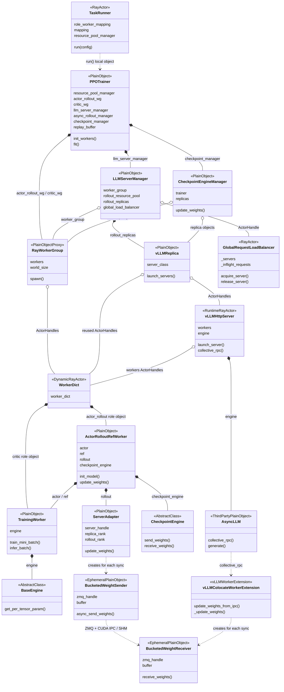
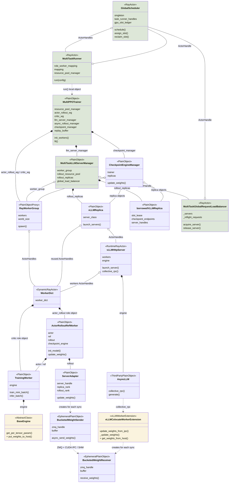
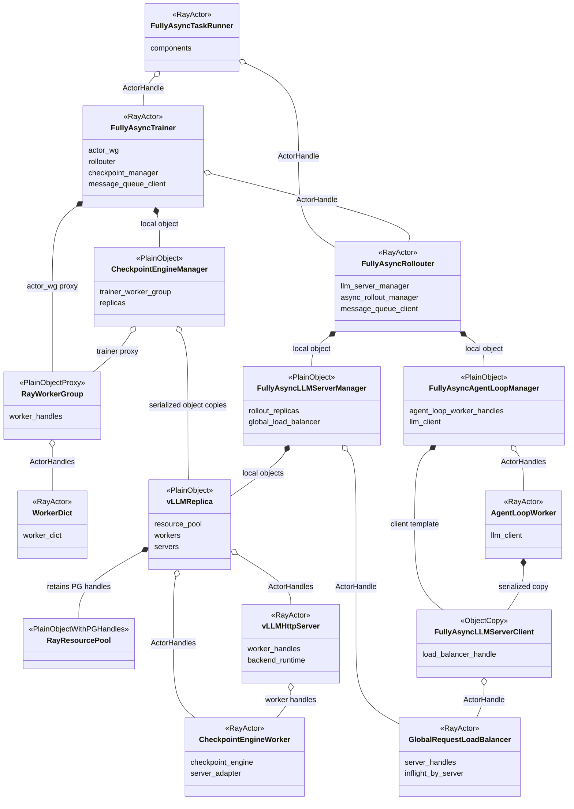
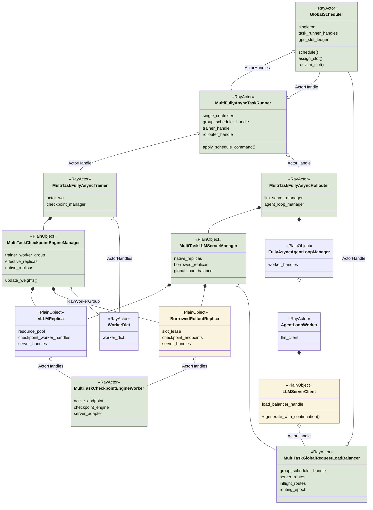
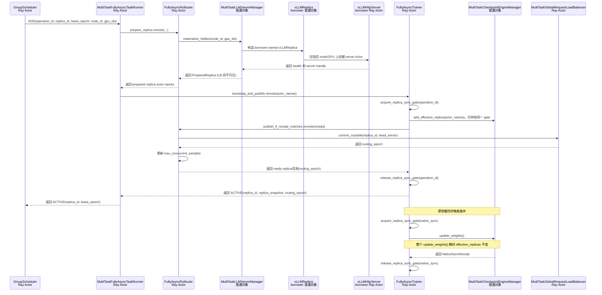
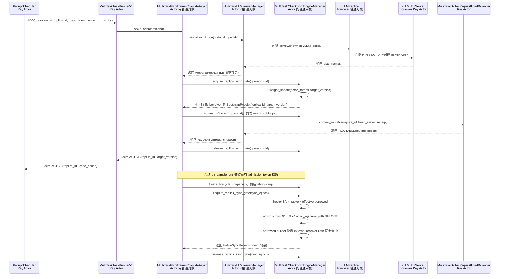

# 设计审查批注说明

> **【审查批注】** 下文保留原始理想架构表述；凡以此格式标出的内容，表示该设想与当前 verl/Ray 实现存在前置条件、接口缺失或语义冲突。批注同时给出插件化落地建议，不代表已经完成代码实现。

# 1. 问题：单RL任务存在 rollout GPU 空泡

同步模式下，训推存在严格先后顺序，一旦 rollout 阶段存在长尾请求，则rollout阶段 GPU 资源会出现严重的空泡，在长程任务场景下尤甚。

为了解决空泡问题，RL 框架往往采用训推异步挤出空泡。然而，即使单任务在训推异步模式下，也不能保证推理 GPU 持续满载：

1. One-Step-Off 在完整 batch 边界天然存在资源空泡；
2. FullyAsync 只能在允许的陈旧度窗口内继续生产，不能无限向前生成；
3. `partial_rollout` 可以降低等待长尾请求的时间，但会引入 trajectory 跨版本生成，不能无条件开启；

因此，单任务训推异步能够压缩一部分空泡，但受算法陈旧度、参数版本和有限生产窗口约束，无法完全消除 rollout GPU 空闲。

# 2. 动机：在不改变单任务算法语义的前提下跨任务共享空泡卡资源

## 2.1 名词定义

- GlobalScheduler：新增组件，协调多个RL实现rollout资源共享
- Donor任务：某个RL任务的rollout进入长尾阶段，即该step内已没有待推理的sample，计划将其空闲卡共享给其他任务
- Borrower任务：某个RL任务的rollout仍在进行，需要更多实例，经GlobalScheduler协调获取空闲卡的任务

## 2.3 基本思路

多任务资源共享遵循以下原则：

1. 只有当卡资源出现空闲时才能够将其进行共享
2. 任务基于原生资源创建的进程均不销毁，受赠任务的进程允许
3. 当 donor 任务需要卡时，通过强行中断推理进行回收

在多个同时运行的 RL 任务之间临时共享 rollout 卡资源基本流程：

```text
donor 任务感知并向GlobalScheduler上报空泡卡资源
→ GlobalScheduler 生成全局空泡卡资源信息，根据各个任务当前的rollout卡资源现状生成捐/借卡策略
→ GlobalScheduler 向各个任务下发卡释放和占用指令
→ donor 保留原 ResourcePool/PG/bundles 并休眠 Server
→ GlobalScheduler 将释放的卡资源临时租给 borrower
→ borrower 在同一 node/GPU 上创建自己的推理replica
→ borrower 将租借的 replica 加入自己的参数同步集合和 LB
```


## 2.3 用户界面

用户通过新增 $[request, limit]$ 配置控制资源共享程度，且 RL 自带的卡资源规模需配置为$\frac{request + limit}{2}$。其中，`request` 为用户给 RL 任务配置的资源下限，GlobalScheduler 调度过程中不得使 RL 任务卡资源低于 `request` 指定的卡数；`limit` 为用户给 RL 任务配置的资源上限。例如当rollout共有16张卡，共享范围设置为`[8, 24]`，这意味着该任务rollout资源出现空泡时，最多会将8张卡共享给其他任务。同时，当该任务需要加速时，最多会得到其他任务共享的8张卡。综上，该任务在rollout期间的卡数变化范围是`[8, 24]`。

## 2.4 调度流程

1. 任务 X 拉起后向 GlobalScheduler 注册，将本任务期望共享的卡规模以及资源视图上报，GlobalScheduler 将任务 X 允许进行共享的资源纳入全局视图进行管理
2. 任务 X 启动训练进入 rollout 阶段，当任务 X 的推理资源感知到空泡（同步模式下：该 step 内样本已经全部消耗完毕，出现空闲推理实例；异步模式下：受陈旧度等控制，进入等待长尾请求完成阶段，出现空闲实例），任务 X 执行一下操作：
	- 将空闲推理实例从 GlobalRequestLoadBalancer移除
	- 将闲推理实例从 CheckpointEngineManager、CheckpointEngineManagerWorker、LLMServerManager 等组件中的活跃server列表中移除，加入 inactive server 列表
	- 将空闲推理实例进行休眠，卸载其权重及 KV Cache
	- 向 GlobalScheduler 上报空泡卡资源
3. GlobalScheduler 根据空卡资源规模及当前全局任务忙闲程度，确定受捐任务集合 S 及各个任务的卡分配策略
4. GlobalScheduler 向受捐任务下发创建推理实例指令，受捐任务基于NODE ID、GPU ID信息通过 NodeAffinity 创建推理实例
5. 推理实例创建完成后，GlobalScheduler 向受捐任务下发指令，将新创建的推理实例加入CheckpointEngineManager、CheckpointEngineManagerWorker、LLMServerManager 等组件中的活跃server列表
6. 当任务 X 重新需要推理实例时（同步模式：重新进入 rollout 阶段；异步模式：长尾请求等待结束，继续异步rollout），该任务向 GlobalScheduler 上报卡缺口（当前卡规模和基线卡规模的差值）
7. GlobalScheduler 基于资源视图生成回收策略（回收任务 X 捐赠的卡），分别向相关的受捐任务下发回收指令
8. 受捐任务中断回收实例，销毁或休眠推理实例，将其从GlobalRequestLoadBalancer、CheckpointEngineManager、CheckpointEngineManagerWorker、LLMServerManager 等组件中移除
9. GlobalScheduler 向任务 X 下发指令，将回收实例唤醒，完成参数同步，恢复GlobalRequestLoadBalancer、CheckpointEngineManager、CheckpointEngineManagerWorker、LLMServerManager 等组件对推理实例的索引

# 3. 多任务资源共享下 VERL 的架构 GAP

## 3.1 VERL 原生资源创建流程无法表达跨任务资源分配

> **【审查批注｜关键可行性问题】** “donor 休眠后，borrower 通过 NodeAffinity 使用同一批 GPU”不能直接由 Ray 实现。verl 的 `ResourcePool/PlacementGroup` 仍然持有 GPU 预留；NodeAffinity 只约束节点，不会把 PG 中的 GPU 转移给另一个任务。若 borrower actor 声明 `num_gpus>0`，Ray 会再次申请资源；若声明 `num_gpus=0`，则必须由插件自行启动 GPU 进程并完成物理 GPU、local rank 和退出清理，否则会产生未受 Ray 保护的 GPU 竞争。

> **【解决方案】** 将 borrowed replica 定义为“已有资源锚点上的插件进程/actor”，而不是普通 Ray GPU actor。GS 只授予物理 slot lease；Factory 使用 node affinity 定位节点、显式 GPU 映射启动 server/CE receiver，并在启动前后校验实际可见 GPU。第一版应限制为固定拓扑和单一 vLLM 后端。

单任务内 VERL 通过 RAY 完成资源占用和绑定，基于资源的Actor创建完成后默认资源是被任务独占的，无法在多任务间进行共享。
- Ray 资源视图会认为这些 GPU 在任务整个生命周期内始终被该 replica 占有
- Ray 不会把 PG 已预留的 GPU resource 重新分配给其他任务

解决方案：以单任务基于 Ray resource bundle 创建的 Actor 为锚点，创建推理后端进程。

## 3.2 单任务内资源、路由和参数同步视图完全互斥，无法表达多任务资源共享复用

> **【审查批注｜实现量被低估】** 原生 CE 的 `add_replicas/remove_replicas` 只修改 replica 列表；真正同步时还会重新执行 `prepare → build_topology → init_process_group → update_weights → finalize`。NCCL/HCCL/NIXL 的 rank、world size、连接和 group name 不能仅靠更新列表完成动态扩缩。

> **【解决方案】** 在插件中增加 backend-specific topology adapter，并使用 `task_id + topology_epoch + backend` 生成通信组标识。只有 backend 支持销毁旧 group、重建新 group 并校验新 epoch 时，才允许 borrowed replica 加入 effective replicas；不支持动态重建的 backend 暂不开放资源共享。

原生 VERL 中存在 3 种资源视图：
1. verl/Ray 资源创建视图：ResourcePool、Placement Group、bundle 和 worker actor；
2. 推理负载均衡视图：LB 只通过 Server ActorHandle 分发请求；
3. 训推参数同步视图：Checkpoint Engine 需要维护当前任务的参数同步训推后端执行集合；

解决方案：引入 GlobalScheduler 实现动态借用后引入第四种资源视图

> GlobalScheduler 全局物理视图：维护 node ID、GPU ID、HBM slot 和跨任务租借。

此外，对现存资源视图及流程的影响：
1. verl/Ray 资源创建视图：无影响
2. 推理负载均衡视图和训推参数同步视图：需要动态感知捐赠和租借的实例effective_replicas
>effective_replicas = 本任务未借出的固有 native replicas + 已成功初始化并注册的受捐 borrowed replicas
3. 调整推理实例规模（scaling）需确保原子性，即同时确保负载均衡和参数同步原子性；同时scaling时段必须与参数同步阶段互斥

## 3.3 强制回收不能丢失 in-flight 请求

> **【审查批注｜LB 接口不足】** 原生 router 的 `remove_servers()` 会立即删除 server 及其 in-flight 计数。若先 remove 再 abort，无法证明请求已经排空，sticky request 也可能失去路由记录。

> **【解决方案】** MultiTask LB 必须增加 `READY → DRAINING → ABORTING → DRAINED → REMOVED` 状态。DRAINING 禁止新请求但保留旧请求计数；只有 abort/续推完成且计数归零后才能调用原生 remove。续推结果必须回传给任务侧，不能把“actor 已停止”当作请求已完成。

优先回收已经形成自然空泡的 replica 最安全，但全局调度可能因公平性原因强制回收仍有请求的租借实例，此时需确保中断的请求推理能够续推。

解决方案：复用 VERL partial rollout机制

```text
摘流
→ abort 目标 replica 的全部 in-flight generation
→ 请求在其他有效 replica 上重新 acquire
→ 使用已有 token prefix 继续生成或重启当前 turn
→ 目标 replica 完成 evacuation 后 sleep
```

# 4. 方案设计

## 4.1 新增和扩展组件

### 4.1.1 GlobalScheduler

单例 Ray Actor，作为跨任务全局调度大脑：

- 保存 TaskRunner ActorHandles；
- 通过心跳维护任务、节点、GPU 和 资源租借状态；
- 接收 LB 上报的 per-replica inflight/idle/routing 状态；
- 结合任务需求、空泡预测、优先级和初始化开销生成 DONATE/ASSIGN/PREEMPT/RECLAIM 等决策；
- 将决策发送给 donor/borrower TaskRunner；
- 使用本地维护的全局资源视图保证同一卡被有限次重复分配；
- 不直接调用 RL 任务的普通对象，通过TaskRunner下发指令执行；
- 不触发参数同步；

### 4.1.2 MultiFullyAsyncTaskRunner / MulitOneStepTaskRunner / MulitTaskRunner

扩展的任务的 single controller Ray Actor：

- 创建或获取 GlobalScheduler 单例 handle；
- 启动时向 GlobalScheduler 注册任务、基础资源和自身 ActorHandle；
- 持有 Trainer、Rollouter 和 GlobalScheduler handles；
- 响应 GlobalScheduler 主动 heartbeat probe，并通过 GS handle 上报注册/状态变化/注销、资源需求和同步；
- donor 侧执行摘流、CheckpointEngine 排除、sleep 和 卡释放；
- borrower 侧执行 Server 创建、donor CheckpointEngine Worker endpoint 重绑定、CheckpointEngine 注册和 GlobalRequestLoadBalancer 激活；
- 任务结束时注销资源。

> TaskRunner 是 GlobalScheduler 进入任务内部的唯一控制入口。

### 4.1.3 MultiTaskLLMServerManager

> **【审查批注｜资源创建接口不够】** Manager 可以管理 replica 对象，但当前 verl 没有“给定 node ID/GPU ID 创建 standalone replica”的公共接口。直接调用原生 `init_standalone()` 会新建 ResourcePool/PG，违背借卡语义；直接复用 donor worker 又会混淆任务所有权。

> **【解决方案】** Manager 只负责生命周期和状态，具体创建交给插件 `ReplicaFactory`。Factory 需要创建 borrower 自己的 receiver/server，并返回 server handles、通信 endpoint、实际 GPU 映射和清理句柄；不得复用 donor 的 PG 或 CE Worker。

位于 Rollouter Actor 内的普通对象，继承或组合 `FullyAsyncLLMServerManager`：

- 管理初始化时创建的 native replicas；
- 管理运行期创建的 borrowed replicas；
- 对replica执行创建、销毁、sleep、wake、abort等操作；
- 基于 `MultiTaskCheckpointEngineWorker` 查询有序 node/GPU IDs；
- 不创建新的MultiTaskCheckpointEngineWorker，将已存在的 `MultiTaskCheckpointEngineWorker` 临时关联到borrowed replica；
- 操作扩展 LB 的路由后端 replica 状态；
- 不制定跨任务调度策略；
- 不直接调用位于 Trainer Actor 内的 CE manager。

### 4.1.4 MultiTaskCheckpointEngineManager

> **【审查批注｜“有效集合”不是普通列表】** `effective_replicas` 变化必须和参数同步互斥，且每次变化都会影响 CE rank/world size。仅维护 native/borrowed 两个列表不能保证同步过程中不会出现半旧半新的通信拓扑。

> **【解决方案】** 使用任务级 replica-sync gate、不可变 snapshot 和 topology epoch；bootstrap、add/remove、旧连接清理、通信组重建和 LB commit 必须作为一个事务完成。失败时新 replica 保持不可路由，旧集合继续服务。

位于 Trainer/controller 内的普通对象，扩展原生 `CheckpointEngineManager`：

- 维护 replica 有效集合；
- 使用 lock 串行化 add/remove 与 `update_weights()`；
- 为每次同步生成不可变 replica snapshot 和 epoch；
- 同步失败时阻止混合版本 replicas 接流；
- 不由 GlobalScheduler 直接调用，命令由 TaskRunner/Trainer Actor 转发。

### 4.1.5 MultiTaskGlobalRequestLoadBalancer

> **【审查批注｜原生 LB 没有 draining 语义】** 原生 LB 仅提供 add/remove 和计数，没有 READY/DRAINING/SLEEPING 等生命周期状态，也不会替 GS 判断资源是否可捐赠。

> **【解决方案】** MultiTask LB 只维护路由事实和 in-flight 计数，增加摘流、排空、abort 回执和 epoch 校验；空泡判定及 DONATE/RECLAIM 决策仍由 GS 完成。

扩展原生 `GlobalRequestLoadBalancer`：

- 维护 `server_id → ActorHandle`；
- 维护 per-server in-flight 请求数；
- 维护 `READY/DRAINING/SYNCING/SLEEPING` 状态和 routing epoch；
- 只向 `READY Server` 分发请求；
- 在 zero-inflight 等状态变化时向 GlobalScheduler 上报事实；
- 支持 Server 摘流；
- 不根据单一 `inflight==0` 自行决定捐赠；
- 不执行跨任务 Server 创建。

### 4.1.6 MultiTaskCheckpointEngineWorker

> **【审查批注｜文档内部存在矛盾】** 本节后文提出“不创建新的 CE Worker、临时关联 donor Worker”，但 5.2 又要求 borrowed replica 有自有同步接收端。一个 CE Worker 的 rank、world size、ServerAdapter 和 process group 不能同时属于两个任务。

> **【解决方案】** 统一采用 borrower 自有 CE Worker/receiver。donor Worker 永不跨任务转移；GS 只传递租约和操作回执，不传递 Worker 所有权。若某 backend 无法创建独立 receiver，则该 backend 不支持 borrowed replica。

受赠 replica 不调用原生 `init_standalone()`，否则会再次申请 ResourcePool/PG/GPU，而是使用 donor 节点和卡信息：

```text
donor worker handles/PG provenance
→ ordered node IDs and GPU IDs
→ hard node affinity
→ explicit CUDA_VISIBLE_DEVICES/local rank
→ borrower Server/backend
```

> **【审查批注】** 与 5.2 的“自有同步接收端”要求冲突；建议删除“这里不创建新的受赠 CheckpointEngineWorker”的方案，改为 borrower 创建独立 receiver，并把 donor Worker 永久限制在 donor 任务内。

**【原理想设想（存在冲突，暂不建议直接实现）】** 这里不创建新的受赠 CheckpointEngineWorker。初始化阶段所有可捐赠 replica 都创建
`MultiTaskCheckpointEngineWorker`；它继承原生 `CheckpointEngineWorker`，仍是 donor private PG bundle 中已经存在的 Ray Actor。借出时，borrower 只得到这些 MultiTaskCheckpointEngineWorker 的临时使用权。

## 4.2 逻辑视图

VERL支持 HYBRID 和 STANDALONE 两种模式，两种模式下资源初始化扩展原则是一致的，参数同步有差异。

公共部分：

1. 引入 GlobalScheduler 单例，被 TaskRunner 和 GlobalRequestLoadBalancer 持有，他们分别向 GlobalScheduler 上报资源、Replica忙闲等信息
2. 扩展 Rollouter、LLMServerManager、GlobalRequestLoadBalancer，打通 BorrowedReplica 的创建、初始化、添加、移除操作

差异部分（参数同步）：

- HYBRID 模式：扩展 vLLMColocateWorkerExtension、BaseEngine，新增 TrainWorker将权重卸载到DDR，BorrowedReplica 通过 DDR 同步参数
- STANDALONE 模式：扩展 CheckpointEngineWorker，支持将 BorrowedReplica 纳入 STANDALONE 参数同步流程

### 4.2.1 HYBRID 模式

#### 4.2.1.1 AS-IS



#### 4.2.2.2 TO-BE



### 4.2.2 STANDALONE 模式

> **【审查批注｜当前实现不直接支持】** 当前 vLLM standalone server 的 `sleep()`/`wake_up()` 在 STANDALONE 模式下是跳过操作；原生 `release_kv_cache()` 也不等价于完整卸载权重。因而图中的“native replica sleep 后释放整卡、wake 后恢复服务”不能直接由现有接口完成。

> **【解决方案】** 在插件中增加版本相关的 standalone sleep adapter，明确 level 1/level 2 的权重与 KV cache 语义，并在不支持的后端上返回不支持。只有 server 确认显存释放、CE/LB 完成摘流后，GS 才能把 slot 视为可借用。
#### 4.2.2.1 AS-IS



####  4.2.2.2 TO-BE


> 其中，MultiTaskCheckpointEngineWorker部分简化，未画出vLLMHttpServer。所有的vLLMHttpServer均会加入MultiTaskGlobalRequestLoadBalancer。

## 4.2 部署视图

### 4.2.1 HYBRID模式

#### 4.2.1.1 AS-IS


#### 4.2.1.2 TO-BE


### 4.2.2 STANDALONE 模式

#### 4.2.2.1 AS-IS


#### 4.2.2.2 TO-BE


## 4.3 关键流程

### 4.3.1 Fully Async ADD：跨 Trainer / Rollouter Actor 的提交协议

> **【审查批注｜“NodeAffinity 创建 server”不是完整创建协议】** ADD 回执中仅有 node/GPU 和 actor names 还不足以完成多节点 TP/DP/PP replica。还必须携带 worker rank 映射、world size、master/DP 端口、实际 GPU 映射、CE topology epoch 和 server 健康状态。

> **【解决方案】** 将 ADD 拆成 `PrepareReplica → BootstrapWeights → RebuildTopology → CommitLB → Active` 五个可观测阶段；任何阶段失败都不得返回 ACTIVE，已创建进程进入回滚或隔离状态。

`PreparedReplica`：初始化完成的replica，但是尚未加入 Borrowed 任务。
`BootstrapReceipt`：记录 replica ID、目标权重版本、operation ID、lease step 和全部接收端的完成状态。



图中的流程按以下顺序提交新 replica：

1. `GroupScheduler` 把 node ID/GPU IDs 租约和 operation ID 发送给`MultiTaskFullyAsyncTaskRunner`。
2. `MultiTaskFullyAsyncTaskRunner` 调用 `FullyAsyncRollouter`。`FullyAsyncRollouter` 再调用其进程内的
   `MultiTaskLLMServerManager`，让 manager 创建 borrower-owned `vLLMReplica` 和 `vLLMHttpServer`。不把 server 加入 LB。`PreparedReplica` 只携带可序列化的 replica ID、server ActorHandle 和 actor names。
3. `FullyAsyncTrainer` 获得 replica-sync gate。原生参数同步已经持有 gate 时，`FullyAsyncTrainer` 等待原生参数同步完成。
4. 全部接收端返回同一版本后，`MultiTaskCheckpointEngineManager` 生成 `BootstrapReceipt`。`FullyAsyncTrainer` 在仍持有同一把
   replica-sync gate 时把新 replica 加入 `effective_replicas`。
5. `FullyAsyncTrainer` 把回执发送给 `FullyAsyncRollouter`。`FullyAsyncRollouter` 校验 operation ID、lease epoch，然后让 LB 把 head server 提交为 `ROUTABLE`。
6. LB 返回 `routing_epoch` 后，`FullyAsyncRollouter` 增加 `max_concurrent_samples`。
7. `FullyAsyncTrainer` 收到 `ready replica` 回执后释放 replica-sync gate。下一次 verl 原生参数同步获得该 gate 后，直接遍历已经包含 borrowed replica 的 `effective_replicas`。
8. `MultiTaskFullyAsyncTaskRunner` 只在上述步骤全部成功后向 `GroupScheduler` 返回 `ACTIVE`。

### 4.3.2 HYBRID partial ADD：同 Actor 控制对象的提交协议

HYBRID partial 与 Fully Async 使用相同的推理实例添加/移除与参数同步串行的语义。HYBRID 的 Trainer、manager 和 CE 位于同一个`TaskRunnerV1` Actor 进程，因此 `MultiTaskTaskRunnerV1` 只需要把命令委托给`MultiTaskPPOTrainerColocateAsync`，不需要把 manager 保存为 TaskRunner 的新增成员变量。




# 5. 需求拆解

## 5.1 范围与命名

- 当前范围分为五部分：基础能力、动态流程、任务交互与全局视图、调度策略、生命周期与运行验证。五部分表示职责分类，不表示五个串行阶段。
- 首个实现范围仍为 experimental Fully Async、纯 STANDALONE。

名称说明：
- 用户在讨论中称全局调度器为 GlobalScheduler，本文简称 GS；既有实现使用 `GroupScheduler` 类名，本次讨论不构成改名要求。
- CE 指 Checkpoint Engine 参数同步组件；LB 指 Load Balancer 请求负载均衡器。
- native replica 指任务按自身初始资源创建的实例；borrowed replica 指借入任务在租借 GPU 上创建的实例。
- donor 是捐出 GPU 的任务，borrower 是借入 GPU 的任务。

## 5.2 verl 能力扩展

MultiTask 主要通过扩展 verl，为任务参与调度提供基本执行能力：

- MultiTask 支持根据 node ID、GPU IDs 创建 borrowed replica 及其自有同步接收端。
- MultiTask 提供 native、borrowed replica 的销毁、休眠和唤醒能力。
- MultiTask 提供强制回收能力，但只针对 borrowed replica。
- MultiTask 扩展 CE 后端通信拓扑能力，包括通信组成员调整、通信组重建和旧连接清理。

职责与约束：

- borrower 根据 GS 提供的 node ID、GPU IDs 创建并持有 borrowed replica 及其同步接收端，不复用 donor 的资源池、Placement Group 或同步组件。
- donor 在资源共享过程中保留 native replica，只执行休眠，不把 native replica 销毁作为借卡步骤。
- native 销毁接口属于基础能力；具体使用场景留待细化，不将销毁作为资源捐赠步骤。
- 强制回收不能等同于直接销毁 borrowed replica；回收还涉及该实例上的在途请求和资源释放。
- 第一部分提供强制回收所需的单项执行能力，第二部分负责摘流、中断、续推、视图变更和释放顺序的整体串联，二者不重复建设两套回收流程。
- 第一部分负责“任务如何执行操作”，不负责 GS 如何选择 donor、borrower 或分配规模。

## 5.3 动态流程编排与参数同步

任务侧调用第一部分的能力，修改相关成员变量，并将操作串联成完整动态流程：

- **空泡感知与上报**：LB 结合样本生产窗口、请求状态和实例状态判断空泡，并向 GS 上报；LB 不能仅凭瞬时并发为零认定资源可捐赠。
- **动态添加**：任务侧调用创建能力，登记 Manager 的实例与生命周期引用，并协调 CE 同步集合、LB 路由和 Rollouter 并发容量。
- **动态移除与回收**：任务侧串联摘流（停止向目标实例发送新请求）、排空或中断请求、安排其他实例续推、移出 CE 和相关视图，以及休眠或销毁。强制回收只针对 borrowed replica。
- **操作边界**：任务侧分别处理“从活跃视图移除”“休眠”和“销毁”，不能把三者视为同一操作；donor native 休眠后仍保留生命周期引用。
- **新实例权重同步**：任务侧立即对新实例执行 bootstrap，即只让新实例追平当前已发布的 serving version（正在服务请求的权重版本），不等待下一次原生同步，不更新已有实例。
- **同步互斥**：experimental Fully Async 使用同一把任务内 replica-sync gate（实例调整与参数同步的互斥锁），保护 bootstrap、CE 有效集合变更、LB 接流提交及原生参数同步；GS 不改变原生同步的触发条件。
- **接流条件**：新实例完成权重同步并进入 CE 有效集合后，LB 才能向新实例分配请求。Manager、CE、LB、Rollouter 分别维护自己的状态，单个列表更新不能替代完整操作成功。
- **自有 replica 归还恢复**：GS 确认 borrower 已释放资源后，donor 按 GS 指令恢复原有 sleeping native replica。donor 在自身 replica-sync gate 保护下串联唤醒、追平自身当前已发布权重、恢复 CE/LB 视图、Manager 活跃记录及 Rollouter 并发容量；实例满足接流条件后才重新接收请求，不重新创建 donor native replica。
- **通信拓扑编排**：任务侧在实例增减和参数同步流程中调用第一部分的通信拓扑能力，并保证相关操作与参数同步互斥。
- **失败处理**：任务侧处理部分成功、超时和重复操作，执行回滚或隔离；失败的新实例不得接流，失败流程也不能永久阻塞原生同步。

本部分负责任务内执行与一致性；第三部分负责接收执行事实并维护全局视图。

## 5.4 GS 与任务交互、全局资源视图维护

GS 与任务建立双向交互，并根据实际状态维护全局租借资源视图：

- **注册与注销**：任务启动时登记自身资源，退出时注销；GS 处理相关任务记录和租借关系。任务自行决定初始化规模，GS 不分配初始 replica。
- **主动心跳**：GS 通过 TaskRunner 主动检测任务心跳，维护任务存活性和资源信息的新鲜度。
- **空卡上报**：任务侧暂时只上报空卡，不新增用卡需求、需求撤销或要回原卡的请求。该边界不取消注册、注销、心跳和执行回执。
- **全局视图**：GS 感知原卡归属、需求变化及需求是否撤销，维护 task、replica、node ID、GPU IDs、donor/borrower、租借关系和生命周期状态，并保证同一 GPU 不被重复授权；具体感知机制后续细化。
- **指令下发**：GS 通过 TaskRunner 下发分配、回收等指令。experimental Fully Async 的 TaskRunner 分别通过 Trainer、Rollouter 句柄到达任务内组件，不额外增加通信 Actor。
- **控制并发**：TaskRunner 在训练期间仍能响应心跳和伸缩指令；Trainer、Rollouter 的跨 Actor 调用需要避免持锁循环等待，并与第二部分的流程互斥配合。
- **执行回执与状态核对**：任务返回执行结果，GS 核对指令目标、实际结果和资源状态，再更新租借视图；“已发送指令”不等于“已交接资源”。

本部分负责状态交互、指令传递和执行反馈；第四部分负责选择具体调度决策，第五部分统一规定异常恢复边界。

## 5.5 GS 调度策略

GS 根据全局资源视图和空卡信息生成策略，并形成以下决策闭环：

- **输入**：GS 读取原卡归属、全局租借状态和任务上报的空卡信息，不依赖新增任务需求上报接口。
- **决策**：GS 确定 donor、borrower、分配规模、分配或回收时机，以及具体操作目标。
- **输出**：GS 形成分配、回收等指令，通过第三部分的交互机制下发，由任务执行第二部分的动态流程。
- **反馈**：GS 根据执行结果和更新后的资源视图进行下一轮决策。
- **模拟器策略迁移适配**：开发者将真实任务状态映射为模拟器策略输入，将策略输出转换为受控执行指令，并纳入实例创建、参数同步和回收成本。

具体算法、优先级、触发条件、资源上下限和策略参数留待细化，本文不预设取值。

## 5.6 生命周期、异常协调与运行验证

- **生命周期协调**：任务侧明确 validation（模型评估）、checkpoint（训练检查点）保存与恢复、初始化失败、任务退出与伸缩之间的限制、状态恢复和资源清理要求。
- **GS 异常边界**：项目明确 GS 不可达或重启后的授权限制、租约核对、隔离资源处理及恢复边界；第一版不默认要求自动高可用，可以明确人工处理范围。
- **隔离原则**：心跳超时不等于 GPU 已释放。GS 必须隔离无法证明已释放的资源，不能直接把这些 GPU 再次分配。
- **运行观测**：项目记录资源使用、借还耗时、bootstrap 和原生参数同步耗时、锁等待及失败原因。
- **流程与收益验证**：项目验证正常流程、超时、重复指令、部分成功和失败回滚，并比较共享前后的吞吐、资源利用率、空泡和样本完整性。

